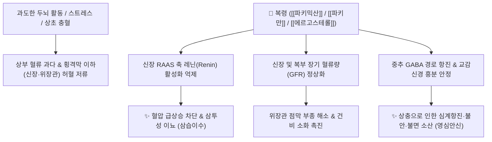

---
aliases:
  - 복령
  - 백복령
  - 적복령
  - 白茯苓
  - 赤茯苓
  - 茯苓
  - Poria
  - Hoelen
---
# 🌿 [[복령]] (茯苓, Poria / Hoelen)


> **핵심 요약 (Key Summary)**:
> 구멍장이버섯과(*Polyporaceae*) 복령균(*Poria cocos*)의 균핵을 건조한 것
> $\beta$-글루칸인 [[파키만]](Pachyman)과 진균 스테롤인 [[에르고스테롤]](Ergosterol)이 RAAS계 레닌 활성을 억제하고 신장 혈류를 촉진하여 하부 울혈 해소 및 중추 진정 작용 발휘
> [[상한론]]의 수음(水飲) 역상·심계(가슴 두근거림)·소변불리 및 비허(脾虛) 설사·불면증을 치료하는 대표적인 [[삼습이수]](滲濕利水)·[[건비화위]](健脾和胃)·[[영심안신]](寧心安神) 군약(君藥)

---
## 📌 목차
1. [기본 본초 정보 & 화학 구조 (Pharmacognosy)](#1-기본-본초-정보--화학-구조-pharmacognosy)
2. [핵심 분자약리 기전 & RAAS 레닌 억제·하부 혈류 네트워크](#2-핵심-분자약리-기전--raas-레닌-억제하부-혈류-네트워크)
3. [해부생체역학 / 혈류 재분배 & 횡격막 하부 순환 연계](#3-해부생체역학--혈류-재분배--횡격막-하부-순환-연계)
4. [사상의학 및 임상 응용 (복령 vs 복신 감별)](#4-사상의학-및-임상-응용-복령-vs-복신-감별)
5. [상한론 『약징(藥徵)』 분석 및 배오 원리](#5-상한론-약징藥徵-분석-및-배오-원리)
6. [핵심 처방 비교 매트릭스](#6-핵심-처방-비교-매트릭스)
7. [출처 및 학술 참고 문헌 (References)](#7-출처-및-학술-참고-문헌-references)

---
## 1. 기본 본초 정보 & 화학 구조 (Pharmacognosy)

| 항목 | 상세 내용 |
| :--- | :--- |
| **기원 식물** | 구멍장이버섯과(Polyporaceae) 복령균 *Poria cocos* Wolf.의 균핵을 말린 것 |
| **성미 (性味)** | 甘·淡, 平 |
| **귀경 (歸經)** | 心·脾·肺·腎經 (심경, 비경, 폐경, 신경) |
| **효능 (Actions)** | [[삼습이수]](滲濕利水), [[건비화위]](健脾和胃), [[영심안신]](寧心安神) |
| **주요 성분** | • **고분자 다당류(90% 이상)**: [[파키만]] (Pachyman, $\beta$-(1$\rightarrow$3)-D-glucan), 파키마란(Pachymaran)<br>• **라노스탄계 트리테르펜**: 파키믹산 (Pachymic acid, KP 규격 $\ge 0.10\%$), 투물로스산, 폴리포렌산<br>• **스테롤**: [[에르고스테롤]] (Ergosterol, 비타민 D 전구물질), 콜린, 레시틴 |

> **[유래 및 본초학적 기전]**:
> * 소나무 뿌리의 신령한 기운이 뭉쳐(伏) 맺힌 영약(苓)이라는 뜻에서 '복령(茯苓)'이라 불렸습니다.
> * 체내 불필요한 수습(水濕)을 소변으로 삼출(滲出)시키면서도 정기를 상하지 않게 하고, 비위를 보양하며(건비), 심장의 화열을 가라앉혀 불안과 불면을 치료합니다.
> * 건비(健脾) 작용을 통해 영심안신(寧心安神)을 유도하는 기전을 지닙니다.

### 🔬 복령의 주요 지표물질 및 다당체 화학 구조
![[Pasted image 20240226002352.png|439]]
![[Pasted image 20250203062002-1.png|500]]
> **[구조적 특징 및 이뇨 메커니즘]**: 복령의 $\beta$-글루칸인 [[파키만]]은 소화관 내 프리바이오틱스로 장내 미생물총을 개선하고, 진균 스테롤인 [[에르고스테롤]]은 비타민 D 수용체를 경유하여 레닌(Renin) 과발현을 억제함으로써 혈압을 안정화하고 이뇨를 촉진합니다.

---
## 2. 핵심 분자약리 기전 & RAAS 레닌 억제·하부 혈류 네트워크



### (1) 혈류 역학적 재분배 및 이뇨·강압 작용
* **횡격막 하부 혈류량 증가 및 수음(水飲) 제거**:
  * 심박출량(5L/min) 중 상부(뇌)로 쏠린 혈류를 신장(1.2L/min) 및 위장관(1.2L/min) 등 하부 장기로 원활히 재분배하여 복부 장기 부종을 해소합니다.
* **RAAS 축 억제 및 이뇨 ([[삼습이수]] 滲濕利水)**:
  * 에르고스테롤 성분이 레닌 분비를 억제하여 혈관 수축과 알도스테론 분비를 막아 완만한 이뇨 효과를 냅니다.
* **중추신경계 진정 ([[영심안신]] 寧心安神)**:
  * 뇌 내 흥분성 신호를 억제하여 가슴 두근거림(동계), 건망, 수면 장애를 개선합니다.

---
## 3. 해부생체역학 / 혈류 재분배 & 횡격막 하부 순환 연계

![[Pasted image 20240226002434.png|624]]
* **위장관 점막 부종 및 장간막 순환 개선**:
  * 히스타민 증후군이나 복부 부종으로 뱃속이 더부룩하고 몸이 무거운 증상을 해소합니다.
* **심하계(心下悸) 및 제하동계(臍下動悸) 해소**:
  * 복부 대동맥 주변 수기(水氣) 정체로 인한 박동성 불안감을 진정시킵니다.

---
## 4. 사상의학 및 임상 응용 (복령 vs 복신 감별)

```
[✅ 최적 적응증 (Sweet Spot)]
• 수음 정체로 인한 가슴 두근거림(심계), 어지럼증(담훈), 숨참 ([[영계출감탕]])
• 소화기 부종 및 무른변: 비허로 소화가 안 되고 몸이 무거우며 설사가 잦은 경우 ([[사군자탕]])
• 체액 과다성 부종: 전신이 붓고 소변량이 줄어든 경우 ([[오령산]])
• 신경증: 가슴이 두근거려 잠을 못 이루고 잘 놀라며 꿈이 많은 불면증

[🔍 복령 vs 복신 감별 포인트]
• [[복령]]: 균핵 전체로, 삼습이수(滲濕利水)와 건비(健脾) 작용이 주가 됨
• [[복신]](茯神): 균핵 중심부에 소나무 뿌리가 관통한 것으로, 진정·안신(安神) 작용에 특화

[⚠️ 사용상 주의]
• 허한(虛寒)으로 소변이 지나치게 맑고 자주 나오는 환자는 신중 투여
```

---
## 5. 상한론 『약징(藥徵)』 분석 및 배오 원리

### (1) 『[[약징]]』에 나타난 복령의 주치
> **"茯苓 主治悸, 及肉瞤, 筋惕也. 旁治眩冒, 小便不利..."**  
> (복령의 주치는 가슴 두근거림(悸) 및 근육이 떨리고 경련하는 것(肉瞤筋惕)이며, 곁들여 어지럼증과 소변불리를 치료한다.)

* **핵심 배오 원리**:
  * [[복령]] + [[계지]] + [[백출]] + [[감초]] $\rightarrow$ 상충하는 수음을 내리고 어지럼증과 심계를 완치 ([[영계출감탕]])
  * [[복령]] + [[택사]] + [[저령]] + [[백출]] $\rightarrow$ 전신 체액 과다를 소변으로 소통 ([[오령산]])
  * [[복령]] + [[반하]] + [[진피]] $\rightarrow$ 위장관 점막 부종을 말리고 담음을 삭임 ([[이진탕]])

---
## 6. 핵심 처방 비교 매트릭스

| 처방명 | 구성 약재 | 주치 병증 및 임상 타깃 | 특징 및 감별점 |
| :--- | :--- | :--- | :--- |
| [[영계출감탕]] | [[복령]], [[계지]], [[백출]], [[감초]] | **수음상역, 기립성 어지럼증, 심계항진, 혈압 불균형** | 상충 수독과 심계 치료의 명방 |
| [[오령산]] | [[저령]], [[복령]], [[택사]], [[백출]], [[계지]] | **체액 과다 부종, 번갈(갈증인데 물 마시면 토함), 소변불리** | 체내 수액 대사 조절의 대표 처방 |
| [[이진탕]] | [[반하]], [[진피]], [[복령]], [[감초]], [[생강]] | **복부 부종, 위장 점막 부종, 오심, 끈적한 가래** | 거담화습의 기본방 |
| [[사군자탕]] | [[인삼]], [[백출]], [[복령]], [[감초]] | **비위기허, 히스타민 증후군, 전신 부종, 권태감** | 보기건비의 으뜸 처방 |
| [[귀비탕]] | [[당귀]], [[용안육]], [[산조인]], [[복신]], [[황기]], [[인삼]] 등 | **사려과다, 심비양허, 불면, 건망, 심계, 식욕부진** | 신경성 불면과 건망을 치료 |

---
## 7. 출처 및 학술 참고 문헌 (References)

1. **Ríos, J. L. (2011)**. Chemical constituents and pharmacological properties of *Poria cocos*. *Planta Medica*, 77(7), 681-691.
   - **[연구 요약]**: 복령의 파키만 다당체와 트리테르펜 성분들의 면역 부활, 이뇨, 항염증 및 진정 작용에 대한 종합적 약리 규명.
2. **대한민국약전(KP) 제12개정 (2022)**. 의약품각조 제2부: 복령 (Poria / Hoelen) 규격 기준.
   - **[공정서 규격]**: 건조물 기준 파키믹산($\text{C}_{33}\text{H}_{52}\text{O}_5$) 0.10% 이상 함유 필수 규격 명시.
3. **길익동동 (吉益東洞, 1784)**. 『약징(藥徵)』: 茯苓 조문.
   - **[고전 원전]**: "茯苓 主治悸, 及肉瞤, 筋惕也" - 심계항진 및 근육 연축에 대한 주치 원리 제시.