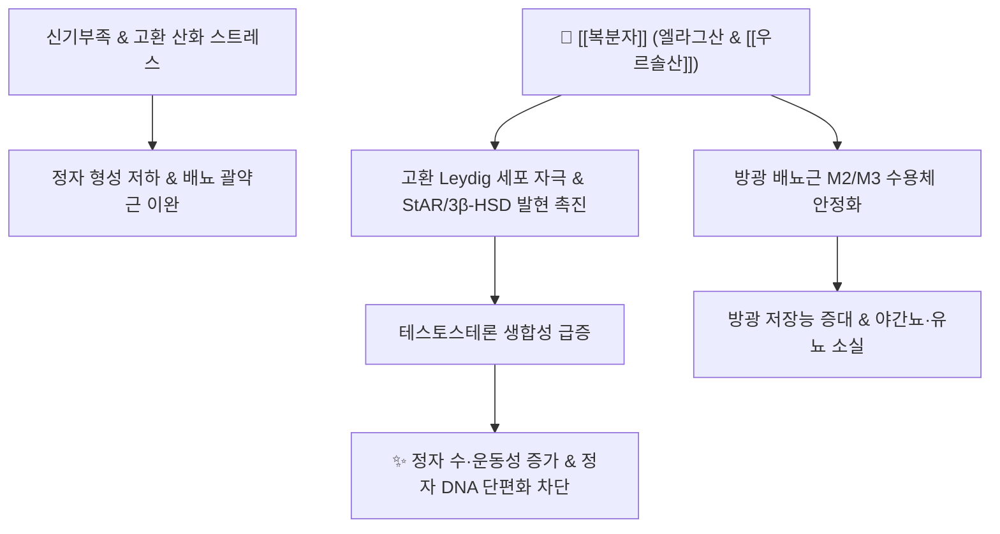

---
aliases:
  - 복분자
  - 覆盆子
  - Rubi Fructus
  - 복분자딸기
tags:
  - 본초
  - 고삽약
  - 보익약
  - 익신고정
  - 야뇨증
  - 정자활력
---

# 🌿 [[복분자]] (覆盆子, Rubi Fructus)

> **핵심 요약 (Key Summary)**:
> 장미과(Rosaceae) 복분자딸기(*Rubus coreanus* Miq.)의 덜 익은 미성숙 열매를 건조한 대표적인 수렴고섭·익신보양 약재
> 핵심 성분인 엘라그산(Ellagic acid)과 우르솔산이 고환 Leydig 세포의 테스토스테론 합성을 촉진하고 항산화 방어계를 강화하여 정자 활력 증대 및 방광 평활근 긴장도 정상화
> 신기부족(腎氣不足) 및 하원허한으로 인한 유정·조루·발기부전·소변빈삭·소아 야뇨증·노인성 요실금 및 간신음허 시력 감퇴를 치료하는 대표 처방 약재

---

## 📌 목차
1. [기본 본초 정보 & 화학 구조 (Pharmacognosy)](#1-기본-본초-정보--화학-구조-pharmacognosy)
2. [핵심 분자약리 기전 & 내분비·비뇨기 네트워크](#2-핵심-분자약리-기전--내분비비뇨기-네트워크)
3. [해부생체역학 / 골반강 자율신경 및 방광 평활근 연계](#3-해부생체역학--골반강-자율신경-및-방광-평활근-연계)
4. [사상의학 및 체질별 임상 응용 (적응증 vs 금기)](#4-사상의학-및-체질별-임상-응용-적응증-vs-금기)
5. [배오 원리 및 포제 (주증법)](#5-배오-원리-및-포제-주증법)
6. [핵심 처방 비교 매트릭스](#6-핵심-처방-비교-매트릭스)
7. [출처 및 학술 참고 문헌 (References)](#7-출처-및-학술-참고-문헌-references)

---

## 1. 기본 본초 정보 & 화학 구조 (Pharmacognosy)

| 항목 | 상세 내용 |
| :--- | :--- |
| **기원 식물** | 장미과(Rosaceae) 복분자딸기(*Rubus coreanus* Miq.)의 채 익지 않은 녹갈색 미성숙 열매 |
| **성미 (性味)** | 단맛(甘), 신맛(酸), 따뜻함(微溫) |
| **귀경 (歸經)** | 간경(肝經), 신경(腎經) |
| **효능 (Actions)** | 익신고정(益腎固精), 축뇨지유(縮尿止遺), 보간명목(補肝明目), 조양고삽(助陽固澁) |
| **주요 성분** | • **지표 성분**: 엘라그산(Ellagic acid, KHP 기준 규격 성분) • **유효 활성 성분군**: [[우르솔산]], 코로솔산, 안토시아닌(Cyanidin 배당체), 갈로탄닌, 퀘르세틴 |

### 🔬 주요 지표물질 화학 구조
> **[구조적 특징 및 활성]**: 엘라그산(Ellagic acid)은 4개의 고리를 가진 폴리페놀성 락톤 다이머 구조. 산미(酸味)를 내는 유기산과 탄닌 성분이 단백질 수렴(Astringent) 작용을 하여 점막 수분을 보존하고 요도 괄약근의 누출을 물리적으로 차단하며, 체내 항산화 활성이 극히 우수함.

---

## 2. 핵심 분자약리 기전 & 내분비·비뇨기 네트워크

### (1) 표적 수용체 및 신호전달 경로
* **테스토스테론 합성 촉진 및 정자 파라미터 개선**:
  * 고환 간질세포(Leydig cell)의 콜레스테롤 수송 단백질(StAR) 및 17β-HSD 스테로이드 합성 효소의 유전자 발현을 상향 조절.
  * 테스토스테론 분비를 유의하게 증가시키고 세르톨리 세포(Sertoli cell) 기능을 보호하여 정자 수, 직진 운동성 및 생존율을 현저히 개선.
* **방광 용적 증대 및 축뇨(縮尿) 메커니즘**:
  * 산감(酸甘)한 수렴 작용으로 방광 점막의 수분 재흡수능을 정상화하고, 방광 배뇨근의 과민성 수축을 억제하여 잔뇨감 없이 방광 용적을 확장.
* **혈관 내피세포 [[eNOS]] 활성화 및 항산화 보호**:
  * 고환 및 골반강 미세혈관의 산화질소([[eNOS]]) 생성을 촉진하여 혈류 관류압을 높이고 정계정맥 울혈을 개선.

---

## 3. 해부생체역학 / 골반강 자율신경 및 방광 평활근 연계

* **외요도괄약근(External Urethral Sphincter) 수축 장력 회복**:
  * 음부신경(Pudendal nerve) 지배를 받는 골반저 횡문근의 만성 이완을 개선하여 복압성 요누출을 방지.
* **자율신경계 균형 (교감신경 지지)**:
  * 하복신경(Hypogastric nerve)을 통한 교감신경 긴장도를 유지시켜 방광 삼각부 폐쇄력을 높이고 야간 소변 누출을 차단.

---

## 4. 사상의학 및 체질별 임상 응용 (적응증 vs 금기)

* **체질별 적응증**:
  * [[소음인]] (少陰人): 신양(腎陽)이 허약하여 하체가 시리고 소변을 자주 지리는 증상에 최고의 보익·축뇨 효과.
  * [[태음인]] (太陰人): 과로 및 음혈 고갈로 인한 만성 피로, 시력 저하(간신부족 안구피로)에 자음(滋陰) 목적으로 다용.
* **금기 및 주의 (Contraindications)**:
  * **소변단적(小便短赤) 및 열림(熱淋) 환자**: 수렴 성질이 매우 강하므로, 체내에 습열(濕熱)이 가득 차서 소변이 붉고 찌르듯 아픈 요로감염 급성기 환자가 복용 시 사기(邪氣)가 갇혀 병세가 악화되므로 사용 금기.

---

## 5. 배오 원리 및 포제 (주증법)

* **주증법 (酒蒸法)**:
  * 청주(淸酒)에 복분자를 담가 축인 뒤 찌고 말리기를 반복하는 전통 포제법으로, 약효 성분의 알코올 용출성을 높이고 신미(酸味)의 자극을 완화하여 신장 귀경성을 극대화.
* **오자(五子) 배오의 시너지**:
  * [[구기자]](음혈 보익), [[토사자]](신양 보익), [[사상자]](온신조양), [[오미자]](폐신 수렴)와 동량 배합하여 음양쌍보 및 고정(固精)의 제1 표준 처방 구성.

---

## 6. 핵심 처방 비교 매트릭스

| 처방명 | 주요 구성 | 핵심 적응증 | 임상 특징 |
| :--- | :--- | :--- | :--- |
| [[오자연종환]] | [[복분자]], 구기자, 토사자, 사상자, 오미자 | 남성 불임, 무기력, 조루증 | 신정(腎精) 결핍으로 인한 정자 감소증 명방 |
| [[축천환]] 가미방 | [[복분자]], 익지인, 오약, 산약 | 소아 야뇨증, 노인성 요실금 | 방광 허한성 수분 누출을 강력 고섭 |
| [[명목지황환]] 가미방 | [[복분자]], 숙지황, 산수유, 국화, 결명자 | 노안, 안구 건조증, 시력 감퇴 | 간신부족으로 인한 안과 질환 치료 |

---

## 7. 출처 및 학술 참고 문헌 (References)
* 国家中医药管理局. *中华本草*. 上海科学技术出版社; 1999.
  - [연구 요약]: 복분자의 식물학적 기원, 수렴고삽 및 익신명목의 전통 한의학적 효능 총괄 수록.
* Kim SJ, et al. Effect of *Rubus coreanus* Miq. extract on sperm parameters and testicular histology in rats. *J Ethnopharmacol*. 2013;147(1):153-160.
  - [연구 요약]: 복분자 추출물이 Leydig 세포를 활성화하여 테스토스테론 생성을 촉진하고 정자 수 및 운동성을 유의하게 개선함을 동물실험으로 규명.
* Lee YA, et al. Antioxidative and anti-inflammatory properties of ellagic acid from *Rubus coreanus*. *Food Sci Biotechnol*. 2018;27(4):1187-1194.
  - [연구 요약]: 복분자의 주성분 엘라그산의 항산화 스트레스 차단 및 요로 상피세포 보호 기전 규명.
