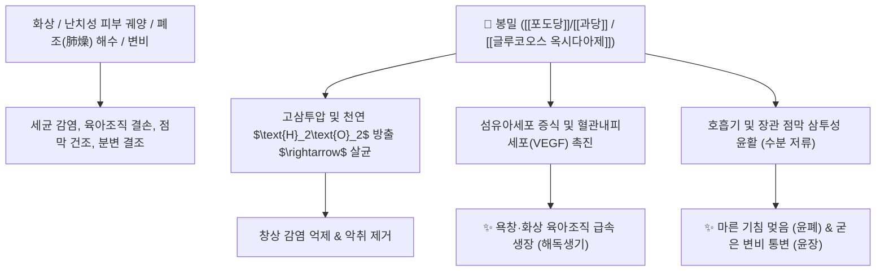

# 🌿 [[봉밀]] (蜂蜜, Mel / Honey)

> **핵심 요약 (Key Summary)**:
> 꿀벌과(*Apidae*) 꿀벌(*Apis cerana* 또는 *Apis mellifera*)이 벌집에 농축 저장한 꿀
> [[포도당]]과 [[과당]](각 35~40%) 및 [[글루코오스 옥시다아제]] 유래 천연 과산화수소가 상처 감염균을 살균하고 섬유아세포 증식을 촉진하여 육아조직 재생(생기 生肌) 및 완하 작용 발휘
> [[상한론]]의 양명병(陽明病) 진액고갈성 변비·복통 급통 및 폐조(肺燥) 마른 기침·화상 궤양을 치료하는 대표적인 [[보중완급]](補中緩急)·[[윤폐지해]](潤肺止咳)·[[윤장통변]](潤腸通便)·[[해독생기]](解毒生肌) 약재

---
## 📌 목차
1. [기본 본초 정보 & 화학 구조 (Pharmacognosy)](#1-기본-본초-정보--화학-구조-pharmacognosy)
2. [핵심 분자약리 기전 & 삼투압 살균·조직 재생 네트워크](#2-핵심-분자약리-기전--삼투압-살균조직-재생-네트워크)
3. [해부생체역학 / 창상 표면 육아조직 & 장관 점막 연계](#3-해부생체역학--창상-표면-육아조직--장관-점막-연계)
4. [사상의학 및 임상 응용 (내복 vs 외용 창상 치유)](#4-사상의학-및-임상-응용-내복-vs-외용-창상-치유)
5. [상한론 『약징(藥徵)』 분석 및 배오 원리 (밀도전법)](#5-상한론-약징藥徵-분석-및-배오-원리-밀도전법)
6. [핵심 처방 비교 매트릭스](#6-핵심-처방-비교-매트릭스)
7. [출처 및 학술 참고 문헌 (References)](#7-출처-및-학술-참고-문헌-references)

---
## 1. 기본 본초 정보 & 화학 구조 (Pharmacognosy)

| 항목 | 상세 내용 |
| :--- | :--- |
| **기원 동물** | 꿀벌과(Apidae) 꿀벌 *Apis cerana* Fabr. 또는 양봉꿀벌 *Apis mellifera* L.이 채집·양조한 벌꿀(Mel) |
| **성미 (性味)** | 甘, 平 |
| **귀경 (歸經)** | 肺·脾·大腸經 (폐경, 비경, 대장경) |
| **효능 (Actions)** | [[보중완급]](補中緩急), [[윤폐지해]](潤肺止咳), [[윤장통변]](潤腸通便), [[해독생기]](解毒生肌) |
| **주요 성분** | • **단당류(70~80%)**: [[포도당]] (Glucose 35%), [[과당]] (Fructose 40%)<br>• **효소 및 억균소**: [[글루코오스 옥시다아제]] (Glucose oxidase), 인버타아제, 디아스타아제<br>• **플라보노이드 및 유기산**: [[피노셈브린]] (Pinocembrin), 크리신, 글루콘산, 비타민 B군, 미네랄 |

> **[유래 및 본초학적 기전]**:
> * 백화(百花)의 정수를 꿀벌이 모아 완성한 천연 보약으로, 비위를 보하고(보중) 급박한 통증을 완화하며(완급), 폐와 대장의 마른 진액을 촉촉하게 적셔줍니다(윤폐, 윤장).
> * 억균소와 효소 성분이 세균을 억제하고, 유합이 지연된 만성 피부 궤양과 화상 부위에 새살(육아조직)을 돋게 합니다.

### 🔬 봉밀의 천연 과산화수소 생성 메커니즘
```
포도당 (Glucose) + O2 + 물 ──[ 글루코오스 옥시다아제 ]──> 글루콘산 + H2O2 (과산화수소 미량 지속 방출)
                                                                 │
                                                                 ▼
                                        광범위 병원균 살균 + 세포 독성 없는 조직 재생 유도
```
> **[구조적 특징 및 창상 치유]**: 꿀의 고삼투압 환경과 효소적 $\text{H}_2\text{O}_2$ 생성 기전은 메티실린 내성 황색포도상구균(MRSA)을 포함한 병원균을 억제하면서도 정상 섬유아세포를 손상시키지 않고 콜라겐 합성을 촉진합니다.

---
## 2. 핵심 분자약리 기전 & 삼투압 살균·조직 재생 네트워크



### (1) 표적 항균 및 조직 재생 기전
* **상처 치유 촉진 및 육아조직 생장 ([[해독생기]] 解毒生肌)**:
  * 궤양 표면의 부종과 삼출물을 흡수하고 신생 혈관 형성과 콜라겐 합성을 촉진하여 욕창, 화상, 수술 후 잘 아물지 않는 상처의 유합을 앞당깁니다.
* **윤장통변(潤腸通便) 및 장관 완하**:
  * 과당과 포도당의 삼투압 작용으로 장관 내 수분을 유지하고 대장 점막을 윤활하여 노인·임산부의 굳은 변비를 부드럽게 배출합니다.
* **보중완급(補中緩急) 및 항궤양**:
  * 위점막을 코팅하여 위산으로부터 위벽을 보호하고 복부 평활근의 급박한 산통을 진정시킵니다.

---
## 3. 해부생체역학 / 창상 표면 육아조직 & 장관 점막 연계

* **표피-진피 경계부 세포 이동성 촉진**:
  * 화상 환자에서 가피(Eschar) 형성을 억제하고 상피세포의 수평 이동을 도와 흉터를 최소화합니다.
* **직장 팽대부 건조 분변 연화**:
  * 직장 내에 굳어 박힌 대변(분괴)의 표면을 적셔 배변 시 항문 열상을 방지합니다.

---
## 4. 사상의학 및 임상 응용 (내복 vs 외용 창상 치유)

```
[✅ 최적 적응증 (Sweet Spot)]
• 마른 기침(조해 燥咳): 진액이 말라 가래는 적고 목구멍이 간질거리며 캑캑거리는 기침
• 허약자 변비: 노인, 산후 산모, 만성 소모성 질환자의 마른 굳은 변비
• 외과 및 피부과: 2도 화상, 욕창, 당뇨발 궤양, 입술 갈라짐, 동상
• 소화기 질환: 위·십이지장궤양의 위완통 완화

[⚠️ 신중 투여 및 금기 (Caution)]
• 영아 보툴리누스증 주의: 장내 미생물이 미발달한 1세 미만 영아에게 복용 절대 금기
• 습열(濕熱) 설사 및 담습(痰濕)이 왕성한 환자 복용 금기
```

---
## 5. 상한론 『약징(藥徵)』 분석 및 배오 원리 (밀도전법)

### (1) 『[[약징]]』에 나타난 봉밀의 주치
> **"蜜 主治結燥, 旁治腹痛..."**  
> (꿀의 주치는 굳고 메마른 것(結燥)을 부드럽게 푸는 것이며, 곁들여 쥐어짜는 복통을 치료한다.)

* **상한론의 천연 좌약: 밀도전도법(蜜煎導法)**:
  * 꿀을 달여 굳힌 후 좌약 형태로 항문에 삽입하여 양명병의 극심한 변비를 자연스럽게 유도 배출시키는 고대의 외과적 지혜.

---
## 6. 핵심 처방 비교 매트릭스

| 처방명 | 구성 약재 | 주치 병증 및 임상 타깃 | 특징 및 감별점 |
| :--- | :--- | :--- | :--- |
| [[밀도전법]](외용) | [[봉밀]](농축 성형 좌약) | 양명병 진액고갈, 완고한 직장 내 분변 저류 | 상한론의 천연 항문 완하 좌약 |
| [[대황초밀탕]] | [[대황]], [[봉밀]] | **실열 변비, 장관 건조, 복부 팽만통** | 사하와 윤장을 동시에 달성 |
| [[백합고금탕]](가미) | [[백합]], [[숙지황]], [[맥문동]] + [[봉밀]](자) | 폐음허 해수, 마른 기침, 인후 건조, 각혈 | 폐를 촉촉하게 적셔 기침을 진정 |
| [[자음강화탕]] | [[백작약]], [[당귀]], [[숙지황]], [[황백]], [[지모]] + [[봉밀]] | **음허화왕, 골증조열, 도한, 마른 기침** | 화열을 끄고 진액을 보충 |

---
## 7. 출처 및 학술 참고 문헌 (References)

1. **Molan, P. C. (2006)**. The evidence supporting the use of honey as a wound dressing. *The International Journal of Lower Extremity Wounds*, 5(1), 40-54.
   - **[연구 요약]**: 벌꿀의 지속적인 과산화수소 방출과 고삼투압이 난치성 창상 및 감염 궤양에서 육아조직 형성을 촉진하고 상처 치유를 극대화함을 입증.
2. **대한민국약전(KP) 제12개정 (2022)**. 의약품각조 제2부: 꿀 (Mel / Honey) 규격 기준.
   - **[공정서 규격]**: 전화당(포도당+과당) 65.0% 이상, 수분 20.0% 이하, 산도 및 순도시험 명시.
3. **길익동동 (吉益東洞, 1784)**. 『약징(藥徵)』: 蜜 조문.
   - **[고전 원전]**: "蜜 主治結燥, 旁治腹痛" - 진액 고갈로 굳은 병태(변비/건조) 치료 원리 제시.