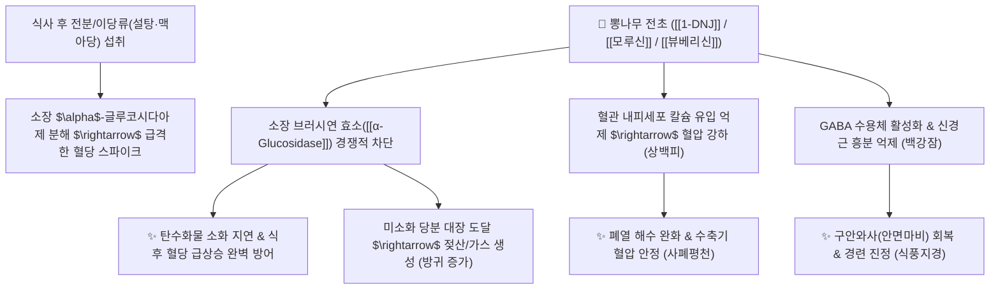

# 🌿 [[뽕나무]] (桑木, Mori Totum / [[상엽]]·[[상백피]]·[[백강잠]])

> **핵심 요약 (Key Summary)**:
> 뽕나무과(*Moraceae*) 뽕나무(*Morus alba*)의 잎([[상엽]]), 근피([[상백피]]), 가지([[상지]]), 열매([[상심자]]) 및 누에 유충([[백강잠]])
> 천연 이미노슈가인 [[1-DNJ]](1-Deoxynojirimycin)와 플라보노이드 [[모루신]](Morusin)이 소장 [[알파-글루코시다아제]] 효소를 경쟁적으로 차단하여 탄수화물 흡수를 억제하고 혈압·혈당 강하 및 진경 작용 발휘
> 당뇨병(소갈)·식후 고혈당 및 풍열(風熱) 감기·폐열천해(肺熱喘咳)·구안와사(안면신경마비)를 부위별로 나누어 치료하는 대표적인 상용 약선 및 임상 본초군

---
## 📌 목차
1. [뽕나무 부위별 5대 본초 비교 총괄 (Pharmacognosy)](#1-뽕나무-부위별-5대-본초-비교-총괄-pharmacognosy)
2. [핵심 분자약리 기전 & 1-DNJ 탄수화물 차단 네트워크](#2-핵심-분자약리-기전--1-dnj-탄수화물-차단-네트워크)
3. [해부생체역학 / 소장 융모 흡수 & 안면 신경계 연계](#3-해부생체역학--소장-융모-흡수--안면-신경계-연계)
4. [사상의학 및 임상 응용 (적응증 vs 소화기 가스 반응)](#4-사상의학-및-임상-응용-적응증-vs-소화기-가스-반응)
5. [고전 의학 및 부위별 핵심 배오 원리](#5-고전-의학-및-부위별-핵심-배오-원리)
6. [핵심 처방 비교 매트릭스](#6-핵심-처방-비교-매트릭스)
7. [출처 및 학술 참고 문헌 (References)](#7-출처-및-학술-참고-문헌-references)

---
## 1. 뽕나무 부위별 5대 본초 비교 총괄 (Pharmacognosy)

| 부위/약재명 | 기원 및 약용 부위 | 성미 및 귀경 | 핵심 전통 효능 | 주치 병증 및 임상 타깃 |
| :--- | :--- | :--- | :--- | :--- |
| [[상엽]] (桑葉) | 뽕나무의 어린 잎 | 苦·甘, 寒<br>肺·肝經 | [[소산풍열]](疏散風熱)<br>[[청폐윤조]](淸肺潤燥)<br>[[청간명목]](淸肝明目) | 풍열 감기, 두통, 마른 기침, 눈 충혈, 당뇨(소갈) |
| [[상백피]] (桑白皮) | 뽕나무의 뿌리껍질(근피) | 甘, 寒<br>肺·脾經 | [[사폐평천]](瀉肺平喘)<br>[[이수소종]](利水消腫) | 폐열 해수·천식, 안면 부종, 고혈압, 흉만 |
| [[백강잠]] (白殭蠶) | 누에가 백강균에 감염되어 굳은 유충 | 鹹·辛, 平<br>肝·肺·胃經 | [[식풍지경]](息風止痙)<br>[[거풍지통]](祛風止痛)<br>[[화담산결]](化痰散結) | 구안와사, 소아 경련, 편두통, 인후종통, 피부 두드러기 |
| [[상지]] (桑枝) | 뽕나무의 어린 가지 | 微苦, 平<br>肝經 | [[거풍습]](祛風濕)<br>[[통경락]](通經絡) | 상지(어깨/팔) 관절통, 오십견, 마비감 |
| [[상심자]] (桑椹子) | 뽕나무의 잘 익은 오디 열매 | 甘·酸, 寒<br>心·肝·腎經 | [[자음양혈]](滋陰養血)<br>[[생진윤장]](生津潤腸) | 노인성 탈모, 조기 백발, 마른 변비, 구갈 |

> **[약리적 관점 및 사용자 메모 고찰]**:
> * 뽕나무의 잎, 줄기, 뿌리껍질, 열매, 그리고 뽕잎을 먹고 자란 백강잠은 공통적으로 당 흡수 억제 활성을 지닙니다.
> * 이는 천연 의약품인 [[아카보스]](Acarbose)와 유사하게 탄수화물을 소화시키는 $\alpha$-글루코시다아제 효소를 차단하여 당을 흡수시키지 않고 대장으로 흘려보내므로 다이어트와 당뇨에 탁월하지만, 대장에서 미생물 발효로 가스가 발생하여 방귀가 잦아지는 임상적 특성을 공유합니다.

### 🔬 뽕나무 1-DNJ의 화학 구조
```
        OH
         │
     [ 피페리딘 고리 ]───CH2OH  <-- 1-DNJ (1-Deoxynojirimycin, 포도당 유사 당 모방체)
     /               \
   HO                 OH
```
> **[구조적 특징 및 효소 경쟁적 억제]**: [[1-DNJ]]는 포도당의 산소 원자가 질소 원자로 치환된 이미노슈가(Iminosugar) 구조로, 소장 융모 상피세포의 말타아제(Maltase)와 수크라아제(Sucrase) 활성 부위에 강력히 결합하여 포도당의 체내 흡수를 원천 차단합니다.

---
## 2. 핵심 분자약리 기전 & 1-DNJ 탄수화물 차단 네트워크



### (1) 소화기 대사 및 혈당 조절
* **소장 $\alpha$-글루코시다아제 억제 ([[1-DNJ]])**:
  * 식후 혈당 스파이크를 완만하게 조절하여 당뇨 환자의 췌장 베타세포 과부하를 방지하고 인슐린 저항성을 개선합니다.
* **대장 발효 및 정장 작용**:
  * 소장에서 흡수되지 않은 올리고당류가 대장 내 유익균의 먹이가 되어 단쇄지방산(SCFA)을 생성하지만, 일시적인 복부 팽만과 가스(방귀) 배출을 유발합니다.

### (2) 혈관 및 신경계 조절
* **사폐평천 및 혈압 강하 (상백피의 [[모루신]])**:
  * 폐포 혈관 저항을 낮추고 기관지 평활근을 이완시켜 폐열로 인한 쌕쌕거림(천식)과 안면 부종을 가라앉힙니다.
* **식풍지경 및 안면신경 마비 치료 (백강잠의 [[뷰베리신]])**:
  * 척수 및 뇌신경 운동 전달을 안정화하여 구안와사(안면마비), 편두통, 안면경련을 치료합니다.

---
## 3. 해부생체역학 / 소장 융모 흡수 & 안면 신경계 연계

* **소장 점막 브러시 가장자리(Brush Border) 차폐**:
  * 십이지장과 공장 상부에서 당류의 능동 수송체(SGLT1) 과부하를 방지합니다.
* **안면신경(CN VII) 및 삼차신경(CN V) 연축 정상화**:
  * 백강잠이 안면 표정근의 비대칭 경련을 완화하고 혈류를 복원합니다.

---
## 4. 사상의학 및 임상 응용 (적응증 vs 소화기 가스 반응)

```
[✅ 최적 적응증 (Sweet Spot)]
• [[상엽]]: 당뇨병(소갈) 초기 혈당 관리, 감기 초기 발열·인후통, 눈이 충혈되고 뻑뻑한 결막염
• [[상백피]]: 폐열 천식, 기관지염, 얼굴과 눈두덩이가 퉁퉁 붓는 수종, 고혈압
• [[백강잠]]: 구안와사(안면신경마비), 소아 경기(놀람/열성경련), 편두통, 담마진(두드러기)
• [[상지]]: 어깨와 팔이 쑤시고 저려 팔을 들기 힘든 견비통 및 오십견
• [[상심자]]: 머리가 일찍 희어지고 탈모가 오며 변이 마르고 눈이 어두운 노인성 허약

[⚠️ 복용 시 특징적 반응 및 주의사항]
• 방귀(가스) 증가 현상: 1-DNJ의 당 흡수 차단으로 인한 자연스러운 대장 발효 반응이므로 안심하고 복용 가능
• 비위허한(脾胃虛寒): 평소 속이 매우 차고 설사를 자주 하는 환자는 장기 단독 복용 주의
```

---
## 5. 고전 의학 및 부위별 핵심 배오 원리

### (1) 상한 및 온병학의 최고 배오
* **핵심 배오**:
  * [[상엽]] + [[국화]] $\rightarrow$ 상초의 풍열을 날리고 눈을 맑게 하는 풍열 감기 명방 ([[상국음]])
  * [[상백피]] + [[지골피]] + [[감초]] $\rightarrow$ 폐의 화열을 끄고 천식을 멎게 함 ([[사백산]])
  * [[백강잠]] + [[백부자]] + [[전갈]] $\rightarrow$ 비뚤어진 안면 신경을 바로잡는 구안와사 특효방 ([[견정산]])

---
## 6. 핵심 처방 비교 매트릭스

| 처방명 | 구성 약재 | 주치 병증 및 임상 타깃 | 특징 및 감별점 |
| :--- | :--- | :--- | :--- |
| [[상국음]] | [[상엽]], [[국화]], [[연교]], [[박하]], [[길경]], [[행인]], [[노근]] | **풍열감모 초기, 미열, 마른 기침, 인후통, 눈 충혈** | 온병학의 대표적 소산풍열 처방 |
| [[사백산]] | [[상백피]], [[지골피]], [[감초]], [[경미]](멥쌀) | **폐열천해, 조열(오후 미열), 소아 폐렴 기침, 각혈** | 폐의 열을 시원하게 씻어내는 명방 |
| [[견정산]] | [[백강잠]], [[백부자]], [[전갈]] | **구안와사, 안면마비, 입과 눈이 비뚤어짐, 안면경련** | 풍담을 뚫어 안면 대칭을 복원 |
| [[상지탕]] | [[상지]], [[위령선]], [[강활]], [[방풍]], [[당귀]] | **상지 비통(어깨·팔 관절염), 상지 마비, 오십견** | 팔과 어깨로 약효를 이끄는 인경 처방 |

---
## 7. 출처 및 학술 참고 문헌 (References)

1. **Asano, N., et al. (2001)**. Polyhydroxylated alkaloids from *Morus alba* and their inhibitory activities against human glycosidases. *Journal of Agricultural and Food Chemistry*, 49(9), 4208-4213.
   - **[연구 요약]**: 뽕나무 잎과 뿌리껍질에서 분리한 1-DNJ가 인체 알파-글루코시다아제를 강력히 저해하여 식후 고혈당을 개선함을 규명.
2. **대한민국약전(KP) 제12개정 (2022)**. 의약품각조 제2부: 상엽, 상백피, 백강잠 규격 기준.
   - **[공정서 규격]**: 상엽의 루틴 함량 규격 및 상백피의 모루신 규격, 백강잠 순도시험 명시.