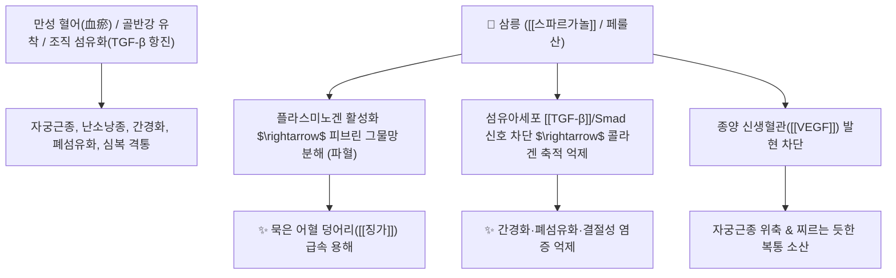

# 🌿 [[삼릉]] (三稜, Sparganii Rhizoma)

> **핵심 요약 (Key Summary)**:
> 흑삼릉과(*Sparganiaceae*) 흑삼릉(*Sparganium stoloniferum*)의 덩이줄기(괴경)
> 페닐프로파노이드인 [[스파르가놀]](Sparganol)과 유기산 성분이 피브린 그물망을 강력히 용해하고 조직 섬유화([[TGF-β]]) 및 종양 신생혈관을 억제하여 단단한 종괴 분쇄 작용 발휘
> 복강 내 징가적취(癥瘕積聚, 자궁근종·난소낭종·간경화 섬유화) 및 극심한 혈어(血瘀) 무월경·식적(食積) 심복통을 치료하는 대표적인 [[파혈거어]](破血祛瘀)·[[행기소적]](行氣消積)·[[소적화위]](消積和胃) 약재

---
## 📌 목차
1. [기본 본초 정보 & 화학 구조 (Pharmacognosy)](#1-기본-본초-정보--화학-구조-pharmacognosy)
2. [핵심 분자약리 기전 & 파혈·항섬유화 네트워크](#2-핵심-분자약리-기전--파혈항섬유화-네트워크)
3. [해부생체역학 / 골반강 장기 섬유화 & 종괴 연계](#3-해부생체역학--골반강-장기-섬유화--종괴-연계)
4. [사상의학 및 임상 응용 (삼릉 vs 아출 파적 비교)](#4-사상의학-및-임상-응용-삼릉-vs-아출-파적-비교)
5. [고전 의학 및 배오 원리 (삼릉아출 배오)](#5-고전-의학-및-배오-원리-삼릉아출-배오)
6. [핵심 처방 비교 매트릭스](#6-핵심-처방-비교-매트릭스)
7. [출처 및 학술 참고 문헌 (References)](#7-출처-및-학술-참고-문헌-references)

---
## 1. 기본 본초 정보 & 화학 구조 (Pharmacognosy)

| 항목 | 상세 내용 |
| :--- | :--- |
| **기원 식물** | 흑삼릉과(Sparganiaceae) 흑삼릉 *Sparganium stoloniferum* Buch.-Ham.의 껍질을 벗겨 말린 덩이줄기(괴경) |
| **성미 (性味)** | 辛·苦, 平 |
| **귀경 (歸經)** | 肝·脾經 (간경, 비경) - **혈분(血分)의 어혈을 직접 분쇄** |
| **효능 (Actions)** | [[파혈거어]](破血祛瘀), [[행기소적]](行氣消積), [[소적화위]](消積和胃), [[통경지통]](通經止痛) |
| **주요 성분** | • **페닐프로파노이드 및 유기산**: [[스파르가놀]] (Sparganol), 스파르가닌(Sparganin A-C), 페룰산, 바닐린산<br>• **플라보노이드 및 스테롤**: 루틴, $\beta$-Sitosterol, Daucosterol<br>• **다당체 및 정유 분획**: 피브린 용해 활성 다당류 |

> **[유래 및 본초학적 기전]**:
> * 잎과 줄기에 세 개의 모서리(三稜)가 칼날처럼 날카롭게 서 있어 '삼릉(三稜)'이라 불렸습니다.
> * 그 날카로운 기운으로 뼛속과 오장육부 깊숙이 굳어버린 돌 같은 어혈(징가 癥瘕)과 묵은 식적(적취 積聚)을 쪼개어 부숴버립니다.
> * 현대 약리적으로 비정상적인 세포 증식(자궁근종, 암세포) 및 조직 섬유화(간경화, 폐섬유화, 골극, 켈로이드 흉터)를 강력히 억제합니다.

### 🔬 삼릉의 주요 지표물질 화학 구조
![[Pasted image 20240228173153.png|450]]
> [구조적 특징 및 활성]: 삼릉의 페닐프로파노이드 유도체들은 혈관 내 피브리노겐의 피브린 중합을 차단하고, 섬유아세포의 콜라겐 과다 합성을 유도하는 [[TGF-β]] 신호 경로를 차단하여 만성 결절성 염증과 섬유화를 역전시킵니다.

---
## 2. 핵심 분자약리 기전 & 파혈·항섬유화 네트워크



### (1) 혈관 내 혈전 용해 및 파혈 작용
* **피브린 용해 촉진 ([[파혈거어]] 破血祛瘀)**:
  * 혈소판 응집을 막고 혈전을 녹여내어 골반강 내의 단단하게 뭉친 어혈과 생리통, 무월경을 강력하게 통리합니다.
* **항섬유화 및 신생물 억제**:
  * 간세포 성상세포 활성화를 억제하여 간경변증의 간 섬유화를 막고, 자궁근층의 과다 증식을 차단합니다.
* **소식화적(消食化積) 및 흉복통 해소**:
  * 위장관 내 음식물이 돌처럼 굳은 식적을 분쇄하여 복부 팽만과 위완통을 멎게 합니다.

---
## 3. 해부생체역학 / 골반강 장기 섬유화 & 종괴 연계

* **자궁근종 및 난소 낭종 크기 축소**:
  * 골반강 미세혈관의 혈류 저항을 낮추고 섬유조직 유착을 완화합니다.
* **복막 유착(Adhesion) 방지**:
  * 수술 후 또는 만성 골반염으로 인한 장관 유착성 통증을 완화합니다.

---
## 4. 사상의학 및 임상 응용 (삼릉 vs 아출 파적 비교)

```
[✅ 삼릉 vs 아출(봉출) 2대 파적제 비교 Matrix]
• [[삼릉]]: 혈분(血分)으로 깊이 들어가 '오래된 단단한 어혈과 피를 깨뜨림' (破血 위주)
• [[아출]](봉출): 기분(氣分)으로 퍼져 '기운을 소통시키고 통증을 멎게 함' (行氣破氣 위주)
• 임상에서는 항상 삼릉과 아출을 1:1로 배오하여 기혈의 모든 적취를 동시에 분쇄

[✅ 최적 적응증 (Sweet Spot)]
• 자궁근종, 자궁내막증, 난소낭종: 아랫배에 딱딱한 덩어리가 만져지고 생리 시 극심한 통증과 덩어리 피가 나오는 경우
• 간비종대 및 간경화: 옆구리 아래 비장이나 간이 딱딱하게 부어오른 경우
• 만성 소화기 식적: 명치 아래가 돌처럼 굳어 소화가 안 되고 답답한 경우
• 관상동맥경화증 및 뇌혈전 후유증

[⚠️ 임산부 절대 금기 (Black Box Warning)]
• 강력한 파혈(破血) 작용으로 태아를 유산시키므로 임산부 투여 절대 금기
• 출혈성 소인 및 월경 과다 환자 금기
```

---
## 5. 고전 의학 및 배오 원리 (삼릉아출 배오)

### (1) 적취 분쇄의 천하 명방: 화적환(化積丸)
* **핵심 배오**:
  * [[삼릉]] + [[봉출]](아출)` $\rightarrow$ 기와 혈의 어혈 덩어리를 완벽히 깨뜨려 배출 ([[화적환]], [[삼릉봉출산]])
  * [[삼릉]] + [[당귀]] + [[홍화]] $\rightarrow$ 어혈성 무월경과 난치성 월경통을 통경

---
## 6. 핵심 처방 비교 매트릭스

| 처방명 | 구성 약재 | 주치 병증 및 임상 타깃 | 특징 및 감별점 |
| :--- | :--- | :--- | :--- |
| [[화적환]] | [[삼릉]], [[봉출]], [[해인]], [[신곡]], [[맥아]], [[빈랑]] 등 | **징가적취, 복강 내 종괴, 비괴(간비종대), 식적 심복통** | 고금 최고의 파적소적 처방 |
| [[삼릉봉출산]] | [[삼릉]], [[봉출]], [[청피]], [[목향]], [[정향]] 등 | **기체혈어, 자궁근종 통증, 복부 팽만통** | 기혈을 고루 뚫어 통증 완화 |
| [[개결서경탕]] | [[삼릉]], [[봉출]], [[당귀]], [[천궁]], [[도인]], [[홍화]] 등 | **어혈성 무월경, 골반염, 하복부 자통(찌르는 통증)** | 막힌 경락을 뚫어 월경 복원 |

---
## 7. 출처 및 학술 참고 문헌 (References)

1. **Sun, J., et al. (2011)**. Antithrombotic and anti-inflammatory activities of *Sparganium stoloniferum* extract. *Journal of Ethnopharmacology*, 133(2), 654-659.
   - **[연구 요약]**: 삼릉 추출물이 트롬빈 매개 혈소판 응집을 차단하고 피브린 용해를 촉진하여 항혈전 및 항염증 효과를 나타냄을 검증.
2. **대한민국약전(KP) 제12개정 (2022)**. 의약품각조 제2부: 삼릉 (Sparganii Rhizoma) 규격 기준.
   - **[공정서 규격]**: 흑삼릉 괴경의 성상, 순도시험(이물, 중금속, 비소) 및 묽은에탄올 엑스 15.0% 이상 기준 명시.