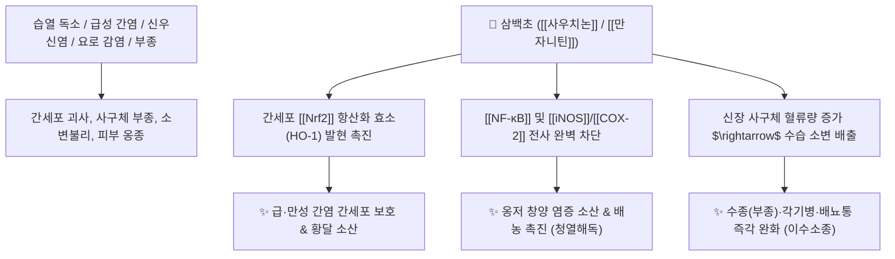

# 🌿 [[삼백초]] (三白草, Saururi Herba seu Rhizoma)

> **핵심 요약 (Key Summary)**:
> 삼백초과(*Saururaceae*) 삼백초(*Saururus chinensis*)의 지상부 또는 뿌리를 포함한 전초
> 리그난 성분인 [[사우치논]](Sauchinone)과 [[만자니틴]](Manassantin)이 [[NF-κB]] 염증 신호와 [[iNOS]]를 차단하여 강력한 간 보호·항암 및 신장 사구체 이뇨 작용 발휘
> 습열(濕熱)로 인한 수종(부종)·소변불리·급성 방광염 및 간염·황달·피부 옹종 창양을 치료하는 대표적인 [[청열해독]](淸熱解毒)·[[이수소종]](利水消腫) 약재

---
## 📌 목차
1. [기본 본초 정보 & 화학 구조 (Pharmacognosy)](#1-기본-본초-정보--화학-구조-pharmacognosy)
2. [핵심 분자약리 기전 & 사우치논·간보호·이뇨 네트워크](#2-핵심-분자약리-기전--사우치논간보호이뇨-네트워크)
3. [해부생체역학 / 사구체 여과 & 요로 점막 연계](#3-해부생체역학--사구체-여과--요로-점막-연계)
4. [사상의학 및 임상 응용 (어성초 vs 삼백초 감별)](#4-사상의학-및-임상-응용-어성초-vs-삼백초-감별)
5. [고전 의학 및 배오 원리](#5-고전-의학-및-배오-원리)
6. [핵심 처방 비교 매트릭스](#6-핵심-처방-비교-매트릭스)
7. [출처 및 학술 참고 문헌 (References)](#7-출처-및-학술-참고-문헌-references)

---
## 1. 기본 본초 정보 & 화학 구조 (Pharmacognosy)

| 항목 | 상세 내용 |
| :--- | :--- |
| **기원 식물** | 삼백초과(Saururaceae) 삼백초 *Saururus chinensis* (Lour.) Baill.의 꽃 필 때 채취한 지상부 또는 뿌리줄기 |
| **성미 (性味)** | 辛·苦, 寒 |
| **귀경 (歸經)** | 肺·膀胱·大腸經 (폐경, 방광경, 대장경) |
| **효능 (Actions)** | [[청열해독]](淸熱解毒), [[이수소종]](利水消腫), [[청열이습]](淸熱利濕), [[소옹산결]](消癰散結) |
| **주요 성분** | • **리그난 유도체**: [[사우치논]] (Sauchinone), [[만자니틴]] (Manassantin A, B), Saucerneol, Sauchinone A<br>• **플라보노이드**: [[케르세틴]] (Quercetin), 루틴, 하이페로사이드, 이소케르시트린<br>• **정유 및 유기산**: 메틸노닐케톤, 미르센 |

> **[유래 및 본초학적 기전]**:
> * 뿌리, 잎, 꽃의 세 군데가 희다 하여 '삼백초(三白草)'라 불렸습니다.
> * 몸속의 독소와 열기를 씻어내고 소변을 시원하게 통하게 하여 수종(부종), 각기병, 황달, 악성 종기(창양 瘡瘍), 림프절 결절을 다스립니다.

### 🔬 삼백초의 주요 리그난 지표물질 화학 구조
```
        [ 테트라하이드로푸란 2환 골격 ]
                 │
      사우치논 (Sauchinone, 천연 강력 항산화/항염 리그난)
```
> **[구조적 특징 및 간 보호]**: [[사우치논]]은 독특한 다이리그난 골격으로, 간세포의 [[Nrf2]] 항산화 신호계를 활성화하고 [[NF-κB]]에 의한 염증성 사이토카인 생성을 차단하여 간 손상과 신장염을 방어합니다.

---
## 2. 핵심 분자약리 기전 & 사우치논·간보호·이뇨 네트워크



### (1) 표적 항염증 및 간·신장 보호
* **간세포 보호 및 항산화 ([[사우치논]])**:
  * 활성산소(ROS)를 제거하고 간독성 물질로부터 간세포 괴사를 막아 급·만성 간염과 황달을 치료합니다.
* **이수소종(利水消腫) 및 요로계 항균**:
  * 신장 사구체 여과 기능을 높여 체내 정체된 수분을 소변으로 몰아내고 요로 감염균을 살균합니다.
* **소옹산결(消癰散結) 및 항암**:
  * 만자니틴 성분이 비정상 세포 증식을 억제하고 피부의 붉은 종기, 림프절염, 피하 결절을 삭입니다.

---
## 3. 해부생체역학 / 사구체 여과 & 요로 점막 연계

* **신장 수입세동맥 저항 감소**:
  * 사구체 여과압을 유지하여 신장염 부종 환자의 핍뇨(소변 감소)를 개선합니다.

---
## 4. 사상의학 및 임상 응용 (어성초 vs 삼백초 감별)

```
[✅ 최적 적응증 (Sweet Spot)]
• 신장 및 비뇨기 질환: 급·만성 신장염 부종, 방광염, 요도염, 소변 시 찌릿한 통증
• 간담 습열 질환: 급성 간염, 황달, 간경변 복수 보조
• 피부 및 외과: 악성 종기, 여드름, 림프절 결핵(나력), 치질 부종
• 각기병(腳氣病)으로 다리가 퉁퉁 붓고 무거운 경우

[🔍 삼백초 vs 어성초 감별 포인트]
• [[삼백초]]: 간질환·황달 및 비뇨기 수종(이수소종)·림프절 결절에 특화
• [[어성초]](약모밀): 폐렴·기관지염 등 호흡기 화농성 폐옹(肺癰) 배농에 특화
```

---
## 5. 고전 의학 및 배오 원리

### (1) 고전 본초학적 배오
* **핵심 배오**:
  * [[삼백초]] + [[인진호]] + [[치자]] $\rightarrow$ 습열성 급성 간염과 황달을 치료
  * [[삼백초]] + [[차전자]] + [[백모근]] $\rightarrow$ 급성 방광염과 혈뇨, 전신 부종을 이뇨 배출

---
## 6. 핵심 처방 비교 매트릭스

| 처방명 | 구성 약재 | 주치 병증 및 임상 타깃 | 특징 및 감별점 |
| :--- | :--- | :--- | :--- |
| [[삼백초탕]](단방) | [[삼백초]](전초 전탕 또는 생즙) | 급성 신장염 부종, 간염 황달, 소변불리, 각기 | 수분을 소통시키고 열독을 해독 |
| [[용담사간탕]](가감) | [[용담초]], [[치자]], [[황금]] + [[삼백초]] | 간담 습열, 요로 감염, 음부 소양증, 황달 | 하초 습열을 소변으로 배출 |
| [[삼백초고]](외용) | [[삼백초]](생것 찧어 환부 첩부) | 악성 종기, 모낭염, 림프절염, 타박 부종 | 외과 염증의 열독을 즉시 흡수 |

---
## 7. 출처 및 학술 참고 문헌 (References)

1. **Sung, S. H., et al. (2000)**. Sauchinone, a lignan from *Saururus chinensis*, attenuates carbon tetrachloride-induced hepatic injury in rats. *British Journal of Pharmacology*, 129(4), 689-694.
   - **[연구 요약]**: 삼백초의 지표 리그난인 사우치논이 지질 과산화를 억제하고 간세포를 강력히 보호함을 입증.
2. **대한민국약전외한약(생약)규격집(KHP) (2022)**. 삼백초 (Saururi Herba seu Rhizoma) 규격 기준.
   - **[공정서 규격]**: 삼백초의 성상, 순도시험(이물, 중금속, 비소) 및 건조감량 13.0% 이하 기준 명시.
