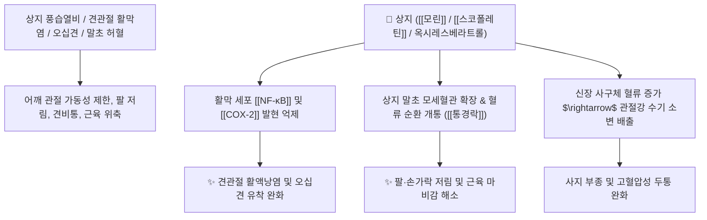

# 🌿 [[상지]] (桑枝, Mori Ramulus / 뽕나무가지)

> **핵심 요약 (Key Summary)**:
> 뽕나무과(*Moraceae*) 뽕나무(*Morus alba*)의 어린 가지(눈가지)
> 플라보노이드인 [[모린]](Morin)과 쿠마린 성분이 상지(팔·어깨) 관절강 내 염증성 부종을 소산시키고 말초 혈류를 촉진하여 거풍습 및 통경락 작용 발휘
> 풍습열비(風濕熱痺)로 인한 어깨·팔의 관절통(견비통)·마비감·오십견 및 사지 수종·고혈압을 치료하는 상지부 인경(引經) 약재이자 대표적인 [[거풍습]](祛風濕)·[[통경락]](通經絡) 약재

---
## 📌 목차
1. [기본 본초 정보 & 화학 구조 (Pharmacognosy)](#1-기본-본초-정보--화학-구조-pharmacognosy)
2. [핵심 분자약리 기전 & 견관절 소염·통경락 네트워크](#2-핵심-분자약리-기전--견관절-소염통경락-네트워크)
3. [해부생체역학 / 견관절 복합체 & 상지 신경총 연계](#3-해부생체역학--견관절-복합체--상지-신경총-연계)
4. [사상의학 및 임상 응용 (상지부 인경 특화)](#4-사상의학-및-임상-응용-상지부-인경-특화)
5. [고전 의학 및 배오 원리 (견비통 배오)](#5-고전-의학-및-배오-원리-견비통-배오)
6. [핵심 처방 비교 매트릭스](#6-핵심-처방-비교-매트릭스)
7. [출처 및 학술 참고 문헌 (References)](#7-출처-및-학술-참고-문헌-references)

---
## 1. 기본 본초 정보 & 화학 구조 (Pharmacognosy)

| 항목 | 상세 내용 |
| :--- | :--- |
| **기원 식물** | 뽕나무과(Moraceae) 뽕나무 *Morus alba* L. 또는 동속 식물의 봄/여름철 채취한 어린 가지 |
| **성미 (性味)** | 微苦, 平 |
| **귀경 (歸經)** | 肝經 (간경) - **상지(팔·어깨) 인경약(引經藥)** |
| **효능 (Actions)** | [[거풍습]](祛風濕), [[통경락]](通經絡), [[이관절]](利關節), [[행수소종]](行水消腫) |
| **주요 성분** | • **플라보노이드**: [[모린]] (Morin), 루틴, 쿠와논, 옥시레스베라트롤<br>• **쿠마린 및 리그난**: [[스코폴레틴]] (Scopoletin), 움벨리페론<br>• **이미노슈가**: [[1-DNJ]] (1-Deoxynojirimycin) |

> **[유래 및 본초학적 기전]**:
> * 뽕나무의 어린 가지(枝)로, 가지의 뻗어나가는 기운이 사람의 팔과 어깨(상지 上肢)로 향하여 상초의 막힌 경락을 뚫어줍니다.
> * 풍습으로 팔과 어깨가 쑤시고 저려 들어 올리지 못하는 견비통(오십견), 사지 저림, 부종, 고혈압을 치료합니다.

### 🔬 상지의 주요 플라보노이드 지표물질 화학 구조
```
     [ 플라보놀 골격 ]───( 2',4'-디하이드록시 페닐기 )  <-- 모린 (Morin)
```
> **[구조적 특징 및 활성]**: [[모린]]은 관절 활막세포의 염증성 프로스타글란딘($\text{PGE}_2$) 생성을 억제하고 혈관 내피세포의 산화 스트레스를 경감시킵니다.

---
## 2. 핵심 분자약리 기전 & 견관절 소염·통경락 네트워크



### (1) 상지 관절염 및 경락 소통 작용
* **상지부 특이적 거풍습 및 진통**:
  * 상지(팔·어깨)로 약효를 이끌어 회전근개 건염, 오십견(유착성 관절낭염), 류마티스 관절통을 완화합니다.
* **통경락(通經絡) 및 마비 완화**:
  * 뇌졸중 후유증이나 신경 포착으로 인한 상지 마비, 손가락 굳음, 저림증을 개선합니다.

---
## 3. 해부생체역학 / 견관절 복합체 & 상지 신경총 연계

* **견갑상완관절(Glenohumeral Joint) 가동역(ROM) 회복**:
  * 관절낭의 섬유성 경직을 이완시켜 팔의 거상(Flexion/Abduction) 운동성을 개선합니다.

---
## 4. 사상의학 및 임상 응용 (상지부 인경 특화)

```
[✅ 최적 적응증 (Sweet Spot)]
• 오십견 및 견비통: 어깨가 굳어 팔을 뒤로 돌리거나 위로 들기 힘들고 비가 오면 쑤시는 경우
• 상지 마비 및 저림: 손목터널증후군, 경추 디스크로 인한 상지 방사통
• 풍습성 관절염으로 사지가 붓고 저린 상태

[💡 상지(上肢) vs 하지(下肢) 인경약 비교]
• 상지(팔·어깨) 질환 인경약: [[상지]], [[강활]], [[계지]]
• 하지(다리·무릎) 질환 인경약: [[우슬]], [[독활]], [[목과]]
```

---
## 5. 고전 의학 및 배오 원리 (견비통 배오)

### (1) 어깨·팔 통증 치료의 명방
* **핵심 배오**:
  * [[상지]] + [[강활]] + [[강황]] $\rightarrow$ 상지 어깨 관절의 풍한습을 뚫고 통증을 멎게 함 ([[견비탕]])
  * [[상지]] + [[위령선]] + [[방풍]] $\rightarrow$ 류마티스성 견비통을 소산

---
## 6. 핵심 처방 비교 매트릭스

| 처방명 | 구성 약재 | 주치 병증 및 임상 타깃 | 특징 및 감별점 |
| :--- | :--- | :--- | :--- |
| [[상지탕]] | [[상지]], [[위령선]], [[강활]], [[방풍]], [[당귀]] | **상지 비통, 견비통, 팔 마비, 오십견** | 팔과 어깨로 약효를 유도 |
| [[견비탕]] | [[강활]], [[독활]], [[강황]], [[당귀]], [[적작약]], [[상지]](가미) | **풍습 견비통, 경추 신경통, 팔 굴신 곤란** | 어깨 통증 치료의 최고 대표방 |
| [[상백피상지음]] | [[상백피]], [[상지]], [[복령]] | **수기 부종, 상지 종통, 고혈압** | 수분을 소통시키고 혈압 안정 |

---
## 7. 출처 및 학술 참고 문헌 (References)

1. **Fang, S. C., et al. (2008)**. Antioxidant and anti-inflammatory constituents from *Morus alba* ramulus. *Journal of Agricultural and Food Chemistry*, 56(18), 8563-8568.
   - **[연구 요약]**: 상지의 모린 및 옥시레스베라트롤 성분이 관절 활막 염증을 억제하고 혈관 내피 보호 효과를 나타냄을 입증.
2. **대한민국약전(KP) 제12개정 (2022)**. 의약품각조 제2부: 상지 (Mori Ramulus) 규격 기준.
   - **[공정서 규격]**: 뽕나무 어린가지의 성상, 순도시험(이물 2.0% 이하) 및 건조감량 12.0% 이하 기준 명시.
