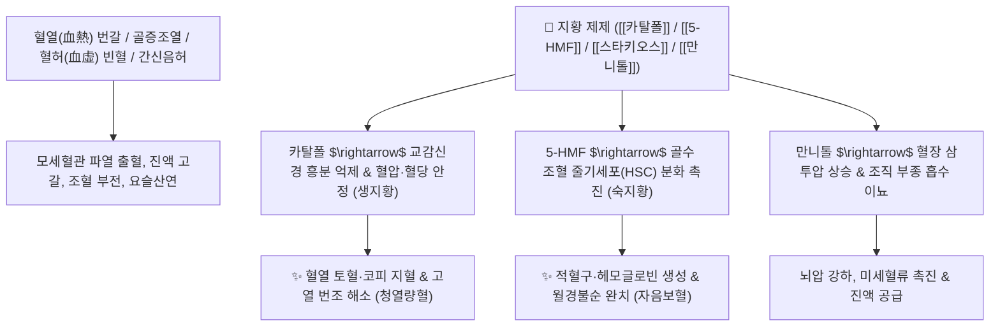

# 🌿 [[생지황]] & [[숙지황]] (Rehmanniae Radix / 生地黃 · 熟地黃)

> **핵심 요약 (Key Summary)**:
> 현삼과(*Scrophulariaceae*) 지황(*Rehmannia glutinosa*)의 신선한/건조된 뿌리([[생지황]]) 및 구증구포 포제 뿌리([[숙지황]])
> 이리도이드 배당체인 [[카탈폴]](Catalpol)과 올리고당 [[스타키오스]](Stachyose), 포제 지표체인 [[5-HMF]]가 혈장 삼투압과 조혈 작용을 조절하여 청열량혈 및 대사 항상성 촉진
> 온열병(溫熱病) 고열 번갈·토혈·음허 발열에는 [[생지황]](淸熱凉血), 혈허(血虛) 빈혈·월경불순·간신음허 요통에는 [[숙지황]](滋陰補血)을 구별하여 사용하는 대표적인 군약(君藥)

---
## 📌 목차
1. [지황 4형제(선지황·생지황·건지황·숙지황) 포제 및 비교 (Pharmacognosy)](#1-지황-4형제선지황생지황건지황숙지황-포제-및-비교-pharmacognosy)
2. [핵심 분자약리 기전 & 카탈폴·5-HMF·혈당 네트워크](#2-핵심-분자약리-기전--카탈폴5-hmf혈당-네트워크)
3. [해부생체역학 / 혈장 삼투압 & 조혈 미세환경 연계](#3-해부생체역학--혈장-삼투압--조혈-미세환경-연계)
4. [사상의학 및 임상 응용 (생지황 청열 vs 숙지황 보혈)](#4-사상의학-및-임상-응용-생지황-청열-vs-숙지황-보혈)
5. [고전 의학 및 배오 원리 (사물탕 & 육미지황탕 배오)](#5-고전-의학-및-배오-원리-사물탕--육미지황탕-배오)
6. [핵심 처방 비교 매트릭스](#6-핵심-처방-비교-매트릭스)
7. [출처 및 학술 참고 문헌 (References)](#7-출처-및-학술-참고-문헌-references)

---
## 1. 지황 4형제(선지황·생지황·건지황·숙지황) 포제 및 비교 (Pharmacognosy)

| 명칭 | 포제 및 가공 상태 | 성미 및 귀경 | 핵심 약리 기전 | 주치 병증 및 임상 타깃 |
| :--- | :--- | :--- | :--- | :--- |
| [[선지황]](鮮地黃) | 갓 캐낸 신선한 생뿌리 | 甘·苦, 大寒<br>心·肝·腎經 | [[청열생진]](淸熱生津)<br>[[량혈지혈]](凉血止血) | 온병 고열, 번갈, 토혈, 코피, 혀가 붉고 마름 |
| [[생지황]](生地黃) | 뿌리를 말린 것 (건지황) | 甘·微苦, 寒<br>心·肝·腎經 | [[청열량혈]](淸熱凉血)<br>[[양음생진]](養陰生津) | 혈열 망행, 반진, 구갈, 골증조열, 변비 |
| [[숙지황]](熟地黃) | 막걸리에 담가 아홉 번 찌고 말림(구증구포) | 甘, 微溫<br>肝·腎經 | [[자음보혈]](滋陰補血)<br>[[익정전수]](益精塡髓) | 혈허 빈혈, 월경 불순, 요슬산연, 조기 백발, 신허 |

> **[약리학적 성분 변화 분석 및 메모 보존]**:
> * 혈당 관련: 지황 뿌리는 올리고당의 한 종류인 [[스타키오스]](Stachyose)(갈락토스 2개+포도당+과당)로 구성되어 있습니다. 이는 대장에서 장내 미생물에 의해 분해되고 소장에서 적게 흡수되어 혈당을 급격히 올리지 않으면서 지속적인 에너지원(천연 수액 역할)을 제공합니다. (단, 소화기가 차고 약한 환자에게는 더부룩함 유발)
> * 대사 및 혈압 안정: 생지황의 주요 지표물질인 [[카탈폴]](Catalpol)은 혈압과 혈당 등 항진된 교감신경 대사 패턴을 안정시킵니다.
> * 호르몬 관련: 지황의 [[파이토스테롤]](Phytosterol)([[캄페스테롤]], [[시토스테롤]], [[스티그마스테롤]])은 성호르몬 및 부신피질호르몬 전구체로 작용하여 안태(安胎) 및 조경(調經)을 돕습니다.
> * 삼투압 및 부종: [[만니톨]](Mannitol)은 혈관 내 혈장 삼투압을 높여 조직 부종과 뇌압 상승을 완화하고 이뇨를 촉진합니다.
> * 숙지황 지표물질: 구증구포 시 카탈폴이 분해되고 흑색 지표물질인 [[5-HMF]](5-Hydroxymethylfurfural)이 생성되어 적혈구 산소 친화력을 높이고 조혈 기능을 극대화합니다.

### 🔬 생지황(카탈폴) vs 숙지황(5-HMF) 화학 구조
```
[ 생지황 (카탈폴, Catalpol) ]                  [ 숙지황 (5-HMF) ]
        O──[ Glc ]                                   O
       /                                            / \
   [ 에폭시 이리도이드 골격 ]───OH           HOCH2──[ 퓨란 고리 ]───CHO
      \     /
       CH──OH
```
> **[구조적 변환 메커니즘]**: 생지황의 수용성 이리도이드 배당체인 카탈폴은 가열·증숙(구증구포) 과정을 거치면서 당이 분해 및 마이야르 반응(Maillard reaction)을 일으켜 퓨란계 화합물인 [[5-HMF]]로 변환되며 성질이 한(寒)에서 온(溫)으로, 청열(淸熱)에서 보혈(補血)로 완전히 역전됩니다.

---
## 2. 핵심 분자약리 기전 & 카탈폴·5-HMF·혈당 네트워크



---
## 3. 해부생체역학 / 혈장 삼투압 & 조혈 미세환경 연계

* **혈장 삼투압(Plasma Osmotic Pressure) 조절**:
  * 만니톨이 간질액에 정체된 잉여 수분을 혈관 내로 끌어들여 미세순환 혈류량을 확보합니다.
* **골수(Bone Marrow) 조혈 미세환경 개선**:
  * 적혈구계 전구세포 증식을 촉진하여 빈혈 환자의 산소 운반 능력을 회복시킵니다.

---
## 4. 사상의학 및 임상 응용 (생지황 청열 vs 숙지황 보혈)

```
[✅ 생지황 vs 숙지황 임상 타깃 비교]
• [[생지황]]: 교감신경 우위로 인한 고혈압, 고혈당, 소모성 발열, 번갈, 혈열 출혈 환자 ([[청영탕]])
• [[숙지황]]: 빈혈, 안색 창백, 생리불순, 어지럼증, 골다공증, 만성 피로 환자 ([[사물탕]])

[⚠️ 소화기 주의사항 (Caution)]
• 스타키오스와 점액질 다당체로 인해 속이 차고 소화력이 약한 환자는 더부룩함이나 무른변 발생 가능
• 소화기 장애 방지를 위해 [[사인]], [[진피]], [[생강]]과 배오하여 처방
```

---
## 5. 고전 의학 및 배오 원리 (사물탕 & 육미지황탕 배오)

### (1) 보혈과 보음의 영원한 군약
* **핵심 배오**:
  * [[숙지황]] + [[당귀]] + [[백작약]] + [[천궁]] $\rightarrow$ 모든 보혈 처방의 으뜸 근간방 ([[사물탕]])
  * [[숙지황]] + [[산수유]] + [[산약]] $\rightarrow$ 간·신·비의 음액을 완벽히 보충 ([[육미지황탕]])
  * [[생지황]] + [[석고]] $\rightarrow$ 온병의 극심한 고열과 혈열 번갈을 진압

---
## 6. 핵심 처방 비교 매트릭스

| 처방명 | 구성 약재 | 주치 병증 및 임상 타깃 | 특징 및 감별점 |
| :--- | :--- | :--- | :--- |
| [[사물탕]] | [[숙지황]], [[당귀]], [[백작약]], [[천궁]] | **혈허증, 빈혈, 안색 창백, 월경불순, 어지럼증** | 보혈(補血)의 천하 기본방 |
| [[육미지황탕]] | [[숙지황]], [[산수유]], [[산약]], [[택사]], [[목단피]], [[복령]] | **간신음허, 요슬산연, 골증조열, 도한, 소갈(당뇨)** | 자음보신의 대표 처방 |
| [[청영탕]] | [[생지황]], [[현삼]], [[맥문동]], [[금은화]], [[연교]], [[죽엽]] | **온병 열입영분, 고열, 섬어(헛소리), 반진, 번조** | 혈분의 열을 끄고 진액 보존 |
| [[경옥고]] | [[생지황]](즙), [[인삼]], [[백복령]], [[봉밀]] | **만성 피로, 허로 해수, 면역력 저하, 원기 고갈** | 3박 4일 달여 만든 자양강장 명방 |

---
## 7. 출처 및 학술 참고 문헌 (References)

1. **Zhang, R. X., et al. (2008)**. *Rehmannia glutinosa*: review of botany and chemistry, pharmacology and clinical applications. *Journal of Ethnopharmacology*, 117(2), 199-214.
   - **[연구 요약]**: 지황의 카탈폴, 스타키오스, 5-HMF의 화학적 변환 기전 및 혈당 강하, 조혈 촉진, 항염증 약리 총괄 고찰.
2. **대한민국약전(KP) 제12개정 (2022)**. 의약품각조 제2부: 생지황 및 숙지황 규격 기준.
   - **[공정서 규격]**: 생지황의 카탈폴 규격 및 숙지황의 5-HMF($\ge 0.10\%$) 규격 명시.