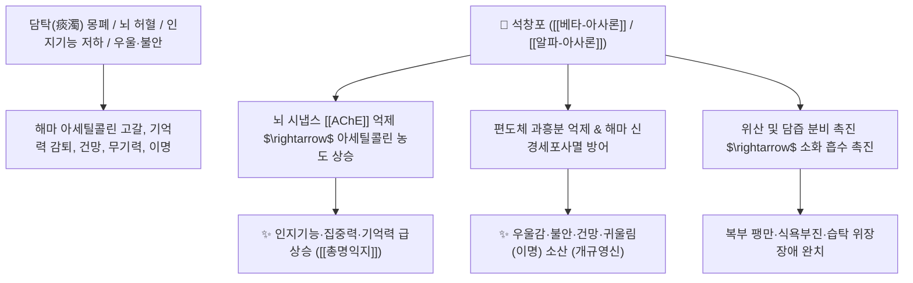

# 🌿 [[석창포]] (石菖蒲, Acori Graminei Rhizoma)

> **핵심 요약 (Key Summary)**:
> 천남성과(*Araceae*) 석창포(*Acorus gramineus*)의 건조한 뿌리줄기(근경)
> 페닐프로파노이드 정유인 [[베타-아사론]](β-Asarone)과 [[알파-아사론]](α-Asarone)이 뇌 편도체 및 해마 신경세포를 보호하고 뇌 미세순환을 촉진하여 개규영신 및 인지기능 개선 작용 발휘
> [[태음인]]의 담음(痰飲) 몽폐로 인한 건망증·치매·우울증·이명 및 비위습탁(脾胃濕濁) 소화불량을 치료하는 총명탕(聰明湯)의 주약이자 대표적인 [[개규영신]](開竅寧神)·[[화습개위]](化濕開胃) 군약(君藥)

---
## 📌 목차
1. [기본 본초 정보 & 화학 구조 (Pharmacognosy)](#1-기본-본초-정보--화학-구조-pharmacognosy)
2. [핵심 분자약리 기전 & 아사론·편도체 신경망 네트워크](#2-핵심-분자약리-기전--아사론편도체-신경망-네트워크)
3. [해부생체역학 / 해마(Hippocampus) 시냅스 & 소화관 분비 연계](#3-해부생체역학--해마hippocampus-시냅스--소화관-분비-연계)
4. [사상의학 및 체질별 임상 응용 (태음인 방향화습 특화)](#4-사상의학-및-임상-응용-태음인-방향화습-특화)
5. [고전 의학 및 배오 원리 (총명탕 배오)](#5-고전-의학-및-배오-원리-총명탕-배오)
6. [핵심 처방 비교 매트릭스](#6-핵심-처방-비교-매트릭스)
7. [출처 및 학술 참고 문헌 (References)](#7-출처-및-학술-참고-문헌-references)

---
## 1. 기본 본초 정보 & 화학 구조 (Pharmacognosy)

| 항목 | 상세 내용 |
| :--- | :--- |
| **기원 식물** | 천남성과(Araceae) 석창포 *Acorus gramineus* Soland.의 뿌리줄기(근경) |
| **성미 (性味)** | 辛·苦, 溫 |
| **귀경 (歸經)** | 心·胃經 (심경, 위경) - **뇌신경계 및 소화기 방향 개규** |
| **효능 (Actions)** | [[개규영신]](開竅寧神), [[화습개위]](化濕開胃), [[총명익지]](聰明益智), [[산풍거습]](散風祛濕) |
| **주요 성분** | • **페닐프로파노이드 정유(주성분)**: [[베타-아사론]] ($\beta$-Asarone, cis-이성질체), [[알파-아사론]] ($\alpha$-Asarone, trans-이성질체)<br>• **모노/세스퀴테르펜**: 유게놀, 아코론, 카리오필렌<br>• **아미노산 및 유기산**: 팔미트산, 콜린 |

> **[유래 및 본초학적 기전]**:
> * 바위(石) 틈의 맑은 물가에서 자라며 향기가 맑고 짙어 머리와 가슴을 맑게 열어준다 하여 '석창포(石菖蒲)'라 불렸습니다.
> * 방향성 아로마 성분이 뇌 편도체와 해마를 자극하여 막힌 담음(痰濁)의 안개를 걷어내어 건망증을 없애고 뇌를 깨워줍니다.
> * 소화액과 담즙 분비를 촉진하여 단백질과 지방의 소화 흡수를 돕습니다.

### 🔬 석창포의 주요 지표물질 화학 구조
![[석창포-20241029041206217.png|397]]
![[석창포-20241029042810561.png|397]]
> **[구조적 특징 및 신경 보호]**: [[베타-아사론]]은 1,2,4-트리메톡시벤젠 유도체로, 뇌세포의 글루탐산 독성을 차단하고 아세틸콜린에스테라아제(AChE)를 억제하여 시냅스 내 아세틸콜린 농도를 높여 기억력을 증진시킵니다.

---
## 2. 핵심 분자약리 기전 & 아사론·편도체 신경망 네트워크



### (1) 표적 개규영신 및 인지기능 향상
* **아세틸콜린 분해 억제 및 해마 가소성 증대**:
  * 뇌 내 학습과 기억을 담당하는 신경전달물질의 농도를 유지하여 수험생의 학습 능력 향상과 노인성 치매를 예방합니다.
* **항우울 및 정서 안정**:
  * 편도체와 시상하부의 스트레스 반응을 안정화하여 잡념이 많고 우울하며 무기력한 신경증을 개선합니다.
* **방향성 건위 및 담즙 분비 촉진**:
  * 위장관 점막을 자극하여 소화액과 담즙 분비를 촉진하고 헛배부름을 해소합니다.

---
## 3. 해부생체역학 / 해마(Hippocampus) 시냅스 & 소화관 분비 연계

* **해마 CA1 영역 신경세포 보호**:
  * 뇌허혈 및 흥분독성으로부터 해마 추체세포 손상을 방어합니다.
* **이관(Eustachian Tube) 개통**:
  * 이관 주변 점막 부종을 가라앉혀 귀가 멍멍하고 소리가 나는 이명증을 완화합니다.

---
## 4. 사상의학 및 임상 응용 (태음인 방향화습 특화)

```
[✅ 최적 적응증 (Sweet Spot)]
• [[태음인]] 건망증 및 브레인 포그: 생각이 둔하고 머리가 무거우며 기억력이 떨어질 때 ([[조위승청탕]])
• 수험생 피로 및 집중력 저하: 장시간 공부로 머리가 맑지 못하고 잠이 올 때 ([[총명탕]])
• 신경증: 가슴이 답답하고 불안하며 우울증과 불면증이 겹친 경우 ([[청심온담탕]])
• 담음성 이명(귀울림) 및 난청: 귀에서 바람 소리나 매미 소리가 나는 증상

[⚠️ 법제 및 복용 주의사항]
• 아사론 성분의 간독성 방지를 위해 정해진 용량(1일 3~9g) 준수
• 음허화왕(陰虛火旺)으로 진액이 마른 환자는 단독 과량 투여 주의
```

---
## 5. 고전 의학 및 배오 원리 (총명탕 배오)

### (1) 수험생과 기억력의 최고 명방: 총명탕(聰明湯)
* **뇌신경 개통 3대 명약 배오**:
  * [[석창포]] $\rightarrow$ **머리와 구멍을 맑게 열어줌** (開竅)
  * [[원지]] $\rightarrow$ **심신을 통하게 하고 가래를 삭임** (通心腎)
  * [[백복신]] $\rightarrow$ **마음을 안정시키고 기운을 보양** (寧心安神)
* **시너지**: 세 약재가 뇌신경 전달을 극대화하여 "하루에 천 마디 말을 외우게 한다"는 총명 효과 달성.

---
## 6. 핵심 처방 비교 매트릭스

| 처방명 | 구성 약재 | 주치 병증 및 임상 타깃 | 특징 및 감별점 |
| :--- | :--- | :--- | :--- |
| [[총명탕]] | [[백복신]], [[원지]], [[석창포]] (동량 배오) | **수험생 건망증, 집중력 저하, 두뇌 피로, 신경 쇠약** | 기억력 증진의 최고 대표방 |
| [[조위승청탕]] | [[태음인]] 처방 ([[의이인]], [[건율]], [[나복자]], [[석창포]], [[원지]] 등) | [[태음인]] **중풍 예방, 건망, 무기력, 위장 무력** | 태음인의 맑은 기운을 뇌로 올림 |
| [[청심연자탕]] | [[연자육]], [[산약]], [[석창포]], [[원지]], [[황금]] 등 | [[태음인]] **가슴 두근거림, 불안, 불면, 건망, 소갈** | 심열을 끄고 정신을 안정 |
| [[반하백출천마탕]](가미) | [[반하백출천마탕]] + [[석창포]], [[원지]] | 담음성 어지럼증(담훈), 두통, 오심, 건망 | 담음을 삭이고 뇌순환 개통 |

---
## 7. 출처 및 학술 참고 문헌 (References)

1. **Cho, J., et al. (2002)**. Inhibitory effects of $\beta$-asarone on excitotoxicity in cultured rat cortical neurons. *Pharmacological Research*, 46(3), 253-258.
   - **[연구 요약]**: 석창포의 베타-아사론이 NMDA 수용체 매개 글루탐산 흥분독성을 차단하여 뇌신경세포 보호 효과를 나타냄을 입증.
2. **대한민국약전(KP) 제12개정 (2022)**. 의약품각조 제2부: 석창포 (Acori Graminei Rhizoma) 규격 기준.
   - **[공정서 규격]**: 석창포 근경의 성상, 순도시험(이물, 중금속, 비소) 및 정유 함량 1.0% 이상 기준 명시.