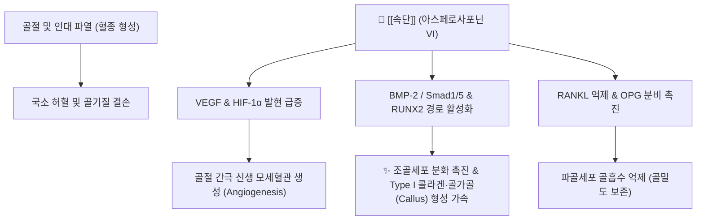

---
aliases:
  - 속단
  - 續斷
  - Dipsaci Radix
  - 천속단
tags:
  - 본초
  - 보양약
  - 골절유합
  - 강근골
  - 안태
  - 아스페로사포닌
---

# 🌿 [[속단]] (續斷, Dipsaci Radix, 천속단)

> **핵심 요약 (Key Summary)**:
> 산토끼꽃과(Dipsacaceae) 천속단(*Dipsacus asper* Wall.)의 건조 뿌리로 끊어진 뼈와 인대를 잇는다는 의미를 지닌 대표적 접골(接骨)·보간신 약재
> 지표 성분인 아스페로사포닌 VI(Asperosaponin VI)가 BMP-2 및 VEGF 발현을 촉진하여 골절부 신생혈관 생성·가골 형성을 가속화하고 RANKL 파골세포 분화 억제
> 요슬산통·골다공증·골절상 및 인대 손상 회복 촉진·임신 중 태동불안(절박유산) 및 붕루하혈을 치료하는 대표적인 보간신·강근골·속절상 약재

---

## 📌 목차
1. [기본 본초 정보 & 화학 구조 (Pharmacognosy)](#1-기본-본초-정보--화학-구조-pharmacognosy)
2. [핵심 분자약리 기전 & 골절유합·연골 보호 네트워크](#2-핵심-분자약리-기전--골절유합연골-보호-네트워크)
3. [해부생체역학 / 건·인대 결합조직 장력 복구](#3-해부생체역학--건인대-결합조직-장력-복구)
4. [사상의학 및 임상 변증별 응용 (골절 vs 안태)](#4-사상의학-및-임상-변증별-응용-골절-vs-안태)
5. [배오 원리 및 포제 (염수초 vs 주초)](#5-배오-원리-및-포제-염수초-vs-주초)
6. [핵심 처방 비교 매트릭스](#6-핵심-처방-비교-매트릭스)
7. [출처 및 학술 참고 문헌 (References)](#7-출처-및-학술-참고-문헌-references)

---

## 1. 기본 본초 정보 & 화학 구조 (Pharmacognosy)

| 항목 | 상세 내용 |
| :--- | :--- |
| **기원 식물** | 산토끼꽃과(Dipsacaceae) 천속단(*Dipsacus asper* Wall. ex Henry)의 건조 뿌리 |
| **성미 (性味)** | 쓴맛(苦), 매운맛(辛), 따뜻함(微溫) |
| **귀경 (歸經)** | 간경(肝經), 신경(腎經) |
| **효능 (Actions)** | 보간신(補肝腎), 강근골(强筋骨), 속절상(續折傷), 지붕루(止崩漏), 안태(安胎) |
| **주요 성분** | • **지표 성분**: 아스페로사포닌 VI (Asperosaponin VI, 대한민국약전 2.0% 이상 규격) • **유효 활성 성분군**: 아케비아사포닌 D, 로가닌, 스웨로사이드, 켄토사이드, 카페오일퀸산 |

### 🔬 주요 지표물질 화학 구조
> **[구조적 특징 및 활성]**: 아스페로사포닌 VI(Asperosaponin VI)는 헤데라게닌(Hederagenin)을 비당체(Aglycone) 골격으로 하는 올레아난계 펜타사이클릭 트리테르페노이드 배당체. C-3 위치의 아라비노오스와 C-28 위치의 람노오스-포도당 사슬이 조골세포 표면 수용체와 결합하여 골기질 단백질 합성을 촉진하는 핵심 약리 작용기임.

---

## 2. 핵심 분자약리 기전 & 골절유합·연골 보호 네트워크

### (1) 분자 수준 작용 메커니즘
* **골절 유합 촉진 및 가골(Callus) 형성 가속화**:
  * 아스페로사포닌 VI는 골절 부위 골모세포에서 골형성단백질-2(BMP-2) 및 RUNX2 발현을 상향 조절.
  * 혈관내피세포 성장인자(VEGF)의 분비를 유도하여 가골 내부로 신생 모세혈관망이 빠르게 침투하도록 유도, 골유합 기간을 획기적으로 단축.
* **조골 촉진 및 파골세포 분화 차단**:
  * 알칼리성 인산화효소(ALP) 활성과 오스테오칼신(Osteocalcin) 생성을 증가시켜 골기질 칼슘 석회화를 촉진하고, RANKL 경로를 차단하여 파골세포 생성을 억제.
* **자궁 평활근 이완 및 항유산(안태) 메커니즘**:
  * 자궁 조직의 베타-2 아드레날린 수용체를 안정화하고 프로스타글란딘 합성을 억제하여 임신 초기 병적 자궁 수축을 완화, 유산 위험을 방지.

---

## 3. 해부생체역학 / 건·인대 결합조직 장력 복구

* **제1형 및 제3형 콜라겐 가교 결합 촉진**:
  * 손상된 건(Tendon)과 인대(Ligament)의 섬유아세포를 활성화하여 콜라겐 합성을 증대시키고 인장 강도(Tensile strength)를 정상 수준으로 회복.
* **관절 연골 보호 (MMP-13 억제)**:
  * 퇴행성 관절염 모델에서 연골세포 분해 효소인 MMP-13 및 ADAMTS-5의 활성을 억제하여 관절 연골 기질 마모를 방어.

---

## 4. 사상의학 및 임상 변증별 응용 (골절 vs 안태)

* **보간신(補肝腎)과 강근골(强筋骨)**:
  * 간주근(肝主筋), 신주골(腎主骨) 원리에 따라 노인성 퇴행성 척추증, 압박 골절, 무릎 관절염에 간신을 동시에 보익.
* **안태(安胎)와 지붕루(止崩漏)**:
  * 임신 중 하혈(태루) 및 복통을 동반한 절박유산(태동불안) 환자에게 기혈을 보하고 태반 결합을 강화.
* **금기 및 주의**:
  * 초기 급성 염증으로 발열·발적·극심한 종창이 있는 실열(實熱) 단계에는 단독 사용을 피하고 청열활혈제와 배합.

---

## 5. 배오 원리 및 포제 (염수초 vs 주초)

* **염수초 (鹽水炒, 소금물 볶음)**:
  * 소금물에 적셔 볶으면 약 기운이 신(腎)으로 집중되어 요통 완화, 골다공증 예방 및 강근골 효능이 배가됨.
* **주초 (酒炒, 술로 볶음)**:
  * 청주로 볶으면 활혈통락(活血通絡) 작용이 강해져 타박상, 어혈 골절, 관절 구축 치료에 유리.

---

## 6. 핵심 처방 비교 매트릭스

| 처방명 | 주요 구성 | 핵심 적응증 | 임상 특징 |
| :--- | :--- | :--- | :--- |
| [[독활기생탕]] | [[속단]], 두충, 우슬, 독활, 상기생, 당귀 | 퇴행성 관절염, 만성 요통, 좌골신경통 | 간신허약에 풍한습이 겹친 만성통증 명방 |
| [[수태환]] | [[속단]], 토사자, 상기생, 아교 | 절박유산, 습관성 유산, 불임 | 신허로 인한 태루·태동불안 제1 안태방 |
| [[속골단]] | [[속단]], 골쇄보, 자연동, 몰약, 유향 | 외상성 골절, 인대 파열, 관절 염좌 | 어혈을 풀고 뼈를 굳히는 외과 전문방 |

---

## 7. 출처 및 학술 참고 문헌 (References)
* 国家中医药管理局. *中华本草*. 上海科学技术出版社; 1999.
  - [연구 요약]: 속단의 기원, 아스페로사포닌 VI 기준 규격, 보간신·강근골·속절상 효능 총괄 수록.
* Niu YB, et al. Asperosaponin VI promotes osteogenic differentiation and mineralization in human osteoblasts through the BMP-2/Smad1/5 pathway. *Phytomedicine*. 2012;19(8-9):738-744.
  - [연구 요약]: 속단 지표 성분 아스페로사포닌 VI의 조골세포 분화 촉진 및 골절 유합 가속화 메커니즘 규명.
* Liu Z, et al. Dipsaci Radix: A comprehensive review on its botany, traditional uses, phytochemistry, pharmacology, and toxicology. *J Ethnopharmacol*. 2021;278:114287.
  - [연구 요약]: 속단의 골다공증 억제, 신경 보호, 안태 작용 및 임상 약리학적 연구에 대한 종합 리뷰.
