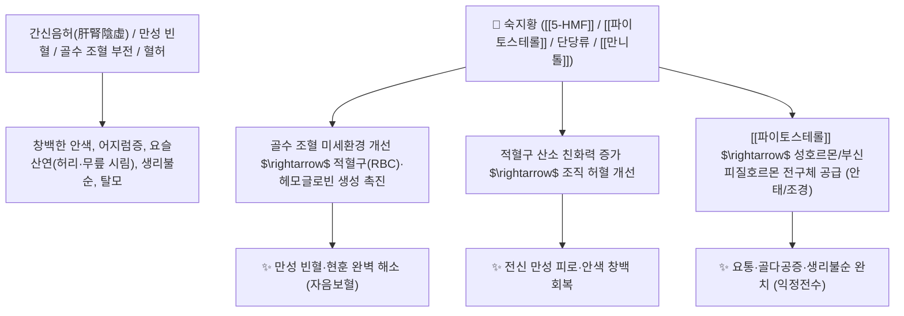

# 🌿 [[숙지황]] (熟地黃, Rehmanniae Radix Preparata)

> **핵심 요약 (Key Summary)**:
> 현삼과(*Scrophulariaceae*) 지황(*Rehmannia glutinosa*)의 뿌리를 막걸리로 9번 찌고 말린(구증구포 九蒸九曝) 포제품
> 마이야르 반응 포제 지표체인 [[5-HMF]](5-Hydroxymethylfurfural)와 분해된 단당류·[[파이토스테롤]]이 골수 조혈 줄기세포를 자극하고 적혈구 산소 운반능을 높여 강력한 자음보혈 작용 발휘
> 혈허(血虛)로 인한 만성 빈혈·어지럼증·안색 창백·월경불순 및 신음부족(腎陰不足) 요통·무릎 시림·조기 백발을 치료하는 천하제일의 [[자음보혈]](滋陰補血)·[[익정전수]](益精塡髓) 군약(君藥)

---
## 📌 목차
1. [기본 본초 정보 & 화학 구조 (Pharmacognosy)](#1-기본-본초-정보--화학-구조-pharmacognosy)
2. [핵심 분자약리 기전 & 5-HMF·골수 조혈·안태 네트워크](#2-핵심-분자약리-기전--5-hmf골수-조혈안태-네트워크)
3. [해부생체역학 / 골수 조혈계 & 척추 추간판 영양 공급 연계](#3-해부생체역학--골수-조혈계--척추-추간판-영양-공급-연계)
4. [사상의학 및 임상 응용 (보혈 vs 소화 장애 완화 비결)](#4-사상의학-및-임상-응용-보혈-vs-소화-장애-완화-비결)
5. [고전 의학 및 배오 원리 (사물탕 & 육미지황탕 배오)](#5-고전-의학-및-배오-원리-사물탕--육미지황탕-배오)
6. [핵심 처방 비교 매트릭스](#6-핵심-처방-비교-매트릭스)
7. [출처 및 학술 참고 문헌 (References)](#7-출처-및-학술-참고-문헌-references)

---
## 1. 기본 본초 정보 & 화학 구조 (Pharmacognosy)

| 항목 | 상세 내용 |
| :--- | :--- |
| **기원 식물** | 현삼과(Scrophulariaceae) 지황 *Rehmannia glutinosa* (Gaertn.) Libosch. ex Fisch. et Mey.의 뿌리를 막걸리와 사인 등으로 구증구포한 것 |
| **성미 (性味)** | 甘, 微溫 |
| **귀경 (歸經)** | 肝·腎經 (간경, 신경) - **간혈(肝血)과 신정(腎精)을 채움** |
| **효능 (Actions)** | [[자음보혈]](滋陰補血), [[익정전수]](益精塡髓), [[보간익신]](補肝益腎), [[조경안태]](調經安胎) |
| **주요 성분** | • **포제 지표물질**: [[5-HMF]] (5-Hydroxymethylfurfural, KP 규격 $\ge 0.10\%$), 마이야르 반응 산물<br>• **분해된 당류**: 포도당, 과당, 갈락토스, 올리고당 분해체<br>• **스테롤류**: [[파이토스테롤]]([[캄페스테롤]], [[시토스테롤]], [[스티그마스테롤]])<br>• **당알코올**: [[만니톨]] (Mannitol) |

> **[유래 및 본초학적 기전]**:
> * 생지황을 술에 담가 아홉 번 찌고 아홉 번 햇볕에 말려(九蒸九曝) 속까지 옻칠처럼 새까맣고 윤기가 흐르도록 가공한 보혈의 으뜸 약재입니다.
> * 포제 과정을 통해 차가운 성질이 따뜻하게 변하고, 소화하기 힘든 고분자 [[스타키오스]]가 단당류로 분해되어 흡수율이 높아집니다.
> * 흑색 지표물질인 [[5-HMF]]가 생성되어 적혈구 헤모글로빈의 산소 친화도를 높이고 골수의 적혈구 생산을 폭발적으로 증가시킵니다.

### 🔬 숙지황의 5-HMF 지표물질 화학 구조
![[image-9.png]]
> **[구조적 특징 및 활성]**: [[5-HMF]]는 퓨란 고리에 알데히드기와 하이드록시메틸기가 결합된 구조로, 적혈구 변형능(Deformability)을 개선하고 혈관 내피세포의 노화를 방지합니다.

---
## 2. 핵심 분자약리 기전 & 5-HMF·골수 조혈·안태 네트워크



### (1) 표적 자음보혈 및 조혈 촉진
* **골수 조혈계 활성화 및 빈혈 치료**:
  * 골수 간세포(Stem cell)의 적혈구계 분화를 촉진하여 철결핍성 빈혈 및 만성 질환 빈혈을 치료합니다.
* **항피로 및 산소 공급 극대화**:
  * 뇌와 근육으로의 산소 공급 효율을 높여 만성 피로와 브레인 포그를 개선합니다.
* **간신 보양 및 골밀도 개선**:
  * 골모세포 분화를 촉진하고 파골세포를 억제하여 갱년기 골다공증과 요슬산연을 치료합니다.

---
## 3. 해부생체역학 / 골수 조혈계 & 척추 추간판 영양 공급 연계

* **골수 및 척추 관절 연골 수화(Hydration) 유지**:
  * 진액과 글리코사미노글리칸을 보충하여 퇴행성 척추 질환의 통증을 줄여줍니다.

---
## 4. 사상의학 및 임상 응용 (보혈 vs 소화 장애 완화 비결)

```
[✅ 최적 적응증 (Sweet Spot)]
• 만성 혈허증: 얼굴에 핏기가 없고, 앉았다 일어설 때 눈앞이 핑 돌며, 손톱이 얇고 잘 부러지는 환자 ([[사물탕]])
• 신음부족증: 허리와 무릎이 시리고 은근히 아프며, 오후에 식은땀이 나고 머리카락이 빠지는 경우 ([[육미지황탕]])
• 부인과: 생리량이 너무 적거나 주기가 늦어지고 유산기가 있는 상태

[💡 소화 장애 극복 임상 팁 (Clinical Tip)]
• 점도 높은 다당류로 인해 비위가 약한 사람은 체기(滯氣)를 느낄 수 있음
• 반드시 행기건위제인 [[사인]], [[진피]], [[백출]]과 배오하여 처방하면 소화 불량 없이 완벽히 흡수됨
```

---
## 5. 고전 의학 및 배오 원리 (사물탕 & 육미지황탕 배오)

### (1) 한의학 역사상 가장 위대한 처방들의 군약
* **핵심 배오**:
  * [[숙지황]] + [[당귀]] + [[백작약]] + [[천궁]] $\rightarrow$ 모든 보혈제의 기본 골격 ([[사물탕]])
  * [[숙지황]] + [[산수유]] + [[산약]] $\rightarrow$ 신수(腎水)를 채우는 불로장생 명방 ([[육미지황탕]])
  * [[숙지황]] + [[녹용]] + [[당귀]] + [[산수유]] $\rightarrow$ 황제의 보약 ([[공진단]])

---
## 6. 핵심 처방 비교 매트릭스

| 처방명 | 구성 약재 | 주치 병증 및 임상 타깃 | 특징 및 감별점 |
| :--- | :--- | :--- | :--- |
| [[사물탕]] | [[숙지황]], [[당귀]], [[백작약]], [[천궁]] | **혈허 빈혈, 두훈안화, 안색 위황, 월경부조, 제반 혈병** | 보혈(補血)의 최고 기본방 |
| [[육미지황탕]] | [[숙지황]], [[산수유]], [[산약]], [[택사]], [[목단피]], [[복령]] | **간신음허, 요슬산연, 도한, 소갈, 골증열, 이명** | 자음보신의 천하제일방 |
| [[팔미지황탕]] | [[육미지황탕]] + [[부자]], [[육계]] | **신양허(腎陽虛), 요슬냉통, 야간 빈뇨, 수족냉증** | 따뜻하게 신장의 양기를 돋움 |
| [[십전대보탕]] | [[사물탕]] + [[사군자탕]] + [[황기]], [[육계]] | **기혈양허, 만성 쇠약, 대병 후 허약, 극심한 피로** | 기와 혈을 완벽히 보양 |

---
## 7. 출처 및 학술 참고 문헌 (References)

1. **Weng, H., et al. (2019)**. 5-Hydroxymethylfurfural from *Rehmannia glutinosa* Libosch induces proliferation of hematopoietic stem and progenitor cells. *Journal of Ethnopharmacology*, 235, 34-42.
   - **[연구 요약]**: 숙지황의 5-HMF가 골수 조혈 줄기세포의 증식 및 적혈구 생성을 강력히 촉진함을 규명.
2. **대한민국약전(KP) 제12개정 (2022)**. 의약품각조 제2부: 숙지황 (Rehmanniae Radix Preparata) 규격 기준.
   - **[공정서 규격]**: 건조물 기준 5-HMF($\text{C}_6\text{H}_6\text{O}_3$) 0.10% 이상 함유 필수 규격 명시.