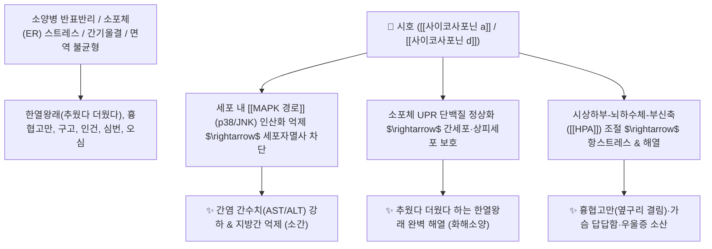

# 🌿 [[시호]] (柴胡, Bupleuri Radix)

> **핵심 요약 (Key Summary)**:
> 미나리과(*Apiaceae*) 시호(*Bupleurum falcatum*) 또는 흑시호의 뿌리
> 올레아난계 트리테르펜 사포닌인 [[사이코사포닌 a]](Saikosaponin a)와 [[사이코사포닌 d]](Saikosaponin d)가 세포 내 [[MAPK 경로]] 및 소포체(ER) 스트레스를 억제하여 강력한 간세포 보호 및 면역 조절 해열 작용 발휘
> [[상한론]] 소양병(少陽病)의 한열왕래(寒熱往來, 오한과 발열의 교대)·흉협고만(胸脅苦滿, 옆구리 결림과 팽만)·구고(입안이 씀)·인건·목현 및 간기울결(스트레스성 신경증)을 치료하는 대표적인 [[화해소양]](和解少陽)·[[소간해울]](疏肝解鬱) 군약(君藥)

---
## 📌 목차
1. [기본 본초 정보 & 화학 구조 (Pharmacognosy)](#1-기본-본초-정보--화학-구조-pharmacognosy)
2. [핵심 분자약리 기전 & 사이코사포닌·MAPK·소포체 스트레스 네트워크](#2-핵심-분자약리-기전--사이코사포닌mapk소포체-스트레스-네트워크)
3. [해부생체역학 / 간문맥 혈류 & 늑간 신경·흉협부 연계](#3-해부생체역학--간문맥-혈류--늑간-신경흉협부-연계)
4. [사상의학 및 임상 응용 (소양병 화해 vs 마황·갈근 비교)](#4-사상의학-및-임상-응용-소양병-화해-vs-마황갈근-비교)
5. [상한론 『약징(藥徵)』 분석 및 배오 원리 (소시호탕 배오)](#5-상한론-약징藥徵-분석-및-배오-원리-소시호탕-배오)
6. [핵심 처방 비교 매트릭스](#6-핵심-처방-비교-매트릭스)
7. [출처 및 학술 참고 문헌 (References)](#7-출처-및-학술-참고-문헌-references)

---
## 1. 기본 본초 정보 & 화학 구조 (Pharmacognosy)

| 항목 | 상세 내용 |
| :--- | :--- |
| **기원 식물** | 산형과 / 미나리과(Apiaceae / Umbelliferae) 시호 *Bupleurum falcatum* L. 또는 북시호의 뿌리 |
| **성미 (性味)** | 苦·辛, 微寒 |
| **귀경 (歸經)** | 肝·膽·心包·三焦經 (간경, 담경, 심포경, 삼초경) - **소양 반표반리(半表半裏) 중추** |
| **효능 (Actions)** | [[화해소양]](和解少陽), [[소간해울]](疏肝解鬱), [[승양거함]](升陽擧陷), [[퇴열차학]](退熱截瘧) |
| **주요 성분** | • **올레아난계 트리테르펜 사포닌**: [[사이코사포닌 a]] (Saikosaponin a, KP 규격 a+d $\ge 0.30\%$), [[사이코사포닌 d]] (Saikosaponin d), 사이코사포닌 b, c<br>• **정유 성분**: 부플레우롤, 리모넨, 헥산산<br>• **다당류 및 플라보노이드**: 사이코폴리사카라이드, 루틴 |

> **[유래 및 본초학적 기전]**:
> * 땔나무(柴)처럼 거친 들판의 모진 스트레스를 견디며 자란 풀로, 인체 세포가 받는 극심한 염증 스트레스와 억울된 간기를 부드럽게 흩트려줍니다.
> * 체표도 아니고 체내도 아닌 **반표반리(半表半裏, 소양경)**에 침범한 사기로 인해 으슬으슬 춥다가 열이 펄펄 끓는 [[한열왕래]](寒熱往來)**와 가슴과 옆구리가 꽉 막혀 답답한 [[흉협고만]](胸脅苦滿)**을 조화롭게 풀어냅니다.

### 🔬 시호의 주요 지표물질 및 MAPK 신호전달 구조
![[Pasted image 20240225234531.png|450]]
![[Pasted image 20240225234540.png|450]]
> **[구조적 특징 및 활성]**: [[사이코사포닌 d]]는 $\text{C-13, C-28}$ 에폭시 에테르 결합을 가진 올레아난 골격으로, 세포막 수용체와 결합하여 [[MAPK 경로]](ERK, p38, JNK)의 과도한 인산화를 차단하고 소포체(ER) 스트레스 반응인 UPR(Unfolded Protein Response)을 정상화하여 간세포와 상피세포의 자멸사를 억제합니다.

---
## 2. 핵심 분자약리 기전 & 사이코사포닌·MAPK·소포체 스트레스 네트워크



### (1) 표적 화해소양 및 간세포 보호 기전
* **소양병 한열왕래(寒熱往來) 해열**:
  * 면역계의 사이토카인 폭풍과 발열 세트포인트 동요를 안정화하여 오한과 발열이 교대로 나타나는 미열(38°C 전후)을 해열합니다.
* **간세포 보호 및 소간해울(疏肝解鬱)**:
  * 알코올, 약물, 바이러스로 손상된 간세포의 괴사를 막고 간경변 섬유화를 억제합니다.
* **스트레스성 신경증 및 우울증 완화**:
  * 뇌 내 세로토닌 및 GABA 신경계를 조절하여 가슴이 답답하고 한숨을 자주 쉬는 화병과 신경성 소화불량을 치료합니다.

---
## 3. 해부생체역학 / 간문맥 혈류 & 늑간 신경·흉협부 연계

* **간문맥(Hepatic Portal System) 울혈 완화**:
  * 횡격막 하부 및 우측 늑궁(Right Subcostal Area) 부위의 간내 혈류 정체를 해소하여 늑간신경통과 흉협고만을 치료합니다.

---
## 4. 사상의학 및 임상 응용 (소양병 화해 vs 마황·갈근 비교)

```
[🔍 상한론 3대 해표 본초 감별 비교]
• [[마황]] (태양병 표증): 오한이 심하고 땀이 안 남 $\rightarrow$ 강력한 발한해표 (오한 위주)
• [[갈근]] (양명병 근육증): 열이 펄펄 나고 목덜미가 뻣뻣함 $\rightarrow$ 해기퇴열·생진 (발열/경직 위주)
• [[시호]] (소양병 반표반리): 추웠다 더웠다 교대하며 옆구리가 결림 $\rightarrow$ 화해소양·소간 (한열왕래/흉협고만)

[✅ 최적 적응증 (Sweet Spot)]
• 소양병 증후군: 감기가 낫지 않고 오래 끌며 미열과 오한이 반복되고, 입이 쓰고 목이 마르며 어지럽고 밥맛이 없는 상태 ([[소시호탕]])
• 간기울결: 스트레스로 가슴과 옆구리가 뻐근하게 아프고 소화가 안 되며 짜증이 나는 신경증 ([[소요산]])
• 만성 간염, 지방간, 늑간신경통
```

---
## 5. 상한론 『약징(藥徵)』 분석 및 배오 원리 (소시호탕 배오)

### (1) 『[[약징]]』에 나타난 시호의 주치
> **"柴胡 主治胸脅苦滿也. 旁治寒熱往來, 腹中痛, 脅下痞硬..."**  
> (시호의 주치는 가슴과 옆구리가 그득 차서 괴로운 흉협고만(胸脅苦滿)이며, 곁들여 오한발열의 교대(한열왕래), 뱃속 통증, 옆구리 밑이 굳는 것을 치료한다.)

* **핵심 배오 원리**:
  * [[시호]] + [[황금]] $\rightarrow$ 소양 반표반리의 열을 끄고 화해시키는 천하제일의 짝 ([[소시호탕]])
  * [[시호]] + [[백작약]] + [[지실]] $\rightarrow$ 뭉친 간기를 뚫고 통증을 멎게 함 ([[사역산]])
  * [[시호]] + [[황기]] + [[승마]] $\rightarrow$ 양기를 위로 끌어올림 ([[보중익기탕]])

---
## 6. 핵심 처방 비교 매트릭스

| 처방명 | 구성 약재 | 주치 병증 및 임상 타깃 | 특징 및 감별점 |
| :--- | :--- | :--- | :--- |
| [[소시호탕]] | [[시호]], [[황금]], [[인삼]], [[반하]], [[생강]], [[대추|대조]], [[감초]] | **소양병 7대증(왕래한열, 흉협고만, 묵묵불욕음식, 심번희구)** | 화해소양의 천하제일 대표방 |
| [[대시호탕]] | [[소시호탕]](인삼 감초 거함) + [[대황]], [[지실]], [[작약]] | **소양양명합병, 흉협고만 극심, 변비, 심하비경통** | 소양열과 양명 실열을 동시 공하 |
| [[시호계지탕]] | [[소시호탕]] + [[계지탕]] (합방) | **태양소양합병, 미열, 오풍, 관절통, 흉협고만** | 표증과 소양증을 동시 치료 |
| [[시호가용골모려탕]] | [[소시호탕]] + [[용골]], [[모려]], [[대황]], [[계지]] | **간담화왕, 흉만, 번경(놀람과 불안), 불면, 섬어** | 중추 신경 흥분을 진정시킴 |

---
## 7. 출처 및 학술 참고 문헌 (References)

1. **Yuan, B., et al. (2017)**. Saikosaponin a and d inhibit PDGF-BB-induced activation and migration of hepatic stellate cells via MAPK pathways. *International Immunopharmacology*, 42, 18-24.
   - **[연구 요약]**: 시호의 사이코사포닌 a와 d가 MAPK 신호 전달을 억제하여 간성상세포 활성화와 간 섬유화를 강력히 차단함을 규명.
2. **대한민국약전(KP) 제12개정 (2022)**. 의약품각조 제2부: 시호 (Bupleuri Radix) 규격 기준.
   - **[공정서 규격]**: 건조물 기준 사이코사포닌 a 및 d의 합($\text{C}_{42}\text{H}_{68}\text{O}_{13}$) 0.30% 이상 함유 필수 규격 명시.
3. **길익동동 (吉益東洞, 1784)**. 『약징(藥徵)』: 柴胡 조문.
   - **[고전 원전]**: "柴胡 主治胸脅苦滿也. 旁治寒熱往來, 腹中痛, 脅下痞硬" - 흉협고만 주치 원리 제시.