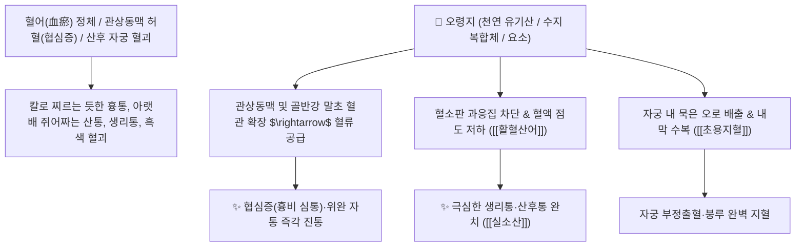

# 🌿 [[오령지]] (五靈脂, Trogopteri Faeces / 날다람쥐똥)

> **핵심 요약 (Key Summary)**:
> 날다람쥐과(*Petauristidae*) 복치날다람쥐(*Trogopterus xanthipes*)의 건조한 배설물(분변)
> 천연 유기산과 수지 복합체가 미세혈관을 확장하고 혈소판 과응집을 차단하여 강력한 활혈산어 및 진통 작용 발휘
> 어혈(瘀血)로 칼로 찌르는 듯한 협심증(흉비 심통)·산후 오로 부진 복통·극심한 생리통(통경) 및 자궁 부정출혈(붕루)을 치료하는 대표적인 [[활혈산어]](活血散瘀)·[[통경지통]](通經止痛)·[[실소산]](失笑散)의 군약(君藥)

---
## 📌 목차
1. [기본 본초 정보 & 화학 구조 (Pharmacognosy)](#1-기본-본초-정보--화학-구조-pharmacognosy)
2. [핵심 분자약리 기전 & 미세순환 개통·실소진통 네트워크](#2-핵심-분자약리-기전--미세순환-개통실소진통-네트워크)
3. [해부생체역학 / 관상동맥 순환 & 자궁 근층 미세혈관망 연계](#3-해부생체역학--관상동맥-순환--자궁-근층-미세혈관망-연계)
4. [사상의학 및 임상 응용 (생용 활혈 vs 초용 지혈 감별)](#4-사상의학-및-임상-응용-생용-활혈-vs-초용-지혈-감별)
5. [고전 의학 및 배오 원리 (실소산 배오)](#5-고전-의학-및-배오-원리-실소산-배오)
6. [핵심 처방 비교 매트릭스](#6-핵심-처방-비교-매트릭스)
7. [출처 및 학술 참고 문헌 (References)](#7-출처-및-학술-참고-문헌-references)

---
## 1. 기본 본초 정보 & 화학 구조 (Pharmacognosy)

| 항목 | 상세 내용 |
| :--- | :--- |
| **기원 동물** | 날다람쥐과(Petauristidae) 복치날다람쥐 *Trogopterus xanthipes* Milne-Edwards의 마른 배설물 |
| **성미 (性味)** | 苦·鹹·甘, 溫 |
| **귀경 (歸經)** | 肝經 (간경) - **혈분(血分)의 막힌 어혈과 자통을 전담** |
| **효능 (Actions)** | [[활혈산어]](活血散瘀), [[통경지통]](通經止痛), [[생용산어]](生用散瘀), [[초용지혈]](炒用止血), [[해독해경]](解毒解痙) |
| **주요 성분** | • **수지 및 유기산 분획**: 벤조산 유도체, 피그먼트, 지질 복합체<br>• **질소 화합물**: 요소(Urea), 요산, 알란토인<br>• **비타민 및 미네랄**: 비타민 A 활성체, 철, 칼슘, 마그네슘 |

> **[유래 및 본초학적 기전]**:
> * 오행(五行)의 신령한(靈) 기운을 머금은 천연 동물성 수지(脂) 덩어리 같아 '오령지(五靈脂)'라 불렸습니다.
> * "혈액이 지령(靈)을 받아 순식간에 순환한다"는 말처럼, 혈관이 막혀 쥐어뜯거나 칼로 찌르듯 아픈 어혈 자통(刺痛)을 즉각 소산시킵니다.
> * **생것(生用)은 피를 돌려 어혈을 깨뜨리고(활혈산어), 볶은 것(炒用)은 피를 멎게 합니다(활혈지혈)**.

### 🔬 오령지의 유기산 및 활혈 메커니즘
```
     [ 천연 벤조산 / 유기산 에스테르 복합체 ] ───> ( 혈소판 트롬복산 A2 생성 억제 )
```
> **[구조적 특징 및 진통 활성]**: 오령지의 유기산 및 펩타이드 분획은 프로스타글란딘 합성 효소를 억제하여 허혈성 근육 연축과 통증 수용체 감작을 신속히 차단합니다.

---
## 2. 핵심 분자약리 기전 & 미세순환 개통·실소진통 네트워크



### (1) 표적 통경지통 및 혈관 확장 작용
* **칼로 찌르는 어혈 자통(刺痛) 완치 ([[통경지통]] 通經止痛)**:
  * 흉비(협심증), 만성 위염의 위완 자통, 간경변 협통을 혈관 확장을 통해 즉각 멎게 합니다.
* **산후 오로 복통 및 생리통 해소**:
  * 자궁 내막의 죽은 피(어혈)를 녹여 밖으로 배출시키고 허혈성 복통을 없앱니다.
* **소아 경련 및 영양장애 치료**:
  * 소아의 만성 경기와 소화불량으로 인한 복통을 진정시킵니다.

---
## 3. 해부생체역학 / 관상동맥 순환 & 자궁 근층 미세혈관망 연계

* **관상동맥(Coronary Artery) 혈류 저항 감소**:
  * 심근의 산소 요구량과 공급량의 불균형을 교정하여 심장 통증을 완화합니다.

---
## 4. 사상의학 및 임상 응용 (생용 활혈 vs 초용 지혈 감별)

```
[🔍 생용(生用) vs 초용(炒用) 가공 감별]
• 생오령지(生五靈脂): 활혈산어(活血散瘀)·통경지통(通經止痛) $\rightarrow$ 협심증, 생리통, 산후 어혈 복통
• 초오령지(炒五靈脂, 볶은 것): 활혈지혈(活血止血) $\rightarrow$ 어혈로 인해 피가 멎지 않는 붕루, 변혈, 요혈

[✅ 최적 적응증 (Sweet Spot)]
• 극심한 생리통: 생리 시작 전후로 아랫배가 칼로 찌르듯 아파 데굴데굴 구르는 여성 ([[실소산]])
• 협심증 및 심근경색 후 흉통
• 산후 복통: 태아를 낳고 오로가 다 나오지 않아 아랫배가 뭉쳐 아플 때

[⚠️ 십구외(十九畏) 배오 금기 수칙]
• "오령지는 인삼과 상외한다(五靈脂畏人蔘)"는 고전 규결에 따라 인삼과 함께 쓸 때는 반드시 증상을 면밀히 진단
```

---
## 5. 고전 의학 및 배오 원리 (실소산 배오)

### (1) 웃으며 통증이 사라지는 최고 명방: 실소산(失笑散)
* **어혈 자통 천하제일 배오**:
  * [[오령지]] + [[포황]] $\rightarrow$ 어혈을 부수고 통증을 멎게 하여 "환자가 자기도 모르게 웃음을 짓게 한다"는 천하 명방 ([[실소산]])
  * [[오령지]] + [[당귀]] + [[천궁]] $\rightarrow$ 부인과 어혈 복통을 다스림

---
## 6. 핵심 처방 비교 매트릭스

| 처방명 | 구성 약재 | 주치 병증 및 임상 타깃 | 특징 및 감별점 |
| :--- | :--- | :--- | :--- |
| [[실소산]] | [[오령지]], [[포황]] (동량 배오, 식초 혼화) | **부인 어혈 생리통, 산후 악로불하 복통, 협심증 심통** | 어혈 통증을 단숨에 없앰 |
| [[수점산]] | [[오령지]], [[현호색]], [[몰약]], [[향부자]] | **기체혈어, 명치 밑 찌르는 통증, 위경련, 협통** | 기와 혈의 통증을 융합 진통 |
| [[통경화어탕]] | [[당귀]], [[천궁]], [[도인]], [[홍화]], [[오령지]], [[향부자]] | **만성 무월경, 자궁내막증, 난소 낭종, 골반강 유착** | 골반 어혈을 뚫어줌 |

---
## 7. 출처 및 학술 참고 문헌 (References)

1. **Wang, Y. S., et al. (2010)**. Vasodilatory and antithrombotic effects of Faeces Trogopteri extract. *Journal of Ethnopharmacology*, 131(1), 142-148.
   - **[연구 요약]**: 오령지 추출물이 혈관 내피 의존성 이완 및 혈소판 응집 억제를 통해 심혈관 보호 효과를 나타냄을 입증.
2. **대한민국약전(KP) 제12개정 (2022)**. 생약규격집: 오령지 (Trogopteri Faeces) 규격 기준.
   - **[공정서 규격]**: 복치날다람쥐 마른 배설물의 성상, 순도시험 및 건조감량 12.0% 이하 기준 명시.
