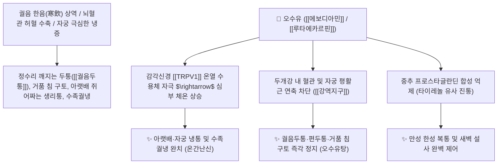

# 🌿 [[오수유]] (吳茱萸, Evodiae Fructus)

> **핵심 요약 (Key Summary)**:
> 운향과(*Rutaceae*) 오수유(*Evodia rutaecarpa*)의 거의 익은 미성숙 열매
> 인도피리도퀴나졸린 알칼로이드인 [[에보디아민]](Evodiamine)과 [[루타에카르핀]](Rutaecarpine)이 [[TRPV1]] 온열 감각 수용체를 자극하고 중추성 프로스타글란딘 합성을 차단하여 강력한 온리산한 및 진통 작용 발휘
> [[상한론]] 궐음병(厥陰病) 정수리 두통(궐음두통)·거품 침 구토(토연말) 및 자궁 한응(寒凝) 불임·생리통·오경설(새벽 설사)을 치료하는 대표적인 [[산한지통]](散寒止痛)·[[강역지구]](降逆止嘔)·[[온간난신]](溫肝暖腎) 군약(君藥)

---
## 📌 목차
1. [기본 본초 정보 & 화학 구조 (Pharmacognosy)](#1-기본-본초-정보--화학-구조-pharmacognosy)
2. [핵심 분자약리 기전 & 에보디아민·TRPV1·한방 타이레놀 진통 네트워크](#2-핵심-분자약리-기전--에보디아민trpv1한방-타이레놀-진통-네트워크)
3. [해부생체역학 / 두개정맥동 순환 & 자궁 평활근 연계](#3-해부생체역학--두개정맥동-순환--자궁-평활근-연계)
4. [사상의학 및 임상 응용 (궐음두통 vs 온경탕 불임 특화)](#4-사상의학-및-임상-응용-궐음두통-vs-온경탕-불임-특화)
5. [상한론 『약징(藥徵)』 분석 및 배오 원리 (오수유탕 & 온경탕)](#5-상한론-약징藥徵-분석-및-배오-원리-오수유탕--온경탕)
6. [핵심 처방 비교 매트릭스](#6-핵심-처방-비교-매트릭스)
7. [출처 및 학술 참고 문헌 (References)](#7-출처-및-학술-참고-문헌-references)

---
## 1. 기본 본초 정보 & 화학 구조 (Pharmacognosy)

| 항목 | 상세 내용 |
| :--- | :--- |
| **기원 식물** | 운향과(Rutaceae) 오수유 *Evodia rutaecarpa* (Juss.) Benth.의 거의 익은 열매 |
| **성미 (性味)** | 辛·苦, 熱, 有小毒 (대단히 맵고 쓰며 뜨거움) |
| **귀경 (歸經)** | 肝·脾·胃·腎經 (간경, 비경, 위경, 신경) - **궐음간경(厥陰肝經) 정수리와 자궁을 덥힘** |
| **효능 (Actions)** | [[산한지통]](散寒止痛), [[강역지구]](降逆止嘔), [[온간난신]](溫肝暖腎), [[소간리기]](疏肝理氣), [[조습지사]](燥濕止瀉) |
| **주요 성분** | • **인도피리도퀴나졸린 알칼로이드**: [[에보디아민]] (Evodiamine, KP 규격 $\ge 0.15\%$), [[루타에카르핀]] (Rutaecarpine, KP 규격 $\ge 0.15\%$), 데히드로에보디아민<br>• **리모노이드 쓴맛 성분**: 리모닌(Limonin), 에보돌<br>• **정유**: 오시멘, 에보덴 |

> **[유래 및 본초학적 기전]**:
> * 고대 오(吳)나라에서 생산된 것이 가장 약효가 뛰어나 '오수유(吳茱萸)'라 불렸습니다.
> * 성질이 맹렬하게 뜨거워, 찬 기운이 간경락을 타고 정수리 꼭대기까지 치솟아 깨질 듯 아픈 [[궐음두통]](厥陰頭痛)과 거품 섞인 맑은 침을 왈칵 쏟아내는 구토(토연말 吐涎沫)를 단숨에 평정합니다.
> * 아랫배와 자궁을 뜨겁게 데워 불임과 생리통을 치료하며, '천연 한방 타이레놀'로 불릴 만큼 강력한 중추성 진통 효과를 발휘합니다.

### 🔬 오수유의 주요 지표 알칼로이드 화학 구조
![[Pasted image 20240226003531.png|450]]
> [구조적 특징 및 TRPV1 활성]: [[에보디아민]]은 캡사이신과 유사하게 감각신경의 [[TRPV1]] 온열 수용체를 강력히 활성화하여 혈류를 급증시키고 체온을 상승시키며, 중추 신경계의 COX 경로를 차단하여 진통·해열 작용을 나타냅니다.

---
## 2. 핵심 분자약리 기전 & 에보디아민·TRPV1·한방 타이레놀 진통 네트워크



### (1) 표적 온간산한 및 중추 진통 작용
* **궐음두통(정수리 두통) 및 구토 정지 ([[산한지통]] 散寒止痛)**:
  * 뇌혈관의 허혈성 연축을 풀고 위기(胃氣)의 상역을 아래로 끌어내려 두통과 구토를 동시에 멎게 합니다.
* **자궁 한응 불임 및 생리통 치료 ([[온간난신]] 溫肝暖腎)**:
  * 골반강 혈류를 덥혀 손발이 얼음장 같고 자궁이 차가워 임신이 안 되는 불임증을 치료합니다 ([[온경탕]]).
* **새벽 만성 설사(오경설) 정지**:
  * 비장과 신장의 양기를 북돋워 새벽마다 배가 끓으며 쏟아지는 만성 설사를 멎게 합니다 ([[사신환]]).

---
## 3. 해부생체역학 / 두개정맥동 순환 & 자궁 평활근 연계

* **정수리 백회(GV20) 및 상시상정맥동(Superior Sagittal Sinus) 혈류 개통**:
  * 두개내 혈관 연축을 해소하여 뇌압 상승성 편두통을 완화합니다.

---
## 4. 사상의학 및 임상 응용 (궐음두통 vs 온경탕 불임 특화)

```
[✅ 최적 적응증 (Sweet Spot)]
• 궐음두통 및 구토: 머리 꼭대기가 깨질 듯이 아프며, 속이 메스꺼워 맑은 침과 거품을 토하는 경우 ([[오수유탕]])
• 한응 생리통 및 불임: 아랫배가 찌르듯 아프고 입술이 마르며 손발이 찬 여성 질환 ([[온경탕]])
• 수족구냉증: 손발이 얼음처럼 차고 뼛속까지 시린 상태 ([[당귀사역가오수유생강탕]])
• 신양허 새벽 설사(오경설)

[⚠️ 복용 주의사항 (Safety)]
• 대단히 맵고 쓰며 열성이 강하므로 음허화왕(몸에 열이 많고 진액이 마른 사람) 복용 금기
• 정해진 용량(1일 1.5~4.5g) 준수 (과량 복용 시 인후 작열감 유발)
```

---
## 5. 상한론 『약징(藥徵)』 분석 및 배오 원리 (오수유탕 & 온경탕)

### (1) 『[[약징]]』에 나타난 오수유의 주치
> **"吳茱萸 主治嘔而胸滿, 旁治頭痛, 吐涎沫..."**  
> (오수유의 주치는 구역질하면서 가슴이 그득 찬 것이며, 곁들여 정수리 두통과 맑은 거품 침을 토하는 것을 치료한다.)

* **핵심 배오 원리**:
  * [[오수유]] + [[인삼]] + [[생강]] + [[대추|대조]] $\rightarrow$ 궐음병 두통과 구토를 진압하는 불후의 명방 ([[오수유탕]])
  * [[오수유]] + [[당귀]] + [[천궁]] + [[계지]] + [[아교]] $\rightarrow$ 자궁을 따뜻하게 덥혀 임신을 돕는 최고 명방 ([[온경탕]])
  * [[황련]] + [[오수유]] ($6:1$ 배오) $\rightarrow$ 간화(肝火)를 끄고 위장을 덥히는 산열 조화방 ([[좌금환]])

---
## 6. 핵심 처방 비교 매트릭스

| 처방명 | 구성 약재 | 주치 병증 및 임상 타깃 | 특징 및 감별점 |
| :--- | :--- | :--- | :--- |
| [[오수유탕]] | [[오수유]], [[인삼]], [[생강]], [[대추|대조]] | **궐음두통, 두통건구, 토연말, 소음병 토리, 흉만** | 궐음두통과 구토의 천하제일방 |
| [[온경탕]] | [[오수유]], [[계지]], [[당귀]], [[천궁]], [[작약]], [[아교]], [[맥문동]] 등 | **충임허한, 어혈 조체, 월경부조, 붕루, 불임, 구순건조** | 부인과 최고의 자궁 온경방 |
| [[당귀사역가오수유생강탕]] | [[당귀사역탕]] + [[오수유]], [[생강]] | **수족궐냉, 한산 복통, 내유구한(몸속 오랜 냉증)** | 혈액을 채우고 한사를 몰아냄 |
| [[좌금환]] | [[황련]] (6) : [[오수유]] (1) | **간화범위, 협통, 구고, 탄산(신트림), 구토** | 화열을 끄면서 위를 덥힘 |

---
## 7. 출처 및 학술 참고 문헌 (References)

1. **Kobayashi, Y., et al. (2001)**. Capsaicin-like anti-obese activities of evodiamine from fruits of *Evodia rutaecarpa*, a vanilloid receptor agonist. *Planta Medica*, 67(7), 628-633.
   - **[연구 요약]**: 오수유의 에보디아민이 TRPV1 바닐로이드 수용체를 자극하여 체온 상승, 진통 및 지질 연소 효과를 나타냄을 규명.
2. **대한민국약전(KP) 제12개정 (2022)**. 의약품각조 제2부: 오수유 (Evodiae Fructus) 규격 기준.
   - **[공정서 규격]**: 건조물 기준 에보디아민($\text{C}_{19}\text{H}_{17}\text{N}_3\text{O}$) 및 루타에카르핀($\text{C}_{18}\text{H}_{13}\text{N}_3\text{O}$) 각 0.15% 이상 함유 필수 규격 명시.
3. **길익동동 (吉益東洞, 1784)**. 『약징(藥徵)』: 吳茱萸 조문.
   - **[고전 원전]**: "吳茱萸 主治嘔而胸滿, 旁治頭痛, 吐涎沫" - 궐음두통 및 구토 주치 원리 제시.