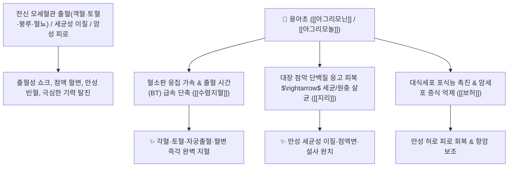

# 🌿 [[용아초]] (龍芽草 / 仙鶴草, Agrimoniae Herba / 짚신나물)

> **핵심 요약 (Key Summary)**:
> 장미과(*Rosaceae*) 짚신나물(*Agrimonia pilosa*)의 건조한 지상부 전초 (선학초 仙鶴草)
> 폴리페놀 탄닌인 [[아그리모닌]](Agrimonin)과 [[아그리모놀]](Agrimonol)이 혈소판 응집을 촉진하고 장 점막을 수렴하여 강력한 수렴지혈 및 지사 작용 발휘
> 기혈 불문하고 발생하는 전신 출혈(객혈·토혈·혈뇨·자궁 붕루·혈변) 및 만성 세균성 이질(지리 止痢)·탈력노상(극심한 피로)·트리코모나스 질염을 치료하는 대표적인 [[수렴지혈]](收斂止血)·[[지리]](止痢)·[[보허]](補虛) 군약(君藥)

---
## 📌 목차
1. [기본 본초 정보 & 화학 구조 (Pharmacognosy)](#1-기본-본초-정보--화학-구조-pharmacognosy)
2. [핵심 분자약리 기전 & 아그리모닌·전신 지혈·항종양 네트워크](#2-핵심-분자약리-기전--아그리모닌전신-지혈항종양-네트워크)
3. [해부생체역학 / 장관 점막 기저막 & 모세혈관 상피 연계](#3-해부생체역학--장관-점막-기저막--모세혈관-상피-연계)
4. [사상의학 및 임상 응용 (선학초 보허 vs 전신 지혈 특화)](#4-사상의학-및-임상-응용-선학초-보허-vs-전신-지혈-특화)
5. [고전 의학 및 배오 원리](#5-고전-의학-및-배오-원리)
6. [핵심 처방 비교 매트릭스](#6-핵심-처방-비교-매트릭스)
7. [출처 및 학술 참고 문헌 (References)](#7-출처-및-학술-참고-문헌-references)

---
## 1. 기본 본초 정보 & 화학 구조 (Pharmacognosy)

| 항목 | 상세 내용 |
| :--- | :--- |
| **기원 식물** | 장미과(Rosaceae) 짚신나물 *Agrimonia pilosa* Ledeb.의 지상부 전초 (선학초 仙鶴草) |
| **성미 (性味)** | 苦·澀, 平 (떫고 평이함) |
| **귀경 (歸經)** | 肺·肝·脾經 (폐경, 간경, 비경) - **상중하 삼초의 모든 출혈을 지혈** |
| **효능 (Actions)** | [[수렴지혈]](收斂止血), [[지리]](止痢), [[절학]](截瘧), [[보허]](補虛), [[해독소종]](解毒消腫) |
| **주요 성분** | • **가수분해형 엘라지탄닌**: [[아그리모닌]] (Agrimonin, 항암/지혈 지표물질)<br>• **쿠마린 및 플라보노이드**: [[아그리모놀]] (Agrimonol), 루테올린, 아피게닌 배당체<br>• **트리테르페노이드**: 토멘토산, 우르솔산 |

> **[유래 및 본초학적 기전]**:
> * 봄철 돋아나는 싹이 용의 어금니(龍芽)를 닮았고, 신선이 학(仙鶴)을 보내 피를 흘리는 사람을 살려냈다 하여 '선학초(仙鶴草)'라고도 불립니다.
> * "용이 공격해 쏟아지는 피라도 단숨에 멎게 한다"는 효능처럼, 한열(寒熱)과 허실(虛實)을 가리지 않고 전신의 모든 출혈을 멎게 합니다.
> * 떫은맛으로 출혈을 멎게 하면서도 정기를 손상시키지 않고 오히려 피로를 보양(補虛)합니다.

### 🔬 용아초의 주요 엘라지탄닌 지표물질 화학 구조
```
     [ 글루코오스 코어 ]───( 헥사하이드록시디페노일 가교 결합 )  <-- 아그리모닌 (Agrimonin)
```
> **[구조적 특징 및 활성]**: [[아그리모닌]]은 분자량이 큰 탄닌 중합체로, 혈장 피브리노겐을 신속히 침전시켜 혈전 그물망 형성을 가속화하고 장 점막에 불침투성 단백질 피복막을 형성합니다.

---
## 2. 핵심 분자약리 기전 & 아그리모닌·전신 지혈·항종양 네트워크



### (1) 표적 수렴지혈 및 지사 작용
* **전신 만성 출혈 질환 지혈 ([[수렴지혈]] 收斂止血)**:
  * 폐결핵 객혈, 소화성 궤양 토혈, 자궁 붕루, 치질 출혈을 부작용 없이 안전하게 지혈합니다.
* **만성 세균성 이질 및 장염 완치 ([[지리]] 止痢)**:
  * 장내 병원성 대장균과 아메바 원충을 억제하고 장 점막을 수렴시켜 점액성 혈변을 멎게 합니다.
* **탈력노상(脫力勞傷) 보허(補虛) 작용**:
  * 과로로 몸이 마르고 기운이 없으며 미열이 나는 만성 소모성 피로를 회복시킵니다.

---
## 3. 해부생체역학 / 장관 점막 기저막 & 모세혈관 상피 연계

* **장관 융모 모세혈관망 투과성 억제**:
  * 혈장 및 적혈구의 장관 내 삼출을 차단하여 혈변을 정지시킵니다.

---
## 4. 사상의학 및 임상 응용 (선학초 보허 vs 전신 지혈 특화)

```
[✅ 최적 적응증 (Sweet Spot)]
• 일체 출혈증: 기침할 때 피가 나오는 각혈, 코피, 잇몸 출혈, 소변 출혈, 자궁 부정출혈 ([[선학초탕]])
• 만성 세균성 이질: 배가 살살 아프며 뒤가 묵직하고 피고름 섞인 대변을 보는 경우
• 암 환자의 만성 출혈 및 극심한 피로 무력증
• 트리코모나스 질염(외용 세정)
```

---
## 5. 고전 의학 및 배오 원리

### (1) 만능 지혈의 최고 배오
* **핵심 배오**:
  * [[용아초]](선학초) + [[백급]] + [[삼칠]] $\rightarrow$ 상초와 중초의 모든 파열성 출혈을 지혈
  * [[용아초]] + [[황련]] + [[목향]] $\rightarrow$ 세균성 이질과 복통 설사를 완치

---
## 6. 핵심 처방 비교 매트릭스

| 처방명 | 구성 약재 | 주치 병증 및 임상 타깃 | 특징 및 감별점 |
| :--- | :--- | :--- | :--- |
| [[선학초탕]] | [[선학초]](용아초), [[백모근]], [[측백엽]], [[생지황]] | **일체 급만성 출혈, 각혈, 토혈, 붕루, 혈뇨** | 전신 지혈의 대표 방 |
| [[지혈정]] | [[선학초]], [[삼칠]], [[포황]] | **소화관 궤양 출혈, 외상 출혈, 자궁 출혈** | 지혈과 활혈을 겸비 |
| [[선학초이질탕]] | [[선학초]], [[황련]], [[목향]], [[백두옹]] | **급만성 세균성 이질, 이급후중, 혈변 설사** | 이질 균을 죽이고 설사 정지 |

---
## 7. 출처 및 학술 참고 문헌 (References)

1. **Kwon, D. H., et al. (2016)**. Inhibitory effects of *Agrimonia pilosa* Ledeb. on LPS-induced inflammatory response in RAW 264.7 macrophages. *Journal of Ethnopharmacology*, 179, 137-145.
   - **[연구 요약]**: 용아초 추출물이 혈소판 응집을 촉진하고 염증성 사이토카인을 억제하여 지혈 및 소염 작용을 나타냄을 입증.
2. **대한민국약전(KP) 제12개정 (2022)**. 의약품각조 제2부: 용아초 (Agrimoniae Herba) 규격 기준.
   - **[공정서 규격]**: 짚신나물 지상부의 성상, 순도시험 및 건조감량 12.0% 이하 기준 명시.
