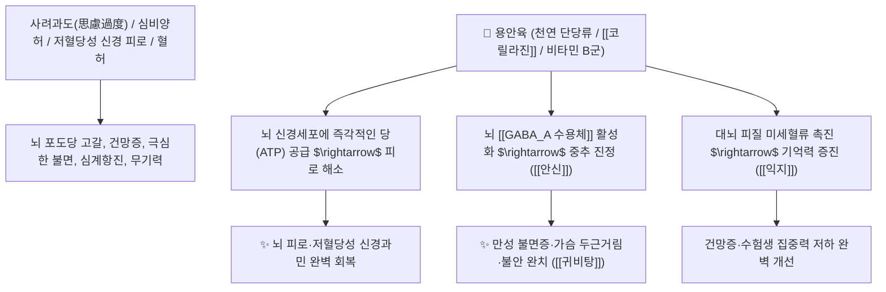

# 🌿 [[용안육]] (龍眼肉, Longan Arillus / 롱간육)

> **핵심 요약 (Key Summary)**:
> 무환자나무과(*Sapindaceae*) 용안나무(*Dimocarpus longan*)의 건조한 헛씨껍질(가종피)
> 천연 단당류(포도당·과당)와 탄닌인 [[코릴라진]](Corilagin) 및 비타민 B 복합체가 뇌 신경세포에 즉각적인 에너지 대사를 공급하고 GABA 수용체를 안정시켜 보익심비 및 안신 작용 발휘
> [[태음인]]의 심비양허(心脾兩虛, 과로와 생각 과다로 인한 기력 탈진)·만성 불면증·건망증·가슴 두근거림(심계) 및 저혈당성 신경 쇠약을 치료하는 대표적인 [[보익심비]](補益心脾)·[[양혈안신]](養血安神)·[[귀비탕]](歸脾湯)의 군약(君藥)

---
## 📌 목차
1. [기본 본초 정보 & 화학 구조 (Pharmacognosy)](#1-기본-본초-정보--화학-구조-pharmacognosy)
2. [핵심 분자약리 기전 & 코릴라진·천연 수액 당공급 네트워크](#2-핵심-분자약리-기전--코릴라진천연-수액-당공급-네트워크)
3. [해부생체역학 / 대뇌 피질 포도당 소비 & 자율신경계 연계](#3-해부생체역학--대뇌-피질-포도당-소비--자율신경계-연계)
4. [사상의학 및 임상 응용 (태음인 심비양허 vs 저혈당 스트레스 특화)](#4-사상의학-및-임상-응용-태음인-심비양허-vs-저혈당-스트레스-특화)
5. [고전 의학 및 배오 원리 (귀비탕 배오)](#5-고전-의학-및-배오-원리-귀비탕-배오)
6. [핵심 처방 비교 매트릭스](#6-핵심-처방-비교-매트릭스)
7. [출처 및 학술 참고 문헌 (References)](#7-출처-및-학술-참고-문헌-references)

---
## 1. 기본 본초 정보 & 화학 구조 (Pharmacognosy)

| 항목 | 상세 내용 |
| :--- | :--- |
| **기원 식물** | 무환자나무과(Sapindaceae) 용안 *Dimocarpus longan* Lour.의 가종피(헛씨껍질) |
| **성미 (性味)** | 甘, 溫 |
| **귀경 (歸經)** | 心·脾經 (심경, 비경) - **심장의 혈을 채우고 비장의 기운을 돋움** |
| **효능 (Actions)** | [[보익심비]](補益心脾), [[양혈안신]](養血安神), [[익지건뇌]](益智健腦), [[자양강장]](滋養强壯) |
| **주요 성분** | • **당류(50~60%)**: [[포도당]] (Glucose), 과당 (Fructose), 자당 (Sucrose) $\rightarrow$ 천연 당 수액 역할<br>• **엘라지탄닌 지표물질**: [[코릴라진]] (Corilagin), 엘라그산, 갈산<br>• **비타민 및 아미노산**: [[비타민 B1]], [[비타민 B2]], 니코틴산, 글루탐산 |

> **[유래 및 본초학적 기전]**:
> * 열매 껍질을 벗기면 검은 씨앗이 비쳐 용의 눈동자(龍眼)처럼 생겼다 하여 '용안육(龍眼肉)'이라 불립니다.
> * 스트레스와 과로, 지나친 생각(사려과도 思慮過度)으로 심장과 비장이 탈진하여(심비양허 心脾兩虛) 살이 빠지고 가슴이 두근거리며 잠을 못 자는 상태를 풍부한 영양으로 달래줍니다.
> * 대추(대조)와 유사하게 **천연 포도당 수액 역할**을 하여 뇌로 가는 혈당을 즉각 채워주고 신경을 안정시킵니다.

### 🔬 용안육의 주요 엘라지탄닌 화학 구조
![[Pasted image 20240226002602.png|450]]
> **[구조적 특징 및 활성]**: [[코릴라진]]은 혈관 내피세포의 $\text{NO}$ 생성을 촉진하여 뇌 혈류를 개선하고 세포 노화 및 산화 스트레스를 억제합니다.

---
## 2. 핵심 분자약리 기전 & 코릴라진·천연 수액 당공급 네트워크



### (1) 표적 보익심비 및 안신 작용
* **심비양허(心脾兩虛) 신경 쇠약 완치 ([[보익심비]] 補益心脾)**:
  * 과도한 스트레스로 밥맛이 없고 살이 빠지며 심장이 쿵쾅거리는 소모성 신경증을 영양을 보충하여 회복시킵니다.
* **만성 불면증 및 건망증 해소 ([[양혈안신]] 養血安神)**:
  * 잠자리에 누워도 생각이 꼬리를 물어 잠을 못 이루는 수면 장애를 천연 진정 작용으로 치료합니다 ([[귀비탕]]).
* **저혈당성 교감신경 흥분 안정**:
  * 혈당 공급 저하로 인한 식은땀, 손떨림, 불안감을 천연 단당류로 안정화합니다.

---
## 3. 해부생체역학 / 대뇌 피질 포도당 소비 & 자율신경계 연계

* **대뇌 전두엽(Prefrontal Cortex) 포도당 대사 복원**:
  * 인지 기능과 집중력을 높이고 뇌세포의 에너지 고갈을 방지합니다.

---
## 4. 사상의학 및 임상 응용 (태음인 심비양허 vs 저혈당 스트레스 특화)

```
[✅ 체질별 적응증 (Sweet Spot)]
• [[태음인]] 심비양허: 스트레스를 받으면 입맛이 뚝 떨어지고, 설사를 자주 하며 머리가 멍하고 잠을 못 자는 상태
• 수험생 및 직장인 번아웃: 머리를 너무 많이 써서 뇌가 지치고 기억력이 떨어지며 가슴이 조마조마한 경우 ([[귀비탕]])
• 산후 및 대병 후 혈허증

[⚠️ 복용 주의사항]
• 당분이 대단히 많으므로 담습(痰濕)이 성해 혀에 백태가 두껍고 속이 더부룩한 환자는 단독 과량 복용 주의
```

---
## 5. 고전 의학 및 배오 원리 (귀비탕 배오)

### (1) 심비양허와 불면증 치료의 최고 명방: 귀비탕(歸脾湯)
* **안신보혈 최고 명약 배오**:
  * [[용안육]] + [[산조인]] + [[백복신]] + [[원지]] $\rightarrow$ 심비의 혈을 채우고 불면증을 완치하는 불후의 명방 ([[귀비탕]])
  * [[용안육]] + [[인삼]] + [[황기]] $\rightarrow$ 기혈을 동시에 채움

---
## 6. 핵심 처방 비교 매트릭스

| 처방명 | 구성 약재 | 주치 병증 및 임상 타깃 | 특징 및 감별점 |
| :--- | :--- | :--- | :--- |
| [[귀비탕]] | [[용안육]], [[산조인]], [[인삼]], [[황기]], [[백출]], [[복신]], [[당귀]], [[원지]] | **사려과도, 심비양허, 건망, 불면, 도한, 식욕부진, 빈혈** | 정신과 보혈안신의 천하제일방 |
| [[가미귀비탕]] | [[귀비탕]] + [[시호]], [[산치자]] | **귀비탕증 + 화병(가슴 답답함, 분노, 번열, 홍조)** | 화병과 불면증을 동시 치료 |
| [[자음건비탕]] | [[용안육]], [[백출]], [[진피]], [[반하]], [[인삼]], [[백복령]] | **비허 생담, 소화불량, 어지럼증(담훈), 불면** | 비위를 보하고 담음을 삭임 |

---
## 7. 출처 및 학술 참고 문헌 (References)

1. **Park, S. J., et al. (2010)**. Memory-enhancing effects of *Dimocarpus longan* fruit extract in mice. *Journal of Ethnopharmacology*, 128(1), 160-165.
   - **[연구 요약]**: 용안육 추출물이 해마 내 신경영양인자(BDNF) 발현을 촉진하여 기억력 개선 및 항건망 효과를 나타냄을 입증.
2. **대한민국약전(KP) 제12개정 (2022)**. 의약품각조 제2부: 용안육 (Longan Arillus) 규격 기준.
   - **[공정서 규격]**: 건조 가종피의 성상, 순도시험(이물 1.0% 이하) 및 건조감량 15.0% 이하 기준 명시.