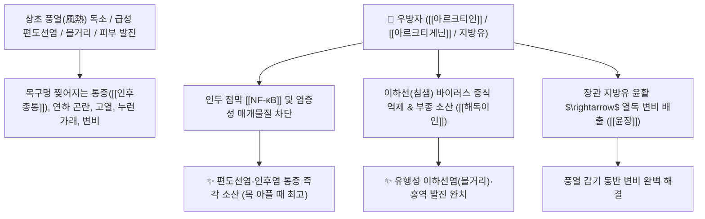

# 🌿 [[우방자]] (牛蒡子, Arctii Fructus / 우엉씨)

> **핵심 요약 (Key Summary)**:
> 국화과(*Asteraceae*) 우엉(*Arctium lappa*)의 성숙한 열매(씨앗)
> 리그난 배당체인 [[아르크티인]](Arctiin)과 [[아르크티게닌]](Arctigenin)이 인후부 염증성 사이토카인을 차단하고 상초 풍열을 소산시켜 강력한 해독이인 및 투진 작용 발휘
> 풍열(風熱) 감모로 인한 극심한 인후종통(목구멍 통증)·급성 편도선염·볼거리(이하선염) 및 홍역 발진 불투·가려움증(아토피)·열성 변비를 치료하는 목 질환의 대표적인 [[소산풍열]](疏散風熱)·[[해독이인]](解毒利咽)·[[선폐투진]](宣肺透疹) 군약(君藥)

---
## 📌 목차
1. [기본 본초 정보 & 화학 구조 (Pharmacognosy)](#1-기본-본초-정보--화학-구조-pharmacognosy)
2. [핵심 분자약리 기전 & 아르크티게닌·인후 소염·투진 네트워크](#2-핵심-분자약리-기전--아르크티게닌인후-소염투진-네트워크)
3. [해부생체역학 / 편도 림프 조직(Waldeyer's Ring) 연계](#3-해부생체역학--편도-림프-조직waldeyers-ring-연계)
4. [사상의학 및 임상 응용 (우방자 vs 박하 열 소산 감별)](#4-사상의학-및-임상-응용-우방자-vs-박하-열-소산-감별)
5. [고전 의학 및 배오 원리 (보제소독음 & 은교산)](#5-고전-의학-및-배오-원리-보제소독음--은교산)
6. [핵심 처방 비교 매트릭스](#6-핵심-처방-비교-매트릭스)
7. [출처 및 학술 참고 문헌 (References)](#7-출처-및-학술-참고-문헌-references)

---
## 1. 기본 본초 정보 & 화학 구조 (Pharmacognosy)

| 항목 | 상세 내용 |
| :--- | :--- |
| **기원 식물** | 국화과(Compositae / Asteraceae) 우엉 *Arctium lappa* L.의 잘 익은 열매 |
| **성미 (性味)** | 辛·苦, 寒 |
| **귀경 (歸經)** | 肺·胃經 (폐경, 위경) - **목구멍과 피부의 열독을 소산** |
| **효능 (Actions)** | [[소산풍열]](疏散風熱), [[해독이인]](解毒利咽), [[선폐투진]](宣肺透疹), [[소종산결]](消腫散結), [[윤장통변]](潤腸通便) |
| **주요 성분** | • **디벤질부티로락톤 리그난(지표물질)**: [[아르크티인]] (Arctiin, KP 규격 $\ge 5.0\%$), [[아르크티게닌]] (Arctigenin)<br>• **지방유(25~30%)**: 올레산, 리놀레산 (윤장 작용)<br>• **스테롤 및 비타민**: 다우코스테롤, 비타민 A, B 복합체 |

> **[유래 및 본초학적 기전]**:
> * 소(牛)처럼 억세고 가시가 돋친 우엉의 열매(子)로, 껍질이 거칠어 '악실(惡實)'이라고도 불립니다.
> * 한의학에서 **목구멍이 붓고 아픈 인후종통(咽喉腫痛)을 치료하는 최고 명약(利咽之聖藥)**입니다.
> * 씨앗 속의 풍부한 지방유가 체내 열독으로 굳어진 변비를 부드럽게 통변시키고, 피부 발진과 아토피 가려움증을 가라앉힙니다.

### 🔬 우방자의 주요 리그난 지표물질 화학 구조
```
     [ 디벤질부티로락톤 골격 ]───O──[ Glc ]  <-- 아르크티인 (Arctiin)
```
> **[구조적 특징 및 이인 활성]**: [[아르크티인]]은 장내 세균에 의해 아글리콘인 [[아르크티게닌]]으로 전환되어 [[NF-κB]] 및 [[iNOS]]를 강력히 차단하여 인두 점막의 급성 부종과 통증을 즉각 완화합니다.

---
## 2. 핵심 분자약리 기전 & 아르크티게닌·인후 소염·투진 네트워크



### (1) 표적 해독이인 및 소산풍열 작용
* **인후종통 및 급성 편도선염 치료 ([[해독이인]] 解毒利咽)**:
  * 침을 삼키기 힘들 정도로 목구멍이 빨갛게 붓고 열이 나는 증상을 신속히 가라앉힙니다.
* **볼거리(유행성 이하선염) 및 풍열 발진 소산**:
  * 턱밑 침샘이 붓고 열이 나는 볼거리와 소아 홍역, 아토피성 피부 가려움증을 치료합니다.
* **열성 변비 통변(潤腸通便)**:
  * 고열 감기로 장이 말라 대변이 막힌 경우 부드럽게 배변을 유도하여 속열을 내립니다.

---
## 3. 해부생체역학 / 편도 림프 조직(Waldeyer's Ring) 연계

* **발데이어 편도환(Waldeyer's Tonsillar Ring) 부종 완화**:
  * 구개편도 및 인두편도의 림프관 울혈을 소산시켜 기도 폐색감을 해소합니다.

---
## 4. 사상의학 및 임상 응용 (우방자 vs 박하 열 소산 감별)

```
[🔍 상초 풍열 명약: 박하 vs 우방자 감별]
• [[박하]]: 가볍고 맑아 열을 체표 밖으로 발산(發散)시킴 $\rightarrow$ 시원한 멘톨 청량감 (초기 미열/두통)
• [[우방자]]: 무겁고 차가워 열을 안에서 삭여 소산(消散)시킴 $\rightarrow$ 쓴맛으로 인후 점막 부종 분쇄 (심한 인후통/화농)

[✅ 최적 적응증 (Sweet Spot)]
• 급성 목감기: 목이 쉬고 따끔거리며 열이 나고 침 삼키기 힘든 인후염 ([[은교산]])
• 볼거리(이하선염): 귀밑과 턱 주변이 부어올라 입을 벌리기 힘든 상태 ([[보제소독음]])
• 아토피 및 두드러기: 열감과 가려움증이 심한 피부 질환
```

---
## 5. 고전 의학 및 배오 원리 (보제소독음 & 은교산)

### (1) 두면부 열독을 끄는 최고 명방: 보제소독음(普濟消毒飲)
* **인후 해독 최고 명약 배오**:
  * [[우방자]] + [[길경]] + [[금은화]] + [[연교]] $\rightarrow$ 목구멍의 모든 열독과 통증을 씻어냄 ([[은교산]])
  * [[우방자]] + [[황금]] + [[황련]] + [[승마]] $\rightarrow$ 두면부 단독(대두온)과 볼거리를 치료 ([[보제소독음]])

---
## 6. 핵심 처방 비교 매트릭스

| 처방명 | 구성 약재 | 주치 병증 및 임상 타깃 | 특징 및 감별점 |
| :--- | :--- | :--- | :--- |
| [[보제소독음]] | [[우방자]], [[황금]], [[황련]], [[연교]], [[길경]], [[승마]], [[시호]] 등 | **대두온(두면부 악성 부종), 유행성 이하선염, 인후 폐색** | 두면부 열독을 끄는 구급방 |
| [[은교산]](가감) | [[은교산]] + [[우방자]] | 풍열 감모, 고열, 극심한 인후종통, 해수 누런 가래 | 인후 소염 효과를 극대화 |
| [[선방패독탕]] | [[우방자]], [[형개]], [[방풍]], [[강활]], [[연교]] | **풍열 두드러기, 소아 발진, 소양증, 부스럼** | 피부 가려움증을 소산 |

---
## 7. 출처 및 학술 참고 문헌 (References)

1. **Koo, H. N., et al. (2002)**. Arctigenin, a constituent of *Arctium lappa*, inhibits inflammatory cytokines in human mast cells. *Immunopharmacology and Immunotoxicology*, 24(2), 273-284.
   - **[연구 요약]**: 우방자의 아르크티게닌이 비만세포 탈과립 및 염증성 사이토카인을 차단하여 강력한 인후 소염 및 항알레르기 활성을 나타냄을 규명.
2. **대한민국약전(KP) 제12개정 (2022)**. 의약품각조 제2부: 우방자 (Arctii Fructus) 규격 기준.
   - **[공정서 규격]**: 건조물 기준 아르크티인($\text{C}_{27}\text{H}_{34}\text{O}_{11}$) 5.0% 이상 함유 필수 규격 명시.
