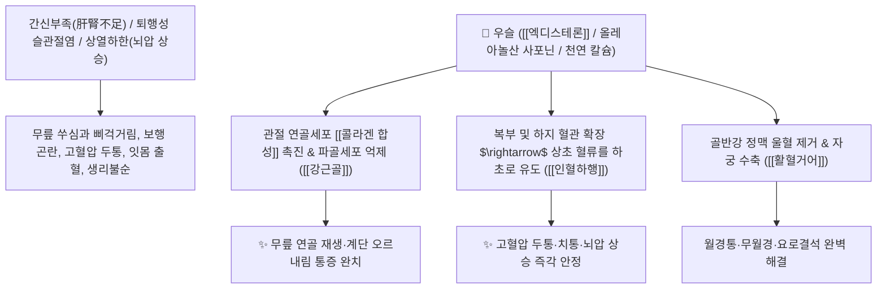

# 🌿 [[우슬]] (牛膝, Achyranthis Radix / 쇠무릎뿌리)

> **핵심 요약 (Key Summary)**:
> 비름과(*Amaranthaceae*) 우슬(*Achyranthes bidentata*) 또는 쇠무릎의 건조한 뿌리
> 식물성 엑디스테로이드인 [[엑디스테론]](Ecdysterone)과 올레아놀산 사포닌이 관절 연골을 재생하고 혈관을 확장하여 혈류를 하체로 유도(인혈하행)하는 강력한 강근골 및 활혈 작용 발휘
> 간신부족(肝腎不足)으로 인한 퇴행성 무릎 관절염·요슬산연(허리·무릎 시림과 힘 빠짐) 및 상열하한(上熱下寒)성 고혈압 두통·치통·어혈 무월경·소변불리를 치료하는 대표적인 [[보간신강근골]](補肝腎强筋骨)·[[인혈하행]](引血下行)·[[활혈거어]](活血祛瘀) 군약(君藥)

---
## 📌 목차
1. [기본 본초 정보 & 화학 구조 (Pharmacognosy)](#1-기본-본초-정보--화학-구조-pharmacognosy)
2. [핵심 분자약리 기전 & 엑디스테론·인혈하행·관절재생 네트워크](#2-핵심-분자약리-기전--엑디스테론인혈하행관절재생-네트워크)
3. [해부생체역학 / 슬관절 연골 기질 & 대퇴사두근 건 연계](#3-해부생체역학--슬관절-연골-기질--대퇴사두근-건-연계)
4. [사상의학 및 임상 응용 (생용 인혈하행 vs 숙용 강근골 감별)](#4-사상의학-및-임상-응용-생용-인혈하행-vs-숙용-강근골-감별)
5. [고전 의학 및 배오 원리 (독활기생탕 & 사묘환 배오)](#5-고전-의학-및-배오-원리-독활기생탕--사묘환-배오)
6. [핵심 처방 비교 매트릭스](#6-핵심-처방-비교-매트릭스)
7. [출처 및 학술 참고 문헌 (References)](#7-출처-및-학술-참고-문헌-references)

---
## 1. 기본 본초 정보 & 화학 구조 (Pharmacognosy)

| 항목 | 상세 내용 |
| :--- | :--- |
| **기원 식물** | 비름과(Amaranthaceae) 우슬 *Achyranthes bidentata* Blume 또는 쇠무릎 *Achyranthes japonica* Nakai의 뿌리 |
| **성미 (性味)** | 苦·酸, 平 |
| **귀경 (歸經)** | 肝·腎經 (간경, 신경) - **약효를 하초 허리와 무릎으로 이끔** |
| **효능 (Actions)** | [[보간신강근골]](補肝腎强筋骨, 숙용), [[활혈거어]](活血祛瘀, 생용), [[인혈하행]](引血下行, 생용), [[이뇨통림]](利尿通淋) |
| **주요 성분** | • **식물성 엑디스테로이드(지표물질)**: [[엑디스테론]] (Ecdysterone / 20-Hydroxyecdysone, KP 규격 $\ge 0.030\%$), 이노코스테론<br>• **트리테르페노이드 사포닌**: 올레아놀산 배당체, 아키란테스 사포닌<br>• **미네랄 및 다당류**: 천연 유기 칼슘($\text{Ca}^{2+}$ 다량), 다당체 |

> **[유래 및 본초학적 기전]**:
> * 줄기 마디가 툭 튀어나온 모양이 마치 '황소의 무릎(牛膝)'을 닮아 우슬이라 불렸습니다.
> * 단순한 보약이 아니라 막힌 혈맥을 시원하게 소통시키고, 위로 치솟는 피와 화열을 아래로 끌어내려(인혈하행 引血下行) **허리와 무릎 질환을 고치는 천하제일의 관절약**입니다.
> * **생것(生用)은 어혈을 풀고 피를 내리며(활혈/인혈하행), 쪄서 익힌 것(熟用)은 간신을 보하고 뼈와 힘줄을 단단하게 합니다(보간신/강근골)**.

### 🔬 우슬의 주요 엑디스테로이드 지표물질 화학 구조
```
     [ 스테로이드 4환 골격 ]───OH (20번 위치 하이드록실화)  <-- 엑디스테론 (Ecdysterone)
```
> **[구조적 특징 및 단백질 합성 촉진]**: [[엑디스테론]]은 연골세포의 단백질 동화 작용(Anabolic effect)을 자극하여 관절 연골 콜라겐 기질을 합성하고 골밀도를 높이며 근육 위축을 방지합니다.

---
## 2. 핵심 분자약리 기전 & 엑디스테론·인혈하행·관절재생 네트워크



### (1) 표적 보간신강근골 및 인혈하행 작용
* **퇴행성 슬관절염 및 요추 협착증 완치 ([[강근골]] 强筋骨)**:
  * 무릎 관절의 마모된 연골을 보호하고 힘줄과 뼈를 튼튼하게 하여 노인 보행 장애를 치료합니다 ([[독활기생탕]]).
* **인혈하행(引血下行)을 통한 뇌압 및 혈압 강하**:
  * 위로 솟구친 피를 아래로 끌어내려 간양상항성 고혈압 두통, 어지럼증, 코피, 치통을 가라앉힙니다.
* **골반강 어혈 소산 및 통경(活血祛瘀)**:
  * 자궁 내 미세순환을 촉진하여 생리불순, 무월경 및 산후 어혈 복통을 치료합니다.

---
## 3. 해부생체역학 / 슬관절 연골 기질 & 대퇴사두근 건 연계

* **슬관절 내측 반월판 및 관절낭 연골 기질 보강**:
  * 활액막 염증을 가라앉혀 관절 부종과 열감을 제거합니다.

---
## 4. 사상의학 및 임상 응용 (생용 인혈하행 vs 숙용 강근골 감별)

```
[🔍 포제에 따른 효능 감별]
• 생우슬(生牛膝): 활혈거어(活血祛瘀)·인혈하행(引血下行)·이뇨통림 $\rightarrow$ 고혈압 두통, 치통, 요로결석, 타박 어혈
• 숙우슬(熟牛膝, 술로 찌거나 볶음): 보간신(補肝腎)·강근골(强筋骨) $\rightarrow$ 만성 퇴행성 무릎 관절염, 요통, 하지 무력증

[✅ 최적 적응증 (Sweet Spot)]
• 퇴행성 관절염: 무릎이 붓고 쑤시며 굽히고 펴기 힘들고 다리에 힘이 빠질 때 ([[독활기생탕]])
• 상열하한(上熱下寒): 머리는 뜨겁고 아픈데 다리와 발은 시리고 힘이 없는 상태
• 어혈성 생리통 및 하지 정맥류
```

---
## 5. 고전 의학 및 배오 원리 (독활기생탕 & 사묘환 배오)

### (1) 허리와 무릎을 세우는 최고 명방: 독활기생탕(獨活寄生湯)
* **관절염 최고 명약 배오**:
  * [[우슬]] + [[두충]] + [[속단]] + [[독활]] $\rightarrow$ 허리와 무릎의 뼈마디를 강철처럼 튼튼히 함 ([[독활기생탕]])
  * [[우슬]] + [[황백]] + [[창출]] $\rightarrow$ 하지의 습열 관절통을 치료 ([[사묘환]])

---
## 6. 핵심 처방 비교 매트릭스

| 처방명 | 구성 약재 | 주치 병증 및 임상 타깃 | 특징 및 감별점 |
| :--- | :--- | :--- | :--- |
| [[독활기생탕]] | [[독활]], [[상기생]], [[두충]], [[우슬]], [[세신]], [[진교]], [[사물탕]] 등 | **간신부족, 풍습 마비, 만성 요통, 무릎 관절염, 협착증** | 퇴행성 근골격계 질환의 황제방 |
| [[사묘환]] | [[황백]], [[창출]], [[우슬]], [[의이인]] | **습열 하주, 하지 관절 종통, 각기, 족저근막염, 통풍** | 하지 습열을 내리고 관절 소염 |
| [[우슬탕]] | [[우슬]], [[당귀]], [[육계]], [[작약]] | **산후 복통, 어혈 무월경, 골반통, 하지 마비** | 하체 혈액 순환을 뚫어줌 |

---
## 7. 출처 및 학술 참고 문헌 (References)

1. **Xu, X., et al. (2017)**. Protective effects of *Achyranthes bidentata* polysaccharides and ecdysterone on articular cartilage in osteoarthritis. *International Journal of Molecular Sciences*, 18(11), 2415.
   - **[연구 요약]**: 우슬의 엑디스테론과 다당체가 연골세포 사멸을 억제하고 관절 연골 기질을 재생함을 입증.
2. **대한민국약전(KP) 제12개정 (2022)**. 의약품각조 제2부: 우슬 (Achyranthis Radix) 규격 기준.
   - **[공정서 규격]**: 건조물 기준 20-하이드록시엑디손($\text{C}_{27}\text{H}_{44}\text{O}_7$) 0.030% 이상 함유 필수 규격 명시.
