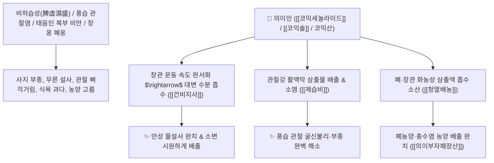

# 🌿 [[의이인]] (薏苡仁, Coicis Semen / 율무씨)

> **핵심 요약 (Key Summary)**:
> 벼과(*Poaceae*) 율무(*Coix lacryma-jobi* var. *ma-yuen*)의 성숙한 씨앗(종인)
> 항종양 및 대사 조절 성분인 [[코익세놀라이드]](Coixenolide)와 [[코익솔]](Coixol)이 장관 수분 흡수를 조절하고 관절 삼출물을 배출하여 건비삼습 및 청열배농 작용 발휘
> [[상한론]]의 습열(濕熱) 관절 비통·사지 부종 및 [[태음인]]의 비만·대사증후군·만성 무른변·폐농양(폐옹)·충수염(장옹)을 치료하는 대표적인 [[이수삼습]](利水滲濕)·[[건비지사]](健脾止瀉)·[[청열배농]](淸熱排膿) 군약(君藥)

---
## 📌 목차
1. [기본 본초 정보 & 화학 구조 (Pharmacognosy)](#1-기본-본초-정보--화학-구조-pharmacognosy)
2. [핵심 분자약리 기전 & 코익세놀라이드·건비이습·비만대사 네트워크](#2-핵심-분자약리-기전--코익세놀라이드건비이습비만대사-네트워크)
3. [해부생체역학 / 장관 수분 재흡수 & 관절강 활액막 연계](#3-해부생체역학--장관-수분-재흡수--관절강-활액막-연계)
4. [사상의학 및 임상 응용 (태음인 비만 다이어트 & 사마귀 고찰)](#4-사상의학-및-임상-응용-태음인-비만-다이어트--사마귀-고찰)
5. [상한론 『약징(藥徵)』 분석 및 배오 원리 (의이인탕 & 마행의감탕)](#5-상한론-약징藥徵-분석-및-배오-원리-의이인탕--마행의감탕)
6. [핵심 처방 비교 매트릭스](#6-핵심-처방-비교-매트릭스)
7. [출처 및 학술 참고 문헌 (References)](#7-출처-및-학술-참고-문헌-references)

---
## 1. 기본 본초 정보 & 화학 구조 (Pharmacognosy)

| 항목 | 상세 내용 |
| :--- | :--- |
| **기원 식물** | 벼과(Poaceae) 율무 *Coix lacryma-jobi* L. var. *ma-yuen* Stapf의 성숙한 종인(씨앗) |
| **성미 (性味)** | 甘·淡, 微寒 |
| **귀경 (歸經)** | 脾·胃·肺經 (비경, 위경, 폐경) - **비위를 보하고 습기를 말림** |
| **효능 (Actions)** | [[이수삼습]](利水滲濕), [[건비지사]](健脾止瀉), [[제습비]](除濕痺), [[청열배농]](淸熱排膿), [[소종산결]](消腫散結) |
| **주요 성분** | • **항종양 및 지질 조절 에스테르**: [[코익세놀라이드]] (Coixenolide), [[코익솔]] (Coixol)<br>• **지방산 및 아미노산**: 올레산, 리놀레산, 팔미트산, 류신, 티로신<br>• **다당류 및 비타민**: 코익산(Coixan A, B, C), [[비타민 B1]], 스테롤 |

> **[유래 및 본초학적 기전]**:
> * 소변을 시원하게 "의이인~" 빼내어 수종과 습열을 소산시키는 명약입니다.
> * 비위를 튼튼하게 하여 만성 설사를 멎게 하고(健脾止瀉), 관절에 물이 차고 쑤시는 풍습 비통을 치료합니다(除濕痺).
> * 폐와 장의 고름을 삭여 밖으로 배출시키는 청열배농(淸熱排膿) 작용을 지니고 있습니다.

### 🔬 의이인의 주요 지표물질 화학 구조
```
     [ 올레산 - 에리스리톨 에스테르 중합체 ]  <-- 코익세놀라이드 (Coixenolide)
     [ 6-메톡시-2-벤조옥사졸리논 ]  <-- 코익솔 (Coixol)
```
> **[구조적 특징 및 이습 활성]**: [[코익세놀라이드]]와 [[코익솔]]은 파골세포 활성을 억제하고 염증성 관절 삼출액 생성을 차단하며 지방산 산화를 촉진합니다.

---
## 2. 핵심 분자약리 기전 & 코익세놀라이드·건비이습·비만대사 네트워크



### (1) 표적 건비이습 및 비만 대사 조절
* **태음인 비만 및 식욕 억제 다이어트**:
  * 소화 흡수 속도를 늦추어 혈당 스파이크를 방지하고 체내 습담(濕痰) 노폐물을 배출시킵니다 ([[마황]]과 배오).
* **만성 설사 정지 및 이뇨 ([[건비지사]] 健脾止瀉)**:
  * 묽은 변을 자주 보고 소변량이 적은 환자의 장관 연동을 안정시키고 소변을 원활하게 합니다.
* **관절염 굴신불리 및 부종 치료 ([[제습비]] 除濕痺)**:
  * 비가 오면 온몸이 쑤시고 관절이 붓는 풍습 관절염을 치료합니다 ([[의이인탕]]).
* **폐옹 및 장옹 고름 배출 ([[청열배농]] 淸熱排膿)**:
  * 폐농양으로 피고름 가래를 뱉거나 충수염으로 아랫배가 붓고 아픈 화농성 질환을 다스립니다.

---
## 3. 해부생체역학 / 장관 수분 재흡수 & 관절강 활액막 연계

* **대장 점막 수분 수송체(Aquaporin) 발현 조절**:
  * 분변 내 수분 함량을 정상화하여 변의 형태를 탄탄하게 만듭니다.

---
## 4. 사상의학 및 임상 응용 (태음인 비만 다이어트 & 사마귀 고찰)

```
[✅ 사상의학 체질 적응증 (Sweet Spot)]
• [[태음인]] 비만 다이어트 처방: 식욕이 왕성하고 살이 찌며 몸이 무거운 경우 ([[의이인]] 20~30g + [[마황]] 4~10g 황금 배오)
• 습열 관절통: 무릎과 손발 관절이 붓고 쑤시며 굽히기 힘든 상태 ([[마황행인의이감초탕]])
• 비허 만성 설사 환자 ([[삼령백출산]])

[💡 사마귀(HPV/Molluscum) 임상 고찰]
• 민간에서 사마귀에 의이인이 특효라 알려져 있으나, 바이러스성(HPV/Molluscum) 사마귀 단독 치료 효과는 제한적이므로 면역 보조제로 이해
```

---
## 5. 상한론 『약징(藥徵)』 분석 및 배오 원리 (의이인탕 & 마행의감탕)

### (1) 『[[약징]]』에 나타난 의이인의 주치
> **"薏苡仁 主治浮腫也. 旁治身體疼痛, 癰膿..."**  
> (의이인의 주치는 몸이 붓는 부종(浮腫)이다. 곁들여 온몸이 쑤시고 아픈 것과 옹저의 고름을 치료한다.)

* **핵심 배오 원리**:
  * [[의이인]] + [[마황]] + [[행인]] + [[감초]] $\rightarrow$ 피부와 관절의 풍습을 흩어 부종을 빼냄 ([[마황행인의이감초탕]])
  * [[의이인]] + [[부자]] + [[패장초]] $\rightarrow$ 몸속 깊은 곳의 장옹 농양을 배출 ([[의이부자패장산]])

---
## 6. 핵심 처방 비교 매트릭스

| 처방명 | 구성 약재 | 주치 병증 및 임상 타깃 | 특징 및 감별점 |
| :--- | :--- | :--- | :--- |
| [[의이인탕]] | [[의이인]], [[마황]], [[당귀]], [[계지]], [[백출]], [[작약]], [[감초]] | **풍습비통, 관절종통, 근육 경련, 사지 무거움** | 관절의 습기를 빼는 대표방 |
| [[마황행인의이감초탕]] | [[마황]], [[행인]], [[의이인]], [[감초]] | **풍습 유착, 신통, 발열, 오한 없는 관절통** | 풍습 표증을 땀과 소변으로 해소 |
| [[삼령백출산]] | [[의이인]], [[산약]], [[연자육]], [[백출]], [[복령]], [[인삼]] | **비위허약, 만성 설사, 소화불량, 전신 무력감** | 건비지사의 기본 명방 |
| [[의이부자패장산]] | [[의이인]], [[부자]], [[패장초]] | **장옹(만성 충수염), 복통, 농양 형성, 피부 갑착** | 장내 고름을 삭여 배출 |

---
## 7. 출처 및 학술 참고 문헌 (References)

1. **Woo, J. H., et al. (2007)**. Coixol, an active component of *Coix lachryma-jobi*, inhibits inflammation and osteoclast differentiation. *Life Sciences*, 81(15), 1195-1202.
   - **[연구 요약]**: 의이인의 코익솔 성분이 파골세포 분화를 차단하고 관절 염증 사이토카인을 억제함을 입증.
2. **대한민국약전(KP) 제12개정 (2022)**. 의약품각조 제2부: 의이인 (Coicis Semen) 규격 기준.
   - **[공정서 규격]**: 건조 종인의 성상, 순도시험 및 건조감량 12.0% 이하 기준 명시.
3. **길익동동 (吉益東洞, 1784)**. 『약징(藥徵)』: 薏苡仁 조문.
   - **[고전 원전]**: "薏苡仁 主治浮腫也..." - 부종 및 관절 비통 주치 원리 제시.
