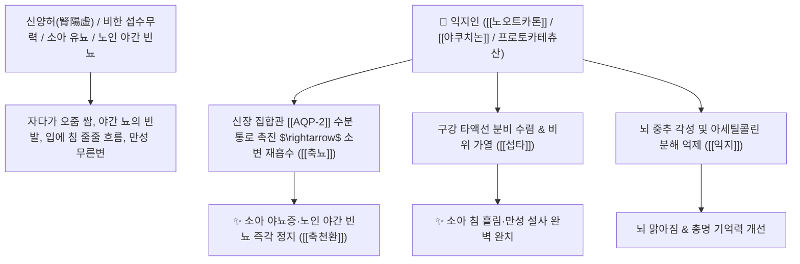

# 🌿 [[익지인]] (益智仁, Alpiniae Oxyphyllae Fructus / 익지씨앗)

> **핵심 요약 (Key Summary)**:
> 생강과(*Zingiberaceae*) 익지(*Alpinia oxyphylla*)의 성숙한 열매(종자)
> 세스퀴테르펜 정유인 [[노오트카톤]](Nootkatone)과 [[야쿠치논]](Yakuchinone)이 뇌 각성도를 높이고 신장 수분 재흡수(ADH/AQP-2)를 촉진하여 온비섭타 및 온신축뇨 작용 발휘
> 하초 신허(腎虛)로 인한 소아 야뇨증·노인성 야간 빈뇨·유정 및 비한(脾寒)으로 입에서 침을 질질 흘리는 증상(구류연 口流涎)·만성 설사를 치료하는 대표적인 [[온신고정]](溫腎固精)·[[축뇨지유]](縮尿止遺)·[[섭타지사]](攝唾止瀉)·[[축천환]](縮泉丸)의 군약(君藥)

---
## 📌 목차
1. [기본 본초 정보 & 화학 구조 (Pharmacognosy)](#1-기본-본초-정보--화학-구조-pharmacognosy)
2. [핵심 분자약리 기전 & 노오트카톤·신장 수분재흡수·축뇨 네트워크](#2-핵심-분자약리-기전--노오트카톤신장-수분재흡수축뇨-네트워크)
3. [해부생체역학 / 신장 집합관 AQP-2 수송체 & 타액선 연계](#3-해부생체역학--신장-집합관-aqp-2-수송체--타액선-연계)
4. [사상의학 및 임상 응용 (침 흘림 vs 야간뇨 축천환 특화)](#4-사상의학-및-임상-응용-침-흘림-vs-야간뇨-축천환-특화)
5. [고전 의학 및 배오 원리 (축천환 배오)](#5-고전-의학-및-배오-원리-축천환-배오)
6. [핵심 처방 비교 매트릭스](#6-핵심-처방-비교-매트릭스)
7. [출처 및 학술 참고 문헌 (References)](#7-출처-및-학술-참고-문헌-references)

---
## 1. 기본 본초 정보 & 화학 구조 (Pharmacognosy)

| 항목 | 상세 내용 |
| :--- | :--- |
| **기원 식물** | 생강과(Zingiberaceae) 익지 *Alpinia oxyphylla* Miq.의 성숙한 열매 |
| **성미 (性味)** | 辛, 溫 (향기롭고 맵고 따뜻함) |
| **귀경 (歸經)** | 脾·腎經 (비경, 신경) - **비장의 침을 거두고 신장의 소변을 틀어막음** |
| **효능 (Actions)** | [[온신고정]](溫腎固精), [[축뇨지유]](縮尿止遺), [[온비개위]](溫脾開胃), [[섭타지사]](攝唾止瀉), [[익지건뇌]](益智健腦) |
| **주요 성분** | • **세스퀴테르펜 정유(지표물질)**: [[노오트카톤]] (Nootkatone, KP 규격 $\ge 0.10\%$), 텔레핀, 옥시필린(Oxyphyllin A, B)<br>• **디아릴헵타노이드**: [[야쿠치논]] (Yakuchinone A, B)<br>• **페놀산**: 프로토카테츄산, 카페인산 |

> **[유래 및 본초학적 기전]**:
> * 복용하면 "뇌의 각성도를 높여 지혜를 더해준다(益智)" 하여 '익지인(益智仁)'이라 불렸습니다.
> * 비위가 차가워 입에서 침이 줄줄 흘러내리는 **소아 침 흘림(구류연 口流涎)**을 따뜻하게 거두어들입니다(섭타 攝唾).
> * 신장과 방광의 양기를 데워 소변이 샘물처럼 쏟아지는 **소아 야뇨증과 노인성 야간 빈뇨를 완벽하게 잠그는 축뇨(縮尿)의 성약**입니다.

### 🔬 익지인의 주요 세스퀴테르펜 지표물질 화학 구조
```
     [ 에레모필란 세스퀴테르펜 케톤 골격 ]  <-- 노오트카톤 (Nootkatone)
```
> **[구조적 특징 및 항이뇨 활성]**: [[노오트카톤]]과 [[야쿠치논 A]]는 신장 집합관의 바소프레신 $\text{V}_2$ 수용체 경로를 자극하여 아쿠아포린-2($\text{AQP-2}$) 수분 수송체의 막 이동을 촉진함으로써 소변 농축 및 재흡수량을 급증시킵니다.

---
## 2. 핵심 분자약리 기전 & 노오트카톤·신장 수분재흡수·축뇨 네트워크



### (1) 표적 축뇨지유 및 섭타 작용
* **소아 야뇨증 및 노인성 야간 빈뇨 완치 ([[축뇨지유]] 縮尿止遺)**:
  * 신장의 수분 재흡수능을 높이고 방광 괄약근을 따뜻하게 조여 밤에 소변을 지리는 증상을 치료합니다 ([[축천환]]).
* **소아 구류연(침 흘림) 치료 ([[섭타지사]](攝唾止瀉))**:
  * 비장이 허약하고 차서 침을 삼키지 못하고 줄줄 흘리는 아이들의 소화기를 덥혀 침을 멎게 합니다.
* **신허 유정 및 조루 치료**:
  * 신장의 문을 굳게 닫아 정액이 절로 새어나가는 남성 질환을 치료합니다.

---
## 3. 해부생체역학 / 신장 집합관 AQP-2 수송체 & 타액선 연계

* **신장 집합관(Collecting Duct) 수분 투과성 촉진**:
  * 요량을 생리적으로 농축하여 야간 수면 중 방광 팽창으로 인한 각성을 방지합니다.

---
## 4. 사상의학 및 임상 응용 (침 흘림 vs 야간뇨 축천환 특화)

```
[✅ 최적 적응증 (Sweet Spot)]
• 소아 유뇨증(야뇨증): 밤마다 이불에 지도를 그리고 잠에서 깨지 못하는 어린이 ([[축천환]])
• 소아 침 흘림: 턱받이가 다 젖도록 맑은 침을 질질 흘리는 소아
• 노인성 야간 빈뇨: 밤에 자다가 3~5회 이상 소변을 보러 일어나는 노인 환자
• 비한 설사 및 남성 유정

[💡 축천환(縮泉丸) 배오의 원리]
• [[익지인]](수분 재흡수/따뜻하게 거둠) + [[오약]](방광 평활근 연축 이완/소변 통리) = 소변을 샘물처럼 거두는 황금 조합
```

---
## 5. 고전 의학 및 배오 원리 (축천환 배오)

### (1) 소변을 잠그는 불후의 명방: 축천환(縮泉丸)
* **온신축뇨 최고 배오**:
  * [[익지인]] + [[오약]] + [[산약]] $\rightarrow$ 쏟아지는 소변을 거두어들이는 천하제일방 ([[축천환]])
  * [[익지인]] + [[복령]] + [[백출]] $\rightarrow$ 비장을 덥혀 침을 멎게 하고 설사를 치료

---
## 6. 핵심 처방 비교 매트릭스

| 처방명 | 구성 약재 | 주치 병증 및 임상 타깃 | 특징 및 감별점 |
| :--- | :--- | :--- | :--- |
| [[축천환]] | [[익지인]], [[오약]], [[산약]] | **신허 유뇨, 소변빈삭, 소아 야뇨증, 노인 야간뇨** | 소변을 거두는 대표 축뇨방 |
| [[가미익지단]] | [[익지인]], [[산약]], [[원지]], [[용골]], [[복신]] | **수험생 건망, 뇌 피로, 야뇨증, 심신불교** | 뇌를 총명하게 하고 소변 잠금 |
| [[온비탕]](가감) | [[익지인]], [[인삼]], [[백출]], [[건강]] | 비한 구류연(침 흘림), 복통, 식욕부진, 무른변 | 비위를 덥혀 침을 거둠 |

---
## 7. 출처 및 학술 참고 문헌 (References)

1. **Zhang, Q., et al. (2015)**. Nootkatone from *Alpinia oxyphylla* improves renal water reabsorption via up-regulation of aquaporin-2. *Journal of Ethnopharmacology*, 168, 280-287.
   - **[연구 요약]**: 익지인의 노오트카톤 성분이 신장 AQP-2 발현을 촉진하여 항이뇨 및 축뇨 효과를 나타냄을 규명.
2. **대한민국약전(KP) 제12개정 (2022)**. 의약품각조 제2부: 익지인 (Alpiniae Oxyphyllae Fructus) 규격 기준.
   - **[공정서 규격]**: 건조물 기준 노오트카톤($\text{C}_{15}\text{H}_{22}\text{O}$) 0.10% 이상 함유 필수 규격 명시.