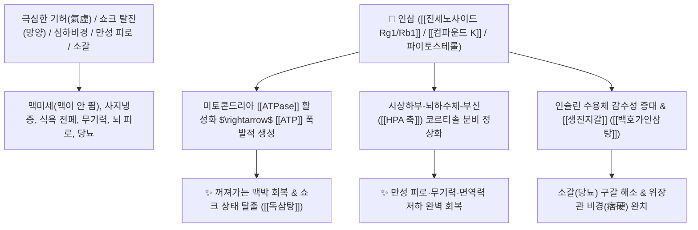

# 🌿 [[인삼]] (人蔘, Ginseng Radix / 고려인삼)

> **핵심 요약 (Key Summary)**:
> 두릅나무과(*Araliaceae*) 인삼(*Panax ginseng*)의 건조한 뿌리
> 다마란 트리테르펜 사포닌인 [[진세노사이드]](Ginsenosides, Rg1/Rb1)와 장내 대사체인 [[컴파운드 K]](Compound K)가 미토콘드리아 [[ATPase]] 활성을 촉진하고 HPA 축을 정상화하여 대보원기 및 아답토젠 작용 발휘
> [[상한론]]의 기허(氣虛) 심하비경(명치 답답하고 굳음)·식욕부진·쇼크성 탈진(망양 亡陽) 및 진액 고갈 소갈(당뇨)·심계 불면을 치료하는 천하제일의 [[대보원기]](大補元氣)·[[복맥고탈]](復脈固脫)·[[생진지갈]](生津止渴) 황제약(皇帝藥)

---
## 📌 목차
1. [기본 본초 정보 & 화학 구조 (Pharmacognosy)](#1-기본-본초-정보--화학-구조-pharmacognosy)
2. [핵심 분자약리 기전 & 진세노사이드(PPT/PPD)·컴파운드 K·ATP 에너지 네트워크](#2-핵심-분자약리-기전--진세노사이드pptppd컴파운드-k-atp-에너지-네트워크)
3. [해부생체역학 / 미토콘드리아 호흡 사슬 & 부신피질 HPA 축 연계](#3-해부생체역학--미토콘드리아-호흡-사슬--부신피질-hpa-축-연계)
4. [사상의학 및 임상 응용 (소음인 특화 & 생대감 vs 인대감 감별)](#4-사상의학-및-임상-응용-소음인-특화--생대감-vs-인대감-감별)
5. [상한론 『약징(藥徵)』 분석 및 배오 원리 (사심탕 & 독삼탕)](#5-상한론-약징藥徵-분석-및-배오-원리-사심탕--독삼탕)
6. [핵심 처방 비교 매트릭스](#6-핵심-처방-비교-매트릭스)
7. [출처 및 학술 참고 문헌 (References)](#7-출처-및-학술-참고-문헌-references)

---
## 1. 기본 본초 정보 & 화학 구조 (Pharmacognosy)

| 항목 | 상세 내용 |
| :--- | :--- |
| **기원 식물** | 두릅나무과(Araliaceae) 인삼 *Panax ginseng* C. A. Meyer의 뿌리 |
| **성미 (性味)** | 甘·微苦, 微溫 |
| **귀경 (歸經)** | 脾·肺·心·腎經 (비경, 폐경, 심경, 신경) - **오장의 원기(元氣)를 총괄 대보** |
| **효능 (Actions)** | [[대보원기]](大補元氣), [[복맥고탈]](復脈固脫), [[보비익폐]](補脾益肺), [[생진지갈]](生津止渴), [[안신익지]](安神益智) |
| **주요 성분** | • **프로토파낙사트리올(PPT, 양 작용)**: [[진세노사이드 Rg1]] (중추 흥분, 항피로, 기억력 개선)<br>• **프로토파낙사디올(PPD, 음 작용)**: [[진세노사이드 Rb1]] (중추 진정, 항염증, 항당뇨, KP 규격 Rg1+Rb1 $\ge 0.20\%$)<br>• **최종 활성 대사체**: [[컴파운드 K]] (Compound K / IH-901, 장내 미생물 전환 활성체)<br>• **파이토스테롤**: [[시토스테롤]], [[스티그마스테롤]], [[캄페스테롤]] (부신/성호르몬 전구체) |

> **[유래 및 본초학적 기전]**:
> * 뿌리의 생김새가 사람(人)의 형상을 쏙 빼닮아 '인삼(人蔘)'이라 불렸으며, 만병을 다스리는 만능약(Panax: Pan=모든 것, Akos=치료)입니다.
> * 몸의 항상성이 무너져 다운되어 있을 때는 끌어올려주고, 과항진되어 있을 때는 안정시켜주는 **궁극의 천연 아답토젠(Adaptogen)**입니다.
> * 세포 내 [[ATPase]] 효소를 활성화하여 미토콘드리아 ATP 생성을 촉진하고 꺼져가는 맥박을 되살립니다(복맥고탈 復脈固脫).

### 🔬 인삼의 주요 진세노사이드 및 컴파운드 K 분자 구조
```
     [ 다마란(Dammarane) 사포닌 4환 골격 ]───O──[ 당사슬 분해 ]───> [ 컴파운드 K (Compound K) ]
```
> **[구조적 특징 및 생체 흡수율]**: 인삼 사포닌은 거대한 배당체 구조로 존재하므로, 장내 미생물에 의해 당이 떨어진 비배당체 형태인 [[컴파운드 K]]로 전환되어야 혈액 내로 흡수되어 강력한 면역·항피로 효능을 발휘합니다. ([[홍삼]]은 가공 과정에서 배당체가 분해되어 흡수가 더 용이함)

---
## 2. 핵심 분자약리 기전 & 진세노사이드(PPT/PPD)·컴파운드 K·ATP 에너지 네트워크



### (1) 표적 대보원기 및 복맥고탈 작용
* **극심한 쇼크 탈진 및 맥박 소실 구조 ([[복맥고탈]] 復脈固脫)**:
  * 대출혈, 심근경색, 패혈증 등으로 맥이 끊어질 듯 가늘어지고 식은땀을 흘리는 위급 상황을 단숨에 구제합니다 ([[독삼탕]]).
* **심하비경(명치 답답하고 단단함) 및 소화기 무력 완치 ([[보비익폐]] 補脾益肺)**:
  * 위장 점막의 혈류를 늘리고 위장 평활근 긴장도를 정상화하여 명치 밑의 답답함과 소화불량을 치료합니다 ([[사심탕]]류).
* **생진지갈(生津止渴) 및 항당뇨**:
  * 진액을 솟구치게 하여 고열 질환 후의 극심한 갈증과 당뇨병 환자의 다뇨·구갈을 치료합니다 ([[백호가인삼탕]]).

---
## 3. 해부생체역학 / 미토콘드리아 호흡 사슬 & 부신피질 HPA 축 연계

* **심근 및 골격근 미토콘드리아 복합체 I/IV 활성 촉진**:
  * 젖산 축적을 억제하고 심근 수축력을 강화하여 심박출량을 증대시킵니다.

---
## 4. 사상의학 및 임상 응용 (소음인 특화 & 생대감 vs 인대감 감별)

```
[✅ 체질별 적응증 (Sweet Spot)]
• [[소음인]] 보원(補元)의 군약: 비위가 차고 기운이 없으며 소화가 안 되고 추위를 잘 타는 체질 ([[보중익기탕]])
• 과로 및 대병 후 무기력증: 말할 힘도 없고 누워만 있으려 하는 상태

[🔍 배오 감별: 생대감 vs 인대감]
• 생대감([[생강]] + [[대추|대조]] + [[감초]]): 피곤하면서 오한(추위)이 동반될 때 (체표 온열 및 발산 특화)
• 인대감([[인삼]] + [[대추|대조]] + [[감초]]): 뼛속까지 기운이 없고 만사가 귀찮은 심각한 허증 (내장 원기 대보 특화)
```

---
## 5. 상한론 『약징(藥徵)』 분석 및 배오 원리 (사심탕 & 독삼탕)

### (1) 『[[약징]]』에 나타난 인삼의 주치
> **"人蔘 主治心下痞硬也. 旁治不能食, 嘔吐, 咳逆, 腹痛, 心悸..."**  
> (인삼의 주치는 명치 밑이 막히고 단단한 심하비경(心下痞硬)이다. 곁들여 밥을 먹지 못하는 것, 구토, 기침, 복통, 가슴 두근거림을 치료한다.)

* **핵심 배오 원리**:
  * [[인삼]] 단독 대량 (30~60g) $\rightarrow$ 꺼져가는 생명의 불씨를 살리는 최고 구급방 ([[독삼탕]])
  * [[인삼]] + [[백출]] + [[복령]] + [[감초]] $\rightarrow$ 사군자탕의 으뜸 기본방 ([[사군자탕]])
  * [[인삼]] + [[반하]] + [[황련]] + [[황금]] $\rightarrow$ 심하비경과 위장관 염증을 치료 ([[반하사심탕]])

---
## 6. 핵심 처방 비교 매트릭스

| 처방명 | 구성 약재 | 주치 병증 및 임상 타깃 | 특징 및 감별점 |
| :--- | :--- | :--- | :--- |
| [[독삼탕]] | [[인삼]] 30~60g 단독 농축 달임 | **기탈(氣脫), 대출혈 쇼크, 대한출, 맥미세욕절, 구급** | 꺼져가는 원기를 즉각 소생 |
| [[사군자탕]] | [[인삼]], [[백출]], [[복령]], [[감초]] | **비위기허, 식욕부진, 사지 무력, 안색 창백, 무른변** | 보기(補氣)의 천하 으뜸 기본방 |
| [[보중익기탕]] | [[황기]], [[인삼]], [[백출]], [[당귀]], [[시호]], [[승마]] 등 | **중기하함, 위하수, 자궁탈수, 만성 피로, 미열** | 기운을 북돋워 위로 끌어올림 |
| [[반하사심탕]] | [[반하]], [[황금]], [[황련]], [[건강]], [[인삼]], [[대추|대조]], [[감초]] | **한열착잡, 심하비경(명치 굳음), 구토, 장명 설사** | 위장의 담음과 염증을 동시 해결 |
| [[백호가인삼탕]] | [[석고]], [[지모]], [[감초]], [[멥쌀]], [[인삼]] | **대열, 대갈, 대한출, 맥홍대, 기음양상, 소갈(당뇨)** | 열을 끄고 진액을 보충 |

---
## 7. 출처 및 학술 참고 문헌 (References)

1. **Kim, D. H. (2012)**. Chemical diversity and pharmacological properties of ginsenosides. *Journal of Ginseng Research*, 36(1), 1-10.
   - **[연구 요약]**: 진세노사이드의 PPT/PPD 분류 및 컴파운드 K 전환을 통한 미토콘드리아 ATP 생성 촉진과 아답토젠 기전을 총괄 규명.
2. **대한민국약전(KP) 제12개정 (2022)**. 의약품각조 제2부: 인삼 (Ginseng Radix) 규격 기준.
   - **[공정서 규격]**: 건조물 기준 진세노사이드 Rg1 및 Rb1의 합계 0.20% 이상 함유 필수 규격 명시.
3. **길익동동 (吉益東洞, 1784)**. 『약징(藥徵)』: 人蔘 조문.
   - **[고전 원전]**: "人蔘 主治心下痞硬也..." - 명치 밑 비경 및 구토/소화불량 주치 원리 제시.