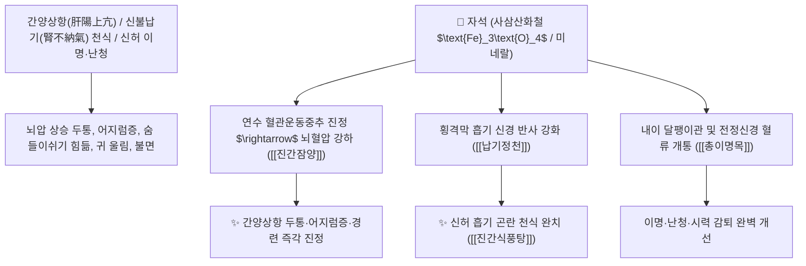

# 🌿 [[자석]] (磁石 / 慈石, Magnetitum / 천연자철석)

> **핵심 요약 (Key Summary)**:
> 산화광물류 자철석(*Magnetite*) 광석으로 주로 사삼산화철($\text{Fe}_3\text{O}_4$) 함유
> 고농도 철 미네랄 이온이 뇌 중추신경계 과흥분을 억제하고 시상하부-자율신경계를 안정시켜 진간잠양 및 납기정천 작용 발휘
> 간양상항(肝陽上亢) 고혈압 두통·어지럼증(현훈)·불면증·놀라 경기함 및 신허(腎虛)로 숨을 들이쉬지 못하는 호흡곤란(신불납기 천식)·이명·난청·시력 저하를 치료하는 대표적인 [[진간잠양]](鎭肝潛陽)·[[진경안신]](鎭驚安神)·[[납기정천]](納氣定喘)·[[총이명목]](聰耳明目) 군약(君藥)

---
## 📌 목차
1. [기본 본초 정보 & 화학 구조 (Pharmacognosy)](#1-기본-본초-정보--화학-구조-pharmacognosy)
2. [핵심 분자약리 기전 & 철 미네랄·중진안신·납기정천 네트워크](#2-핵심-분자약리-기전--철-미네랄중진안신납기정천-네트워크)
3. [해부생체역학 / 내이 전정기관 & 횡격막 호흡근 연계](#3-해부생체역학--내이-전정기관--횡격막-호흡근-연계)
4. [사상의학 및 임상 응용 (생용 잠양 vs 단용 안신 감별)](#4-사상의학-및-임상-응용-생용-잠양-vs-단용-안신-감별)
5. [고전 의학 및 배오 원리 (진간식풍탕 & 자석양신환)](#5-고전-의학-및-배오-원리-진간식풍탕--자석양신환)
6. [핵심 처방 비교 매트릭스](#6-핵심-처방-비교-매트릭스)
7. [출처 및 학술 참고 문헌 (References)](#7-출처-및-학술-참고-문헌-references)

---
## 1. 기본 본초 정보 & 화학 구조 (Pharmacognosy)

| 항목 | 상세 내용 |
| :--- | :--- |
| **광물 기원** | 등축정계 산화광물류 자철석(Magnetite)의 광석 |
| **성미 (性味)** | 鹹, 寒 (짜고 차가우며 대단히 무거움) |
| **귀경 (歸經)** | 肝·心·腎經 (간경, 심경, 신경) - **간양을 누르고 신수를 끌어올림** |
| **효능 (Actions)** | [[진간잠양]](鎭肝潛陽), [[진경안신]](鎭驚安神), [[납기정천]](納氣定喘), [[총이명목]](聰耳明目) |
| **주요 성분** | • **주성분 광물**: 사삼산화철($\text{Fe}_3\text{O}_4$, KP 규격 $\ge 50.0\%$)<br>• **미량 원소**: 마그네슘, 알루미늄, 실리카, 망간, 티타늄 |

> **[유래 및 본초학적 기전]**:
> * 자석이 쇠붙이를 자애롭게 끌어당기는 모습이 마치 어머니가 자식을 품에 안는 것 같다 하여 '자석(慈石/磁石)'이라 불렸습니다. (실제 천연 자석 광석)
> * 무거운 무게(重鎭)로 위로 솟구친 간양(肝陽)의 화열을 아래로 끌어내리고, 신장이 기운을 받아들이지 못해 헐떡이는 [[신불납기]](腎不納氣) 허천(虛喘)을 가라앉힙니다(납기정천 納氣定喘).
> * 신허로 인해 귀에서 소리가 나고(이명) 잘 들리지 않으며(난청), 눈이 침침한 증상을 맑게 뚫어줍니다(총이명목 聰耳明目).

### 🔬 자석의 천연 산화철 결정 화학 구조
```
     [ 스피넬(Spinel) 격자 구조 : Fe2+ (Fe3+)2 O4 ]  <-- 사삼산화철 (Magnetite)
```
> **[구조적 특징 및 신경 진정]**: 자석에서 유리된 미량의 2가/3가 철 이온 및 미네랄은 뇌 혈관운동 중추의 긴장을 완화하고 전정신경계 과흥분을 진정시킵니다.

---
## 2. 핵심 분자약리 기전 & 철 미네랄·중진안신·납기정천 네트워크



### (1) 표적 진간잠양 및 납기정천 작용
* **악성 고혈압 두통 및 뇌출혈 전조증 완치 ([[진간잠양]] 鎭肝潛陽)**:
  * 머리로 피가 쏠려 터질 듯 아프고 어찔어찔한 간양상항성 뇌압 상승을 가라앉힙니다 ([[진간식풍탕]]).
* **신불납기(腎不納氣) 만성 허천 치료 ([[납기정천]] 納氣定喘)**:
  * 숨을 내쉬기는 쉬우나 들이쉬기 힘들고 조금만 움직여도 헐떡이는 만성 천식을 치료합니다.
* **이명·난청 및 눈 침침함 해소 ([[총이명목]] 聰耳明目)**:
  * 신장의 정기가 고갈되어 귀에서 매미 소리가 나고 눈이 흐릿한 노인성 감각 질환을 개선합니다.

---
## 3. 해부생체역학 / 내이 전정기관 & 횡격막 호흡근 연계

* **내이 달팽이관 미세순환 저항 감소**:
  * 유모세포의 허혈성 손상을 방지하고 청신경 전도를 안정화합니다.

---
## 4. 사상의학 및 임상 응용 (생용 잠양 vs 단용 안신 감별)

```
[🔍 포제에 따른 효능 감별]
• 생자석(生磁石, 선전 오래 달임): 진간잠양(鎭肝潛陽)·납기정천(納氣定喘) $\rightarrow$ 고혈압 두통, 만성 천식, 이명
• 단자석(煅磁石, 식초 담금): 진경안신(鎭驚安神)·보신익정 $\rightarrow$ 불면증, 경련, 신허 난청

[✅ 최적 적응증 (Sweet Spot)]
• 뇌졸중 전조증: 뒷목이 뻣뻣하고 머리가 어지러우며 손발이 떨릴 때 ([[진간식풍탕]])
• 노인성 만성 천식 및 이명 난청 ([[자석양신환]])
```

---
## 5. 고전 의학 및 배오 원리 (진간식풍탕 & 자석양신환)

### (1) 뇌혈관을 안정시키는 최고 명방: 진간식풍탕(鎭肝熄風湯)
* **진간잠양 최고 배오**:
  * [[자석]] + [[대자석]] + [[용골]] + [[모려]] + [[우슬]] $\rightarrow$ 치솟는 간양을 완벽히 진압하는 장석순의 명방 ([[진간식풍탕]])
  * [[자석]] + [[숙지황]] + [[오미자]] $\rightarrow$ 신수를 보하고 귀와 눈을 밝힘 ([[자석양신환]])

---
## 6. 핵심 처방 비교 매트릭스

| 처방명 | 구성 약재 | 주치 병증 및 임상 타깃 | 특징 및 감별점 |
| :--- | :--- | :--- | :--- |
| [[진간식풍탕]] | [[자석]], [[대자석]], [[우슬]], [[용골]], [[모려]], [[현삼]], [[천문동]] | **간풍내동, 간양상항, 뇌졸중 전조, 현훈, 두통, 반신마비** | 간양을 아래로 가라앉히는 황제방 |
| [[자석양신환]] | [[자석]], [[숙지황]], [[육종용]], [[토사자]], [[오미자]] | **신허 이명, 난청, 요슬산연, 만성 천식, 시력 감퇴** | 신장을 보하고 귀를 뚫어줌 |
| [[자석환]] | [[자석]], [[주사]], [[신곡]] | **심신불안, 경계 불면, 소아 야제, 전간 경련** | 중진안신의 대표 환제 |

---
## 7. 출처 및 학술 참고 문헌 (References)

1. **대한민국약전(KP) 제12개정 (2022)**. 의약품각조 제2부: 자석 (Magnetitum) 규격 기준.
   - **[공정서 규격]**: 사삼산화철($\text{Fe}_3\text{O}_4$) 50.0% 이상 함유 필수 규격 명시.
