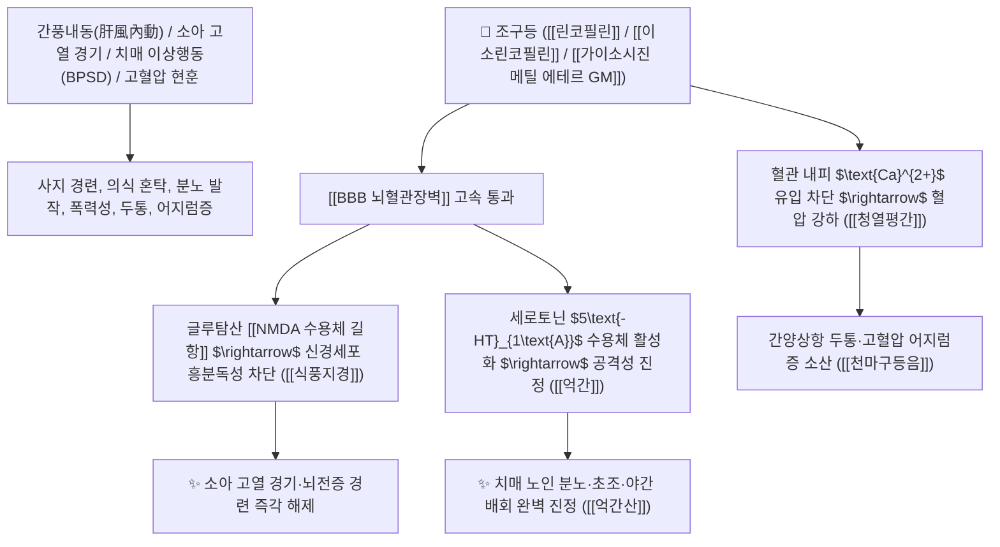

# 🌿 [[조구등]] (釣鉤藤, Uncariae Ramulus cum Uncis / 조구등줄기갈고리)

> **핵심 요약 (Key Summary)**:
> 꼭두서니과(*Rubiaceae*) 조구등(*Uncaria rhynchophylla*)의 낚싯바늘 모양 갈고리가 달린 어린 줄기
> 인돌 알칼로이드인 [[린코필린]](Rhynchophylline)과 [[가이소시진 메틸 에테르]](GM)가 뇌혈관장벽(BBB)을 통과하여 NMDA 수용체를 차단하고 세로토닌 $5\text{-HT}_{1\text{A}}$ 경로를 조절하여 식풍지경 및 청열평간 작용 발휘
> 간풍내동(肝風內動)으로 인한 소아 고열 경기(소아경풍)·전간 발작 및 치매 이상행동(BPSD 공격성·초조 불면)·간양상항성 두통·고혈압 어지럼증을 치료하는 대표적인 [[식풍지경]](熄風止痙)·[[청열평간]](淸熱平肝)·[[억간산]](抑肝散)의 군약(君藥)

---
## 📌 목차
1. [기본 본초 정보 & 화학 구조 (Pharmacognosy)](#1-기본-본초-정보--화학-구조-pharmacognosy)
2. [핵심 분자약리 기전 & 린코필린·GM·BBB 통과 신경안정 네트워크](#2-핵심-분자약리-기전--린코필린gmbbb-통과-신경안정-네트워크)
3. [해부생체역학 / 뇌혈관장벽(BBB) 투과 & 대뇌피질 추체세포 연계](#3-해부생체역학--뇌혈관장벽bbb-투과--대뇌피질-추체세포-연계)
4. [사상의학 및 임상 응용 (소아 경기 vs 치매 이상행동 BPSD 특화)](#4-사상의학-및-임상-응용-소아-경기-vs-치매-이상행동-bpsd-특화)
5. [고전 의학 및 배오 원리 (억간산 & 천마구등음)](#5-고전-의학-및-배오-원리-억간산--천마구등음)
6. [핵심 처방 비교 매트릭스](#6-핵심-처방-비교-매트릭스)
7. [출처 및 학술 참고 문헌 (References)](#7-출처-및-학술-참고-문헌-references)

---
## 1. 기본 본초 정보 & 화학 구조 (Pharmacognosy)

| 항목 | 상세 내용 |
| :--- | :--- |
| **기원 식물** | 꼭두서니과(Rubiaceae) 조구등 *Uncaria rhynchophylla* (Miq.) Miq. ex Havil. 또는 동속 근연식물의 갈고리가 달린 어린 가지 |
| **성미 (性味)** | 甘·苦, 微寒 (달고 약간 쓰며 차가움) |
| **귀경 (歸經)** | 肝·心包經 (간경, 심포경) - **간열을 끄고 심포의 경련을 안정** |
| **효능 (Actions)** | [[식풍지경]](熄風止痙), [[청열평간]](淸熱平肝), [[안신진경]](安神鎭驚), [[강혈압]](降血壓) |
| **주요 성분** | • **모노테르펜 인돌 알칼로이드(핵심 지표)**: [[린코필린]] (Rhynchophylline, KP 규격 $\ge 0.060\%$), [[이소린코필린]] (Isorhynchophylline, KP 규격 $\ge 0.040\%$), 코리녹세인<br>• **중추 신경 조절 분획**: [[가이소시진 메틸 에테르]] (GM / Geissoschizine methyl ether), 히르수틴(Hirsutine)<br>• **플라보노이드 및 카테킨**: 에피카테킨, 프로시아니딘 B1, B2 |

> **[유래 및 본초학적 기전]**:
> * 가지 마디마디에 돋아난 갈고리가 마치 물고기를 낚는 낚싯바늘(釣鉤)을 닮아 '조구등(釣鉤藤)'이라 불렸습니다.
> * 간열(肝熱)이 머리로 치솟아 발생하는 **소아의 고열 경기(驚風), 손발 떨림, 뇌전증(간질) 경련 발작을 낚싯바늘로 낚아채듯 즉각 진정시키는 명약**입니다.
> * 현대 뇌과학에서 뇌혈관장벽(BBB)을 직접 통과하여 **치매 환자의 분노, 폭력성, 야간 배회 등 치매 행동심리증상(BPSD)**을 가라앉히는 최고의 신경 정신과 본초로 입증되었습니다.

### 🔬 조구등의 주요 알칼로이드 화학 구조 및 BBB 투과 기전
![[Pasted image 20240228142417.png|450]]
![[Pasted image 20240228142437.png|450]]
> [구조적 특징 및 NMDA/세로토닌 조절]: [[린코필린]]은 분자량 400 Da 이하의 지용성/양친매성 분자로 뇌혈관장벽(BBB)을 완벽히 통과하여 NMDA 수용체의 비경쟁적 길항제로 작용하며, [[가이소시진 메틸 에테르]](GM)는 세로토닌 $5\text{-HT}_{1\text{A}}$ 수용체 아고니스트로 작용하여 피로 유발 없이 치매 환자의 공격성을 완화합니다.

---
## 2. 핵심 분자약리 기전 & 린코필린·GM·BBB 통과 신경안정 네트워크



### (1) 표적 식풍지경 및 치매 행동증상(BPSD) 개선 작용
* **소아 고열 경기 및 뇌전증 발작 진정 ([[식풍지경]] 熄風止痙)**:
  * 열감기로 인해 눈이 돌아가고 손발을 파르르 떠는 영유아 경련을 즉각 가라앉힙니다.
* **치매 환자의 공격성 및 망상·환각 진정 ([[억간산]])**:
  * 알츠하이머 및 혈관성 치매 환자의 간질발작, 분노 폭발, 간병인에 대한 공격성을 부작용 없이 안정시킵니다.
* **간양상항 고혈압 두통 및 현훈 치료 ([[청열평간]] 淸熱平肝)**:
  * 뇌혈관 긴장을 완화하여 머리가 터질 듯한 두통과 어지럼증을 다스립니다 ([[천마구등음]]).

---
## 3. 해부생체역학 / 뇌혈관장벽(BBB) 투과 & 대뇌피질 추체세포 연계

* **대뇌 변연계(Limbic System) 편도체(Amygdala) 과흥분 억제**:
  * 공포 및 공격 반응 신호를 차단하여 정서적 평정을 유도합니다.

---
## 4. 사상의학 및 임상 응용 (소아 경기 vs 치매 이상행동 BPSD 특화)

```
[✅ 최적 적응증 (Sweet Spot)]
• 소아 열성 경련 및 틱(Tic) 장애
• 치매 노인의 이상행동: 소리 지름, 의심 망상, 간병 거부, 불면 ([[억간산]])
• 간양상항 고혈압 두통 및 뇌졸중 전조증 ([[천마구등음]])

[⚠️ 전탕 수칙 (Pharmacokinetics)]
• 알칼로이드 성분이 열에 약하므로 다른 약재를 달인 후 마지막 10~15분 전에 넣어 후하(後下)하는 것이 약효 보존에 유리
```

---
## 5. 고전 의학 및 배오 원리 (억간산 & 천마구등음)

### (1) 뇌신경을 안정시키는 천하제일 명방: 억간산(抑肝散)
* **간풍식풍 최고 명약 배오**:
  * [[조구등]] + [[백출]] + [[복령]] + [[천궁]] + [[당귀]] + [[시호]] + [[감초]] $\rightarrow$ 치매와 소아 경기를 다스리는 명방 ([[억간산]])
  * [[조구등]] + [[천마]] + [[석결명]] + [[황금]] + [[치자]] $\rightarrow$ 간양 두통을 내리는 황제방 ([[천마구등음]])

---
## 6. 핵심 처방 비교 매트릭스

| 처방명 | 구성 약재 | 주치 병증 및 임상 타깃 | 특징 및 감별점 |
| :--- | :--- | :--- | :--- |
| [[억간산]] | [[조구등]], [[시호]], [[백출]], [[복령]], [[당귀]], [[천궁]], [[감초]] | **소아 야제증, 경풍, 간기울결, 치매 BPSD(공격성, 망상, 불면)** | 뇌신경을 안정시키는 제1 황제방 |
| [[천마구등음]] | [[천마]], [[조구등]], [[석결명]], [[산치자]], [[황금]], [[우슬]], [[두충]] | **간양상항, 간풍상요, 고혈압 두통, 현훈, 불면, 뇌졸중 전조** | 간양을 가라앉히고 혈압을 내림 |
| [[영각구등탕]] | [[영양각]], [[조구등]], [[상엽]], [[국화]], [[백작약]], [[생지황]] | **온열병 사열치성, 열극생풍, 고열 경련, 신혼 섬어, 사지 추축** | 급성 고열 경련의 최고 구급방 |

---
## 7. 출처 및 학술 참고 문헌 (References)

1. **Ikarashi, Y., et al. (2009)**. Geissoschizine methyl ether, an alkaloid in *Uncaria hook*, is a candidate for the alleviation of aggressiveness in dementia by acting on serotonergic system. *European Neuropsychopharmacology*, 19(5), 350-358.
   - **[연구 요약]**: 조구등의 GM 성분이 세로토닌 수용체에 작용하여 피로감 없이 치매 모델의 공격성을 유의하게 완화함을 입증.
2. **대한민국약전(KP) 제12개정 (2022)**. 의약품각조 제2부: 조구등 (Uncariae Ramulus cum Uncis) 규격 기준.
   - **[공정서 규격]**: 건조물 기준 린코필린 0.060% 및 이소린코필린 0.040% 이상 함유 필수 규격 명시.