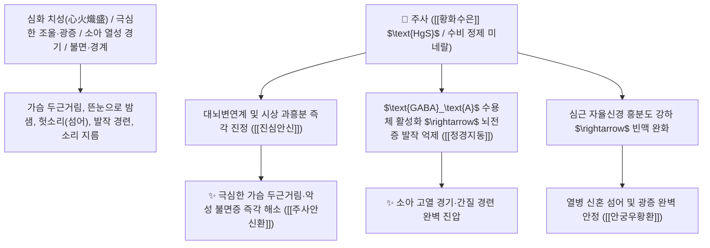

# 🌿 [[주사]] (朱砂 / 丹砂 / 辰砂, Cinnabaris / 천연황화수은광석)

> **핵심 요약 (Key Summary)**:
> 삼방정계 황화광물류 진사(*Cinnabar*) 광석으로 주로 [[황화수은]]($\text{HgS}$) 함유
> 불용성 미네랄 이온 복합체가 대뇌변연계 과흥분을 진정시키고 중추신경 $\text{GABA}_\text{A}$ 신경전달을 안정화하여 진심안신 및 청열해독 작용 발휘
> 심화(心火) 치성으로 인한 극심한 불면증·가슴 두근거림(심계항진)·소아 고열 경기(경풍)·전간(간질) 및 조현병·광증(狂證)을 치료하는 한의학 최고의 [[진심안신]](鎭心安神)·[[정경지동]](定驚止動)·[[주사안신환]](朱砂安神丸)의 군약(君藥)

---
## 📌 목차
1. [기본 본초 정보 & 화학 구조 (Pharmacognosy)](#1-기본-본초-정보--화학-구조-pharmacognosy)
2. [핵심 분자약리 기전 & 황화수은·중추신경 억제·GABA 안정 네트워크](#2-핵심-분자약리-기전--황화수은중추신경-억제gaba-안정-네트워크)
3. [해부생체역학 / 대뇌변연계 편도체 & 시상하부 신경망 연계](#3-해부생체역학--대뇌변연계-편도체--시상하부-신경망-연계)
4. [사상의학 및 임상 응용 (수비 水飛 포제 필수 vs 가열 절대 금기)](#4-사상의학-및-임상-응용-수비-水飛-포제-필수-vs-가열-절대-금기)
5. [고전 의학 및 배오 원리 (주사안신환 & 안궁우황환)](#5-고전-의학-및-배오-원리-주사안신환--안궁우황환)
6. [핵심 처방 비교 매트릭스](#6-핵심-처방-비교-매트릭스)
7. [출처 및 학술 참고 문헌 (References)](#7-출처-및-학술-참고-문헌-references)

---
## 1. 기본 본초 정보 & 화학 구조 (Pharmacognosy)

| 항목 | 상세 내용 |
| :--- | :--- |
| **광물 기원** | 삼방정계 황화광물 진사(Cinnabar)의 결정 광석 (원래 명칭: 단사 丹砂 / 진주 진사 辰砂) |
| **성미 (性味)** | 甘, 微寒, 有毒 (달고 차가우며 무겁고 독성이 있음) |
| **귀경 (歸經)** | 心經 (심경) - **심장으로 직달하여 심화(心火)를 내리고 심신을 진압** |
| **효능 (Actions)** | [[진심안신]](鎭心安神), [[정경지동]](定驚止動), [[청열해독]](淸熱解毒), [[방부]](防腐) |
| **주요 성분** | • **주성분 광물**: [[황화수은]] ($\alpha\text{-HgS}$, KP 규격 $\ge 96.0\%$)<br>• **미량 원소**: 철, 아연, 마그네슘, 실리카 |

> **[유래 및 본초학적 기전]**:
> * 붉은색(朱/丹)을 띠는 귀한 광물로, 중국 진주(辰州)에서 많이 생산되어 진사(辰砂)라고도 불렸습니다. (임상 메모: 극도로 흥분한 환자에게 마취주사를 놓듯 뇌신경을 즉각 진정시키는 중진안신의 제1명약)
> * 무거운 무게(重鎭)와 차가운 성질로 **심장의 맹렬한 불길을 끄고 미쳐 날뛰는 정신(광증 狂證)과 발작성 경련(경풍 驚風)을 가라앉힙니다**.
> * 수은 화합물이므로 **절대 불에 굽거나 가열하지 않고(가열 시 맹독성 수은 증기 발생), 물에서 곱게 갈아 뜨는 가루만 취하는 수비(水飛) 포제**를 거쳐 미량 복용합니다.

### 🔬 주사의 천연 황화수은 결정 구조
```
     [ 삼방정계 $\alpha\text{-HgS}$ 나선형 사슬 격자 구조 ] ───( 물속에서 갈아냄 수비 水飛 )───> [ 극미세 불용성 콜로이드 ]
```
> **[구조적 특징 및 신경 안정]**: $\alpha\text{-HgS}$는 위장관에서 거의 흡수되지 않는 난용성 무기 황화물로, 수비(水飛)를 통해 가용성 유리 수은염을 제거한 미세입자 상태로 복용하여 중추신경계의 과도한 흥분성 시냅스 전달을 진정시킵니다.

---
## 2. 핵심 분자약리 기전 & 황화수은·중추신경 억제·GABA 안정 네트워크



### (1) 표적 진심안신 및 중진정경 작용
* **악성 불면증 및 심계항진 완치 ([[진심안신]](鎭心安神))**:
  * 가슴이 심하게 두근거려 잠을 잘 수 없고 불안초조한 심화 환자를 깊은 수면에 들게 합니다 ([[주사안신환]]).
* **소아 고열 경기 및 뇌전증 발작 진압 ([[정경지동]](定驚止動))**:
  * 아이가 놀라 울음을 그치지 않거나 손발을 떨며 경련하는 것을 진정시킵니다.
* **급성 뇌염 및 뇌졸중 신혼 섬어 해독 ([[안궁우황환]])**:
  * 고열로 헛소리를 하고 의식이 혼탁한 뇌졸중 급성기를 구급합니다.

---
## 3. 해부생체역학 / 대뇌변연계 편도체 & 시상하부 신경망 연계

* **편도체-시상하부 스트레스 축 과민 반응 억제**:
  * 교감신경의 급격한 서지를 차단하여 심박수와 혈압을 안정화합니다.

---
## 4. 사상의학 및 임상 응용 (수비 水飛 포제 필수 vs 가열 절대 금기)

```
[⚠️ 절대 준수 포제 및 복용 수칙 (Safety First)]
1. 절대 가열 금기 (忌火煅): 불에 구우면 독성 수은 증기(Hg)와 유독 산화수은이 발생하여 치명적 중독 유발
2. 수비(水飛) 필수: 반드시 물속에서 곱게 갈아 물에 뜨는 미세 가루만 건조하여 1회 0.1~0.5g씩 환산제로 단기 복용
3. 장기 복용 절대 금지: 중금속 체내 축적을 방지하기 위해 증상이 가라앉으면 즉시 투약 중단
```

---
## 5. 고전 의학 및 배오 원리 (주사안신환 & 안궁우황환)

### (1) 심신을 안정시키는 최고 명방: 주사안신환(朱砂安神丸)
* **진심안신 최고 배오**:
  * [[주사]] (수비분말) + [[황련]] + [[생지황]] + [[당귀]] + [[감초]] $\rightarrow$ 심화를 끄고 정신을 안정시키는 이천의 불후 명방 ([[주사안신환]])
  * [[주사]] + [[우황]] + [[사향]] + [[영양각]] + [[석웅황]] $\rightarrow$ 뇌졸중 온병 구급 황제방 ([[안궁우황환]])

---
## 6. 핵심 처방 비교 매트릭스

| 처방명 | 구성 약재 | 주치 병증 및 임상 타깃 | 특징 및 감별점 |
| :--- | :--- | :--- | :--- |
| [[주사안신환]] | [[주사]], [[황련]], [[생지황]], [[당귀]], [[감초]] | **심화 항성, 번열 불면, 심계 정충, 다몽, 건망, 구설생창** | 심화를 끄고 심신을 안정시킴 |
| [[안궁우황환]] | [[우황]], [[사향]], [[주사]], [[영양각]], [[황련]], [[황금]], [[치자]], [[웅황]] | **온열병 사입심포, 고열 섬어, 중풍 혼미, 소아 경궐** | 뇌졸중 신혼의 최고 구급방 |
| [[자석환]] | [[자석]], [[주사]], [[신곡]] | **심신불안, 경계 불면, 전간, 이명, 난청, 시력 감퇴** | 중진안신과 보신을 겸비 |

---
## 7. 출처 및 학술 참고 문헌 (References)

1. **Zhou, X., et al. (2010)**. Differences in toxicity and tissue distribution between cinnabar and mercuric chloride in rats. *Journal of Ethnopharmacology*, 130(2), 211-216.
   - **[연구 요약]**: 수비(水飛)된 천연 주사(HgS)는 염화수은과 달리 위장관 흡수율이 매우 낮아 적정 용량 단기 복용 시 안전하게 진정 활성을 발휘함을 규명.
2. **대한민국약전(KP) 제12개정 (2022)**. 의약품각조 제2부: 주사 (Cinnabaris) 규격 기준.
   - **[공정서 규격]**: 황화수은($\text{HgS}$) 96.0% 이상 함유 필수 규격 및 수비 가공 기준 명시.
