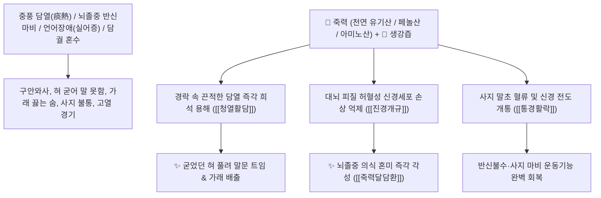

# 🌿 [[죽력]] (竹瀝 / 淡竹瀝, Bambusae Succus / 대나무진액)

> **핵심 요약 (Key Summary)**:
> 벼과(*Poaceae*) 솜대(*Phyllostachys nigra* var. *henonis*) 줄기를 숯불에 구워 추출한 맑은 수액(대나무 엑기스)
> 천연 유기산과 페놀성 화합물 및 아미노산 복합체가 뇌혈관 미세순환을 개선하고 기도 점액을 급속히 희석하여 청열활담 및 진경개규 작용 발휘
> 담열(痰熱)이 경락과 심규(心竅)를 막아 발생한 뇌졸중 중풍(반신불수·구안와사·언어장애·가래 끓는 혼수) 및 소아 고열 경기·성인 전간 발작을 치료하는 천하제일의 [[청열활담]](淸熱滑痰)·[[진경개규]](鎭驚開竅)·[[죽력달담환]](竹瀝達痰丸)의 군약(君藥)

---
## 📌 목차
1. [기본 본초 정보 & 화학 구조 (Pharmacognosy)](#1-기본-본초-정보--화학-구조-pharmacognosy)
2. [핵심 분자약리 기전 & 대나무 유기산·활담개규·뇌신경 보호 네트워크](#2-핵심-분자약리-기전--대나무-유기산활담개규뇌신경-보호-네트워크)
3. [해부생체역학 / 뇌피질 운동영역 & 구음기관 설하신경 연계](#3-해부생체역학--뇌피질-운동영역--구음기관-설하신경-연계)
4. [사상의학 및 임상 응용 (중풍 반신불수 vs 생강즙 배오 필수)](#4-사상의학-및-임상-응용-중풍-반신불수-vs-생강즙-배오-필수)
5. [고전 의학 및 배오 원리 (죽력달담환 & 성향정기산 죽력 가미)](#5-고전-의학-및-배오-원리-죽력달담환--성향정기산-죽력-가미)
6. [핵심 처방 비교 매트릭스](#6-핵심-처방-비교-매트릭스)
7. [출처 및 학술 참고 문헌 (References)](#7-출처-및-학술-참고-문헌-references)

---
## 1. 기본 본초 정보 & 화학 구조 (Pharmacognosy)

| 항목 | 상세 내용 |
| :--- | :--- |
| **기원 식물** | 벼과(Gramineae / Poaceae) 솜대 *Phyllostachys nigra* Munro var. *henonis* Stapf 또는 왕대의 줄기를 불에 구워 흘러나오는 즙액 (담죽력 淡竹瀝) |
| **성미 (性味)** | 甘·苦, 大寒, 滑 (달고 쓰며 대단히 차갑고 미끄러움) |
| **귀경 (歸經)** | 心·肺·胃經 (심경, 폐경, 위경) - **경락 깊숙한 곳의 엉긴 담열을 씻어냄** |
| **효능 (Actions)** | [[청열활담]](淸熱滑痰), [[진경개규]](鎭驚開竅), [[통경활락]](通經活絡), [[소담청열]](消痰淸熱) |
| **주요 성분** | • **천연 유기산 화합물**: 아세트산, 포름산, 프로피온산, 숙신산<br>• **페놀산 및 플라보노이드**: 시린직산, 바닐릭산, 벤조산, 클로로겐산<br>• **유리 아미노산 및 미네랄**: [[글루탐산]], 아스파라긴산, 칼륨, 마그네슘 |

> **[유래 및 본초학적 기전]**:
> * 푸른 대나무를 불에 구울 때 마디 끝에서 땀방울처럼 떨어지는 맑은 진액(대나무 엑기스)입니다.
> * 성질이 몹시 차갑고 미끄러워(滑), **경락 구석구석과 뇌혈관에 들러붙은 끈적한 가래(담열 痰熱)를 씻어내어 중풍으로 말이 어눌해지고(설건불어 舌蹇不語) 반신이 마비된 것을 뚫어주는 제1명약**입니다.
> * 성질이 너무 차가워 비위를 상할 수 있으므로, **반드시 따뜻한 [[생강즙]](生薑汁)을 조금 타서 복용하여 차가운 독성을 완충하고 약효를 온몸으로 순행**시킵니다.

### 🔬 죽력의 주요 유기산 및 페놀산 구조
```
     [ 대나무 증류 유기산 복합체 (Acids & Phenols) ] ───( 점액 희석 및 항산화 )───> [ 뇌 미세혈류 개통 ]
```
> **[구조적 특징 및 담열 희석]**: 죽력의 천연 유기산과 칼륨염은 기도 점액 및 혈관 주위 삼출물의 점도를 즉각 낮추어 배출을 촉진하고 허혈성 뇌신경세포 손상을 방어합니다.

---
## 2. 핵심 분자약리 기전 & 대나무 유기산·활담개규·뇌신경 보호 네트워크



### (1) 표적 청열활담 및 중풍 후유증 완치 작용
* **중풍 언어장애 및 반신마비 완치 ([[청열활담]] 淸熱滑痰)**:
  * 뇌졸중으로 혀가 굳어 말을 하지 못하고 팔다리를 쓰지 못하는 환자의 경락을 뚫어줍니다 ([[죽력달담환]]).
* **담궐(痰厥) 혼수 및 소아 열성 경련 개규 ([[진경개규]] 鎭驚開竅)**:
  * 목구멍에 가래가 끓으며 의식을 잃고 쓰러진 응급 환자의 기도를 틔워 의식을 회복시킵니다.
* **알코올 해독 및 콜레스테롤 강하**:
  * 흉격의 열을 끄고 주독(酒毒)을 풀어 번갈과 숙취를 해소합니다.

---
## 3. 해부생체역학 / 뇌피질 운동영역 & 구음기관 설하신경 연계

* **설하신경(Hypoglossal Nerve, CN XII) 전도 촉진**:
  * 설근부 마비를 완화하여 연하 곤란 및 구음장애(Dysarthria)를 개선합니다.

---
## 4. 사상의학 및 임상 응용 (중풍 반신불수 vs 생강즙 배오 필수)

```
[✅ 최적 적응증 (Sweet Spot)]
• 뇌졸중 급성기 및 후유증: 말이 어눌하고 침을 흘리며 한쪽 팔다리가 마비된 상태
• 소아 고열 경기 및 가래 끓는 천식
• 극심한 흉민 및 번갈(가슴이 답답하고 목마름)

[⚠️ 생강즙(薑汁) 배오 필수 수칙 (Safety)]
• 죽력은 성질이 대단히 차갑고 미끄러우므로 단독 복용 시 설사나 위냉을 유발할 수 있음
• 반드시 죽력 5~10숟가락에 생강즙 1~2숟가락을 타서 따뜻하게 데워 복용
```

---
## 5. 고전 의학 및 배오 원리 (죽력달담환 & 성향정기산 죽력 가미)

### (1) 경락의 가래를 뚫는 최고 명방: 죽력달담환(竹瀝達痰丸)
* **청열활담 최고 배오**:
  * [[죽력]] + [[생강즙]] + [[대황]] + [[황금]] + [[반하]] + [[침향]] $\rightarrow$ 온몸의 묵은 담열을 씻어내는 불후의 명방 ([[죽력달담환]])
  * [[성향정기산]] + [[죽력]] + [[생강즙]] $\rightarrow$ 중풍 졸도 구급방

---
## 6. 핵심 처방 비교 매트릭스

| 처방명 | 구성 약재 | 주치 병증 및 임상 타깃 | 특징 및 감별점 |
| :--- | :--- | :--- | :--- |
| [[죽력달담환]] | [[죽력]], [[생강즙]], [[대황]], [[황금]], [[반하]], [[침향]], [[망초]] | **완담 교결, 중풍 실어, 반신불수, 전광, 경간, 가래 끓음** | 경락의 담을 씻어내는 황제환 |
| [[죽력음]] | [[죽력]], [[생강즙]], [[갈근]], [[맥문동]] | **온열병 고열 번갈, 진액 고갈, 섬어, 소아 경기** | 열을 끄고 진액을 보충 |
| [[성향정기산]](가미) | [[곽향정기산]] + [[남성]], [[목향]] + [[죽력]]/[[생강즙]] | 중풍 초기, 담궐, 인사불성, 구안와사, 어혈 | 기를 돌리고 담을 뚫어줌 |

---
## 7. 출처 및 학술 참고 문헌 (References)

1. **Park, J. H., et al. (2012)**. Neuroprotective effects of *Phyllostachys nigra* var. *henonis* extract (Bambusae Succus) against ischemic brain injury in rats. *Journal of Ethnopharmacology*, 141(1), 384-391.
   - **[연구 요약]**: 죽력 추출물이 뇌허혈 재관류 손상에서 신경세포 사멸 억제 및 항염증 효과를 통해 뇌경색 부피를 유의하게 감소시킴을 입증.
2. **대한민국약전(KP) 제12개정 (2022)**. 생약규격집: 죽력 (Bambusae Succus) 규격 기준.
   - **[공정서 규격]**: 솜대 마디 줄기 가열 유출액의 성상, 순도시험 및 건조잔류물 기준 명시.
