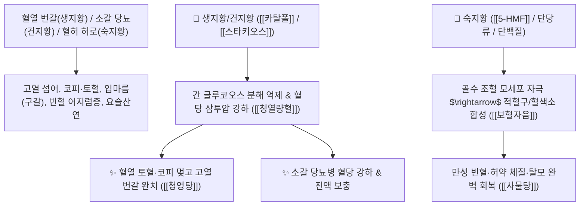

# 🌿 [[지황]] (地黃, Rehmanniae Radix / 생지황·건지황·숙지황 총괄)

> **핵심 요약 (Key Summary)**:
> 현삼과(*Scrophulariaceae*) 지황(*Rehmannia glutinosa*)의 신선한 뿌리(생지황), 건조 뿌리(건지황), 증숙 가공 뿌리(숙지황)
> 이리도이드 배당체인 [[카탈폴]](Catalpol)과 올리고당인 [[스타키오스]](Stachyose) 및 증숙 유래 [[5-HMF]]가 간 글리코겐 대사와 혈당 삼투압을 조절하고 조혈 인자를 자극하여 청열생진 및 보혈자음 작용 발휘
> [[상한론]]의 혈열 번갈·소갈(당뇨병)·출혈(토혈·코피·붕루) 및 혈허 빈혈·정혈 고갈(요슬산연·어지럼증·탈모)을 치료하는 한의학 최고의 [[청열량혈]](淸熱凉血)·[[자음보혈]](滋陰補血)·[[육미지황환]](六味地黃丸)·[[사물탕]](四物湯)의 군약(君藥)

---
## 📌 목차
1. [기본 본초 정보 & 화학 구조 (Pharmacognosy)](#1-기본-본초-정보--화학-구조-pharmacognosy)
2. [핵심 분자약리 기전 & 카탈폴·5-HMF·스타키오스·당대사 네트워크](#2-핵심-분자약리-기전--카탈폴5-hmf스타키오스당대사-네트워크)
3. [해부생체역학 / 골수 조혈 미세환경 & 췌장-간문맥 혈당 조절 연계](#3-해부생체역학--골수-조혈-미세환경--췌장-간문맥-혈당-조절-연계)
4. [사상의학 및 생지황 vs 건지황 vs 숙지황 3대 정밀 감별](#4-사상의학-및-생지황-vs-건지황-vs-숙지황-3대-정밀-감별)
5. [상한론 『약징(藥徵)』 분석 및 배오 원리 (팔미환 & 궁귀교애탕)](#5-상한론-약징藥徵-분석-및-배오-원리-팔미환--궁귀교애탕)
6. [핵심 처방 비교 매트릭스](#6-핵심-처방-비교-매트릭스)
7. [출처 및 학술 참고 문헌 (References)](#7-출처-및-학술-참고-문헌-references)

---
## 1. 기본 본초 정보 & 화학 구조 (Pharmacognosy)

| 항목 | 상세 내용 |
| :--- | :--- |
| **기원 식물** | 현삼과(Scrophulariaceae) 또는 질경이과 지황 *Rehmannia glutinosa* Liboschitz ex Fischer et Meyer의 덩이뿌리 |
| 성미 (性味) | • [[생지황]](生地黃): 甘·苦, 大寒 (청열량혈, 생진지갈)<br>• [[건지황]](乾地黃): 甘, 寒 (청열량혈, 양음생진, 보골수)<br>• [[숙지황]](熟地黃): 甘, 微溫 (보혈자음, 익정진수) |
| **귀경 (歸經)** | 心·肝·腎經 (심경, 간경, 신경) - **심장의 혈열을 식히고 간신의 정혈을 보충** |
| **효능 (Actions)** | [[청열생진]](淸熱生津), [[량혈지혈]](凉血止血), [[보혈자음]](補血滋陰), [[익정진수]](益精塡髓) |
| **주요 성분** | • **이리도이드 배당체(생지황/건지황 지표)**: [[카탈폴]] (Catalpol, KP 규격 건지황 $\ge 0.20\%$), 아우쿠빈, 레오누라이드<br>• **수용성 당류 및 올리고당**: [[스타키오스]] (Stachyose, 생지황에 다량), [[만니톨]] (Mannitol), 글루코오스<br>• **구증구포 증숙 지표물질**: [[5-HMF]] (5-Hydroxymethylfurfural, 숙지황 $\ge 0.10\%$) |

> **[유래 및 본초학적 기전]**:
> * 대지(地)의 누런 황금(黃) 같은 정기를 머금은 뿌리로, **혈분의 모든 병과 체액 대사의 불균형을 다스리는 한의학 최고의 성약(聖藥)**입니다.
> * [[생지황]]: 갓 캔 즙이 많은 생뿌리로, 불타는 혈열을 끄고 진액을 채움 (청열생진, 량혈지혈).
> * [[건지황]]: 밭에서 캐어 햇볕에 말린 것으로, 보음과 보골수, 인대 손상 재생에 특화 (양음생진).
> * [[숙지황]]: 막걸리에 적셔 9번 찌고 말려(구증구포) 검게 만든 것으로, 보혈과 신장의 골수를 채움 (보혈익정).

### 🔬 지황의 주요 카탈폴 및 숙지황 포제 화학 메커니즘
![[Pasted image 20240227142437.png|350]]
![[Pasted image 20240227142444.png|350]]
![[Pasted image 20240227142453.png|450]]
> **[구조적 특징 및 포제 메커니즘]**:
> 1. [[스타키오스]]: 생지황의 난소화성 올리고당은 상부 소화기를 지나 대장 미생물의 먹이가 되며, 장내 환경에 따라 묽은 변을 유발할 수 있습니다.
> 2. **구증구포(九蒸九曝)**: 증숙 과정을 거치면 스타키오스가 단당류로 분해되어 소화 흡수율이 높아지고, 당-아미노산 마이야르 반응에 의해 [[5-HMF]]가 생성되어 흑색으로 전환됩니다.
> 3. [[카탈폴]]: 췌장 $\beta$-세포 기능을 회복시키고 간의 과도한 글루코오스 방출을 억제하여 혈당과 혈압을 안정화합니다.

---
## 2. 핵심 분자약리 기전 & 카탈폴·5-HMF·스타키오스·당대사 네트워크



### (1) 표적 청열량혈 및 보혈자음 작용
* **혈열망행 출혈 및 온열병 번갈 완치 ([[생지황]])**:
  * 펄펄 끓는 열로 코피, 토혈, 피부 발진이 돋는 상태를 식혀줍니다 ([[청영탕]]).
* **당뇨병(소갈) 혈당 조절 및 체액 삼투압 안정 ([[건지황]])**:
  * 간에서 글리코겐이 과도하게 포도당으로 분해되는 것을 억제하고 혈당 스파이크를 방어합니다 ([[팔미지황환]]).
* **만성 빈혈 및 골수 정혈 보충 ([[숙지황]])**:
  * 얼굴이 노랗고 어지러우며 머리카락이 빠지고 허리 무릎이 시큰거리는 증상을 치료합니다 ([[사물탕]]).

---
## 3. 해부생체역학 / 골수 조혈 미세환경 & 췌장-간문맥 혈당 조절 연계

* **골수 내 에리스로포이에틴(EPO) 반응성 증대**:
  * 조혈 줄기세포의 적혈구계 분화를 유도하여 산소 운반능을 극대화합니다.

---
## 4. 사상의학 및 생지황 vs 건지황 vs 숙지황 3대 정밀 감별

```
[🔍 지황 3형제 정밀 감별 매트릭스]
• [[생지황]](生地黃, 生): 大寒, 량혈지혈(凉血止血) $\rightarrow$ 고열 출혈, 인후염, 온열 발진 (소양인 청열)
• [[건지황]](乾地黃, 乾): 寒, 양음생진(養陰生津)·보골수 $\rightarrow$ 당뇨병 소갈, 골절/인대 손상, 음허내열
• [[숙지황]](熟地黃, 熟): 微溫, 보혈자음(補血滋陰)·익정진수 $\rightarrow$ 만성 빈혈, 정력 감퇴, 난임, 허약자 (소음인/태음인 보약)

[💡 복용 주의점]
• 숙지황은 성질이 점조(粘稠)하므로 비위가 약한 사람은 백출, 사인, 진피를 배오하여 소화불량을 방지
```

---
## 5. 상한론 『약징(藥徵)』 분석 및 배오 원리 (팔미환 & 궁귀교애탕)

### (1) 『[[약징]]』에 나타난 지황의 주치
> **"地黃 主治血證及水病也..."**  
> (지황의 주치는 피의 병(혈증)에서 물의 병(수병, 체액 삼투압 대사)까지 아우른다.)

* **상한론 최고 명약 배오**:
  * [[건지황]] + [[산약]] + [[산수유]] + [[복령]] + [[택사]] + [[목단피]] + [[계지]] + [[부자]] $\rightarrow$ 신양과 신음을 동시에 살리는 불후의 명방 ([[팔미지황환]])
  * [[생지황]] + [[아교]] + [[당귀]] + [[천궁]] + [[백작약]] $\rightarrow$ 임신 하혈과 붕루를 멎게 함 ([[궁귀교애탕]])

---
## 6. 핵심 처방 비교 매트릭스

| 처방명 | 구성 약재 | 주치 병증 및 임상 타깃 | 특징 및 감별점 |
| :--- | :--- | :--- | :--- |
| [[사물탕]] | [[숙지황]], [[당귀]], [[천궁]], [[백작약]] | **일체 혈허증, 안색 창백, 현훈, 심계, 월경부조, 산후 빈혈** | 보혈 치료의 제1 황제방 |
| [[육미지황환]] | [[숙지황]], [[산약]], [[산수유]], [[택사]], [[복령]], [[목단피]] | **간신 음허, 요슬산연, 두훈 이명, 골증조열, 도한, 소갈** | 하초 신수를 채우는 기본방 |
| [[팔미지황환]] | [[육미지황환]] + [[육계]](계지), [[부자]] | **신양허, 소변 빈삭, 야간뇨, 하지 냉감, 양위, 소갈** | 음과 양을 동시에 북돋움 |
| [[궁귀교애탕]] | [[천궁]], [[당귀]], [[아교]], [[애엽]], [[건지황]], [[백작약]], [[감초]] | **부인 붕루, 임신 태루 하혈, 복통, 산후 출혈 지속** | 자궁 출혈을 멎게 하고 안태 |

---
## 7. 출처 및 학술 참고 문헌 (References)

1. **Zhang, R. X., et al. (2008)**. *Rehmannia glutinosa*: Review of botany and chemistry and pharmacology of catalpol and 5-HMF. *Journal of Ethnopharmacology*, 117(2), 199-214.
   - **[연구 요약]**: 지황의 카탈폴 성분의 항당뇨·신경보호 기전 및 숙지황 포제 시 5-HMF 생성에 따른 조혈 촉진 활성을 총괄 규명.
2. **대한민국약전(KP) 제12개정 (2022)**. 의약품각조 제2부: 지황 (Rehmanniae Radix) 및 숙지황 규격 기준.
   - **[공정서 규격]**: 건지황 기준 카탈폴 0.20% 이상, 숙지황 기준 5-HMF 0.10% 이상 함유 필수 규격 명시.
3. **길익동동 (吉益東洞, 1784)**. 『약징(藥徵)』: 地黃 조문.
   - **[고전 원전]**: "地黃 主治血證及水病也..." - 혈액 및 수분 대사 조절 주치 원리 제시.