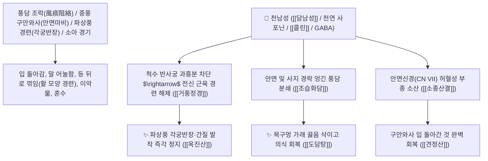

# 🌿 [[천남성]] (天南星 / 膽南星, Arisaematis Rhizoma / 둥근잎천남성덩이뿌리)

> **핵심 요약 (Key Summary)**:
> 천남성과(*Araceae*) 둥근잎천남성(*Arisaema amurense*) 또는 천남성의 건조한 덩이뿌리 (소쓸개즙 포제 시 담남성 膽南星)
> 트리테르페노이드 사포닌과 콜린 화합물이 뇌신경 운동 중추의 과흥분을 억제하고 끈적한 풍담(風痰)을 액화 배출시켜 거풍지경 및 조습화담 작용 발휘
> 풍담(風痰)이 경락을 막아 발생한 뇌졸중 중풍(구안와사 안면마비·반신불수)·파상풍 경련(각궁반장 角弓反張)·소아 간질 경기 및 임파선 멍울(나력)을 뚫어주는 천하제일의 [[거풍정경]](去風定驚)·[[조습화담]](燥濕化痰)·[[소종산결]](消腫散結)·[[견정산]](牽正散)·[[도담탕]](導痰湯)의 군약(君藥)

---
## 📌 목차
1. [기본 본초 정보 & 화학 구조 (Pharmacognosy)](#1-기본-본초-정보--화학-구조-pharmacognosy)
2. [핵심 분자약리 기전 & 담남성 포제·항경련·풍담 소산 네트워크](#2-핵심-분자약리-기전--담남성-포제항경련풍담-소산-네트워크)
3. [해부생체역학 / 안면신경(CN VII) & 척수 운동 뉴런 연계](#3-해부생체역학--안면신경cn-vii--척수-운동-뉴런-연계)
4. [사상의학 및 생남성 vs 제남성(우담남성) 포제 감별](#4-사상의학-및-생남성-vs-제남성우담남성-포제-감별)
5. [고전 의학 및 배오 원리 (견정산 & 옥진산)](#5-고전-의학-및-배오-원리-견정산--옥진산)
6. [핵심 처방 비교 매트릭스](#6-핵심-처방-비교-매트릭스)
7. [출처 및 학술 참고 문헌 (References)](#7-출처-및-학술-참고-문헌-references)

---
## 1. 기본 본초 정보 & 화학 구조 (Pharmacognosy)

| 항목 | 상세 내용 |
| :--- | :--- |
| **기원 식물** | 천남성과(Araceae) 둥근잎천남성 *Arisaema amurense* Maxim. 또는 천남성의 덩이뿌리 |
| **성미 (性味)** | • **생남성(生南星)**: 苦·辛, 溫, 有毒 (맵고 마비감이 심함)<br>• **담남성(膽南星, 우담 포제)**: 苦, 微凉 (차분하고 서늘하여 진경력 탁월) |
| **귀경 (歸經)** | 肺·肝·脾經 (폐경, 간경, 비경) - **경락 구석구석의 풍담(風痰)을 깨뜨림** |
| **효능 (Actions)** | [[거풍정경]](去風定驚), [[조습화담]](燥濕化痰), [[소종산결]](消腫散結), [[진경지통]](鎭痙止痛) |
| **주요 성분** | • **트리테르펜 사포닌**: 아리사에마 사포닌, $\beta$-시토스테롤 글루코사이드<br>• **유기산 및 아미노산**: [[콜린]] (Choline), $\gamma$-아미노부티르산(GABA), 디펩타이드<br>• **자극성 침상 결정**: 옥살산칼슘(Calcium oxalate) 바늘 결정 (생것의 혀 마비 독성) |

> **[유래 및 본초학적 기전]**:
> * 눈앞이 캄캄해지는 어지럼증과 담(가래)을 치료하여 **"천남성을 먹으니 담이 걷혀 하늘의 남쪽 별(天南星)이 맑게 보인다"** 하여 불렸습니다.
> * 단순한 호흡기 가래가 아니라, **경락과 신경을 틀어막아 입과 눈이 돌아가고(구안와사 口眼喎斜) 온몸이 활처럼 뒤로 꺾이는 파상풍 경련(각궁반장 角弓反張)을 일으키는 악성 풍담(風痰)을 타파하는 최고 명약**입니다.
> * 소의 쓸개즙(우담 牛膽)에 버무려 오랜 기간 발효시킨 [[담남성]](膽南星)은 매운 독성이 사라지고 서늘한 성질로 바뀌어 소아 경기와 뇌전증 발작을 안전하게 진정시킵니다.

### 🔬 천남성의 담남성 포제 화학 구조
```
     [ 생남성 옥살산칼슘 침상 결정 ] ───( 소 쓸개즙 발효 담남성 膽南星 )───> [ 무독성 콜린-담즙산 복합체 ]
```
> **[구조적 특징 및 항경련 활성]**: 우담(소 쓸개즙) 포제를 거친 담남성은 옥살산칼슘 결정의 점막 자극 독성이 중화되고, 천연 GABA 및 담즙산염 복합체에 의해 척수 반사궁의 과흥분을 차단합니다.

---
## 2. 핵심 분자약리 기전 & 담남성 포제·항경련·풍담 소산 네트워크



### (1) 표적 거풍정경 및 구안와사 완치 작용
* **중풍 안면마비(구안와사) 완치 ([[견정산]] 牽正散)**:
  * 찬바람을 맞거나 스트레스로 입과 눈이 삐뚤어지고 눈이 감기지 않는 벨 마비(Bell's palsy)를 즉각 바로잡습니다.
* **파상풍 경련 및 이악묾(아관긴급) 구급 ([[옥진산]] 玉眞散)**:
  * 녹슨 못에 찔려 온몸에 경련이 일어나고 입을 벌리지 못하는 파상풍을 치료합니다.
* **뇌졸중 담궐 및 담음성 어지럼증 해소 ([[도담탕]] 導痰湯)**:
  * 가래가 끓어 숨이 차고 머리가 핑핑 도는 중풍 전조증을 다스립니다.

---
## 3. 해부생체역학 / 안면신경(CN VII) & 척수 운동 뉴런 연계

* **경유돌공(Stylomastoid Foramen) 안면신경 부종 완화**:
  * 안면 표정근의 신경 지배력을 복원하여 안면 비대칭을 교정합니다.

---
## 4. 사상의학 및 생남성 vs 제남성(우담남성) 포제 감별

```
[🔍 천남성 포제별 효능 감별]
• 생남성(生南星): 辛溫有毒 $\rightarrow$ 외용 종기 도포, 외과 마취 진통
• 제남성(製南星, 생강 백반 포제): 溫燥 $\rightarrow$ 한담(寒痰) 기침, 풍습 관절 마비
• [[담남성]](膽南星, 소 쓸개즙 발효): 苦微凉 $\rightarrow$ 열담(熱痰) 경기, 소아 뇌전증, 뇌졸중 혼수

[⚠️ 복용 주의사항 (Safety)]
• 생것은 혀를 마비시키는 독성이 있으므로 반드시 법제된 제남성이나 담남성을 사용
```

---
## 5. 고전 의학 및 배오 원리 (견정산 & 옥진산)

### (1) 안면마비와 파상풍 치료의 최고 황제방
* **구안와사 최고 배오**:
  * [[백부자]] + [[백강잠]] + [[천남성]](제남성)` $\rightarrow$ 입 돌아간 것을 바로잡는 불후의 명방 ([[견정산]])
* **파상풍 경련 최고 배오**:
  * [[천남성]] + [[방풍]] + [[백지]] + [[강활]] $\rightarrow$ 온몸 경련을 진정시키는 명방 ([[옥진산]])

---
## 6. 핵심 처방 비교 매트릭스

| 처방명 | 구성 약재 | 주치 병증 및 임상 타깃 | 특징 및 감별점 |
| :--- | :--- | :--- | :--- |
| [[견정산]] | [[백부자]], [[백강잠]], [[천남성]] (동량 산제) | **풍담 조락, 구안와사, 안면마비, 입과 눈이 삐뚤어짐** | 안면마비를 바로잡는 제1방 |
| [[옥진산]] | [[천남성]], [[방풍]], [[백지]], [[강활]] | **파상풍, 아관긴급, 각궁반장, 사지 경련, 칼/못에 찔린 상처** | 파상풍 경련의 최고 구급방 |
| [[도담탕]] | [[반하]], [[천남성]], [[진피]], [[지실]], [[복령]], [[감초]] | **담음 옹성, 중풍 어지럼증, 가래 끓는 소리, 흉격 비만** | 가래를 삭이고 기운을 통하게 함 |

---
## 7. 출처 및 학술 참고 문헌 (References)

1. **Ji, X., et al. (2014)**. Processing of *Arisaema amurense* with bovine bile (Dan-Nan-Xing) reduces toxicity and enhances anticonvulsant activity. *Journal of Ethnopharmacology*, 151(1), 470-477.
   - **[연구 요약]**: 천남성을 소 쓸개즙으로 포제한 담남성이 옥살산칼슘 독성을 제거하고 뇌신경 항경련 활성을 극대화함을 입증.
2. **대한민국약전(KP) 제12개정 (2022)**. 의약품각조 제2부: 천남성 (Arisaematis Rhizoma) 규격 기준.
   - **[공정서 규격]**: 둥근잎천남성 덩이뿌리의 성상, 순도시험 및 건조감량 13.0% 이하 기준 명시.
