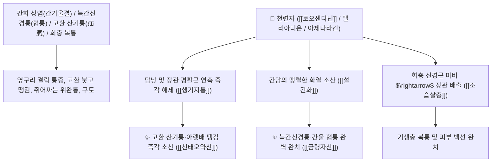

# 🌿 [[천련자]] (川楝子 / 金鈴子, Toosendan Fructus / 멀구슬나무열매)

> **핵심 요약 (Key Summary)**:
> 멀구슬나무과(*Meliaceae*) 멀구슬나무(*Melia azedarach*)의 건조한 성숙 열매(금령자 金鈴子)
> 리모노이드 트리테르페노이드인 [[토오센다닌]](Toosendanin)이 신경근 접합부 아세틸콜린 유리를 조절하여 평활근 경련을 풀고 기생충을 마비시켜 행기지통 및 조습살충 작용 발휘
> 간기울결(肝氣鬱結)로 인한 옆구리 통증(협통 脇痛)·위완통 및 고환이 붓고 당기며 아픈 산기(疝氣) 통증·회충성 복통·두부 백선을 치료하는 대표적인 [[행기지통]](行氣止痛)·[[설간화]](泄肝火)·[[조습살충]](燥濕殺蟲)·[[금령자산]](金鈴子散)·[[일관전]](一貫煎)의 군약(君藥)

---
## 📌 목차
1. [기본 본초 정보 & 화학 구조 (Pharmacognosy)](#1-기본-본초-정보--화학-구조-pharmacognosy)
2. [핵심 분자약리 기전 & 토오센다닌·간울 진통·산기통 네트워크](#2-핵심-분자약리-기전--토오센다닌간울-진통산기통-네트워크)
3. [해부생체역학 / 늑간신경 & 음낭 정삭(Spermatic Cord) 주행 연계](#3-해부생체역학--늑간신경--음낭-정삭spermatic-cord-주행-연계)
4. [사상의학 및 임상 응용 (고환 산기통 vs 간울 협통 특화)](#4-사상의학-및-임상-응용-고환-산기통-vs-간울-협통-특화)
5. [고전 의학 및 배오 원리 (금령자산 & 일관전)](#5-고전-의학-및-배오-원리-금령자산--일관전)
6. [핵심 처방 비교 매트릭스](#6-핵심-처방-비교-매트릭스)
7. [출처 및 학술 참고 문헌 (References)](#7-출처-및-학술-참고-문헌-references)

---
## 1. 기본 본초 정보 & 화학 구조 (Pharmacognosy)

| 항목 | 상세 내용 |
| :--- | :--- |
| **기원 식물** | 멀구슬나무과(Meliaceae) 멀구슬나무 *Melia azedarach* L. 또는 천련의 성숙한 열매 (금령자 金鈴子 / 고련자 苦楝子) |
| **성미 (性味)** | 苦, 寒, 有小毒 (쓰고 차가우며 맑고 약간의 독성이 있음) |
| **귀경 (歸經)** | 肝·胃·小腸·膀胱經 (간경, 위경, 소장경, 방광경) - **간담의 화열을 끄고 경락을 뚫음** |
| **효능 (Actions)** | [[행기지통]](行氣止痛), [[설간화]](泄肝火), [[조습살충]](燥濕殺蟲), [[산한통산]](散寒通疝) |
| **주요 성분** | • **리모노이드 트리테르펜(지표물질)**: [[토오센다닌]] (Toosendanin / 천련자소, KP 규격 $\ge 0.050\%$), 멜리아디온<br>• **세코리모노이드**: 아제다라킨(Azedarachin A~C), 멜리아닌<br>• **플라보노이드 및 지방산**: 루틴, 미리시트린, 스테아르산 |

> **[유래 및 본초학적 기전]**:
> * 열매가 둥글고 황금빛 방울(金鈴)처럼 매달려 있어 '금령자(金鈴子)'라고도 불립니다.
> * 간(肝)에 불이 붙어 **옆구리가 찌르듯 아픈 늑간신경통(협통 脇痛)과, 간경락이 지나는 고환이 붓고 아랫배가 당겨 찢어질 듯한 산기(疝氣) 통증을 신속히 멎게 하는 간경 진통의 최고 명약**입니다.
> * 뱃속의 회충과 요충을 마비시켜 배출시키고 피부 버짐과 백선을 치료합니다.

### 🔬 천련자의 주요 토오센다닌 화학 구조
```
     [ 테트라노르트리테르페노이드 리모노이드 골격 ]───( C-28 푸란 고리 결합 )  <-- 토오센다닌 (Toosendanin)
```
> **[구조적 특징 및 신경근 진통]**: [[토오센다닌]]은 신경근 접합부의 아세틸콜린 과다 방출을 차단하여 평활근의 경련성 산통을 즉각 이완시키고, 기생충의 신경계를 마비시켜 살충 효과를 나타냅니다.

---
## 2. 핵심 분자약리 기전 & 토오센다닌·간울 진통·산기통 네트워크



### (1) 표적 행기지통 및 산기통(疝氣痛) 완치 작용
* **간기울결 늑간신경통 및 위완통 완치 ([[금령자산]] 金鈴子散)**:
  * 스트레스로 간화가 치솟아 옆구리와 명치가 쑤시고 아픈 통증을 현호색과 함께 단숨에 멎게 합니다.
* **고환 부종 및 산기(疝氣) 복통 치료 ([[행기지통]] 行氣止痛)**:
  * 고환이 부어오르고 사타구니가 당기며 아랫배가 쥐어뜯기듯 아픈 산기 질환을 다스립니다 ([[천태오약산]]).
* **회충성 복통 구충 및 피부 백선 해소 ([[조습살충]] 燥濕殺蟲)**:
  * 뱃속 기생충을 마비시켜 대변으로 배출시키고 피부 진균을 살균합니다.

---
## 3. 해부생체역학 / 늑간신경 & 음낭 정삭(Spermatic Cord) 주행 연계

* **정삭신경총(Spermatic Plexus) 과민성 완화**:
  * 서혜관(Inguinal Canal)을 통과하는 신경혈관 다발의 긴장을 풀어 고환통을 개선합니다.

---
## 4. 사상의학 및 임상 응용 (고환 산기통 vs 간울 협통 특화)

```
[🔍 현호색과의 황금 배오: 금령자산(金鈴子散)]
• [[천련자]](金鈴子): 苦寒, 기운의 열을 끄고 행기(行氣) $\rightarrow$ 기분(氣分)의 통증
• [[현호색]](玄胡索): 辛溫, 어혈을 풀고 활혈(活血) $\rightarrow$ 혈분(血分)의 통증
$\rightarrow$ 둘을 동량으로 배오하면 기혈(氣血)의 모든 찌르는 복통과 협통을 평정

[⚠️ 복용 주의사항 (Safety)]
• 약간의 독성이 있으므로 비위가 허한하여 차가운 환자 및 임산부는 주의하여 투여
```

---
## 5. 고전 의학 및 배오 원리 (금령자산 & 일관전)

### (1) 간경 통증을 다스리는 최고 황제방: 금령자산(金鈴子散) & 일관전(一貫煎)
* **간울 통증 최고 배오**:
  * [[천련자]] + [[현호색]] (동량 배오) $\rightarrow$ 협통과 복통을 멎게 하는 불후의 명방 ([[금령자산]])
  * [[천련자]] + [[사삼]] + [[맥문동]] + [[당귀]] + [[생지황]] + [[구기자]] $\rightarrow$ 간음허 협통을 치료 ([[일관전]])

---
## 6. 핵심 처방 비교 매트릭스

| 처방명 | 구성 약재 | 주치 병증 및 임상 타깃 | 특징 및 감별점 |
| :--- | :--- | :--- | :--- |
| [[금령자산]] | [[천련자]], [[현호색]] (동량 산제) | **간울화화, 흉협 협통, 위완 자통, 생리통, 산기통** | 기혈 통증을 멎게 하는 명방 |
| [[일관전]] | [[생지황]], [[북사삼]], [[맥문동]], [[당귀]], [[구기자]], [[천련자]] | **간신 음허, 간기 불서, 흉협 창통, 탄산 토고(신물/쓴물)** | 음을 보하며 간기를 틔움 |
| [[천태오약산]](가미) | [[오약]], [[약목향]], [[소회향]], [[청피]], [[천련자]] | 소장 산기, 고환 편폐 종통, 소복 연급 산통 | 하초 산기를 흩어버림 |

---
## 7. 출처 및 학술 참고 문헌 (References)

1. **Shi, Y. L., et al. (1992)**. Neuromuscular blocking and antinociceptive mechanisms of toosendanin from *Melia toosendan*. *British Journal of Pharmacology*, 107(3), 666-671.
   - **[연구 요약]**: 천련자의 토오센다닌 성분이 신경근 접합부 아세틸콜린 방출 조절을 통해 강력한 진통 및 평활근 경련 이완 활성을 발휘함을 입증.
2. **대한민국약전(KP) 제12개정 (2022)**. 의약품각조 제2부: 천련자 (Toosendan Fructus) 규격 기준.
   - **[공정서 규격]**: 건조 성숙 열매 기준 토오센다닌($\text{C}_{30}\text{H}_{38}\text{O}_{11}$) 0.050% 이상 함유 필수 규격 명시.
