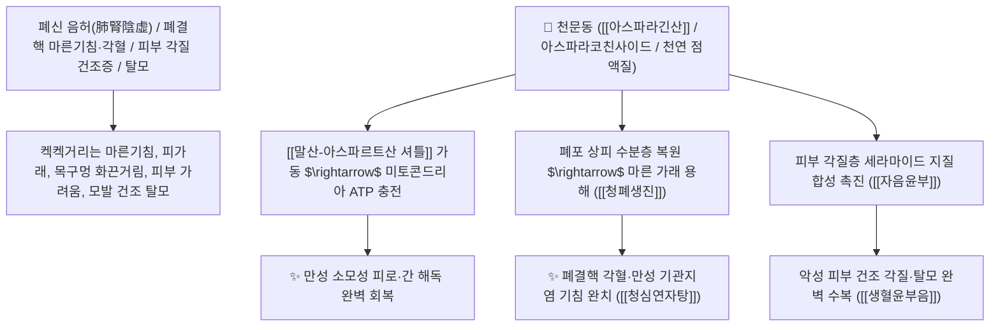

# 🌿 [[천문동]] (天門冬, Asparagi Radix / 천문동덩이뿌리)

> **핵심 요약 (Key Summary)**:
> 백합과(*Liliaceae*) 천문동(*Asparagus cochinchinensis*)의 껍질을 벗겨 쪄서 말린 덩이뿌리
> 스테로이드 사포닌과 고농도 [[아스파라긴산]](Asparagine)이 미토콘드리아 말산-아스파르트산 셔틀을 가동하여 세포 내 수분을 충전하고 폐포 상피 손상을 수복하여 양음윤조 및 청폐생진 작용 발휘
> [[태음인]]의 폐신 음허(폐결핵 마른기침·각혈·인후 건조) 및 피부 각질 건조증·탈모·노인성 진액 고갈 변비를 치료하는 대표적인 [[양음윤조]](養陰潤燥)·[[청폐생진]](淸肺生津)·[[자음윤부]](滋陰潤膚)·[[조위승청탕]](調胃升淸湯)·[[생혈윤부음]](生血潤膚飲)의 군약(君藥)

---
## 📌 목차
1. [기본 본초 정보 & 화학 구조 (Pharmacognosy)](#1-기본-본초-정보--화학-구조-pharmacognosy)
2. [핵심 분자약리 기전 & 아스파라긴산·말산 셔틀·세포수분 충전 네트워크](#2-핵심-분자약리-기전--아스파라긴산말산-셔틀세포수분-충전-네트워크)
3. [해부생체역학 / 폐포 제2형 상피세포 & 피부 각질층 수분 장벽 연계](#3-해부생체역학--폐포-제2형-상피세포--피부-각질층-수분-장벽-연계)
4. [사상의학 및 천문동 vs 맥문동 음액 보충 정밀 감별](#4-사상의학-및-천문동-vs-맥문동-음액-보충-정밀-감별)
5. [고전 의학 및 배오 원리 (생혈윤부음 & 조위승청탕)](#5-고전-의학-및-배오-원리-생혈윤부음--조위승청탕)
6. [핵심 처방 비교 매트릭스](#6-핵심-처방-비교-매트릭스)
7. [출처 및 학술 참고 문헌 (References)](#7-출처-및-학술-참고-문헌-references)

---
## 1. 기본 본초 정보 & 화학 구조 (Pharmacognosy)

| 항목 | 상세 내용 |
| :--- | :--- |
| **기원 식물** | 백합과(Liliaceae / Asparagaceae) 천문동 *Asparagus cochinchinensis* (Lour.) Merr.의 덩이뿌리 |
| **성미 (性味)** | 甘·苦, 大寒 (달고 쓰며 몹시 차갑고 몹시 윤택함) |
| **귀경 (歸經)** | 肺·腎經 (폐경, 신경) - **상초 폐열을 끄고 하초 신장의 진액을 샘솟게 함** |
| **효능 (Actions)** | [[양음윤조]](養陰潤燥), [[청폐생진]](淸肺生津), [[자음윤부]](滋陰潤膚), [[익정청열]](益精淸熱) |
| **주요 성분** | • **비필수 아미노산(핵심 에너지 대사)**: [[아스파라긴산]] (Asparagine, 아스파라긴), 티로신, 프롤린<br>• **스테로이드 사포닌**: 아스파라코친사이드(Asparacochinsaponin A~I), 야모게닌<br>• **수용성 다당체 및 점액질**: 천문동 다당체(ACP), $\beta$-시토스테롤 |

> **[유래 및 본초학적 기전]**:
> * 약효가 하늘의 문(天門)을 열어 겨울(冬)처럼 차분하고 서늘하게 진액을 채운다 하여 '천문동(天門冬)'이라 불렸습니다.
> * 맥문동(麥門冬)이 심위(心胃)의 진액을 채운다면, **천문동은 성질이 훨씬 더 차갑고 깊숙하여 폐와 신장(肺腎)의 말라붙은 음액을 채우고 뼛속 허열을 끄는 최고의 자음약**입니다.
> * 피부가 뱀 비늘처럼 트고 각질이 일어나는 건조증(생혈윤부음)과 모발이 빠지는 탈모 질환을 치료합니다.

### 🔬 천문동의 아스파라긴산 대사 셔틀 및 분자 구조
![[Pasted image 20241112100654-1.jpg|350]]
![[Pasted image 20241112100445-1.jpg|450]]
> **[구조적 특징 및 말산-아스파르트산 셔틀]**: [[아스파라긴산]]은 미토콘드리아 내막의 **말산-아스파르트산 셔틀(Malate-Aspartate Shuttle)**에 직접 관여하여 세포질의 $\text{NADH}$를 미토콘드리아로 전달함으로써 세포 손상 회복, 간 해독 및 만성 피로를 회복시킵니다.

---
## 2. 핵심 분자약리 기전 & 아스파라긴산·말산 셔틀·세포수분 충전 네트워크



### (1) 표적 양음윤조 및 피부 재생 작용
* **폐음허 마른기침 및 각혈 완치 ([[양음윤조]] 養陰潤燥)**:
  * 가래 없이 켁켁거리며 목구멍이 찢어질 듯 아프고 피가 섞여 나오는 기침을 치료합니다.
* **피부 악성 각질 건조증 수복 ([[생혈윤부음]] 生血潤膚飲)**:
  * 아토피나 노인성 건조증으로 피부가 하얗게 트고 갈라지며 회복되지 않는 상태를 치료합니다.
* **사상의학적 태음인 보음 및 뇌인지 개선 ([[조위승청탕]] & 이삼단)**:
  * 뇌세포 손상을 억제하여 치매 예방 및 건망증을 개선합니다.

---
## 3. 해부생체역학 / 폐포 제2형 상피세포 & 피부 각질층 수분 장벽 연계

* **폐포 표면활성물질(Surfactant) 분비 촉진**:
  * 폐포의 허탈을 방지하고 호흡기 점막의 섬모 청소 기능을 정상화합니다.

---
## 4. 사상의학 및 천문동 vs 맥문동 음액 보충 정밀 감별

```
[🔍 자음 2대 문동(門冬) 정밀 감별 매트릭스]
• [[천문동]](天門冬): 苦甘大寒 $\rightarrow$ 肺腎(하초)에 직달, 성질이 몹시 차갑고 강함 (골증열, 각혈, 피부 각질, 태음인)
• [[맥문동]](麥門冬): 甘微苦微寒 $\rightarrow$ 心胃(중초/상초)에 작용, 성질이 온화함 (가슴 번열, 위음부족, 마른기침)
$\rightarrow$ 둘을 동량으로 함께 배오하면 상하(上下)의 모든 진액 고갈을 평정 ([[조위승청탕]], [[청심연자탕]])
```

---
## 5. 고전 의학 및 배오 원리 (생혈윤부음 & 조위승청탕)

### (1) 피부와 진액을 살리는 최고 명방
* **피부 건조 재생 최고 배오**:
  * [[천문동]] + [[맥문동]] + [[생지황]] + [[숙지황]] + [[당귀]] + [[황기]] $\rightarrow$ 피부 건조와 각질을 치료하는 불후의 명방 ([[생혈윤부음]])
  * [[천문동]] + [[맥문동]] + [[원지]] + [[석창포]] $\rightarrow$ [[태음인]] 뇌 청뇌 명방 ([[조위승청탕]])

---
## 6. 핵심 처방 비교 매트릭스

| 처방명 | 구성 약재 | 주치 병증 및 임상 타깃 | 특징 및 감별점 |
| :--- | :--- | :--- | :--- |
| [[생혈윤부음]] | [[천문동]], [[맥문동]], [[생지황]], [[숙지황]], [[당귀]], [[황기]], [[황금]] | **혈허 풍조, 피부 건조 각질, 가려움증, 손발 갈라짐, 탈모** | 피부에 진액을 채우는 제1방 |
| [[조위승청탕]] | [[의이인]], [[건율]], [[맥문동]], [[천문동]], [[원지]], [[석창포]] | [[태음인]] **위완한증, 중풍 전조증, 건망증, 사지 무력, 피로** | 태음인의 청기(淸氣)를 올림 |
| [[청심연자탕]] | [[연자육]], [[산약]], [[천문동]], [[맥문동]], [[원지]], [[석창포]] | [[태음인]] **심열 번조, 몽설, 유정, 소변 혼탁, 불면증** | 심장의 불을 끄고 진액 보충 |

---
## 7. 출처 및 학술 참고 문헌 (References)

1. **Lee, D. Y., et al. (2015)**. Anti-inflammatory and skin-hydrating effects of *Asparagus cochinchinensis* extract (Asparagi Radix) via mitochondrial metabolic enhancement. *Journal of Ethnopharmacology*, 169, 131-138.
   - **[연구 요약]**: 천문동의 아스파라긴산 및 사포닌 분획이 미토콘드리아 대사 활성화 및 피부 각질층 수분 보유력을 유의하게 증대시킴을 규명.
2. **대한민국약전(KP) 제12개정 (2022)**. 의약품각조 제2부: 천문동 (Asparagi Radix) 규격 기준.
   - **[공정서 규격]**: 천문동 덩이뿌리의 성상, 순도시험 및 건조감량 15.0% 이하 기준 명시.