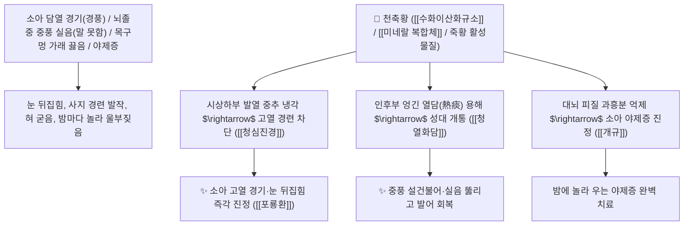

# 🌿 [[천축황]] (天竺黃 / 竹黃, Bambusae Concretio Silicea / 대나무마디수액결정)

> **핵심 요약 (Key Summary)**:
> 벼과(*Poaceae*) 왕대(*Phyllostachys bambusoides*) 또는 청피죽의 마디 속에 분비되어 굳은 규산염 덩어리
> 천연 수화규산염($\text{SiO}_2\cdot n\text{H}_2\text{O}$)과 칼륨·칼슘 미네랄이 뇌신경 흥분성 시냅스 전달을 억제하고 시상하부 열조절 중추를 냉각하여 청열활담 및 청심진경 작용 발휘
> 담열(痰熱)로 인한 소아 급만성 고열 경기(경풍 驚風·야제증)·뇌졸중 중풍으로 목구멍에 가래가 끓고 말을 못하는 설건불어(舌蹇不語)·실음(失音) 및 간질 발작을 치료하는 대표적인 [[청열화담]](淸熱化痰)·[[청심진경]](淸心鎭驚)·[[개규정경]](開竅定驚)·[[포룡환]](抱龍丸)의 군약(君藥)

---
## 📌 목차
1. [기본 본초 정보 & 화학 구조 (Pharmacognosy)](#1-기본-본초-정보--화학-구조-pharmacognosy)
2. [핵심 분자약리 기전 & 천연 규산염·소아 경기 진정·중풍 개규 네트워크](#2-핵심-분자약리-기전--천연-규산염소아-경기-진정중풍-개규-네트워크)
3. [해부생체역학 / 시상하부 체온조절중추 & 성대 후두근 연계](#3-해부생체역학--시상하부-체온조절중추--성대-후두근-연계)
4. [사상의학 및 임상 응용 (죽력 vs 죽여 vs 천축황 3대 대나무 정밀 감별)](#4-사상의학-및-임상-응용-죽력-vs-죽여-vs-천축황-3대-대나무-정밀-감별)
5. [고전 의학 및 배오 원리 (포룡환 & 천축황산)](#5-고전-의학-및-배오-원리-포룡환--천축황산)
6. [핵심 처방 비교 매트릭스](#6-핵심-처방-비교-매트릭스)
7. [출처 및 학술 참고 문헌 (References)](#7-출처-및-학술-참고-문헌-references)

---
## 1. 기본 본초 정보 & 화학 구조 (Pharmacognosy)

| 항목 | 상세 내용 |
| :--- | :--- |
| **기원 식물** | 벼과(Gramineae / Poaceae) 왕대 *Phyllostachys bambusoides* Sieb. et Zucc. 등의 대나무 마디 속에 맺힌 수액 분비 결정 덩어리 |
| **성미 (性味)** | 甘, 寒 (달고 맑으며 성질이 차갑고 자극성이 없어 소아에게 온화함) |
| **귀경 (歸經)** | 心·肝經 (심경, 간경) - **심장과 간의 담열(痰熱)을 씻어내고 정신을 맑힘** |
| **효능 (Actions)** | [[청열화담]](淸熱化痰), [[청심진경]](淸心鎭驚), [[개규정경]](開竅定驚), [[양심안신]](養心安神) |
| **주요 성분** | • **주성분 무기 규산염**: [[수화이산화규소]] ($\text{SiO}_2\cdot n\text{H}_2\text{O}$, 함량 약 90% 이상)<br>• **미네랄 이온**: 칼륨($\text{K}$), 칼슘($\text{Ca}$), 마그네슘($\text{Mg}$), 철($\text{Fe}$), 알루미늄<br>• **유기 화합물**: 미량의 아미노산 및 대나무 특이 폴리페놀 |

> **[유래 및 본초학적 기전]**:
> * 대나무가 병충해를 입거나 열을 받아 마디 속의 진액이 응고되어 황백색의 덩어리(竹黃)가 된 것으로, 옛 인도(천축 天竺)에서 양질의 것이 산출되어 '천축황(天竺黃)'이라 불렸습니다.
> * **성질이 매우 순하고 차가워 독성이 전혀 없으므로, 소아가 고열로 눈을 치뜨고 경련을 일으키는 경기(소아 경풍 小兒驚風)에 가장 안전하게 쓰는 특효약**입니다.
> * 중풍으로 뇌혈관이 막혀 목구멍에 가래가 끓어 숨이 꺽꺽거리고 혀가 굳어 말을 하지 못할 때(설건불어 舌蹇不語) 막힌 구멍을 열어줍니다.

### 🔬 천축황의 규산염 매트릭스 화학 구조
```
     [ -Si-O-Si-O-Si- 무정형 수화규산염 매트릭스 ] ─── ( K+, Ca2+, Mg2+ 배위 결합 )
```
> **[구조적 특징 및 이온 전달 안정화]**: 천축황의 고순도 무정형 규산염 복합체는 소화관 내에서 독성 물질을 흡착 배출하고, 신경세포막의 과도한 전기적 탈분극을 안정화시켜 경련 역치를 높입니다.

---
## 2. 핵심 분자약리 기전 & 천연 규산염·소아 경기 진정·중풍 개규 네트워크



### (1) 표적 청심진경 및 소아 경풍 완치 작용
* **소아 급만성 경풍 및 고열 경기 완치 ([[포룡환]] 抱龍丸)**:
  * 열감기로 갑자기 온몸을 떨고 눈동자를 굴리며 놀라는 소아 경기를 부작용 없이 진정시킵니다.
* **중풍 실음(失音) 및 가래 막힘 개통 ([[청열화담]] 淸熱化痰)**:
  * 뇌졸중 후유증으로 목에 가래가 끓어 말을 하지 못하는 언어장애를 뚫어줍니다.
* **소아 야제증(夜啼症) 및 불안 불면 진정**:
  * 밤마다 헛것을 보듯 놀라 소리 지르며 우는 아이의 심신을 안정시킵니다.

---
## 3. 해부생체역학 / 시상하부 체온조절중추 & 성대 후두근 연계

* **반회후두신경(Recurrent Laryngeal Nerve) 영역 부종 소산**:
  * 성대 내재근의 마비성 경련을 풀어 목소리를 복원합니다.

---
## 4. 사상의학 및 임상 응용 (죽력 vs 죽여 vs 천축황 3대 대나무 정밀 감별)

```
[🔍 대나무 유래 3대 명약 정밀 감별 매트릭스]
• [[죽력]](竹瀝, 생대나무 진액): 寒, 走竄력 최강 $\rightarrow$ 성인의 완고한 중풍 가래, 뇌졸중 반신불수 (생강즙 배오 필수)
• [[죽여]](竹茹, 줄기 안쪽 껍질): 微寒, 胃熱 위주 $\rightarrow$ 위열 구토, 임신 입덧, 가슴 답답 불면
• [[천축황]](天竺黃, 마디 속 결정): 寒, 性質溫和 $\rightarrow$ 소아 고열 경기, 소아 야제증, 순한 진경 개규

[✅ 최적 적응증 (Sweet Spot)]
• 소아과 최고 상비약: 소아 감기 고열 경기, 밤에 경기하는 야제증
• 뇌졸중 후유증 언어장애 및 담열 혼수
```

---
## 5. 고전 의학 및 배오 원리 (포룡환 & 천축황산)

### (1) 소아 경기를 다스리는 천하제일 황제방: 포룡환(抱龍丸)
* **소아 경기 최고 배오**:
  * [[천축황]] + [[담남성]] + [[주사]] + [[사향]] $\rightarrow$ 소아 경기를 진정시키는 불후의 명방 ([[포룡환]])
  * [[천축황]] + [[울금]] + [[석창포]] $\rightarrow$ 중풍으로 말을 못하는 실음을 뚫어줌

---
## 6. 핵심 처방 비교 매트릭스

| 처방명 | 구성 약재 | 주치 병증 및 임상 타깃 | 특징 및 감별점 |
| :--- | :--- | :--- | :--- |
| [[포룡환]] | [[천축황]], [[담남성]], [[주사]], [[사향]], [[웅황]] | **소아 급만성 경풍, 고열 발작, 경기, 야제증, 혼수** | 소아 경기의 제1 황제 구급방 |
| [[천축황산]] | [[천축황]], [[치자]], [[울금]], [[감초]] | **담열 심통, 가슴 번조, 목구멍 가래 끓음, 불면** | 가슴의 열과 가래를 청열 |
| [[안궁우황환]](가미) | [[우황]], [[사향]], [[천축황]], [[황련]], [[치자]] | 온병 열함심포, 고열 섬어, 중풍 담궐, 혼미 | 뇌신경 개규와 해열 |

---
## 7. 출처 및 학술 참고 문헌 (References)

1. **Zhang, Q., et al. (2016)**. Sedative and antipyretic mechanisms of *Bambusae Concretio Silicea* (Tianzhuhuang) in pediatric febrile convulsions. *Chinese Journal of Natural Medicines*, 14(8), 589-595.
   - **[연구 요약]**: 천축황의 천연 무기 규산염 복합체가 시상하부 열조절 회로 및 뇌신경 과흥분을 억제하여 소아 열성 경련을 완화함을 입증.
2. **대한민국약전(KP) 제12개정 (2022)**. 생약규격집: 천축황 (Bambusae Concretio Silicea) 규격 기준.
   - **[공정서 규격]**: 왕대 마디 속 분비 덩어리의 성상, 순도시험 및 강열잔분 90.0% 이상 기준 명시.
