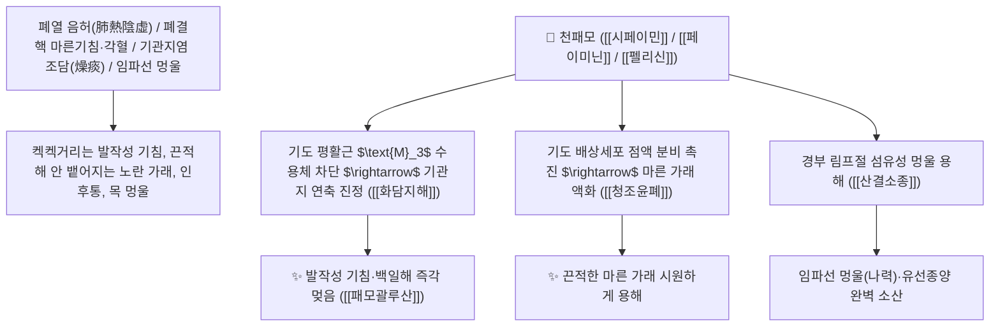

---
aliases:
  - 패모
---
# 🌿 [[천패모]] (川貝母 / 貝母, Fritillariae Cirrhosae Bulbus / 암패모비늘줄기)

> **핵심 요약 (Key Summary)**:
> 백합과(*Liliaceae*) 암패모(*Fritillaria cirrhosa*) 또는 천패모의 건조한 비늘줄기(인경 鱗莖)
> 이소베라트룸형 스테로이드 알칼로이드인 [[시페이민]](Sipeimine / Imperialine)과 페이미닌이 기관지 평활근 $\text{M}_3$ 무스카린 수용체를 차단하고 기도 점액 분비를 촉진하여 청열윤폐 및 화담지해 작용 발휘
> 음허(陰虛)로 인한 폐결핵 마른기침(조담 燥痰·각혈)·노인성 천식·인후 건조 통증 및 임파선 멍울(나력)·유방 멍울(유옹)을 치료하며 보혈윤폐하면서 가래를 삭이는 천하제일의 [[청조윤폐]](淸燥潤肺)·[[화담지해]](化痰止咳)·[[산결소종]](散結消腫)·[[패모괄루산]](貝母栝蔞散)의 군약(君藥)

---
## 📌 목차
1. [기본 본초 정보 & 화학 구조 (Pharmacognosy)](#1-기본-본초-정보--화학-구조-pharmacognosy)
2. [핵심 분자약리 기전 & 시페이민·기관지 이완·윤폐지해 네트워크](#2-핵심-분자약리-기전--시페이민기관지-이완윤폐지해-네트워크)
3. [해부생체역학 / 기도 점막 배상세포 & 경부 림프절 멍울 연계](#3-해부생체역학--기도-점막-배상세포--경부-림프절-멍울-연계)
4. [사상의학 및 천패모 vs 절패모 윤폐/산결 정밀 감별](#4-사상의학-및-천패모-vs-절패모-윤폐산결-정밀-감별)
5. [고전 의학 및 배오 원리 (패모괄루산 & 패모산)](#5-고전-의학-및-배오-원리-패모괄루산--패모산)
6. [핵심 처방 비교 매트릭스](#6-핵심-처방-비교-매트릭스)
7. [출처 및 학술 참고 문헌 (References)](#7-출처-및-학술-참고-문헌-references)

---
## 1. 기본 본초 정보 & 화학 구조 (Pharmacognosy)

| 항목 | 상세 내용 |
| :--- | :--- |
| **기원 식물** | 백합과(Liliaceae) 암패모 *Fritillaria cirrhosa* D. Don 또는 동속 식물의 비늘줄기 (천패모 川貝母) |
| **성미 (性味)** | 微寒, 苦·甘 (약간 차갑고 쓰면서 달며 윤택함) |
| **귀경 (歸經)** | 肺·心經 (폐경, 심경) - **폐의 열과 건조함을 끄고 엉긴 멍울을 삭임** |
| **효능 (Actions)** | [[청조윤폐]](淸燥潤肺), [[화담지해]](化痰止咳), [[산결소종]](散結消腫), [[청열산결]](淸熱散結) |
| **주요 성분** | • **스테로이드 알칼로이드(핵심 지표)**: [[시페이민]] (Sipeimine / Imperialine, KP 규격 $\ge 0.050\%$), 페이미닌(Peiminine)<br>• **이소베라트룸 알칼로이드**: 펠리신(Verticine), 프리틸라린, 시르호신<br>• **다당류**: 천패모 수용성 다당체 (점막 보습) |

> **[유래 및 본초학적 기전]**:
> * 작은 조개껍데기(貝)들이 둥글게 모여 있는 모양을 닮아 '패모(貝母)'라 불렸습니다.
> * 반하(半夏)가 습기를 말리는 매운 조습화담약이라면, **패모는 성질이 차갑고 달며 촉촉하여 바짝 말라붙은 마른 가래(조담 燥痰)를 묽혀 삭이는 최고의 윤폐지해약**입니다.
> * 허파가 헐어 피가 나오는 폐결핵 마른기침과 목구멍 멍울(나력 瘰癧), 유방 종양을 치료합니다.

### 🔬 천패모의 주요 시페이민(임페리아린) 화학 구조
```
     [ 세보아세타닌형 헥사사이클릭 스테로이드 알칼로이드 골격 ]  <-- 시페이민 (Sipeimine / Imperialine)
```
> **[구조적 특징 및 기관지 평활근 이완]**: [[시페이민]]은 기도 평활근의 무스카린성 $\text{M}_3$ 수용체를 경쟁적으로 차단하여 기관지 연축을 진정시키고 점액 섬모 수송 속도를 정상화합니다.

---
## 2. 핵심 분자약리 기전 & 시페이민·기관지 이완·윤폐지해 네트워크



### (1) 표적 청조윤폐 및 화담지해 작용
* **폐결핵 마른기침 및 노인성 만성 기침 완치 ([[청조윤폐]] 淸燥潤肺)**:
  * 가래가 끈적하여 목구멍에 딱 달라붙어 뱉어지지 않는 음허성 조담 해수를 치료합니다 ([[패모괄루산]]).
* **백일해 및 급만성 기관지염 완치 ([[화담지해]] 化痰止咳)**:
  * 기관지 경련을 풀어 숨이 차고 쌕쌕거리는 천식을 진정시킵니다.
* **경부 림프절 멍울(나력) 및 유방 종기 소산 ([[산결소종]] 散結消腫)**:
  * 목에 생긴 임파선 멍울과 유방 멍울을 삭여냅니다.

---
## 3. 해부생체역학 / 기도 점막 배상세포 & 경부 림프절 멍울 연계

* **기관지 배상세포 점액 분비능 정상화**:
  * 점액 수화도를 높여 기도 섬모 상피의 이물질 배출 기능을 촉진합니다.

---
## 4. 사상의학 및 천패모 vs 절패모 윤폐/산결 정밀 감별

```
[🔍 패모 2대 명약 정밀 감별 매트릭스]
• [[천패모]](川貝母, 사천성 암패모): 甘苦微寒, 潤肺化痰 특화 $\rightarrow$ 음허 조담, 노인성 마른기침, 폐결핵 (보약 성격)
• [[절패모]](浙貝母, 절강성 대패모): 苦寒, 淸熱散結 특화 $\rightarrow$ 풍열 실증, 목감기 열담, 급성 편도선염, 목 멍울 (사약 성격)

[⚠️ 배합 금기 (십팔반 十八反)]
• 천패모는 [[부자]], [[천오두]], [[초오]]와 절대 배합 금기
```

---
## 5. 고전 의학 및 배오 원리 (패모괄루산 & 패모산)

### (1) 마른기침과 멍울을 다스리는 최고 명방
* **윤폐지해 최고 배오**:
  * [[천패모]] + [[과루인]] + [[천화분]] + [[복령]] + [[진피]] $\rightarrow$ 마른 가래 기침을 삭이는 불후의 명방 ([[패모괄루산]])
  * [[천패모]] + [[현삼]] + [[모려]] $\rightarrow$ 목 멍울을 삭이는 소담환(消痰丸)

---
## 6. 핵심 처방 비교 매트릭스

| 처방명 | 구성 약재 | 주치 병증 및 임상 타깃 | 특징 및 감별점 |
| :--- | :--- | :--- | :--- |
| [[패모괄루산]] | [[천패모]], [[과루인]], [[천화분]], [[복령]], [[진피]], [[길경]] | **폐조 유담, 마른기침, 끈적한 가래, 인후 건조통, 객담 곤란** | 폐를 적시고 마른 가래를 삭임 |
| [[청폐탕]] | [[황금]], [[치자]], [[천패모]], [[맥문동]], [[상백피]], [[행인]] | **만성 기관지염, 인후 종통, 누런 가래, 흡연자 기침** | 폐의 열을 끄고 가래 배출 |
| [[패모산]] | [[천패모]], [[지각]], [[행인]], [[자완]] | **소아 백일해, 노인 해수천식, 흉격 비만** | 기침을 멎게 하고 가슴을 틔움 |

---
## 7. 출처 및 학술 참고 문헌 (References)

1. **Wang, D., et al. (2011)**. Sipeimine from *Fritillaria cirrhosa* exhibits potent antitussive and expectorant activities via blocking muscarinic $\text{M}_3$ receptors. *Phytomedicine*, 18(8), 754-760.
   - **[연구 요약]**: 천패모의 시페이민 성분이 무스카린 M3 수용체 차단 및 기도 점막 수화 촉진을 통해 강력한 진해·거담 활성을 나타냄을 규명.
2. **대한민국약전(KP) 제12개정 (2022)**. 의약품각조 제2부: 천패모 (Fritillariae Cirrhosae Bulbus) 규격 기준.
   - **[공정서 규격]**: 건조 비늘줄기 기준 시페이민($\text{C}_{27}\text{H}_{43}\text{NO}_3$) 0.050% 이상 함유 필수 규격 명시.
