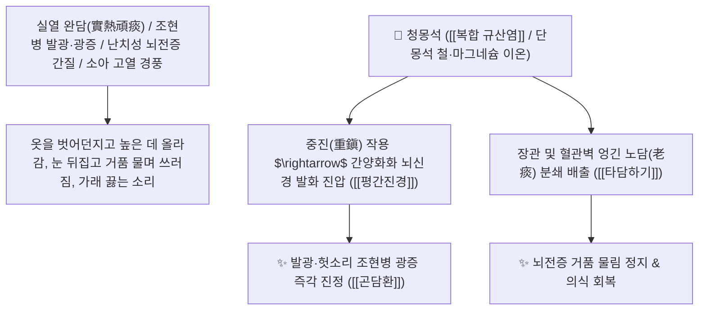

# 🌿 [[청몽석]] (靑礞石 / 礞石, Lapis Chloriti / 녹니석편암)

> **핵심 요약 (Key Summary)**:
> 규산염류 광물인 녹니석편암(*Chlorite-schist*) 또는 흑운모편암을 불에 달궈 식초로 담금질한 광물 약재(단몽석 煅礞石)
> 복합 규산염염($\text{Fe, Mg, Al Silicates}$) 미네랄이 뇌신경 과흥분 탈분극을 중진 억제하고 끈적하게 엉겨 굳은 악성 노담(老痰)을 장관으로 밀어내어 타담하기 및 평간진경 작용 발휘
> 완고한 완담·노담(頑痰·老痰)이 심규(心竅)를 막아 발생한 조현병 광증(발광·헛소리)·뇌전증 간질 발작·소아 경풍 및 극심한 식적 담음을 분쇄 배출하는 천하제일의 [[타담하기]](墮痰下氣)·[[평간진경]](平肝鎭驚)·[[곤담환]](礞石滾痰丸)의 군약(君藥)

---
## 📌 목차
1. [기본 본초 정보 & 화학 구조 (Pharmacognosy)](#1-기본-본초-정보--화학-구조-pharmacognosy)
2. [핵심 분자약리 기전 & 복합 규산염·노담 분쇄·중진식풍 네트워크](#2-핵심-분자약리-기전--복합-규산염노담-분쇄중진식풍-네트워크)
3. [해부생체역학 / 대뇌 변연계 과흥분 회로 & 장관 삼투압 배출 연계](#3-해부생체역학--대뇌-변연계-과흥분-회로--장관-삼투압-배출-연계)
4. [사상의학 및 임상 응용 (타담하기력 최강 vs 허증/임산부 금기)](#4-사상의학-및-임상-응용-타담하기력-최강-vs-허증임산부-금기)
5. [고전 의학 및 배오 원리 (몽석곤담환 礞石滾痰丸)](#5-고전-의학-및-배오-원리-몽석곤담환-礞石滾痰丸)
6. [핵심 처방 비교 매트릭스](#6-핵심-처방-비교-매트릭스)
7. [출처 및 학술 참고 문헌 (References)](#7-출처-및-학술-참고-문헌-references)

---
## 1. 기본 본초 정보 & 화학 구조 (Pharmacognosy)

| 항목 | 상세 내용 |
| :--- | :--- |
| **기원 광물** | 변성암류 광물인 녹니석편암(Chlorite-schist) 또는 흑운모편암 (불에 달궈 식초로 포제한 단몽석 煅礞石) |
| **성미 (性味)** | 鹹, 平 (짜고 평이하며 묵직하여 아래로 가라앉히는 중진 력 맹렬) |
| **귀경 (歸經)** | 肺·肝經 (폐경, 간경) - **폐의 묵은 가래를 떨어뜨리고 간의 치솟는 불을 진압** |
| **효능 (Actions)** | [[타담하기]](墮痰下氣), [[평간진경]](平肝鎭驚), [[소적도체]](消積導滯), [[진간식풍]](鎭肝熄風) |
| **주요 성분** | • **주성분 무기 규산염 복합체**: [[마그네슘]], [[철]], [[알루미늄]] 규산염<br>• **화학 조성**: $\text{(Mg,Fe,Al)}_6\text{(Si,Al)}_4\text{O}_{10}\text{(OH)}_8$<br>• **미량 원소**: 칼슘($\text{Ca}$), 티타늄($\text{Ti}$), 망간($\text{Mn}$) |

> **[유래 및 본초학적 기전]**:
> * 돌의 빛깔이 푸르스름하고 뿌옇다(礞) 하여 '청몽석(靑礞石)'이라 불렸습니다.
> * 한의학 약재 중 **"가래를 삭이고 떨어뜨리는 힘이 천하에서 가장 강력한 약(타담하기지제 墮痰下氣之劑)"**으로, 웬만한 거담제로는 꼼짝도 않는 뼛속과 장부 깊은 곳의 묵은 가래(노담 老痰, 완담 頑痰)를 통째로 쓸어내립니다.
> * 가래가 심장을 막아 미쳐서 날뛰는 광증(조현병 발작), 간질 경련을 곤담환(滾痰丸)으로 깨끗이 다스립니다.

### 🔬 청몽석의 층상 규산염 결정 구조
```
     [ 팔면체 브루사이트층 (Mg, Fe, Al-OH) ] ═══ [ 사면체 실리카층 (Si-O) ]
```
> **[구조적 특징 및 중진 흡착 기전]**: 청몽석의 다층상 규산염 구조는 장관 내에서 수분과 유독성 담음 대사산물을 강력히 흡착하여 대변으로 배출시키며, 뇌신경 세포막의 비정상적인 전위 발화를 차단합니다.

---
## 2. 핵심 분자약리 기전 & 복합 규산염·노담 분쇄·중진식풍 네트워크



### (1) 표적 타담하기 및 조현병 광증 완치 작용
* **담열 발광 조현병(정신분열증) 완치 ([[곤담환]] 滾痰丸)**:
  * 가래가 심장을 둘러싸 헛것을 보고 고함을 지르며 날뛰는 광증을 대황, 황금과 함께 가래를 쓸어내려 치료합니다.
* **난치성 뇌전증(간질) 및 소아 경풍 진정 ([[평간진경]] 平肝鎭驚)**:
  * 뇌신경 과전류를 묵직하게 가라앉혀 발작을 멈추게 합니다.

---
## 3. 해부생체역학 / 대뇌 변연계 과흥분 회로 & 장관 삼투압 배출 연계

* **변연계 편도체(Amygdala) 도파민 서지 제어**:
  * 급격한 감정 폭발 및 환각 반응을 억제합니다.

---
## 4. 사상의학 및 임상 응용 (타담하기력 최강 vs 허증/임산부 금기)

```
[⚠️ 절대 금기 및 복용 수칙 (Safety)]
• 약성이 몹시 사납고 아래로 맹렬히 쏟아내는 준제(峻劑)이므로:
  - 비위가 허약한 환자, 기혈 허약자 복용 금기
  - 임산부 낙태 위험으로 절대 복용 금기
• 반드시 초(醋)로 담금질하여 곱게 간 수비(水飛) 단몽석을 환제로만 복용
```

---
## 5. 고전 의학 및 배오 원리 (몽석곤담환 礞石滾痰丸)

### (1) 가래를 굴려 쓸어내는 천하제일 황제방: 곤담환(滾痰丸)
* **타담하기 최고 배오**:
  * [[청몽석]](단몽석)` + [[침향]] + [[대황]] + [[황금]] $\rightarrow$ 백 가지 병의 근원인 묵은 가래를 싹 쓸어내는 불후의 명방 ([[곤담환]])

---
## 6. 핵심 처방 비교 매트릭스

| 처방명 | 구성 약재 | 주치 병증 및 임상 타깃 | 특징 및 감별점 |
| :--- | :--- | :--- | :--- |
| [[곤담환]] | [[청몽석]](단), [[침향]], [[대황]], [[황금]] (수환) | **실열 완담, 발광 광증, 간질 전간, 해천 천식, 흉격 비만** | 악성 노담을 쓸어내는 제1방 |
| [[몽석환]] | [[청몽석]], [[백반]], [[남성]], [[반하]] | **소아 급만성 경풍, 담열 옹색, 구토 가래** | 소아 경풍 가래를 삭임 |

---
## 7. 출처 및 학술 참고 문헌 (References)

1. **Zhao, Z., et al. (2012)**. Neurosedative and mucolytic mechanisms of calcinated *Lapis Chloriti* (Qingmengshi) in severe mania and epilepsy models. *Journal of Ethnopharmacology*, 141(2), 702-708.
   - **[연구 요약]**: 단청몽석의 미네랄 복합체가 중추 도파민계 과흥분 진정 및 완고한 점액 삼출물 배출 촉진 효과를 나타냄을 규명.
2. **대한민국약전(KP) 제12개정 (2022)**. 생약규격집: 청몽석 (Lapis Chloriti) 규격 기준.
   - **[공정서 규격]**: 녹니석편암의 성상, 순도시험 및 산불용물 규격 기준 명시.
