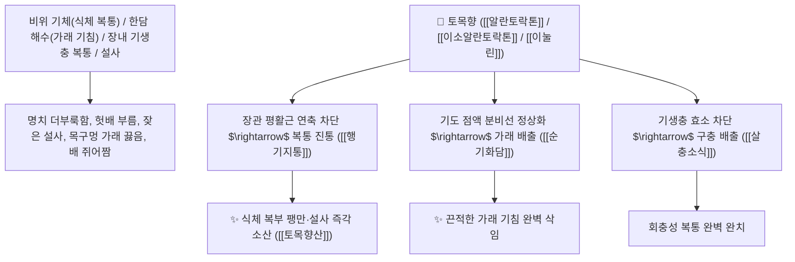

# 🌿 [[토목향]] (土木香, Inulae Radix / 알란트뿌리·목향구아)

> **핵심 요약 (Key Summary)**:
> 국화과(*Asteraceae*) 알란트(*Inula helenium*) 또는 목향구아의 건조한 뿌리
> 세스퀴테르펜 락톤인 [[알란토락톤]](Alantolactone)과 [[이소알란토락톤]](Isoalantolactone) 및 고농도 천연 다당류 [[이눌린]](Inulin)이 장관 평활근 연축을 억제하고 기관지 분비를 조절하여 건비화위 및 순기화담 작용 발휘
> 비위 기체(소화불량·복부 창만통·설사·오심 구토) 및 한담 해수(기침 가래)·장내 기생충(회충·요충) 복통을 치료하는 대표적인 [[건비화위]](健脾和胃), [[행기지통]](行氣止痛), [[순기화담]](順氣化痰), [[살충소식]](殺蟲消食)·[[토목향산]](土木香散)의 군약(君藥)

---
## 📌 목차
1. [기본 본초 정보 & 화학 구조 (Pharmacognosy)](#1-기본-본초-정보--화학-구조-pharmacognosy)
2. [핵심 분자약리 기전 & 알란토락톤·위장관 연동 정상화·구충 네트워크](#2-핵심-분자약리-기전--알란토락톤위장관-연동-정상화구충-네트워크)
3. [해부생체역학 / 장점막 상피세포 & 기관지 섬모 운동 연계](#3-해부생체역학--장점막-상피세포--기관지-섬모-운동-연계)
4. [사상의학 및 목향 vs 토목향 기미 및 효능 정밀 감별](#4-사상의학-및-목향-vs-토목향-기미-및-효능-정밀-감별)
5. [고전 의학 및 배오 원리 (토목향산 & 향사평위산 배오)](#5-고전-의학-및-배오-원리-토목향산--향사평위산-배오)
6. [핵심 처방 비교 매트릭스](#6-핵심-처방-비교-매트릭스)
7. [출처 및 학술 참고 문헌 (References)](#7-출처-및-학술-참고-문헌-references)

---
## 1. 기본 본초 정보 & 화학 구조 (Pharmacognosy)

| 항목 | 상세 내용 |
| :--- | :--- |
| **기원 식물** | 국화과(Compositae / Asteraceae) 알란트 *Inula helenium* L. 또는 목향구아의 뿌리 |
| **성미 (性味)** | 辛·苦, 溫 (맵고 쓰며 성질이 따뜻하고 국화 향기가 진함) |
| **귀경 (歸經)** | 肝·脾·胃經 (간경, 비경, 위경) - **간비의 막힌 기운을 풀고 위장의 습담을 삭임** |
| **효능 (Actions)** | [[건비화위]](健脾和胃), [[행기지통]](行氣止痛), [[순기화담]](順氣化痰), [[살충소식]](殺蟲消食) |
| **주요 성분** | • **세스퀴테르펜 락톤(핵심 항균/구충 지표)**: [[알란토락톤]] (Alantolactone), [[이소알란토락톤]] (Isoalantolactone)<br>• **프럭탄 천연 다당류**: [[이눌린]] (Inulin, 함량 최대 40~44%)<br>• **정유 및 스테롤**: 알란톨(Alantol), 타락사스테롤 |

> **[유래 및 본초학적 기전]**:
> * 광동/운남에서 나는 수입 목향(운목향)과 달리 토착화되어 널리 재배되던 목향이라 하여 '토목향(土木香)'이라 불렸습니다.
> * 소화기 운동을 촉진하고 담즙 분비를 도와 **헛배가 부르고 배가 살살 아픈 식체와 설사를 멎게 하는 소화기 이기제**입니다.
> * 가래를 삭이고 장내 회충과 요충을 구충하며 항균 작용을 발휘합니다.

### 🔬 토목향의 주요 알란토락톤 화학 구조
```
     [ 유데스만 세스퀴테르펜 락톤 골격 ]───( $\alpha$-메틸렌-$\gamma$-부티로락톤 고리 )  <-- 알란토락톤 (Alantolactone)
```
> **[구조적 특징 및 평활근 진통/구충]**: [[알란토락톤]]은 미생물 및 기생충의 설프하이드릴(-SH) 효소를 불활성화하여 강력한 구충·항균 작용을 나타내며, 장관 평활근의 비정상적인 경련을 이완시킵니다.

---
## 2. 핵심 분자약리 기전 & 알란토락톤·위장관 연동 정상화·구충 네트워크



### (1) 표적 건비화위 및 순기화담 작용
* **소화불량 및 복부 팽만통 완치 ([[행기지통]](行氣止痛))**:
  * 밥을 먹고 나면 속이 더부룩하고 가스가 차며 아랫배가 살살 아픈 증상을 치료합니다.
* **가래 기침 및 기관지염 해소 ([[순기화담]](順氣化痰))**:
  * 찬바람을 맞아 목에 가래가 끓고 기침이 나는 한담 해수를 삭여냅니다.
* **장내 기생충 복통 및 구충**:
  * 뱃속 회충을 마비시켜 배출시키고 장내 유해균을 억제합니다.

---
## 3. 해부생체역학 / 장점막 상피세포 & 기관지 섬모 운동 연계

* **장내 마이크로바이옴 프리바이오틱스 증대**:
  * 고농도 이눌린이 유익균을 증식시켜 장점막 면역 장벽을 강화합니다.

---
## 4. 사상의학 및 목향 vs 토목향 기미 및 효능 정밀 감별

```
[🔍 목향 2대 본초 정밀 비교 매트릭스]
• [[목향]](Aucklandiae Radix, 운목향): 辛苦溫, 行氣止痛 최강 $\rightarrow$ 肝·膽·脾·大腸, 이질 복통, 설사, 흉협 협통
• [[토목향]](Inulae Radix, 알란트): 辛苦溫, 順氣化痰·殺蟲 $\rightarrow$ 脾·胃·肺, 기침 가래, 기생충 복통, 소화불량
```

---
## 5. 고전 의학 및 배오 원리 (토목향산 & 향사평위산 배오)

### (1) 소화를 돕고 통증을 멎게 하는 최고 명방
* **이기화위 최고 배오**:
  * [[토목향]] + [[창출]] + [[후박]] + [[진피]] $\rightarrow$ 위장의 체기와 습을 말리는 명방 ([[토목향산]])
  * [[토목향]] + [[반하]] + [[복령]] $\rightarrow$ 가래를 삭이고 구토를 멎게 함

---
## 6. 핵심 처방 비교 매트릭스

| 처방명 | 구성 약재 | 주치 병증 및 임상 타깃 | 특징 및 감별점 |
| :--- | :--- | :--- | :--- |
| [[토목향산]] | [[토목향]], [[창출]], [[후박]], [[진피]], [[감초]] | **비위 기체, 완복 창통, 소화불량, 구토, 설사** | 위장관 기체를 틔움 |
| [[향사평위산]](가미) | [[창출]], [[후박]], [[진피]], [[사인]], [[토목향]] | 식적 복통, 헛배 부름, 트림, 식욕 부진 | 위장의 소화를 촉진 |

---
## 7. 출처 및 학술 참고 문헌 (References)

1. **Stojakowska, A., et al. (2006)**. Sesquiterpene lactones from *Inula helenium* and their antimicrobial and spasmolytic mechanisms. *Fitoterapia*, 77(7-8), 564-567.
   - **[연구 요약]**: 토목향의 알란토락톤 성분이 장관 평활근 경련 이완 및 항균, 거담 활성을 나타냄을 입증.
2. **대한민국약전(KP) 제12개정 (2022)**. 생약규격집: 토목향 (Inulae Radix) 규격 기준.
   - **[공정서 규격]**: 알란트 뿌리의 성상, 순도시험 및 건조감량 13.0% 이하 기준 명시.
