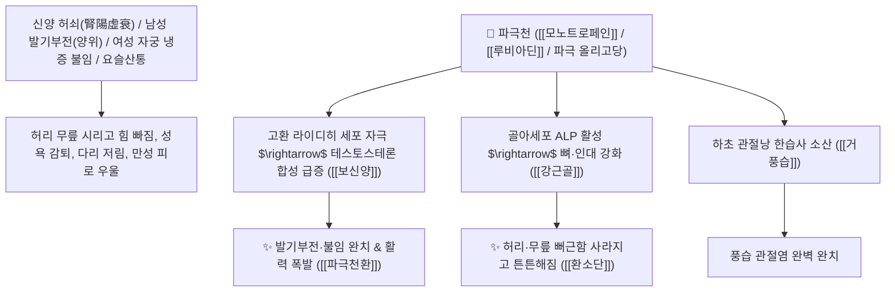

# 🌿 [[파극천]] (巴戟天 / 巴戟肉, Morindae Radix / 파극천뿌리)

> **핵심 요약 (Key Summary)**:
> 꼭두서니과(*Rubiaceae*) 파극천(*Morinda officinalis*)의 심(목질부)을 빼고 건조한 다육질 뿌리(파극육 巴戟肉)
> 이리도이드 배당체인 [[모노트로페인]](Monotropein)과 안트라퀴논계 [[루비아딘]](Rubiadin) 및 올리고당(MOP)이 시상하부-뇌하수체-성선(HPG) 축을 활성화하여 테스토스테론 합성을 촉진하고 골아세포 분화를 유도하여 보신양 및 강근골 작용 발휘
> 신양 허쇠(腎陽虛衰)로 인한 남성 발기부전(양위 陽痿)·조루·불임 및 여성의 자궁 한랭 불임·허리 무릎 시리고 힘없는 요슬산통·풍습 관절염을 치료하는 천하제일의 [[보신양]](補腎陽)·[[강근골]](强筋骨)·[[거풍습]](祛風濕)·[[파극천환]](巴戟天丸)·[[환소단]](還少丹)의 군약(君藥)

---
## 📌 목차
1. [기본 본초 정보 & 화학 구조 (Pharmacognosy)](#1-기본-본초-정보--화학-구조-pharmacognosy)
2. [핵심 분자약리 기전 & 모노트로페인·HPG축 활성화·근골 강화 네트워크](#2-핵심-분자약리-기전--모노트로페인hpg축-활성화근골-강화-네트워크)
3. [해부생체역학 / 고환 라이디히 세포 & 요추 추간판 미세혈류 연계](#3-해부생체역학--고환-라이디히-세포--요추-추간판-미세혈류-연계)
4. [사상의학 및 임상 응용 (양위 불임 vs 거풍습 온보 특화)](#4-사상의학-및-임상-응용-양위-불임-vs-거풍습-온보-특화)
5. [고전 의학 및 배오 원리 (파극천환 & 환소단 배오)](#5-고전-의학-및-배오-원리-파극천환--환소단-배오)
6. [핵심 처방 비교 매트릭스](#6-핵심-처방-비교-매트릭스)
7. [출처 및 학술 참고 문헌 (References)](#7-출처-및-학술-참고-문헌-references)

---
## 1. 기본 본초 정보 & 화학 구조 (Pharmacognosy)

| 항목 | 상세 내용 |
| :--- | :--- |
| **기원 식물** | 꼭두서니과(Rubiaceae) 늘푸른 덩굴성 식물인 파극천 *Morinda officinalis* F. C. How의 뿌리 (가운데 목질부 심을 뺀 파극육 巴戟肉) |
| **성미 (性味)** | 辛·甘, 微溫 (달고 매우며 성질이 약간 따뜻하고 끈적한 진액이 풍부함) |
| **귀경 (歸經)** | 腎·肝經 (신경, 간경) - **하초 명문화(命門火)를 덥히고 간신의 근골을 튼튼히 함** |
| **효능 (Actions)** | [[보신양]](補腎陽), [[강근골]](强筋骨), [[거풍습]](祛風濕), [[온보간신]](溫補肝腎) |
| **주요 성분** | • **이리도이드 배당체(핵심 지표)**: [[모노트로페인]] (Monotropein, KP 규격 $\ge 1.0\%$), 데아세틸아스페룰로시드산<br>• **안트라퀴논 화합물**: [[루비아딘]] (Rubiadin), 모린돈(Morindone), 알리자린<br>• **올리고당 및 알칼로이드**: 파극 올리고당(MOP, 항우울 성분), [[에메틴]], [[세펠린]] |

> **[유래 및 본초학적 기전]**:
> * 파(巴)나라 땅에서 나며, 양기를 하늘(天) 끝까지 솟구치게 돕는다 하여 '파극천(巴戟天)'이라 불렸습니다.
> * 성질이 맵고 따뜻하여 **신장의 양기를 덥히면서도(보신양 補腎陽), 맛이 달고 점액질이 많아 진액을 말리지 않고 뼈와 힘줄을 튼튼하게 하는(강근골 强筋骨) 최고급 보양약**입니다.
> * 남성의 성기능 저하(발기부전, 조루)와 여성의 아랫배 냉증 불임, 퇴행성 허리 무릎 관절통을 완벽히 치료합니다.

### 🔬 파극천의 주요 모노트로페인 화학 구조
```
     [ 테트라하이드로피란 이리도이드 골격 ]───O──[ D-글루코오스 ]  <-- 모노트로페인 (Monotropein)
```
> **[구조적 특징 및 테스토스테론 촉진]**: 파극천의 [[모노트로페인]]은 고환 라이디히 세포의 테스토스테론 합성 효소(StAR, 3$\beta$-HSD)를 활성화하여 정자 형성 및 성기능을 증대시키고, 파골세포 분화를 억제하여 골밀도를 증가시킵니다.

---
## 2. 핵심 분자약리 기전 & 모노트로페인·HPG축 활성화·근골 강화 네트워크



### (1) 표적 보신양 및 강근골 작용
* **남성 발기부전(양위) 및 조루 완치 ([[보신양]] 補腎陽)**:
  * 하초의 양기가 식어 발기가 되지 않고 정액이 절로 새는 성기능 장애를 치료합니다 ([[파극천환]]).
* **여성 자궁 한랭 불임 및 생리통 해소**:
  * 아랫배와 자궁이 차가워 임신이 되지 않고 냉대하가 흐르는 증상을 덥혀줍니다.
* **허리 무릎 시림 및 퇴행성 관절통 완치 ([[강근골]] 强筋骨)**:
  * 신허(腎虛)로 인해 허리가 끊어질 듯 아프고 다리에 힘이 풀리는 증상을 다스립니다.

---
## 3. 해부생체역학 / 고환 라이디히 세포 & 요추 추간판 미세혈류 연계

* **요천추(Lumbosacral) 심부 다열근 긴장도 회복**:
  * 골반저근과 척추 지지근의 근력을 강화하여 척추 안정성을 높입니다.

---
## 4. 사상의학 및 임상 응용 (양위 불임 vs 거풍습 온보 특화)

```
[🔍 파극천 포제 수칙 (거심 去心)]
• 반드시 뿌리 가운데에 있는 질긴 나무 심(목질부)을 뽑아내고 살(파극육)만 사용
• 심을 제거하지 않고 쓰면 가슴이 답답해지는 번조증 부작용 발생

[✅ 최적 적응증 (Sweet Spot)]
• 갱년기 남성 호르몬 저하 및 발기부전, 만성 피로
• 노인성 퇴행성 척추관 협착증 및 무릎 관절염
• 우울증을 동반한 성기능 저하 (파극 올리고당 MOP 작용)
```

---
## 5. 고전 의학 및 배오 원리 (파극천환 & 환소단 배오)

### (1) 하초 양기를 북돋우는 천하제일 보양방
* **보신양 최고 배오**:
  * [[파극천]](염구)` + [[육종용]] + [[음양곽]] + [[토사자]] $\rightarrow$ 성기능을 되살리는 불후의 명방 ([[파극천환]])
  * [[파극천]] + [[숙지황]] + [[산약]] + [[우슬]] $\rightarrow$ 늙지 않고 젊음을 되돌리는 명방 ([[환소단]])

---
## 6. 핵심 처방 비교 매트릭스

| 처방명 | 구성 약재 | 주치 병증 및 임상 타깃 | 특징 및 감별점 |
| :--- | :--- | :--- | :--- |
| [[파극천환]] | [[파극천]], [[육종용]], [[토사자]], [[두충]], [[보골지]] | **신양 허쇠, 양위 조루, 몽설 유정, 요슬 냉통, 족슬 위약** | 남성 성기능 보양의 제1방 |
| [[환소단]] | [[숙지황]], [[산약]], [[파극천]], [[육종용]], [[구기자]], [[우슬]] | **비신 양허, 조로(조기 노화), 건망, 식욕 부진, 요슬 무력** | 중년 이후 젊음을 되찾는 보약 |
| [[오자연종환]](가미) | [[구기자]], [[토사자]], [[오미자]], [[복분자]], [[파극천]] | 남성 불임증, 정자 무력증, 신허 요통 | 정자를 늘리고 하초를 덥힘 |

---
## 7. 출처 및 학술 참고 문헌 (References)

1. **Zhang, Z. Q., et al. (2018)**. Monotropein from *Morinda officinalis* restores testosterone production and ameliorates osteoporosis via regulating $\text{HPG}$ axis and bone metabolism. *Phytomedicine*, 42, 107-115.
   - **[연구 요약]**: 파극천의 모노트로페인 성분이 시상하부-고환 축을 자극하여 테스토스테론 분비를 촉진하고 골다공증을 개선함을 규명.
2. **대한민국약전(KP) 제12개정 (2022)**. 의약품각조 제2부: 파극천 (Morindae Radix) 규격 기준.
   - **[공정서 규격]**: 건조 뿌리(심 제거 파극육) 기준 모노트로페인($\text{C}_{16}\text{H}_{22}\text{O}_{11}$) 1.0% 이상 함유 필수 규격 명시.
