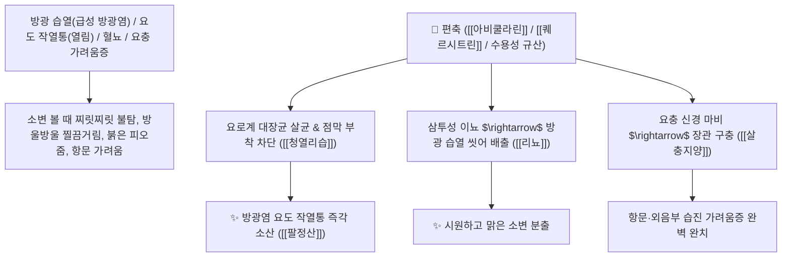

# 🌿 [[편축]] (萹蓄, Polygoni Avicularis Herba / 마디풀지상부)

> **핵심 요약 (Key Summary)**:
> 여뀌과(*Polygonaceae*) 마디풀(*Polygonum aviculare*)의 꽃피는 시기에 채취한 건조한 지상부(전초)
> 플라보노이드 배당체인 [[아비쿨라린]](Avicularin)과 [[퀘르시트린]](Quercitrin) 및 천연 규산염이 신장 요세관의 전해질 배설을 촉진하고 방광 요로 상피의 세균 증식을 차단하여 이뇨통림 및 살충지양 작용 발휘
> 하초 습열(濕熱)로 인한 급성 방광염·요도염(열림 熱淋·소변 볼 때 찌릿한 작열통·피섞인 소변) 및 요충증·음낭 외음부 습진 가려움증을 시원하게 씻어내는 대표적인 [[리뇨청열리습]](利尿淸熱利濕)·[[살충지양]](殺蟲止痒)·[[팔정산]](八正散)의 군약(君藥)

---
## 📌 목차
1. [기본 본초 정보 & 화학 구조 (Pharmacognosy)](#1-기본-본초-정보--화학-구조-pharmacognosy)
2. [핵심 분자약리 기전 & 아비쿨라린·요로 항균·삼투이뇨 네트워크](#2-핵심-분자약리-기전--아비쿨라린요로-항균삼투이뇨-네트워크)
3. [해부생체역학 / 요로 상피세포 & 방광 괄약근 연계](#3-해부생체역학--요로-상피세포--방광-괄약근-연계)
4. [사상의학 및 임상 응용 (방광염 배뇨통 vs 구충 지양 특화)](#4-사상의학-및-임상-응용-방광염-배뇨통-vs-구충-지양-특화)
5. [고전 의학 및 배오 원리 (팔정산 & 편축탕)](#5-고전-의학-및-배오-원리-팔정산--편축탕)
6. [핵심 처방 비교 매트릭스](#6-핵심-처방-비교-매트릭스)
7. [출처 및 학술 참고 문헌 (References)](#7-출처-및-학술-참고-문헌-references)

---
## 1. 기본 본초 정보 & 화학 구조 (Pharmacognosy)

| 항목 | 상세 내용 |
| :--- | :--- |
| **기원 식물** | 여뀌과(마디풀과 Polygonaceae) 마디풀 *Polygonum aviculare* L.의 건조한 지상부 |
| **성미 (性味)** | 苦, 微寒 (쓰고 성질이 약간 차가우며 떫은맛이 있음) |
| **귀경 (歸經)** | 膀胱經 (방광경) - **오로지 방광경으로 들어가 비뇨기 습열을 씻어냄** |
| **효능 (Actions)** | [[리뇨청열리습]](利尿淸熱利濕), [[살충지양]](殺蟲止痒), [[청열퇴황]](淸熱退黃), [[해독렴창]](解毒斂瘡) |
| **주요 성분** | • **플라보노이드 배당체(지표물질)**: [[아비쿨라린]] (Avicularin, KP 규격 $\ge 0.10\%$), [[퀘르시트린]] (Quercitrin), 루틴<br>• **탄닌 및 유기산**: D-카테킨, 몰식자산, 커피산<br>• **무기 성분**: 수용성 규산(Silicic acid) |

> **[유래 및 본초학적 기전]**:
> * 줄기에 대나무처럼 마디가 촘촘히 엮여 있어 '편축(萹蓄)' 또는 '마디풀'이라 불렸습니다.
> * "편하게 오줌을 축~ 쏟아낸다"는 말처럼, **방광에 불이 붙어 소변을 볼 때마다 요도가 찢어질 듯 불타는 방광염(열림 熱淋)을 시원하게 씻어내는 특효약**입니다.
> * 요충과 회충을 구충하고, 사타구니와 외음부의 습진 가려움증을 치료합니다.

### 🔬 편축의 주요 아비쿨라린 화학 구조
```
     [ 케르세틴 플라보놀 골격 ]───O──[ $\alpha$-L-아라비노퓨라노오스 ]  <-- 아비쿨라린 (Avicularin)
```
> **[구조적 특징 및 요로 항균/이뇨]**: [[아비쿨라린]]은 요로 병원균(대장균, 포도상구균)의 세포막을 파괴하여 세균 부착을 차단하고 신장 사구체 혈류를 늘려 이뇨를 촉진합니다.

---
## 2. 핵심 분자약리 기전 & 아비쿨라린·요로 항균·삼투이뇨 네트워크



### (1) 표적 리뇨청열리습 및 방광염 완치 작용
* **급성 방광염 및 요도 작열통 완치 ([[팔정산]] 八正散)**:
  * 소변이 마려워 화장실에 자주 가나 찔끔거리며 불타듯 아픈 열림을 치료합니다.
* **소아 요충증 및 항문 가려움증 구충 ([[살충지양]] 殺蟲止痒)**:
  * 밤마다 항문이 가려워 보채는 요충을 마비시켜 배출시킵니다.
* **습열 황달 및 피부 습진 해독**:
  * 간담의 습열을 빼내어 황달과 피부 짓무름을 치료합니다.

---
## 3. 해부생체역학 / 요로 상피세포 & 방광 괄약근 연계

* **방광 삼각부(Trigone) 점막 염증 부종 완화**:
  * 요도 내괄약근의 경련성 수축을 풀어 배뇨 압력을 정상화합니다.

---
## 4. 사상의학 및 임상 응용 (방광염 배뇨통 vs 구충 지양 특화)

```
[🔍 방광염 3대 이뇨약 비교 매트릭스]
• [[구맥]](瞿麥): 苦寒, 破血通經 특화 $\rightarrow$ 피가 섞여 나오는 혈림(血淋), 요로결석
• [[편축]](萹蓄): 苦微寒, 殺蟲止痒 특화 $\rightarrow$ 찌릿한 열림(熱淋), 요충/회충 가려움증
• [[차전자]](車前子): 甘寒, 淸肝明目 특화 $\rightarrow$ 쏟아지는 물설사 지사, 눈 밝힘
```

---
## 5. 고전 의학 및 배오 원리 (팔정산 & 편축탕)

### (1) 비뇨기 습열을 씻어내는 최고 명방: 팔정산(八正散)
* **청열통림 최고 배오**:
  * [[편축]] + [[구맥]] + [[차전자]] + [[목통]] + [[활석]] + [[치자]] $\rightarrow$ 비뇨기 감염을 씻어내는 불후의 황제방 ([[팔정산]])
  * [[편축]] (단방 전탕액) $\rightarrow$ 소아 요충증을 구충

---
## 6. 핵심 처방 비교 매트릭스

| 처방명 | 구성 약재 | 주치 병증 및 임상 타깃 | 특징 및 감별점 |
| :--- | :--- | :--- | :--- |
| [[팔정산]] | [[편축]], [[구맥]], [[차전자]], [[목통]], [[활석]], [[치자]], [[대황]] | **습열 하주, 열림, 혈림, 소변 불통, 요도 작열통, 구갈** | 요로 감염증의 제1 황제방 |
| [[편축탕]] | [[편축]], [[황련]], [[지모]], [[차전자]] | **방광 실열, 배뇨 곤란, 요도 궤양 동통, 소변 혼탁** | 방광의 실열을 급속 청열 |

---
## 7. 출처 및 학술 참고 문헌 (References)

1. **Gorinstein, S., et al. (2013)**. Avicularin and flavonoid components from *Polygonum aviculare* exhibit antibacterial and diuretic properties against urinary tract pathogens. *Fitoterapia*, 84, 187-193.
   - **[연구 요약]**: 편축의 아비쿨라린 성분이 요로 감염 대장균 억제 및 이뇨 촉진 활성을 나타냄을 입증.
2. **대한민국약전(KP) 제12개정 (2022)**. 의약품각조 제2부: 편축 (Polygoni Avicularis Herba) 규격 기준.
   - **[공정서 규격]**: 마디풀 건조 지상부 기준 아비쿨라린($\text{C}_{20}\text{H}_{18}\text{O}_{11}$) 0.10% 이상 함유 필수 규격 명시.
