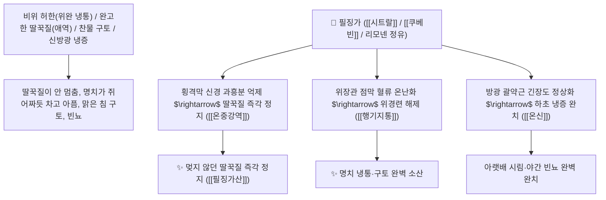

# 🌿 [[필징가]] (蓽澄茄, Litseae / Piperis Cubebae Fructus / 산계초열매·쿠베바)

> **핵심 요약 (Key Summary)**:
> 녹나무과(*Lauraceae*) 산계초(*Litsea cubeba*) 또는 후추과 필징가(*Piper cubeba*)의 건조한 성숙 열매
> 모노테르펜 알데히드인 [[시트랄]](Citral)과 리그난 화합물 [[쿠베빈]](Cubebin) 및 리모넨 정유가 위장관 미주신경 반사를 안정화시키고 평활근 연축을 해제하여 온중산한 및 행기지통 작용 발휘
> 비위 한랭(脾胃寒冷)으로 인한 쥐어짜는 위완 냉통·구토·딸꾹질(애역 呃逆) 및 신·방광 냉증(하복부 냉통·소변 빈삭)을 치료하는 대표적인 [[온중산한]](溫中散寒)·[[행기지통]](行氣止痛)·[[건비소식]](健脾消食)·[[온신조양]](溫腎助陽)·[[필징가산]](蓽澄茄散)의 군약(君藥)

---
## 📌 목차
1. [기본 본초 정보 & 화학 구조 (Pharmacognosy)](#1-기본-본초-정보--화학-구조-pharmacognosy)
2. [핵심 분자약리 기전 & 시트랄·쿠베빈·위장관 온난화 네트워크](#2-핵심-분자약리-기전--시트랄쿠베빈위장관-온난화-네트워크)
3. [해부생체역학 / 횡격막 신경총 & 방광 배뇨근 연계](#3-해부생체역학--횡격막-신경총--방광-배뇨근-연계)
4. [사상의학 및 필발 vs 필징가 방향성 온중 정밀 감별](#4-사상의학-및-필발-vs-필징가-방향성-온중-정밀-감별)
5. [고전 의학 및 배오 원리 (필징가산 & 정향 배오)](#5-고전-의학-및-배오-원리-필징가산--정향-배오)
6. [핵심 처방 비교 매트릭스](#6-핵심-처방-비교-매트릭스)
7. [출처 및 학술 참고 문헌 (References)](#7-출처-및-학술-참고-문헌-references)

---
## 1. 기본 본초 정보 & 화학 구조 (Pharmacognosy)

| 항목 | 상세 내용 |
| :--- | :--- |
| **기원 식물** | 녹나무과(Lauraceae) 산계초 *Litsea cubeba* (Lour.) Pers. 또는 후추과 필징가 *Piper cubeba* L.의 익은 열매 |
| **성미 (性味)** | 辛, 溫 (맵고 톡 쏘는 레몬 향기가 강렬하며 성질이 따뜻함) |
| **귀경 (歸經)** | 脾·胃·腎·膀胱經 (비경, 위경, 신경, 방광경) - **중초를 덥히고 하초 신방광의 냉기를 쫓음** |
| **효능 (Actions)** | [[온중산한]](溫中散寒), [[행기지통]](行氣止痛), [[건비소식]](健脾消食), [[온신조양]](溫腎助陽) |
| **주요 성분** | • **모노테르펜 알데히드 정유(핵심 방향 지표)**: [[시트랄]] (Citral, 제라니알+네랄, 함량 60~75%), 리모넨<br>• **디벤질부티로락톤 리그난**: [[쿠베빈]] (Cubebin), 힌키닌(Hinokinin)<br>• **세스퀴테르펜**: 카디넨, 코파엔 |

> **[유래 및 본초학적 기전]**:
> * 맑고 상쾌한 레몬 향기(澄)를 풍기는 가지 열매라 하여 '필징가(蓽澄茄)'라 불렸습니다.
> * 비위가 차가워 생기는 **딸꾹질과 구토, 위경련을 신속히 멎게 하며, 아랫배와 방광이 차가워 소변을 자주 보고 찔끔거리는 하초 냉증을 덥혀주는 명약**입니다.
> * 헛배 부름을 해소하고 소화를 돕는 방향성 건위약입니다.

### 🔬 필징가의 주요 시트랄 및 쿠베빈 화학 구조
```
     [ 3,7-디메틸-2,6-옥타디에날 ]  <-- 시트랄 (Citral, 레몬 향기 및 소화 촉진)
     [ 디벤질부티로락톤 리그난 골격 ]  <-- 쿠베빈 (Cubebin, 진통 및 항염증)
```
> **[구조적 특징 및 평활근 진정 기전]**: 필징가의 [[시트랄]]과 [[쿠베빈]]은 장관 평활근의 무스카린 수용체 과흥분을 차단하여 위경련과 딸꾹질을 진정시키고 소화 효소 분비를 촉진합니다.

---
## 2. 핵심 분자약리 기전 & 시트랄·쿠베빈·위장관 온난화 네트워크



### (1) 표적 온중산한 및 완고한 딸꾹질 완치 작용
* **완고한 딸꾹질(애역) 및 냉성 구토 완치 ([[온중강역]] 溫中降逆)**:
  * 횡격막 경련으로 며칠간 멎지 않는 딸꾹질을 덥혀서 단숨에 멎게 합니다 ([[필징가산]]).
* **위완 냉통 및 소화불량 헛배 부름 해소 ([[건비소식]] 健脾消食)**:
  * 찬 음식을 먹고 체해 명치가 아프고 트림이 나는 증상을 다스립니다.
* **신·방광 한랭 및 야간 빈뇨 치료 ([[온신조양]] 溫腎助陽)**:
  * 하초가 차가워 밤마다 화장실을 자주 가는 노인성 빈뇨를 덥혀줍니다.

---
## 3. 해부생체역학 / 횡격막 신경총 & 방광 배뇨근 연계

* **횡격막 신경(Phrenic Nerve) 경련성 반사 차단**:
  * 급격한 호흡근 경련을 이완시켜 호흡 리듬을 정상화합니다.

---
## 4. 사상의학 및 필발 vs 필징가 방향성 온중 정밀 감별

```
[🔍 온중약 비교 매트릭스]
• [[필발]](蓽撥): 辛熱, 下氣止痛 $\rightarrow$ 관상동맥 협심증 흉통, 쥐어짜는 위완 극통
• [[필징가]](蓽澄茄): 辛溫, 溫中止呃 $\rightarrow$ 맑은 레몬 향기, 완고한 딸꾹질, 구토, 방광 냉증
```

---
## 5. 고전 의학 및 배오 원리 (필징가산 & 정향 배오)

### (1) 딸꾹질과 위장 냉통을 다스리는 최고 명방
* **온중지애 최고 배오**:
  * [[필징가]] + [[정향]] + [[시체]](감꼭지)` + [[생강]] $\rightarrow$ 딸꾹질을 멎게 하는 불후 명방 ([[필징가산]])
  * [[필징가]] + [[고량강]] + [[육계]] $\rightarrow$ 속을 덥히고 냉통을 없앰

---
## 6. 핵심 처방 비교 매트릭스

| 처방명 | 구성 약재 | 주치 병증 및 임상 타깃 | 특징 및 감별점 |
| :--- | :--- | :--- | :--- |
| [[필징가산]] | [[필징가]], [[정향]], [[시체]], [[생강]], [[감초]] | **위한 기체, 딸꾹질 멎지 않음, 오심 구토, 완복 냉통** | 딸꾹질을 멈추는 제1방 |
| [[백출산]](가미) | [[백출]], [[인삼]], [[복령]], [[필징가]], [[사인]] | 비위 허약, 소화불량, 헛배 부름, 묽은 변 | 소화를 돕고 위장을 덥힘 |

---
## 7. 출처 및 학술 참고 문헌 (References)

1. **Gogoi, P., et al. (2014)**. Essential oil and citral from *Litsea cubeba* fruits exhibit antispasmodic and anti-hiccup activities via regulating smooth muscle contractions. *Journal of Ethnopharmacology*, 155(1), 740-746.
   - **[연구 요약]**: 필징가(산계초)의 시트랄 성분이 평활근 경련 이완 및 횡격막 신경 진정을 통해 딸꾹질과 위경련을 완화함을 입증.
2. **대한민국약전(KP) 제12개정 (2022)**. 생약규격집: 필징가 (Litseae Fructus) 규격 기준.
   - **[공정서 규격]**: 산계초 열매의 성상, 순도시험 및 정유 함량 2.0mL 이상 명시.
