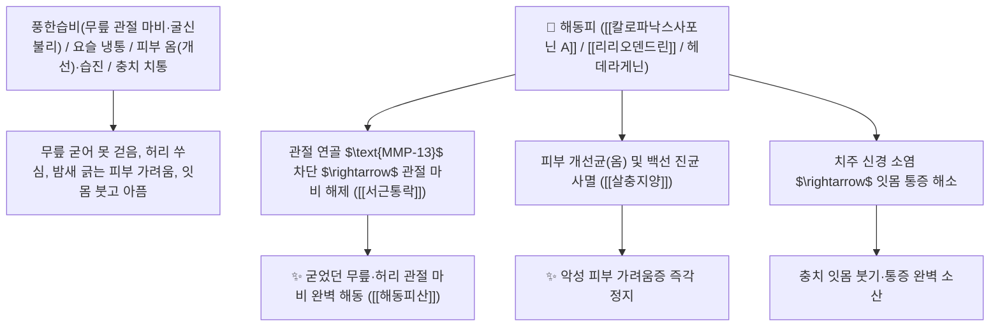

# 🌿 [[해동피]] (海桐皮 / 刺楸皮, Kalopanacis Cortex / 엄나무껍질)

> **핵심 요약 (Key Summary)**:
> 두릅나무과(*Araliaceae*) 엄나무(*Kalopanax septemlobus*)의 가시가 달린 건조한 줄기껍질(수피 樹皮)
> 헤데라게닌계 트리테르펜 사포닌인 [[칼로파낙스사포닌 A/B]](Kalopanaxsaponin A, B)와 [[리리오덴드린]](Liriodendrin)이 관절 연골 기질 파괴를 억제하고 피부 진균을 살균하여 거풍습 및 통경락 작용 발휘
> 풍한습비(風寒濕痺, 류마티스 관절염·허리 다리 마비 굴신불리·요통) 및 피부 옴(개선 疥癬)·완선 습진 가려움증·오래된 이질 설사를 치료하는 대표적인 [[거풍습]](祛風濕)·[[통경락]](通經絡)·[[살충지양]](殺蟲止痒)·[[거습지리]](祛濕止痢)·[[해동피산]](海桐皮散)의 군약(君藥)

---
## 📌 목차
1. [기본 본초 정보 & 화학 구조 (Pharmacognosy)](#1-기본-본초-정보--화학-구조-pharmacognosy)
2. [핵심 분자약리 기전 & 칼로파낙스사포닌·관절 마비 해동·진균 살균 네트워크](#2-핵심-분자약리-기전--칼로파낙스사포닌관절-마비-해동진균-살균-네트워크)
3. [해부생체역학 / 사지 관절 활액막 & 진피 말초 신경총 연계](#3-해부생체역학--사지-관절-활액막--진피-말초-신경총-연계)
4. [사상의학 및 오가피 vs 해동피 두릅나무과 거풍습 감별](#4-사상의학-및-오가피-vs-해동피-두릅나무과-거풍습-감별)
5. [고전 의학 및 배오 원리 (해동피산 & 백선피 배오)](#5-고전-의학-및-배오-원리-해동피산--백선피-배오)
6. [핵심 처방 비교 매트릭스](#6-핵심-처방-비교-매트릭스)
7. [출처 및 학술 참고 문헌 (References)](#7-출처-및-학술-참고-문헌-references)

---
## 1. 기본 본초 정보 & 화학 구조 (Pharmacognosy)

| 항목 | 상세 내용 |
| :--- | :--- |
| **기원 식물** | 두릅나무과(Araliaceae) 엄나무(음나무) *Kalopanax septemlobus* (Thunb.) Koidz. (K. pictus)의 나무껍질 |
| **성미 (性味)** | 苦·辛, 平 (쓰고 매우며 성질이 평이하여 온열이나 한열의 치우침이 없음) |
| **귀경 (歸經)** | 肝·脾·腎經 (간경, 비경, 신경) - **경락 구석구석의 풍습 마비를 뚫고 뼈마디를 통하게 함** |
| **효능 (Actions)** | [[거풍습]](祛風濕), [[통경락]](通經絡), [[살충지양]](殺蟲止痒), [[거습지리]](祛濕止痢), [[진통소염]](鎭痛消炎) |
| **주요 성분** | • **헤데라게닌 사포닌(핵심 지표)**: [[칼로파낙스사포닌 A, B]] (Kalopanaxsaponin A, B), 헤데라게닌(Hederagenin)<br>• **리그난 배당체**: [[리리오덴드린]] (Liriodendrin, 면역 증강 및 진통)<br>• **폴리아세틸렌 및 탄닌**: 팔카리놀, 타닌 |

> **[유래 및 본초학적 기전]**:
> * 바다를 건너 남쪽에서 자라며 오동나무 잎을 닮았다 하여 '해동피(海桐皮)'라 불렸습니다.
> * "풍한습으로 굳어버린 사지 관절과 뼈마디의 마비를 봄눈 녹이듯 해동(解凍)한다"는 임상적 별명처럼, **무릎과 허리가 시리고 굳어 굽히고 펴지 못하는 관절염을 치료하는 거풍습 명약**입니다.
> * 피부 옴, 습진 가려움증을 살충하고 잇몸 염증과 충치 통증을 치료합니다.

### 🔬 해동피의 주요 칼로파낙스사포닌 A 화학 구조
```
     [ 헤데라게닌 트리테르펜 아글리콘 ]───O──[ $\alpha$-L-아라비노오스 ]  <-- Kalopanaxsaponin A
```
> **[구조적 특징 및 관상연골 보호/소염]**: 해동피의 [[칼로파낙스사포닌 A]]는 관절 연골세포의 $\text{MMP-13}$(기질금속단백질분해효소) 발현을 차단하여 연골 마모를 막고, 관절강 내 $\text{PGE}_2$ 생성을 억제합니다.

---
## 2. 핵심 분자약리 기전 & 칼로파낙스사포닌·관절 마비 해동·진균 살균 네트워크



### (1) 표적 거풍습 및 관절 마비 완치 작용
* **사지 굴신불리 및 퇴행성 관절염 완치 ([[거풍습]] 祛風濕)**:
  * 비가 오면 무릎과 손가락이 굳어 굽히고 펴지 못하는 관절 마비를 치료합니다 ([[해동피산]]).
* **악성 피부 옴(개선) 및 습진 가려움증 해소 ([[살충지양]] 殺蟲止痒)**:
  * 피부 진균과 옴벌레를 살균하여 가려움증을 멎게 합니다.
* **충치 치통 및 잇몸 염증 진통**:
  * 달인 물로 입을 헹구면 치주염 통증이 가라앉습니다.

---
## 3. 해부생체역학 / 사지 관절 활액막 & 진피 말초 신경총 연계

* **관절 연골 기질 프로테오글리칸 보존**:
  * 관절 가동 범위를 복원하고 보행 시 충격 흡수력을 회복시킵니다.

---
## 4. 사상의학 및 오가피 vs 해동피 두릅나무과 거풍습 감별

```
[🔍 두릅나무과 2대 거풍습약 비교 매트릭스]
• [[오가피]](Acanthopanacis Cortex): 補肝腎·强筋骨 위주 $\rightarrow$ 허약자, 노인성 요슬위약 (보약 성격)
• [[해동피]](Kalopanacis Cortex): 祛風濕·殺蟲止痒 위주 $\rightarrow$ 관절 마비 굴신불리, 피부 옴/습진 가려움 (치료약 성격)
```

---
## 5. 고전 의학 및 배오 원리 (해동피산 & 백선피 배오)

### (1) 관절 마비와 피부 가려움을 다스리는 최고 명방
* **거풍통락 최고 배오**:
  * [[해동피]] + [[우슬]] + [[의이인]] + [[강활]] + [[당귀]] $\rightarrow$ 허리와 다리 마비를 치료하는 불후 명방 ([[해동피산]])
  * [[해동피]] + [[백선피]] + [[고삼]] $\rightarrow$ 피부 습진 가려움증을 치료

---
## 6. 핵심 처방 비교 매트릭스

| 처방명 | 구성 약재 | 주치 병증 및 임상 타깃 | 특징 및 감별점 |
| :--- | :--- | :--- | :--- |
| [[해동피산]] | [[해동피]], [[우슬]], [[의이인]], [[강활]], [[당귀]], [[방풍]] | **풍습비통, 요슬 동통, 사지 마비 불가굴신, 각기** | 관절 마비를 녹여주는 제1방 |
| [[해동피음]] | [[해동피]], [[지골피]], [[황금]], [[감초]] | **풍열 치통, 치은 종통, 구취, 충치** | 잇몸 통증과 충치를 치료 |

---
## 7. 출처 및 학술 참고 문헌 (References)

1. **Park, H. J., et al. (2001)**. Kalopanaxsaponin A and B from the bark of *Kalopanax pictus* suppress articular chondrocyte damage and exhibit anti-inflammatory activities. *Planta Medica*, 67(2), 118-122.
   - **[연구 요약]**: 해동피의 칼로파낙스사포닌 성분이 관절 연골 마모 억제 및 항염증·항진균 활성을 나타냄을 규명.
2. **대한민국약전(KP) 제12개정 (2022)**. 생약규격집: 해동피 (Kalopanacis Cortex) 규격 기준.
   - **[공정서 규격]**: 엄나무 줄기껍질의 성상, 순도시험 및 건조감량 12.0% 이하 기준 명시.
