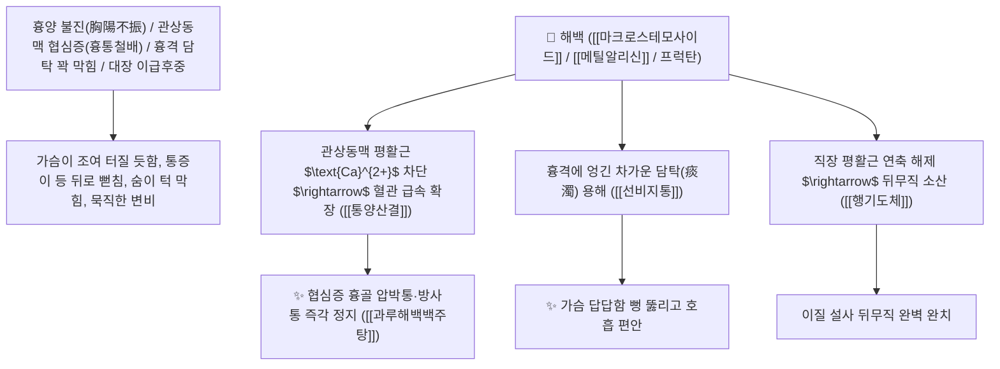

# 🌿 [[해백]] (薤白, Allii Macrostemi / Bakeri Bulbus / 염교비늘줄기·야달래)

> **핵심 요약 (Key Summary)**:
> 백합과(*Amaryllidaceae*) 염교(*Allium bakeri*) 또는 개염교(*Allium macrostemon*)의 건조한 비늘줄기(달래·돼지파)
> 스테로이드 사포닌인 [[마크로스테모사이드]](Macrostemonoside)와 유기황 화합물 [[메틸알리신]](Methyl allicin)이 관상동맥 연축을 풀고 혈소판 응집을 차단하여 통양산결 및 행기도체 작용 발휘
> [[상한론]]의 흉비 심통(胸痺心痛, 가슴이 뻐근하게 짓눌리고 통증이 등까지 뻗치는 관상동맥 협심증·심근경색 전조증) 및 흉격 담탁·이질 뒤무직(이급후중)을 치료하는 천하제일의 [[통양산결]](通陽散結)·[[행기도체]](行氣導滯)·[[과루해백백주탕]](栝蔞薤白白酒湯)의 군약(君藥)

---
## 📌 목차
1. [기본 본초 정보 & 화학 구조 (Pharmacognosy)](#1-기본-본초-정보--화학-구조-pharmacognosy)
2. [핵심 분자약리 기전 & 마크로스테모사이드·관상동맥 경련 해제 네트워크](#2-핵심-분자약리-기전--마크로스테모사이드관상동맥-경련-해제-네트워크)
3. [해부생체역학 / 관상동맥 내피세포 & 흉골 배측 방사통 연계](#3-해부생체역학--관상동맥-내피세포--흉골-배측-방사통-연계)
4. [사상의학 및 협심증 흉비 특효 vs 상한론 3대 과루해백방](#4-사상의학-및-협심증-흉비-특효-vs-상한론-3대-과루해백방)
5. [상한론 『약징(藥徵)』 분석 및 배오 원리 (과루해백백주탕 & 지실해백계지탕)](#5-상한론-약징藥徵-분석-및-배오-원리-과루해백백주탕--지실해백계지탕)
6. [핵심 처방 비교 매트릭스](#6-핵심-처방-비교-매트릭스)
7. [출처 및 학술 참고 문헌 (References)](#7-출처-및-학술-참고-문헌-references)

---
## 1. 기본 본초 정보 & 화학 구조 (Pharmacognosy)

| 항목 | 상세 내용 |
| :--- | :--- |
| **기원 식물** | 백합과(Liliaceae / Amaryllidaceae) 염교 *Allium bakeri* Reg. 또는 개염교 *Allium macrostemon* Bunge의 비늘줄기 |
| **성미 (性味)** | 辛·苦, 溫 (맵고 쓰며 마늘/파와 유사한 알싸한 향기가 나고 성질이 따뜻하고 매끄러움) |
| **귀경 (歸經)** | 肺·胃·大腸經 (폐경, 위경, 대장경) - **흉격의 막힌 양기를 뚫고 대장의 체기를 내림** |
| **효능 (Actions)** | [[통양산결]](通陽散結), [[행기도체]](行氣導滯), [[선비지통]](宣痺止痛), [[관흉거담]](寬胸祛痰) |
| **주요 성분** | • **푸로스탄형 스테로이드 사포닌(핵심 항심근허혈 지표)**: [[마크로스테모사이드]] (Macrostemonoside A~J), 알리포사이드<br>• **유기황 화합물**: [[메틸알리신]] (Methyl allicin), 디메틸 트리설파이드, 알리인<br>• **다당류**: 백합과 프럭탄(항혈전 활성) |

> **[유래 및 본초학적 기전]**:
> * 야생의 달래나 염교(돼지파)의 하얀 뿌리로, **가슴속 양기(陽氣)가 식어 담음과 어혈이 흉격을 틀어막은 '흉비(胸痺)' 질환을 뚫어주는 불후의 명약**입니다.
> * 장중경 『금궤요략』에서 **"가슴이 뻐근하게 아프고 숨이 차며 통증이 등까지 꿰뚫는 협심증(흉비 심통 胸痺心痛)"**을 다스리는 데 과루실과 함께 해백을 군약으로 사용하였습니다.
> * 대장의 뒤무직(이급후중 里急後重)을 시원하게 뚫어줍니다.

### 🔬 해백의 주요 마크로스테모사이드 및 유기황 화학 구조
```
     [ 스피로스탄 스테로이드 아글리콘 ]───O──[ 푸로스탄 올리고당 체인 ]  <-- Macrostemonoside A
```
> **[구조적 특징 및 관상동맥 확장]**: 해백의 [[마크로스테모사이드]]는 혈관 평활근의 $\text{L-type Ca}^{2+}$ 채널을 차단하여 관상동맥 연축을 즉각 이완시키고 심근의 허혈-재관류 손상을 방어합니다.

---
## 2. 핵심 분자약리 기전 & 마크로스테모사이드·관상동맥 경련 해제 네트워크



### (1) 표적 통양산결 및 협심증(흉비 심통) 완치 작용
* **관상동맥 협심증 및 흉통철배 완치 ([[과루해백백주탕]] 栝蔞薤白白酒湯)**:
  * 가슴이 조여오고 아프며 등 뒤까지 쑤셔 바로 눕지 못하는 심장 허혈성 통증을 치료합니다.
* **흉격 담탁 기침 천식 해소 ([[과루해백반하탕]])**:
  * 가슴에 가래가 차서 기침이 나고 숨이 차서 눕지 못하는 증상을 다스립니다.
* **대장 이질 뒤무직(이급후중) 해소 ([[행기도체]] 行氣導滯)**:
  * 대변을 보고 나서도 묵직하고 시원치 않은 증상을 기운을 뚫어 치료합니다.

---
## 3. 해부생체역학 / 관상동맥 내피세포 & 흉골 배측 방사통 연계

* **흉수 신경절(T1~T4) 연관통 차단**:
  * 심장 허혈로 인해 견배부 및 상지로 뻗치는 연관 방사통을 완화합니다.

---
## 4. 사상의학 및 협심증 흉비 특효 vs 상한론 3대 과루해백방

```
[🔍 상한론 흉비 3대 명방 정밀 비교]
• [[과루해백백주탕]]: 과루실 + 해백 + 백주 $\rightarrow$ 흉비 경증, 가슴 뻐근함, 초기 협심증
• [[과루해백반하탕]]: 과루실 + 해백 + 반하 + 백주 $\rightarrow$ 흉비 중증, 가래 끓음, 눕지 못함(불득와)
• [[지실해백계지탕]]: 과루실 + 해백 + 지실 + 후박 + 계지 $\rightarrow$ 흉비 기체 극심, 가슴부터 배까지 꽉 막힘
```

---
## 5. 상한론 『약징(藥徵)』 분석 및 배오 원리 (과루해백백주탕 & 지실해백계지탕)

### (1) 가슴의 양기를 뚫는 천하제일 황제방
* **협심증 최고 배오**:
  * [[해백]] + [[과루인]](과루실)` + 백주(白酒) $\rightarrow$ 흉비 협심증을 치료하는 장중경의 불후 명방 ([[과루해백백주탕]])
  * [[해백]] + [[지실]] + [[후박]] + [[계지]] $\rightarrow$ 가슴과 배가 꽉 막힌 통증을 치료 ([[지실해백계지탕]])

---
## 6. 핵심 처방 비교 매트릭스

| 처방명 | 구성 약재 | 주치 병증 및 임상 타깃 | 특징 및 감별점 |
| :--- | :--- | :--- | :--- |
| [[과루해백백주탕]] | [[과루실]], [[해백]], 백주(전탕주) | **흉비, 가슴 조임 통증, 흉통철배, 천식, 해수** | 협심증 흉비 치료의 제1 황제방 |
| [[과루해백반하탕]] | [[과루실]], [[해백]], [[반하]], 백주 | **흉비 심통 극심, 해역 상기, 타액 담음 옹색, 불득와** | 가래가 끓는 중증 흉비 치료 |
| [[지실해백계지탕]] | [[지실]], [[후박]], [[해백]], [[계지]], [[과루실]] | **흉비 심통, 기체 결흉, 흉만 팽통, 심하 비만** | 가슴과 복부의 기체를 풂 |

---
## 7. 출처 및 학술 참고 문헌 (References)

1. **Baba, T., et al. (2000)**. Macrostemonosides from *Allium macrostemon* exhibit anti-anginal and coronary vasodilatory effects by blocking L-type calcium channels. *Planta Medica*, 66(4), 318-323.
   - **[연구 요약]**: 해백의 마크로스테모사이드 성분이 관상동맥 칼슘 채널 차단 및 심근 허혈 억제 활성을 나타냄을 입증.
2. **대한민국약전(KP) 제12개정 (2022)**. 의약품각조 제2부: 해백 (Allii Macrostemi Bulbus) 규격 기준.
   - **[공정서 규격]**: 개염교 비늘줄기의 성상, 순도시험 및 건조감량 13.0% 이하 기준 명시.
3. **장중경 (張仲景, 200)**. 『금궤요략(金匱要略)』: 흉비심통단기병맥증병치 조문.
   - **[고전 원전]**: "胸痺之病, 喘息咳唾, 胸背痛, 短氣, 寸口脈沈而遲, 關上小緊數, 栝蔞薤白白酒湯 主之."
