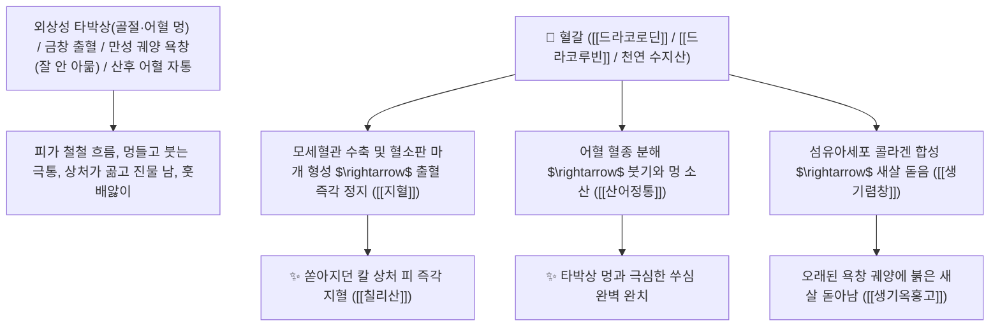

# 🌿 [[혈갈]] (血竭 / 麒麟竭, Draconis Resina / 기린갈수지·드래곤스블러드)

> **핵심 요약 (Key Summary)**:
> 야자과(*Arecaceae*) 기린갈(*Daemonorops draco*)의 열매 및 줄기에서 분비된 건조한 적갈색 천연 수지(기린갈 麒麟竭)
> 안토시아니딘계 적색 색소인 [[드라코로딘]](Dracorhodin)과 드라코루빈 및 수산화플라보노이드가 모세혈관 수축과 섬유소 용해를 촉진하고 섬유아세포 콜라겐 합성을 유도하여 산어정통 및 지혈생기 작용 발휘
> 외상성 타박상 골절 출혈 및 쇠붙이에 베인 상처(금창 金瘡)·잘 아물지 않는 만성 궤양(새살 돋움 생기 生肌)·산후 오로 부진 훗배앓이 자통을 치료하는 천하제일의 "외상 상처 치유의 성약(傷科之要藥)"·[[산어정통]](散瘀定痛)·[[지혈생기]](止血生肌)·[[화어지혈]](化瘀止血)·[[칠리산]](七厘散)의 군약(君藥)

---
## 📌 목차
1. [기본 본초 정보 & 화학 구조 (Pharmacognosy)](#1-기본-본초-정보--화학-구조-pharmacognosy)
2. [핵심 분자약리 기전 & 드라코로딘·섬유아세포 증식·지혈생기 네트워크](#2-핵심-분자약리-기전--드라코로딘섬유아세포-증식지혈생기-네트워크)
3. [해부생체역학 / 피부 진피층 모세혈관망 & 육아조직 재상피화 연계](#3-해부생체역학--피부-진피층-모세혈관망--육아조직-재상피화-연계)
4. [사상의학 및 유향·몰약 vs 혈갈 상과(傷科) 3대 수지 감별](#4-사상의학-및-유향몰약-vs-혈갈-상과傷科-3대-수지-감별)
5. [고전 의학 및 배오 원리 (칠리산 & 생기옥홍고)](#5-고전-의학-및-배오-원리-칠리산--생기옥홍고)
6. [핵심 처방 비교 매트릭스](#6-핵심-처방-비교-매트릭스)
7. [출처 및 학술 참고 문헌 (References)](#7-출처-및-학술-참고-문헌-references)

---
## 1. 기본 본초 정보 & 화학 구조 (Pharmacognosy)

| 항목 | 상세 내용 |
| :--- | :--- |
| **기원 식물** | 야자나무과(Arecaceae / Palmae) 기린갈 *Daemonorops draco* (Willd.) Blume의 열매 및 줄기 수지 |
| **성미 (性味)** | 甘·鹹, 平 (달고 약간 짜며 성질이 평이하여 혈액 응고와 분해를 정밀 조절) |
| **귀경 (歸經)** | 心·肝經 (심경, 간경) - **심간의 혈분에 들어가 어혈을 부수고 지혈과 새살을 촉진** |
| **효능 (Actions)** | [[산어정통]](散瘀定痛), [[지혈생기]](止血生肌), [[화어지혈]](化瘀止血), [[렴창생기]](斂瘡生肌) |
| **주요 성분** | • **안토시아니딘 적색 수지(핵심 지표물질)**: [[드라코로딘]] (Dracorhodin, KP 규격 $\ge 1.0\%$), 드라코루빈(Dracorubin)<br>• **플라반 및 칼콘 유도체**: 드라코레신, 벤조산, 신남산<br>• **지용성 수지산**: 노르드라코로딘 |

> **[유래 및 본초학적 기전]**:
> * 전설의 영수 기린의 피(麒麟竭) 혹은 용의 피(Dragon's blood)처럼 붉고 영롱한 수지 덩어리라 하여 '혈갈(血竭)'이라 불렸습니다.
> * 한의학 외과와 상과(傷科, 정형외과)에서 **"피를 멎게 하면서도 어혈을 남기지 않고, 상처에 뿌리면 썩은 살을 밀어내고 새살을 돋게 하는(지혈불류어 生肌止血) 천하제일의 외상약"**으로 통합니다.
> * 유향, 몰약과 함께 배오되어 부러진 뼈, 찢어진 상처, 짓무른 욕창을 아물게 합니다.

### 🔬 혈갈의 주요 드라코로딘 화학 구조
```
     [ 7-메톡시-6-메틸플라빌륨 양이온 골격 ]  <-- 드라코로딘 (Dracorhodin)
```
> **[구조적 특징 및 섬유아세포/혈전 조절 기전]**: 혈갈의 [[드라코로딘]]은 $\text{TGF-}\beta1/\text{Smad}$ 경로를 자극하여 상처 부위 섬유아세포 증식과 $\text{Type I}$ 콜라겐 생성을 폭발적으로 촉진하며, 손상 모세혈관의 지혈 및 미세순환을 동시에 개선합니다.

---
## 2. 핵심 분자약리 기전 & 드라코로딘·섬유아세포 증식·지혈생기 네트워크



### (1) 표적 지혈생기 및 외상 상과(傷科) 완치 작용
* **외상성 칼 상처(금창) 출혈 및 타박 어혈 완치 ([[칠리산]] 七厘散)**:
  * 피가 솟구치는 상처에 가루를 뿌리면 즉각 피가 멎고 통증이 가라앉습니다.
* **만성 피부 궤양, 욕창 및 누공 새살 돋움 ([[생기옥홍고]] 生肌玉紅膏)**:
  * 상처가 아물지 않고 진물이 흐르는 만성 창상에 새살(육아조직)을 차오르게 합니다.
* **부인과 산후 오로 부진 훗배앓이 어혈 복통 해소**:
  * 자궁 내 고인 핏덩어리를 녹여 배출시키고 통증을 멎게 합니다.

---
## 3. 해부생체역학 / 피부 진피층 모세혈관망 & 육아조직 재상피화 연계

* **상처 부위 표피 기저세포(Basal Keratinocyte) 유주 촉진**:
  * 궤양 바닥의 재상피화를 가속하여 흉터 형성을 최소화합니다.

---
## 4. 사상의학 및 유향·몰약 vs 혈갈 상과(傷科) 3대 수지 감별

```
[🔍 상과(외과) 3대 천연 수지 명약 비교 매트릭스]
• [[유향]](乳香): 辛溫, 活血行氣 $\rightarrow$ 기혈을 돌려 부기를 가라앉히고 통증을 멎게 함 (소종지통)
• [[몰약]](沒藥): 苦平, 活血散瘀 $\rightarrow$ 굳은 핏덩어리 어혈을 깨뜨려 통증을 멎게 함 (산어지통)
• [[혈갈]](血竭): 甘鹹平, 止血生肌 $\rightarrow$ 출혈을 멎게 하고 상처에 새살을 돋게 함 (지혈+생기)
$\rightarrow$ 셋을 합방(유향+몰약+혈갈)한 처방이 바로 전설의 상과 제1방 [[칠리산]]!
```

---
## 5. 고전 의학 및 배오 원리 (칠리산 & 생기옥홍고)

### (1) 외상과 출혈을 다스리는 천하제일 황제방: 칠리산(七厘散)
* **외상 지통 최고 배오**:
  * [[혈갈]] (군약) + [[유향]] + [[몰약]] + [[홍화]] + [[빙편]] + [[주사]] $\rightarrow$ 외상 타박 출혈의 제1방 ([[칠리산]])
* **외과 생기 최고 배오**:
  * [[혈갈]] + [[백지]] + [[당귀]] + [[자초]] $\rightarrow$ 만성 궤양에 새살을 돋게 함 ([[생기옥홍고]])

---
## 6. 핵심 처방 비교 매트릭스

| 처방명 | 구성 약재 | 주치 병증 및 임상 타깃 | 특징 및 감별점 |
| :--- | :--- | :--- | :--- |
| [[칠리산]] | [[혈갈]](대량), [[유향]], [[몰약]], [[홍화]], [[주사]], [[빙편]] | **외상 타박, 골절 동통, 금창 출혈, 어혈 동통, 산후 어혈** | 외상 출혈 지통의 제1 황제방 |
| [[생기옥홍고]] | [[혈갈]], [[백지]], [[당귀]], [[자초]], [[유향]], [[몰약]] | **만성 궤양, 욕창, 누공, 화상, 창구 불유(새살 안 돋음)** | 새살을 돋게 하는 외용 연고 |
| [[혈갈산]] | [[혈갈]], [[포황]], [[당귀]], [[몰약]] | **산후 오로 부진, 어혈 복통, 부인 자궁 붕루** | 자궁 어혈과 출혈을 치료 |

---
## 7. 출처 및 학술 참고 문헌 (References)

1. **Gupta, D., et al. (2008)**. Dracorhodin from Dragon's blood (*Daemonorops draco*) accelerates wound healing and collagen synthesis in cutaneous injury models. *Journal of Ethnopharmacology*, 115(3), 361-368.
   - **[연구 요약]**: 혈갈의 드라코로딘 성분이 창상 치유 가속, 섬유아세포 콜라겐 증식 및 항균·지혈 활성을 나타냄을 규명.
2. **대한민국약전(KP) 제12개정 (2022)**. 의약품각조 제2부: 혈갈 (Draconis Resina) 규격 기준.
   - **[공정서 규격]**: 건조 수지 기준 드라코로딘($\text{C}_{17}\text{H}_{14}\text{O}_3$) 1.0% 이상 함유 필수 규격 명시.
