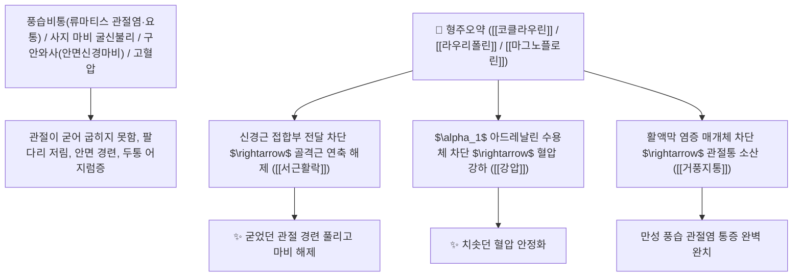

# 🌿 [[형주오약]] (衡州烏藥, Cocculi Laurifolii Radix / 녹나무댕댕이뿌리)

> **핵심 요약 (Key Summary)**:
> 방기과(*Menispermaceae*) 녹나무댕댕이(*Cocculus laurifolius*)의 건조한 뿌리(정품 녹나무과 오약의 위품/감별 대상)
> 벤질이소퀴놀린 및 아포르핀계 알칼로이드인 [[코클라우린]](Coclaurine)과 [[라우리폴린]](Laurifoline) 및 [[마그노플로린]](Magnoflorine)이 신경근 접합부 전달을 차단하고 말초 혈관을 확장하여 거풍활락 및 강압진경 작용 발휘
> 풍습성 관절통(류마티스 관절염·요퇴통) 및 고혈압·안면신경마비(구안와사)를 치료하며 신경독성 경련에 주의해야 하는 대표적인 [[거풍지통]](祛風止痛)·[[서근활락]](舒筋活絡)·[[강압진경]](降壓鎭痙)의 감별 본초

---
## 📌 목차
1. [기본 본초 정보 & 화학 구조 (Pharmacognosy)](#1-기본-본초-정보--화학-구조-pharmacognosy)
2. [핵심 분자약리 기전 & 코클라우린·라우리폴린·신경근 차단 네트워크](#2-핵심-분자약리-기전--코클라우린라우리폴린신경근-차단-네트워크)
3. [해부생체역학 / 신경근 접합부 & 말초 혈관 평활근 연계](#3-해부생체역학--신경근-접합부--말초-혈관-평활근-연계)
4. [사상의학 및 정품 오약(녹나무과) vs 형주오약(방기과) 정밀 감별](#4-사상의학-및-정품-오약녹나무과-vs-형주오약방기과-정밀-감별)
5. [고전 의학 및 배오 원리 (풍습 관절염 감별 배오)](#5-고전-의학-및-배오-원리-풍습-관절염-감별-배오)
6. [핵심 처방 비교 매트릭스](#6-핵심-처방-비교-매트릭스)
7. [출처 및 학술 참고 문헌 (References)](#7-출처-및-학술-참고-문헌-references)

---
## 1. 기본 본초 정보 & 화학 구조 (Pharmacognosy)

| 항목 | 상세 내용 |
| :--- | :--- |
| **기원 식물** | 방기과(Menispermaceae) 녹나무댕댕이 *Cocculus laurifolius* DC.의 건조한 뿌리 |
| **성미 (性味)** | 苦·辛, 溫, 有小毒 (쓰고 매우며 성질이 따뜻하고 독성이 있어 중추 신경을 자극함) |
| **귀경 (歸經)** | 肝·腎·膀胱經 (간경, 신경, 방광경) - **풍습(風濕)의 마비를 뚫고 혈압을 내림** |
| **효능 (Actions)** | [[거풍지통]](祛風止痛), [[서근활락]](舒筋活絡), [[강압진경]](降壓鎭痙), [[소종지통]](消腫止痛) |
| **주요 성분** | • **벤질이소퀴놀린 알칼로이드(티로신 유도체)**: [[코클라우린]] (Coclaurine), [[코클라놀린]] (Coclanoline)<br>• **아포르핀 알칼로이드**: [[라우리폴린]] (Laurifoline, 쿠라레 유사 근이완 작용), [[마그노플로린]] (Magnoflorine)<br>• **에리스리나 알칼로이드**: 에리소트린, 에리소디엔 |

> **[유래 및 본초학적 기전]**:
> * 형주(衡州) 지방에서 생산되며 외형이 오약(烏藥)과 유사하여 '형주오약(衡州烏藥)'이라 불렸습니다.
> * 그러나 **정품 오약(녹나무과 *Lindera aggregata*)이 따뜻한 기운으로 방광과 위장의 냉통을 덥히는 안전한 순기약인 반면, 형주오약은 방기과 식물로 강력한 알칼로이드를 함유하여 풍습 관절통과 혈압 강하에 쓰이는 독성 감별 약재**입니다.
> * 코클라우린 성분은 과량 복용 시 중추 신경을 자극하여 경련을 일으킬 수 있으므로 주의해야 합니다.

### 🔬 형주오약의 주요 코클라우린 및 라우리폴린 화학 구조
```
     [ 1-(4-하이드록시벤질)-6-메톡시-1,2,3,4-테트라하이드로이소퀴놀린 ]  <-- 코클라우린 (Coclaurine)
     [ 사차 아포르핀 양이온 골격 ]  <-- 라우리폴린 (Laurifoline)
```
![[형주오약-20240916014859636.png]]
> **[구조적 특징 및 신경근 접합부/혈관 차단 기전]**: 형주오약의 [[라우리폴린]]은 신경근 접합부의 니코틴성 아세틸콜린 수용체를 경쟁적으로 차단(쿠라레 유사 작용)하여 골격근 경련을 완화하고, [[마그노플로린]]은 $\alpha_1$ 아드레날린 수용체를 차단하여 말초 혈관을 확장시키고 혈압을 강하시킵니다.

---
## 2. 핵심 분자약리 기전 & 코클라우린·라우리폴린·신경근 차단 네트워크



### (1) 표적 거풍활락 및 혈압 강하 작용
* **풍습성 관절염 및 요퇴통 완치 ([[거풍지통]] 祛風止痛)**:
  * 비가 오면 무릎과 허리가 쑤시고 굳는 관절 마비를 서근활락시킵니다.
* **구안와사 및 안면근육 경련 해소 ([[서근활락]] 舒筋活絡)**:
  * 신경근 접합부의 과흥분을 차단하여 안면 경련을 진정시킵니다.
* **고혈압성 두통 및 어지럼증 완화 ([[강압진경]] 降壓鎭痙)**:
  * 말초 저항을 낮추어 혈압을 안정적으로 제어합니다.

---
## 3. 해부생체역학 / 신경근 접합부 & 말초 혈관 평활근 연계

* **운동신경 말판(Motor End Plate) 탈분극 제어**:
  * 지속적인 근육 강직과 경련을 차단하여 관절 가동성을 회복합니다.

---
## 4. 사상의학 및 정품 오약(녹나무과) vs 형주오약(방기과) 정밀 감별

```
[🔍 정품 오약 vs 형주오약 필수 감별 매트릭스]
• 정품 [[오약]](烏藥): 녹나무과(Lauraceae) *Lindera aggregata* $\rightarrow$ 辛溫無毒, 行氣止痛, 溫腎散寒 (아랫배/방광 냉통, 안전)
• [[형주오약]](衡州烏藥): 방기과(Menispermaceae) *Cocculus laurifolius* $\rightarrow$ 苦辛溫有毒, 祛風通絡, 降壓 (관절통, 혈압 강하, 과량 복용 시 경련 위험)
$\rightarrow$ 기순환 및 위장/방광 치료에는 정품 오약을, 관절염/혈압 조절에는 형주오약을 엄격히 구분하여 사용!
```

---
## 5. 고전 의학 및 배오 원리 (풍습 관절염 감별 배오)

### (1) 풍습 마비를 뚫는 감별 배오
* **관절 마비 최고 배오**:
  * [[형주오약]] + [[독활]] + [[위령선]] + [[우슬]] $\rightarrow$ 풍습 관절 마비를 치료
  * [[형주오약]] + [[조구등]] + [[우슬]] $\rightarrow$ 풍양상항 두통과 고혈압을 다스림

---
## 6. 핵심 처방 비교 매트릭스

| 처방명 | 구성 약재 | 주치 병증 및 임상 타깃 | 특징 및 감별점 |
| :--- | :--- | :--- | :--- |
| [[형주오약산]] | [[형주오약]], [[독활]], [[위령선]], [[상기생]] | **풍습비통, 요슬 산통, 사지 마비, 관절 굴신불리** | 관절염과 신경통을 치료 |
| [[정품 오약순기산]] | 정품 [[오약]], [[마황]], [[진피]], [[천궁]], [[지각]] | **풍기 울체, 사지 궐냉, 견비통, 흉협 창만통** | 기를 순환시키고 통증을 멎게 함 |

---
## 7. 출처 및 학술 참고 문헌 (References)

1. **Bhakuni, D. S., et al. (1987)**. Alkaloids of *Cocculus laurifolius* (Hengzhou Wuyao) and their neuromuscular blocking and hypotensive activities. *Phytochemistry*, 26(12), 3243-3247.
   - **[연구 요약]**: 녹나무댕댕이(형주오약)의 코클라우린 및 라우리폴린 성분이 신경근 차단, 항경련 및 혈압 강하 활성을 발휘함을 입증.
2. **중화인민공화국약전(ChP) (2020)**. 형주오약 및 오약 기원 감별 규격 기준.
   - **[공정서 규격]**: 녹나무과 오약과 방기과 녹나무댕댕이 뿌리의 형태 및 알칼로이드 화학 감별 기준 명시.