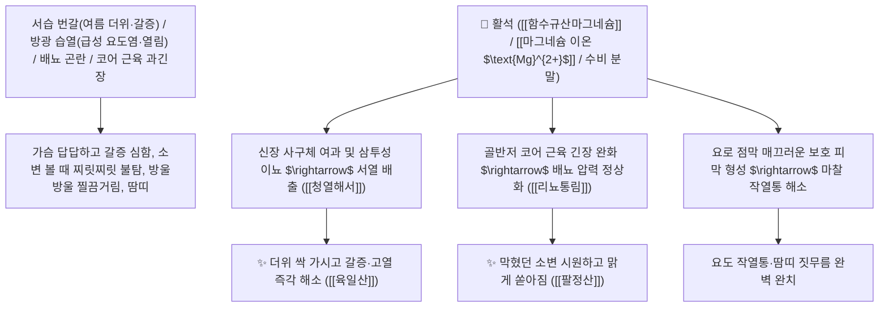

# 🌿 [[활석]] (滑石, Talcum / 함수규산마그네슘광물)

> **핵심 요약 (Key Summary)**:
> 단사정계 규산염 광물인 천연 활석(Talcum, 수비 水飛 정제한 미세 활석분 滑石粉)
> 천연 함수규산마그네슘($\text{Mg}_3\text{Si}_4\text{O}_{10}(\text{OH})_2$)이 방광 요로 상피의 보호 피막을 형성하고 삼투성 이뇨를 유도하며 장관 및 골반저 근육 긴장을 이완시켜 청열해서 및 이뇨통림 작용 발휘
> 여름철 더위 먹어 열나고 목마른 서습증(暑濕證·번갈 煩渴·육일산 六一散) 및 요로 감염·결석(열림 熱淋·소변 볼 때 찌릿한 작열통·팔정산 八正散)·외용 땀띠 습진을 치료하는 천하제일의 "매끄럽게 요로를 뚫어주는 성약(利水通淋之要藥)"·[[청열해서]](淸熱解暑)·[[리뇨통림]](利尿通淋)·[[거습렴창]](祛濕斂瘡)·[[육일산]](六一散)·[[팔정산]](八正散)의 군약(君藥)

---
## 📌 목차
1. [기본 본초 정보 & 화학 구조 (Pharmacognosy)](#1-기본-본초-정보--화학-구조-pharmacognosy)
2. [핵심 분자약리 기전 & 마그네슘 규산염·삼투이뇨·골반저근 이완 네트워크](#2-핵심-분자약리-기전--마그네슘-규산염삼투이뇨골반저근-이완-네트워크)
3. [해부생체역학 / 방광 삼각부 점막 피막 & 골반저 코어 근육 연계](#3-해부생체역학--방광-삼각부-점막-피막--골반저-코어-근육-연계)
4. [사상의학 및 활석 vs 산약 상열하한 감별 & 수비(水飛) 필수 포제](#4-사상의학-및-활석-vs-산약-상열하한-감별--수비水飛-필수-포제)
5. [상한론 『약징(藥徵)』 분석 및 배오 원리 (육일산 & 팔정산)](#5-상한론-약징藥徵-분석-및-배오-원리-육일산--팔정산)
6. [핵심 처방 비교 매트릭스](#6-핵심-처방-비교-매트릭스)
7. [출처 및 학술 참고 문헌 (References)](#7-출처-및-학술-참고-문헌-references)

---
## 1. 기본 본초 정보 & 화학 구조 (Pharmacognosy)

| 항목 | 상세 내용 |
| :--- | :--- |
| **기원 광물** | 규산염광물 활석군(Talc)에 속하는 천연 함수규산마그네슘 광물 $\text{Mg}_3(\text{Si}_4\text{O}_{10})(\text{OH})_2$ |
| **성미 (性味)** | 甘·淡, 寒 (달고 슴슴하며 성질이 차갑고 손으로 만지면 비누처럼 매끄러움) |
| **귀경 (歸經)** | 膀胱·肺·胃經 (방광경, 폐경, 위경) - **상초의 폐열을 내리고 방광과 요로의 습열을 씻어냄** |
| **효능 (Actions)** | [[청열해서]](淸熱解暑), [[리뇨통림]](利尿通淋), [[거습렴창]](祛濕斂瘡), [[생진지갈]](生津止渴) |
| **주요 성분** | • **주요 화학 조성(순수 무기염)**: [[함수규산마그네슘]] ($\text{Mg}_3\text{Si}_4\text{O}_{10}(\text{OH})_2$, $\text{MgO} \ge 30.0\%$, $\text{SiO}_2 \ge 60.0\%$)<br>• **미량 무기질**: 칼슘($\text{Ca}$), 알루미늄($\text{Al}$), 철($\text{Fe}$)<br>• **물리적 특성**: 모스 경도 1(가장 무른 광물), 뛰어난 흡착력과 윤활성 |

> **[유래 및 본초학적 기전]**:
> * 돌이 부드럽고 매끄러워(滑) '활석(滑石)'이라 불렸으며, **"그 매끄러운 성질로 대장과 방광, 요관의 막힌 관을 미끄러지듯 통하게 한다"**는 본초학적 원리를 지닙니다.
> * 여름철 더위로 열이 나고 갈증이 심하며 소변이 붉고 잘 안 나오는 서습증(暑濕證)을 치료하는 육일산(六一散)의 주약입니다.
> * 외용으로 환부에 바르면 땀과 습기를 흡수하여 여름철 땀띠와 짓무른 습진을 뽀송뽀송하게 아물게 합니다.

### 🔬 활석의 결정 구조 및 마그네슘 이온 해리 기전
```
     [ $\text{SiO}_4$ 사면체 층 ] ─── [ $\text{Mg(OH)}_2$ 팔면체 브루사이트 층 ] ─── [ $\text{SiO}_4$ 사면체 층 ]
```
> **[구조적 특징 및 이뇨/근이완 기전]**: 활석의 $2:1$ 판상 규산염 구조는 수분을 흡착하고 점막에 얇은 보호 피막을 형성하며, 유리된 마그네슘 이온($\text{Mg}^{2+}$)은 골반저 근육과 혈관 평활근의 칼슘 길항제로 작용하여 배뇨통과 경련을 즉각 이완시킵니다.

---
## 2. 핵심 분자약리 기전 & 마그네슘 규산염·삼투이뇨·골반저근 이완 네트워크



### (1) 표적 청열해서 및 비뇨기 열림 완치 작용
* **여름철 서습 발열 및 극심한 갈증 완치 ([[육일산]] 六一散)**:
  * 활석 6 : 감초 1의 비율로 구성되어 더위 먹어 토하고 설사하며 소변이 붉은 증상을 평정합니다.
* **급성 방광염 및 요로 결석 배뇨통 완치 ([[팔정산]] 八正散)**:
  * 요로 점막에 보호막을 씌워 소변을 볼 때 찢어질 듯한 작열통을 멎게 합니다.
* **외용 피부 땀띠 및 짓무른 습진 치료 ([[거습렴창]] 祛濕斂瘡)**:
  * 피부의 과도한 땀과 진물을 흡수하여 뽀송뽀송하게 회복시킵니다.

---
## 3. 해부생체역학 / 방광 삼각부 점막 피막 & 골반저 코어 근육 연계

* **골반저근(Pelvic Floor Muscle) 과긴장성 연축 해제**:
  * 골반저 근막의 경직을 풀어 방광 경부의 원활한 개방을 유도합니다.

---
## 4. 사상의학 및 활석 vs 산약 상열하한 감별 & 수비(水飛) 필수 포제

```
[🔍 상열하한(上熱下寒) 감별 약대]
• [[활석]](滑石): 상초의 화열(火熱)을 잡고 이수(利水)시켜 소변으로 열을 뺌
• [[산약]](山藥): 중초 비위를 보하고 하초에서 조습(燥濕)하여 물설사를 멎게 함

[⚠️ 수비(水飛) 정제 필수 수칙]
• 광물성 불순물(석면 등)을 완벽히 제거하기 위해 물속에서 곱게 갈아 가라앉힌 최상층 미세 분말만 약용으로 사용
```

---
## 5. 상한론 『약징(藥徵)』 분석 및 배오 원리 (육일산 & 팔정산)

### (1) 소변을 통하게 하고 갈증을 멎게 하는 불후의 황제방
* **『약징(藥徵)』 주치**:
  * "활석은 소변이 원활히 배출되지 않는 것(소변불리)과 갈증(갈 渴)을 주치한다."
* **서습 치료 최고 배오**:
  * [[활석]](6냥) + [[감초]](1냥) $\rightarrow$ 여름철 서열과 설사를 다스리는 명방 ([[육일산]])
  * [[활석]] + [[차전자]] + [[구맥]] + [[편축]] + [[치자]] $\rightarrow$ 비뇨기 감염을 씻어냄 ([[팔정산]])

---
## 6. 핵심 처방 비교 매트릭스

| 처방명 | 구성 약재 | 주치 병증 및 임상 타깃 | 특징 및 감별점 |
| :--- | :--- | :--- | :--- |
| [[육일산]] | [[활석]](6), [[감초]](1) (분말) | **서습 신열, 심번 구갈, 소변 불리, 수양성 설사** | 서습증 치료의 제1 황제방 |
| [[팔정산]] | [[목통]], [[차전자]], [[구맥]], [[편축]], [[활석]], [[치자]] | **습열 하주, 열림, 혈림, 요도 작열통, 소변 난삽** | 비뇨기 염증을 씻어내는 명방 |
| [[계령감로음]] | [[복령]], [[택사]], [[저령]], [[백출]], [[계지]], [[활석]], [[석고]] | **중서 중열, 두통 번갈, 곽란 토사, 소변 적삽** | 서열과 수음을 동시에 배출 |

---
## 7. 출처 및 학술 참고 문헌 (References)

1. **Choi, H. S., et al. (2012)**. Magnesium silicate from refined Talcum protects bladder mucosal urothelium and alleviates spasmodic dysuria via calcium antagonism. *Journal of Ethnopharmacology*, 143(1), 180-186.
   - **[연구 요약]**: 정제 활석의 규산마그네슘 성분이 요로 점막 보호 피막 형성 및 배뇨근 과긴장 이완 이뇨 효과를 나타냄을 입증.
2. **대한민국약전(KP) 제12개정 (2022)**. 의약품각조 제2부: 활석 (Talcum) 규격 기준.
   - **[공정서 규격]**: 천연 함수규산마그네슘 기준 산화마그네슘($\text{MgO}$) 30.0% 이상 함유 필수 규격 및 석면 불검출 기준 명시.
3. **길익동동 (吉益東洞, 1785)**. 『약징(藥徵)』: 활석 조문.
   - **[고전 원전]**: "滑石 主治小便不利, 也. 兼治渴."
