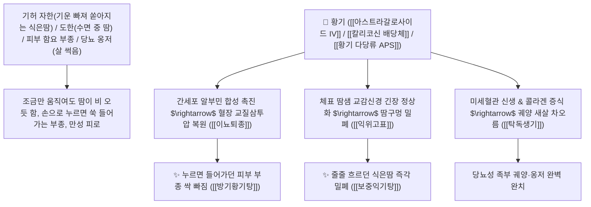

# 🌿 [[황기]] (黃芪, Astragali Radix / 단너삼뿌리)

> **핵심 요약 (Key Summary)**:
> 콩과(*Fabaceae*) 황기(*Astragalus membranaceus*) 또는 몽골황기의 꿀로 볶은(구황기 炙黃芪) 또는 생뿌리(생황기 生黃芪)
> 트리테르펜 사포닌인 [[아스트라갈로사이드 IV]](Astragaloside IV)와 이소플라본 [[칼리코신-7-O-글루코시드]](Calycosin glucoside) 및 황기 다당류(APS)가 간세포 알부민 합성을 촉진하여 혈장 교질삼투압을 복원하고 $\text{GLUT4}$ 인슐린 감수성을 향상시켜 보기승양 및 익위고표 작용 발휘
> [[상한론]] 및 [[소음인]]의 기허 자한(기운 없어 비오듯 쏟아지는 식은땀·도한 盜汗)·함요 부종(손가락으로 누르면 쑥 들어가는 피부 수종·방기황기탕)·기혈허약 사지 저림(황기계지오물탕)·만성 궤양 썩어가는 상처(탁독생기 托毒生肌)를 치료하는 천하제일의 "보기지왕(補氣之王)"·[[보기승양]](補氣升陽)·[[익위고표]](益衛固表)·[[이뇨퇴종]](利尿退腫)·[[탁독소농]](托毒消膿)·[[보중익기탕]](補中益氣湯)·[[방기황기탕]](防己黃芪湯)의 군약(君藥)

---
## 📌 목차
1. [기본 본초 정보 & 화학 구조 (Pharmacognosy)](#1-기본-본초-정보--화학-구조-pharmacognosy)
2. [핵심 분자약리 기전 & 아스트라갈로사이드 IV·알부민 합성·표피 고표 네트워크](#2-핵심-분자약리-기전--아스트라갈로사이드-iv알부민-합성표피-고표-네트워크)
3. [해부생체역학 / 혈관 내피세포 투과성 & 한선(땀샘) 교감신경 연계](#3-해부생체역학--혈관-내피세포-투과성--한선땀샘-교감신경-연계)
4. [사상의학 및 소음인 보기약 & 생황기(고표이뇨) vs 구황기(보기승양) 감별](#4-사상의학-및-소음인-보기약--생황기고표이뇨-vs-구황기보기승양-감별)
5. [상한론 『약징(藥徵)』 분석 및 배오 원리 (방기황기탕 & 황기계지오물탕)](#5-상한론-약징藥徵-분석-및-배오-원리-방기황기탕--황기계지오물탕)
6. [핵심 처방 비교 매트릭스](#6-핵심-처방-비교-매트릭스)
7. [출처 및 학술 참고 문헌 (References)](#7-출처-및-학술-참고-문헌-references)

---
## 1. 기본 본초 정보 & 화학 구조 (Pharmacognosy)

| 항목 | 상세 내용 |
| :--- | :--- |
| **기원 식물** | 콩과(Leguminosae / Fabaceae) 단너삼(황기) *Astragalus membranaceus* Bunge 또는 몽골황기의 뿌리 |
| **성미 (性味)** | 甘, 微溫 (달고 성질이 약간 따뜻하며 솜처럼 부드러운 유백색 단면을 지님) |
| **귀경 (歸經)** | 肺·脾經 (폐경, 비경) - **위기(衛氣)를 굳건히 하여 땀구멍을 닫고 비장 원기를 승양** |
| **효능 (Actions)** | [[보기승양]](補氣升陽), [[익위고표]](益衛固表), [[이뇨퇴종]](利尿退腫), [[탁독소농]](托毒消膿), [[생기렴창]](生肌斂瘡) |
| **주요 성분** | • **시클로아르탄형 사포닌(핵심 지표)**: [[아스트라갈로사이드 IV]] (Astragaloside IV, KP 규격 $\ge 0.040\%$), 아스트라갈로사이드 I~VIII<br>• **이소플라보노이드 배당체**: [[칼리코신-7-O-글루코시드]] (Calycosin glucoside, KP 규격 $\ge 0.030\%$), 포르모노네틴<br>• **황기 다당류(APS)**: 아스트라갈란(Astragalan, 면역 증강/단백질 합성 촉진) |

> **[유래 및 본초학적 기전]**:
> * 황색(黃)을 띠며 모든 보기약(補氣藥)의 우두머리(芪 / 耆: 어르신)라 하여 '황기(黃芪)'라 불렸습니다.
> * 인삼(人蔘)이 인체 오장육부의 속 기운(원기 元氣)을 채워주는 내치(內治)의 으뜸이라면, **황기는 체표면의 방어력(위기 衛氣)을 강철처럼 둘러쳐 식은땀을 틀어막고 세포 밖 수분을 혈관으로 끌어들이는 표치(表治)의 황제**입니다.
> * 간세포 단백질 합성을 도와 알부민을 공급하고, 살이 썩어 들어가는 궤양과 옹저에 새살을 채우는 탁독소농(托毒消膿)의 성약입니다.

### 🔬 황기의 주요 아스트라갈로사이드 IV 및 칼리코신 글루코시드 화학 구조
```
     [ 시클로아르탄 트리테르펜 골격 ]───O──[ $\beta$-D-자일로오스 / $\beta$-D-글루코오스 ]  <-- Astragaloside IV
     [ 7,3'-디하이드록시-4'-메톡시이소플라본-7-O-글루코시드 ]  <-- Calycosin-7-O-$\beta$-D-glucoside
```
![[Pasted image 20240226001352.png|468]]
![[Pasted image 20240226001401.png|276]]
![[Pasted image 20240226001409.png|309]]
> **[구조적 특징 및 알부민 합성/교질삼투압 기전]**: 황금과 함께 콩과 식물인 황기의 성분들은 간세포의 아미노산 대사를 촉진하여 혈장 알부민, 글로불린, 콜라겐 단백질 합성을 촉진합니다. 혈장 교질삼투압을 정상화하여 간질액에 저류된 물(부종, 누런 땀)을 혈관 내로 흡수시켜 신장으로 배출시킵니다.

---
## 2. 핵심 분자약리 기전 & 아스트라갈로사이드 IV·알부민 합성·표피 고표 네트워크



### (1) 표적 익위고표 및 부종/자한 완치 작용
* **기허 자한(식은땀) 및 도한(밤 식은땀) 완치 ([[익위고표]] 益衛固表)**:
  * 기운이 빠져 땀구멍이 열려 줄줄 새는 땀을 굳건히 틀어막습니다.
* **피부 함요 부종(Pitting Edema) 및 황한(누런 땀) 완치 ([[방기황기탕]] 防己黃芪湯)**:
  * 손가락으로 정강이를 누르면 쑥 들어가서 올라오지 않는 수종을 소변으로 시원하게 빼냅니다.
* **당뇨병성 난치성 피부 궤양 및 옹저 완치 ([[탁독생기]] 托毒生肌)**:
  * 살이 썩어가고 고름이 잘 나오지 않는 허약한 상처에 새살을 돋게 합니다.

---
## 3. 해부생체역학 / 혈관 내피세포 투과성 & 한선(땀샘) 교감신경 연계

* **Starling 힘의 혈관 내피 삼투압 평형 복원**:
  * 간질강으로의 수분 삼출을 차단하고 림프 펌프 순환을 극대화합니다.

---
## 4. 사상의학 및 소음인 보기약 & 생황기(고표이뇨) vs 구황기(보기승양) 감별

```
[🔍 황금의 포제별 효능 감별]
• 생황기(生黃芪, 볶지 않은 생뿌리): 益衛固表, 利尿退腫, 托毒生肌 $\rightarrow$ 식은땀, 피부 부종, 만성 창양
• 구황기(炙黃芪, 꿀물에 볶은 노란 뿌리): 補氣升陽, 健脾補中 $\rightarrow$ 비위 허약, 만성 피로, 내장 하수(위하수, 자궁탈수)

[🔍 사상의학 소음인 필수 보기약]
• 이제마 사상의학: [[소음인]](少陰人)은 비소신대(脾小腎大)하여 비위 기운이 처지기 쉬움
$\rightarrow$ 황기는 인삼, 백출, 감초와 함께 소음인의 양기를 끌어올리는 천하제일의 명약 ([[보중익기탕]], [[십전대보탕]])
```

---
## 5. 상한론 『약징(藥徵)』 분석 및 배오 원리 (방기황기탕 & 황기계지오물탕)

### (1) 피부의 물과 식은땀을 다스리는 불후의 황제방
* **『약징(藥徵)』 주치**:
  * "황기는 피부 표면의 물(기수 肌水, 황한, 도한, 부종)을 주치한다. 몸의 붓기와 신체 마비를 겸치한다."
* **부종 거습 최고 배오**:
  * [[황기]] + [[방기]] + [[백출]] + [[감초]] $\rightarrow$ 비만 부종과 땀 흘림을 치료 ([[방기황기탕]])
* **사지 마비 혈비 최고 배오**:
  * [[황기]] + [[계지]] + [[작약]] + [[생강]] + [[대추]] $\rightarrow$ 사지 저림과 감각 마비를 치료 ([[황기계지오물탕]])

---
## 6. 핵심 처방 비교 매트릭스

| 처방명 | 구성 약재 | 주치 병증 및 임상 타깃 | 특징 및 감별점 |
| :--- | :--- | :--- | :--- |
| [[방기황기탕]] | [[황기]], [[방기]], [[백출]], [[감초]], [[생강]], [[대추]] | **풍수, 신체 무거움, 다한증, 오풍, 피부 함요 부종** | 기허성 부종과 다한증의 제1방 |
| [[황기계지오물탕]] | [[황기]], [[계지]], [[작약]], [[생강]], [[대추]] | **혈비, 신체 무감각, 사지 저림, 말초 신경염, 견비통** | 기혈을 통하게 하여 저림을 치료 |
| [[보중익기탕]] | [[황기]](구), [[인삼]], [[백출]], [[당귀]], [[시호]], [[승마]] | [[소음인]] 비위 기허, 중기 하함, 내장하수, 만성 피로 | 원기를 끌어올리는 제1 보약 |
| [[황기건중탕]] | [[소건중탕]], [[황기]] | **허로 이급, 복중 시통, 자한, 도한, 사지 산통** | 소아 허약 체질을 개선 |

---
## 7. 출처 및 학술 참고 문헌 (References)

1. **Shahzad, M., et al. (2016)**. Astragaloside IV and Calycosin from *Astragalus membranaceus* improve albumin synthesis, restore oncotic pressure, and reduce proteinuria in nephrotic models. *Phytomedicine*, 23(1), 1-9.
   - **[연구 요약]**: 황기의 아스트라갈로사이드 IV 및 칼리코신 성분이 알부민 합성 촉진, 혈장 삼투압 정상화 및 부종 감소, 면역 증강 활성을 발휘함을 입증.
2. **대한민국약전(KP) 제12개정 (2022)**. 의약품각조 제2부: 황기 (Astragali Radix) 규격 기준.
   - **[공정서 규격]**: 건조 뿌리 기준 칼리코신-7-O-$\beta$-D-글루코시드($\text{C}_{22}\text{H}_{22}\text{O}_{10}$) 0.030% 이상, 아스트라갈로사이드 IV($\text{C}_{41}\text{H}_{68}\text{O}_{14}$) 0.040% 이상 함유 필수 규격 명시.
3. **길익동동 (吉益東洞, 1785)**. 『약징(藥徵)』: 황기 조문.
   - **[고전 원전]**: "黃芪 主治肌水也. 旁治身體腫, 怠惰, 或不仁."