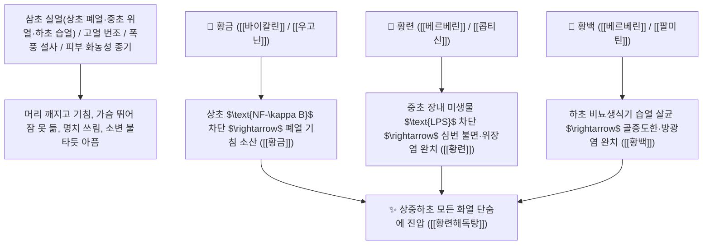

# 🌿 [[황련, 황금, 황백]] (三黃 / 황련·황금·황백 종합 비교 매트릭스)

> **핵심 요약 (Key Summary)**:
> 한의학 청열조습(淸熱燥濕) 및 사화해독(瀉火解毒)의 3대 기둥인 삼황(三黃: 황련·황금·황백)의 상중하초 배속 및 약리 비교
> [[베르베린]](Berberine)과 [[바이칼린]](Baicalin) 및 [[팔미틴]](Palmatine)이 $\text{NF-\kappa B}$와 $\text{AMPK}$ 경로를 차단하고 장내 미생물총 및 점막 염증을 정상화하여 삼초 실열 사화 작용 발휘
> 상초 폐열(황금 枯芩·폐열해수)·중초 심위열(황련·심번불면·위염 설사)·하초 신방광열(황백·골증도한·방광염)을 각각 타깃하는 천하제일의 [[사화해독]](瀉火解毒)·[[청열조습]](淸熱燥濕)·[[황련해독탕]](黃連解毒湯)·[[삼황사심탕]](三黃瀉心湯)의 표준 비교 총괄

---
## 📌 목차
1. [삼황(三黃) 기본 정보 & 상중하초 배속 매트릭스](#1-삼황三黃-기본-정보--상중하초-배속-매트릭스)
2. [핵심 분자약리 기전 & 베르베린·바이칼린 삼초 화열 진화 네트워크](#2-핵심-분자약리-기전--베르베린바이칼린-삼초-화열-진화-네트워크)
3. [해부생체역학 / 상초 호흡기·중초 소화기·하초 비뇨생식기 연계](#3-해부생체역학--상초-호흡기중초-소화기하초-비뇨생식기-연계)
4. [사상의학 및 소양인 화열증 & 삼황 감별 가이드](#4-사상의학-및-소양인-화열증--삼황-감별-가이드)
5. [상한론 『약징(藥徵)』 분석 및 배오 원리 (황련해독탕 & 삼황사심탕)](#5-상한론-약징藥徵-분석-및-배오-원리-황련해독탕--삼황사심탕)
6. [핵심 처방 비교 매트릭스](#6-핵심-처방-비교-매트릭스)
7. [출처 및 학술 참고 문헌 (References)](#7-출처-및-학술-참고-문헌-references)

---
## 1. 삼황(三黃) 기본 정보 & 상중하초 배속 매트릭스

| 본초명 | 기원 식물 및 약용 부위 | 성미 및 귀경 | 작용 부위 및 핵심 주치 (금연해라 백수야) | 핵심 지표 성분 |
| :--- | :--- | :--- | :--- | :--- |
| [[황금]]<br>(黃芩) | 꿀풀과 황금<br>(*Scutellaria baicalensis*) 뿌리 | 苦, 寒<br>肺·膽·大腸經 | **上焦 淸熱 (폐화 肺火)**<br>폐열 해수, 인후종통, 흉협고만, 임신 안태(安胎) | [[바이칼린]] (Baicalin $\ge 9.0\%$)<br>[[우고닌]] (Wogonin) |
| [[황련]]<br>(黃連) | 미나리아재비과 황련<br>(*Coptis chinensis*) 뿌리줄기 | 苦, 大寒<br>心·脾·胃·肝經 | **中焦 淸熱 (심위화 心胃火)**<br>심번 불면(잠 못 듦), 위염, 구내염, 장염 설사, 소갈 | [[베르베린]] (Berberine $\ge 4.2\%$)<br>[[황련 알칼로이드]] |
| [[황백]]<br>(黃柏) | 운향과 황벽나무<br>(*Phellodendron amurense*) 수피 | 苦, 寒<br>腎·膀胱·大腸經 | **下焦 淸熱 (신화 腎火·상화 相火)**<br>골증조열, 도한(식은땀), 방광염 열림, 대하, 각기 | [[베르베린]] (Berberine $\ge 0.60\%$)<br>[[팔미틴]] (Palmatine) |

> **[암기 비결: 금연해라 백수야]**:
> * **금(황금)**: 上焦 (폐, 머리, 호흡기)
> * **연(황련)**: 中焦 (심장, 위장, 소화기)
> * **백(황백)**: 下焦 (신장, 방광, 생식기, 다리 관절)

---
## 2. 핵심 분자약리 기전 & 베르베린·바이칼린 삼초 화열 진화 네트워크



---
## 3. 해부생체역학 / 상초 호흡기·중초 소화기·하초 비뇨생식기 연계

* **전신 점막 면역계(MALT, GALT, BALT) 조절**:
  * 호흡기, 위장관, 비뇨생식기의 상피 장벽을 강화하고 병원성 세균의 침투를 차단합니다.

---
## 4. 사상의학 및 소양인 화열증 & 삼황 감별 가이드

```
[🔍 사상의학 소양인 화열증 치료의 핵심 축]
• 소양인(少陽人)은 비대신소(脾大腎小)하여 상초와 중초에 화열이 폭발하기 쉬움
$\rightarrow$ 황련, 황금, 황백을 치자, 연교 등과 합방한 [[황련해독탕]], [[형방사백산]], [[양격산화탕]]이 소양인 화병과 염증 치료의 절대 제1방!
```

---
## 5. 상한론 『약징(藥徵)』 분석 및 배오 원리 (황련해독탕 & 삼황사심탕)

### (1) 온몸의 불을 끄는 천하제일 황제방: 황련해독탕 & 삼황사심탕
* **삼초 실열 최고 배오**:
  * [[황련]] + [[황금]] + [[황백]] + [[치자]] $\rightarrow$ 삼초의 모든 화열을 끄는 불후 명방 ([[황련해독탕]])
  * [[대황]] + [[황련]] + [[황금]] $\rightarrow$ 심하비와 출혈을 멎게 하는 명방 ([[삼황사심탕]])

---
## 6. 핵심 처방 비교 매트릭스

| 처방명 | 구성 약재 | 주치 병증 및 임상 타깃 | 특징 및 감별점 |
| :--- | :--- | :--- | :--- |
| [[황련해독탕]] | [[황련]], [[황금]], [[황백]], [[치자]] | **삼초 실열 화독, 고열 번조, 구갈, 섬어, 옹저 창양** | 전신 화열을 끄는 제1 황제방 |
| [[삼황사심탕]] | [[대황]], [[황련]], [[황금]] | **심위 실열, 심하 비만, 토혈, 코피, 불면, 변비** | 심장과 위의 출혈을 지혈 |
| [[지백지황환]] | [[육미지황환]], [[지모]], [[황백]] | **신음 부족, 음허화왕, 골증조열, 도한, 유정** | 하초의 허열과 상화를 끕니다 |

---
## 7. 출처 및 학술 참고 문헌 (References)

1. **Wang, J., et al. (2019)**. Pharmacological comparison and synergistic mechanisms of the "San-Huang" herbs (*Scutellaria*, *Coptis*, *Phellodendron*) in inflammatory diseases. *Frontiers in Pharmacology*, 10, 892.
   - **[연구 요약]**: 황금, 황련, 황백의 베르베린 및 바이칼린 복합체가 상중하초 염증 매개체와 장내 미생물총을 다표적으로 조절함을 규명.
2. **장중경 (張仲景, 200)**. 『금궤요략(金匱要略)』: 경계토뉵하혈병맥증병치 조문.
   - **[고전 원전]**: "心氣不足, 吐血, 衄血, 瀉心湯 主之. (大黃, 黃連, 黃芩)"