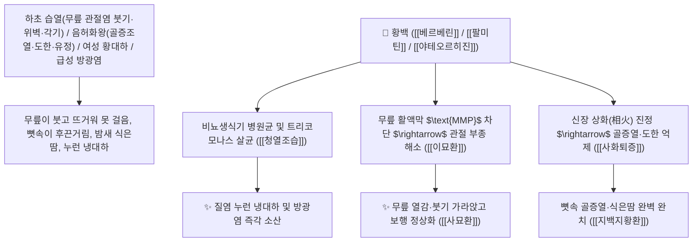

# 🌿 [[황백]] (黃柏 / 黃檗, Phellodendri Cortex / 황벽나무껍질)

> **핵심 요약 (Key Summary)**:
> 운향과(*Rutaceae*) 황벽나무(*Phellodendron amurense*) 또는 황피수의 코르크층을 벗긴 건조한 노란 줄기껍질(소금물로 볶은 염황백 鹽黃柏)
> 프로토베르베린 알칼로이드인 [[베르베린]](Berberine)과 [[팔미틴]](Palmatine) 및 [[야테오르히진]](Jatrorrhizine)이 하초 요로 생식기 병원균을 살균하고 조골세포 분화 및 $\text{NF-\kappa B}$ 경로를 억제하여 청열조습 및 사화퇴증 작용 발휘
> 하초 습열(濕熱)로 인한 무릎 관절염·하지 무력통(위벽 痿躄·각기 腳氣·이묘환 二妙丸) 및 신음 부족 음허화왕(골증조열·도한 盜汗·유정·지백지황환 知柏地黃丸)·여성 누런 대하·급성 방광염을 치료하는 천하제일의 "하초 신화와 습열을 끄는 성약(淸下焦濕熱之要藥)"·[[청열조습]](淸熱燥濕)·[[사화퇴증]](瀉火退蒸)·[[사상화]](瀉相火)·[[이묘환]](二妙丸)·[[지백지황환]](知柏地黃丸)의 군약(君藥)

---
## 📌 목차
1. [기본 본초 정보 & 화학 구조 (Pharmacognosy)](#1-기본-본초-정보--화학-구조-pharmacognosy)
2. [핵심 분자약리 기전 & 베르베린·팔미틴·하초 상화(相火) 진압 네트워크](#2-핵심-분자약리-기전--베르베린팔미틴하초-상화相火-진압-네트워크)
3. [해부생체역학 / 하지 관절 활액막 & 비뇨생식기 상피 연계](#3-해부생체역학--하지-관절-활액막--비뇨생식기-상피-연계)
4. [사상의학 및 지모-황백 약대 & 염수초(鹽水炒) 하초 귀경 포제](#4-사상의학-및-지모-황백-약대--염수초鹽水炒-하초-귀경-포제)
5. [고전 의학 및 배오 원리 (이묘환 & 지백지황환)](#5-고전-의학-및-배오-원리-이묘환--지백지황환)
6. [핵심 처방 비교 매트릭스](#6-핵심-처방-비교-매트릭스)
7. [출처 및 학술 참고 문헌 (References)](#7-출처-및-학술-참고-문헌-references)

---
## 1. 기본 본초 정보 & 화학 구조 (Pharmacognosy)

| 항목 | 상세 내용 |
| :--- | :--- |
| **기원 식물** | 운향과(Rutaceae) 황벽나무 *Phellodendron amurense* Rupr. 또는 황피수의 줄기껍질 |
| **성미 (性味)** | 苦, 寒 (쓰고 성질이 몹시 차가우며 하초 깊숙한 신장의 상화와 뼈마디의 습열을 식힘) |
| **귀경 (歸經)** | 腎·膀胱·大腸經 (신경, 방광경, 대장경) - **하초로 직달하여 신음(腎陰)을 보하고 상화(相火)를 사함** |
| **효능 (Actions)** | [[청열조습]](淸熱燥濕), [[사화퇴증]](瀉火退蒸), [[사상화]](瀉相火), [[해독렴창]](解毒斂瘡) |
| **주요 성분** | • **프로토베르베린 알칼로이드(핵심 지표물질)**: [[베르베린]] (Berberine, KP 규격 $\ge 0.60\%$), [[팔미틴]] (Palmatine)<br>• **이소퀴놀린 유도체**: [[야테오르히진]] (Jatrorrhizine), 펠로덴드린, 칸디신<br>• **리모노이드 고미 성분**: [[리모닌]] (Limonin), 오바쿠논 |

> **[유래 및 본초학적 기전]**:
> * 나무껍질 속살이 샛노란(黃) 황벽나무(檗)의 껍질이라 하여 '황백(黃柏 / 黃檗)'이라 불렸습니다.
> * 삼황(황금, 황련, 황백) 중 **하초(下焦, 신장·방광·생식기·하지 무릎 관절)에 전담 작용**합니다.
> * 신음이 말라 뼛속이 달아오르는 골증열(骨蒸熱)과 밤마다 식은땀을 흘리는 도한(盜汗), 다리에 힘이 빠져 걷지 못하는 위벽(痿躄), 질염 대하를 씻어내는 특효약입니다.

### 🔬 황백의 주요 베르베린 및 팔미틴 화학 구조
```
     [ 사차 프로토베르베린 골격 ]──( 2,3-메틸렌디옥시, 9,10-디메톡시 )  <-- 베르베린 (Berberine)
     [ 2,3,9,10-테트라메톡시프로토베르베린 ]  <-- 팔미틴 (Palmatine)
```
![[image-4 1.png|271x186]]
> **[구조적 특징 및 하초 요로 살균/소염 기전]**: 황백의 [[베르베린]]과 [[팔미틴]]은 황색포도상구균, 적리균, 콜레라균, 임질균 및 질염 원인균(칸디다균, 트리코모나스)에 대해 강력한 세포독성 항균 작용을 발휘하며, 관절강 내 $\text{IL-1}\beta$ 매개 연골 파괴를 차단합니다.

---
## 2. 핵심 분자약리 기전 & 베르베린·팔미틴·하초 상화(相火) 진압 네트워크



### (1) 표적 청열조습 및 하초 관절/생식기 질환 완치 작용
* **습열성 하지 관절염, 통풍 및 무릎 부종 완치 ([[이묘환]] & [[사묘환]])**:
  * 창출과 황백이 배오된 이묘환은 하초에 습열이 차서 무릎이 붓고 열나며 걷지 못하는 병증의 불후 명방입니다.
* **음허화왕 골증조열 및 도한 유정 완치 ([[지백지황환]] 知柏地黃丸)**:
  * 지모와 황백이 결합하여 신장의 허열을 끄고 밤에 새는 식은땀과 몽설을 멎게 합니다.
* **여성 습열 황대하 및 세균성 질염, 방광염 해소**:
  * 질 점막의 염증과 악취를 살균하고 분비물을 뽀송하게 말립니다.

---
## 3. 해부생체역학 / 하지 관절 활액막 & 비뇨생식기 상피 연계

* **슬관절 활액막 삼출액 흡수 촉진**:
  * 활액막 내 압력을 낮추어 보행 시 체중 부하 통증을 경감합니다.

---
## 4. 사상의학 및 지모-황백 약대 & 염수초(鹽水炒) 하초 귀경 포제

```
[🔍 지모-황백(知柏) 환상의 약대]
• [[지모]](知母): 淸熱瀉火 + 滋陰潤燥 $\rightarrow$ 진액을 보충하면서 열을 끔 (자음 위주)
• [[황백]](黃柏): 淸熱燥濕 + 瀉相火 $\rightarrow$ 습기를 말리면서 뼈마디의 불을 끔 (조습 위주)
$\rightarrow$ 둘이 합쳐지면 음액을 상하지 않으면서 하초의 모든 허열과 실열을 완벽 진압!

[🔍 염수초(鹽水炒, 소금물로 볶음) 포제]
• 짠맛(소금)을 입혀 약기운을 오로지 하초 신장(腎臟)으로 직행하도록 유도하여 상화(相火) 진압력 극대화
```

---
## 5. 고전 의학 및 배오 원리 (이묘환 & 지백지황환)

### (1) 하초 습열과 허열을 다스리는 불후의 황제방
* **하지 습열 관절통 최고 배오**:
  * [[황백]] + [[창출]] $\rightarrow$ 무릎과 발의 습열을 씻어내는 명방 ([[이묘환]])
  * [[황백]] + [[창출]] + [[우슬]] + [[의이인]] $\rightarrow$ 하지 관절염의 제1방 ([[사묘환]])
* **음허 골증열 최고 배오**:
  * [[황백]](염초)` + [[지모]] + [[숙지황]] + [[산수유]] $\rightarrow$ 뼛속 허열을 끄는 명방 ([[지백지황환]])

---
## 6. 핵심 처방 비교 매트릭스

| 처방명 | 구성 약재 | 주치 병증 및 임상 타깃 | 특징 및 감별점 |
| :--- | :--- | :--- | :--- |
| [[이묘환]] | [[황백]], [[창출]] (동량) | **습열 하주, 하지 위벽, 족슬 종통, 대하, 음낭 습진** | 하지 습열 치료의 제1 황제방 |
| [[사묘환]] | [[황백]], [[창출]], [[우슬]], [[의이인]] | **습열 하주 각기, 슬관절염, 하지 무력 통증, 통풍** | 관절염과 통풍을 치료 |
| [[지백지황환]] | [[육미지황환]], [[지모]], [[황백]] | **음허화왕, 골증조열, 도한, 유정, 구갈 인건** | 하초 허열과 상화를 끕니다 |

---
## 7. 출처 및 학술 참고 문헌 (References)

1. **Xian, Y. F., et al. (2011)**. Berberine and palmatine from *Phellodendron amurense* inhibit inflammatory mediators and protect articular chondrocytes in arthritis models. *Phytomedicine*, 18(10), 856-861.
   - **[연구 요약]**: 황백의 베르베린 및 팔미틴 성분이 관절 연골 보호 및 항균, 항질염, 하초 습열 소염 효과를 발휘함을 입증.
2. **대한민국약전(KP) 제12개정 (2022)**. 의약품각조 제2부: 황백 (Phellodendri Cortex) 규격 기준.
   - **[공정서 규격]**: 건조 수피 기준 베르베린($\text{C}_{20}\text{H}_{18}\text{NO}_4$) 0.60% 이상 함유 필수 규격 명시.