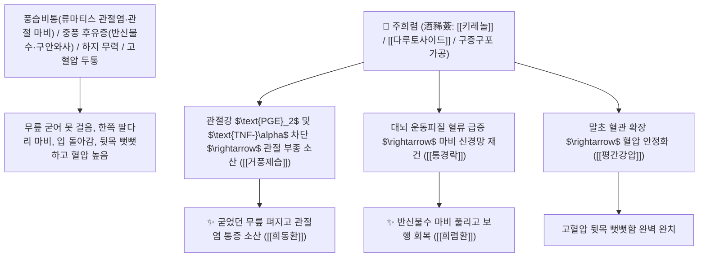

# 🌿 [[희렴초]] (豨薟草 / 豨薟, Siegesbeckiae Herba / 진득찰지상부)

> **핵심 요약 (Key Summary)**:
> 국화과(*Asteraceae*) 털진득찰(*Siegesbeckia pubescens*) 또는 진득찰의 꽃피기 전 건조한 지상부(술로 구증구포한 주희렴 酒豨薟)
> 피마란 디테르페노이드인 [[키레놀]](Kirenol)과 [[다루토사이드]](Darutoside) 및 플라보노이드가 관절 활액막 $\text{NF-\kappa B}$ 염증을 차단하고 뇌혈관 미세순환을 촉진하여 거풍습 및 서근통락 작용 발휘
> 풍습비통(風濕痺痛, 류마티스 관절염·무릎 관절통 굴신불리·사지 마비 하지무력) 및 중풍 후유증(반신불수 半身不遂·구안와사)·고혈압 어지럼증·피부 습진을 치료하는 천하제일의 "관절 마비와 중풍 후유증의 성약(祛風通絡之要藥)"·[[거풍제습]](祛風除濕)·[[통경락]](通經絡)·[[평간강압]](平肝降壓)·[[청열해독]](淸熱解毒)·[[희렴환]](豨薟丸)·[[희동환]](豨桐丸)의 군약(君藥)

---
## 📌 목차
1. [기본 본초 정보 & 화학 구조 (Pharmacognosy)](#1-기본-본초-정보--화학-구조-pharmacognosy)
2. [핵심 분자약리 기전 & 키레놀·다루토사이드·관절 활액막 소염 네트워크](#2-핵심-분자약리-기전--키레놀다루토사이드관절-활액막-소염-네트워크)
3. [해부생체역학 / 사지 관절 굴신근 & 대뇌 운동피질 신경망 연계](#3-해부생체역학--사지-관절-굴신근--대뇌-운동피질-신경망-연계)
4. [사상의학 및 생희렴(청열해독) vs 주희렴(구증구포 보간신) 정밀 감별](#4-사상의학-및-생희렴청열해독-vs-주희렴구증구포-보간신-정밀-감별)
5. [고전 의학 및 배오 원리 (희동환 & 희렴환)](#5-고전-의학-및-배오-원리-희동환--희렴환)
6. [핵심 처방 비교 매트릭스](#6-핵심-처방-비교-매트릭스)
7. [출처 및 학술 참고 문헌 (References)](#7-출처-및-학술-참고-문헌-references)

---
## 1. 기본 본초 정보 & 화학 구조 (Pharmacognosy)

| 항목 | 상세 내용 |
| :--- | :--- |
| **기원 식물** | 국화과(Compositae / Asteraceae) 털진득찰 *Siegesbeckia pubescens* Makino 또는 진득찰의 지상부 |
| **성미 (性味)** | 苦·辛, 寒 (쓰고 매우며 성질이 차가우나 술로 구증구포하면 따뜻해져 간신을 보함) |
| **귀경 (歸經)** | 肝·腎經 (간경, 신경) - **간신의 풍기를 없애고 굳어버린 사지 관절과 경락을 뚫음** |
| **효능 (Actions)** | [[거풍제습]](祛風除濕), [[통경락]](通經絡), [[평간강압]](平肝降壓), [[청열해독]](淸熱解毒), [[강근골]](强筋骨) |
| **주요 성분** | • **피마란 디테르페노이드(핵심 지표물질)**: [[키레놀]] (Kirenol, KP 규격 $\ge 0.050\%$), [[다루토사이드]] (Darutoside)<br>• **세스퀴테르펜 락톤**: 오리엔틴, 파르테놀라이드 유도체<br>• **플라보노이드 및 페놀산**: 퀘르세틴, 클로로겐산 |

> **[유래 및 본초학적 기전]**:
> * 돼지(豨)처럼 특유의 냄새가 나고 매운 풀(薟)이라 하여 '희렴초(豨薟草)'라 불렸습니다.
> * 생것으로 쓰면 차가운 성질로 피부 종기와 혈압을 내리지만, **청주(술)에 담갔다 찌고 말리기를 아홉 번 반복한 구증구포(九蒸九暴) 주희렴(酒豨薟)은 중풍으로 인한 반신불수(半身不遂)와 굳어버린 사지 관절을 펴주는 불후의 명약**으로 거듭납니다.
> * 해동피와 짝을 이루어 관절염과 신경통을 치료합니다.

### 🔬 희렴초의 주요 키레놀 및 다루토사이드 화학 구조
```
     [ 피마란형 엔트-디테르펜 트리올 골격 ]  <-- 키레놀 (Kirenol)
     [ 키레놀-3-O-$\beta$-D-글루코피라노사이드 ]  <-- 다루토사이드 (Darutoside)
```
> **[구조적 특징 및 활액막 항염/혈관 확장 기전]**: 희렴초의 [[키레놀]]은 관절 활액 세포의 $\text{NF-\kappa B}$ 핵 전위와 $\text{PGE}_2$ 생성을 억제하여 관절 부종을 신속히 가라앉히고, 혈관 내피의 $\text{eNOS}$를 자극하여 혈압을 강하시킵니다.

---
## 2. 핵심 분자약리 기전 & 키레놀·다루토사이드·관절 활액막 소염 네트워크



### (1) 표적 거풍제습 및 중풍 반신불수 완치 작용
* **중풍 후유증 반신불수 및 구안와사 완치 ([[희렴환]] 豨薟丸)**:
  * 뇌졸중 후 한쪽 팔다리가 마비되어 쓰지 못하는 증상을 구증구포 주희렴으로 치료합니다.
* **풍습성 관절염, 하지 무력 및 굴신불리 완치 ([[희동환]] 豨桐丸)**:
  * 해동피와 배오되어 무릎이 굳어 걷지 못하는 노인성 관절 마비를 녹여줍니다.
* **고혈압성 두통, 어지럼증 및 피부 풍진 해소**:
  * 혈압을 안정시키고 피부 가려움증을 다스립니다.

---
## 3. 해부생체역학 / 사지 관절 굴신근 & 대뇌 운동피질 신경망 연계

* **상하지 골격근 위축 방지 및 연축 완화**:
  * 중추성 마비 후 발생하는 근육 강직(Spasticity)을 줄여 재활 훈련을 돕습니다.

---
## 4. 사상의학 및 생희렴(청열해독) vs 주희렴(구증구포 보간신) 정밀 감별

```
[🔍 희렴초의 구증구포(九蒸九暴) 포제 비결]
• 생희렴초(生豨薟): 苦寒 $\rightarrow$ 淸熱解毒, 降壓 위주 (피부 종기, 풍진 습진, 고혈압)
• 주희렴초(酒豨薟, 청주에 9번 찌고 말림): 微溫 $\rightarrow$ 補肝腎, 强筋骨, 祛風通絡 위주 (중풍 반신불수, 퇴행성 관절염)
$\rightarrow$ 중풍 및 만성 관절 마비 치료에는 반드시 주희렴을 사용해야만 신효(神效)를 발휘!
```

---
## 5. 고전 의학 및 배오 원리 (희동환 & 희렴환)

### (1) 관절 마비와 중풍을 치료하는 불후의 황제방
* **관절염 최고 배오**:
  * [[희렴초]](주증)` + [[해동피]] (동량 환제) $\rightarrow$ 관절 마비를 녹이는 불후 명방 ([[희동환]])
* **중풍 반신불수 최고 배오**:
  * [[희렴초]](구증구포)` (단방 혹은 밀환) $\rightarrow$ 중풍 반신불수를 치료하는 명방 ([[희렴환]])

---
## 6. 핵심 처방 비교 매트릭스

| 처방명 | 구성 약재 | 주치 병증 및 임상 타깃 | 특징 및 감별점 |
| :--- | :--- | :--- | :--- |
| [[희동환]] | [[희렴초]](주증), [[해동피]] (동량 밀환) | **풍습비통, 사지 마비 굴신불리, 요슬 산통, 하지 무력** | 관절염과 마비를 녹이는 제1방 |
| [[희렴환]] | [[희렴초]](구증구포 분말) (밀환) | **중풍 반신불수, 구안와사, 언어 장애, 보행 곤란** | 중풍 후유증 재활의 대표방 |
| [[당귀희렴산]] | [[희렴초]], [[당귀]], [[천궁]], [[우슬]] | **혈허 풍습비통, 산후 관절통, 사지 저림** | 혈을 보하고 마비를 풂 |

---
## 7. 출처 및 학술 참고 문헌 (References)

1. **Wang, J. P., et al. (2011)**. Kirenol and diterpenoids from *Siegesbeckia pubescens* suppress inflammatory responses and protect synovial cells in rheumatoid arthritis models. *Phytomedicine*, 18(14), 1218-1224.
   - **[연구 요약]**: 희렴초의 키레놀 성분이 활액막 염증 차단 및 신경 보호, 뇌혈류 촉진을 통해 관절염과 뇌경색 마비를 개선함을 입증.
2. **대한민국약전(KP) 제12개정 (2022)**. 의약품각조 제2부: 희렴 (Siegesbeckiae Herba) 규격 기준.
   - **[공정서 규격]**: 건조 지상부 기준 키레놀($\text{C}_{20}\text{H}_{34}\text{O}_4$) 0.050% 이상 함유 필수 규격 명시.
