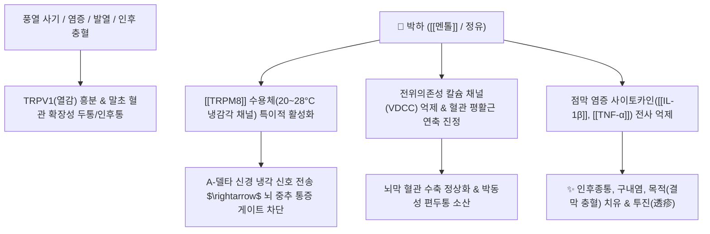

# 🌿 [[박하]] (薄荷, Menthae Herba)

> **핵심 요약 (Key Summary)**:
> 꿀풀과(*Lamiaceae*) 박하(*Mentha canadensis*)의 지상부
> 모노테르펜인 [[멘톨]](l-Menthol)이 냉감각 수용체인 [[TRPM8]](20~28°C)을 자극하여 혈관 평활근 연축과 감각신경 과흥분을 진정시키고 소염·진통 작용 발휘
> 상초 풍열(風熱)로 인한 두통·목적(눈 충혈)·인후종통 및 간기울결(肝氣鬱結)을 치료하는 대표적인 [[소산풍열]](疏散風熱)·[[청리두목]](淸利頭目)·[[소간행기]](疏肝行氣) 약재

---
## 📌 목차
1. [기본 본초 정보 & 화학 구조 (Pharmacognosy)](#1-기본-본초-정보--화학-구조-pharmacognosy)
2. [핵심 분자약리 기전 & TRP 이온 채널 네트워크](#2-핵심-분자약리-기전--trp-이온-채널-네트워크)
3. [해부생체역학 / 두경부 미세혈관 & 신경 대사 연계](#3-해부생체역학--두경부-미세혈관--신경-대사-연계)
4. [사상의학 및 체질별 임상 응용 (적응증 vs 금기)](#4-사상의학-및-체질별-임상-응용-적응증-vs-금기)
5. [상한론 및 고전 의학 배오 원리](#5-상한론-및-고전-의학-배오-원리)
6. [핵심 처방 비교 매트릭스](#6-핵심-처방-비교-매트릭스)
7. [출처 및 학술 참고 문헌 (References)](#7-출처-및-학술-참고-문헌-references)

---
## 1. 기본 본초 정보 & 화학 구조 (Pharmacognosy)

> [!abstract]+ 🧪 3D 약리 분자 구조 (Interactive 3D Viewer)
> <iframe src="https://molecule-viewer-rho.vercel.app/?cid=1254" style="width: 100%; height: 600px; border: none; border-radius: 12px; box-shadow: 0 4px 20px rgba(0,0,0,0.15);" allowfullscreen></iframe>


| 항목 | 상세 내용 |
| :--- | :--- |
| **기원 식물** | 꿀풀과(Labiatae / Lamiaceae) 박하 *Mentha arvensis* L. var. *piperascens* Malinvaud ex Holmes 또는 근연종의 지상부 |
| **성미 (性味)** | 辛, 凉 |
| **귀경 (歸經)** | 肺·肝經 (폐경, 간경) |
| **효능 (Actions)** | [[소산풍열]](疏散風熱), [[청리두목]](淸利頭目), [[이후투진]](利咽透疹), [[소간행기]](疏肝行氣) |
| **주요 성분** | • **모노테르펜 정유**: [[멘톨]] (l-Menthol, KP 규격 $\ge 0.8\%$), 멘톤(Menthone), 이소멘톤, 멘틸아세테이트, 피페리톤<br>• **페놀산 및 플라보노이드**: [[로즈마린산]] (Rosmarinic acid), 루테올린, 에리오시트린 |

> **[유래 및 본초학적 기전]**:
> * 박하사탕을 먹으면 입안이 화하고 시원해지는 것처럼, 체표와 상초를 차갑게 식혀주면서 울체된 풍열(風熱)을 밖으로 발산시킵니다.
> * 폐와 간경에 작용하여 머리와 눈을 맑게 하고, 인후염·구내염·피부 발진(마진, 풍진)을 치료하며, 발산하는 힘으로 간기울결(스트레스)을 시원하게 풀어줍니다.
> * 보혈약이나 감적(疳積)으로 인한 소아 신열에는 진액을 소모할 수 있어 단독 사용을 피합니다.

### 🔬 박하의 주요 지표물질 화학 구조
```
        CH3
         |
      [고리]
     /      \
    HO       CH(CH3)2  <-- 멘톨 (l-Menthol)
```
> **[구조적 특징 및 휘발성]**: 핵심 모노테르펜 알코올인 [[멘톨]]은 지용성이 높고 휘발성이 강하여 후하(後下, 탕약 전탕 마지막에 살짝 끓임)하여 향기 성분을 보존해야 하며, 세포막 지질층을 신속히 통과하여 감각신경 수용체에 직접 결합합니다.

---
## 2. 핵심 분자약리 기전 & TRP 이온 채널 네트워크



### (1) TRP 채널(Transient Receptor Potential Channel) 조절 기전
* **TRP 양이온 통로 단백질 특성**:
  * 세포막에 박혀 있는 양이온 통로로 온도 변화, 물리적 압력, 염증 신호, 산염기 변화 및 화학 물질에 반응하여 열립니다.
  * [[TRPA1]]: 17°C 이하 극저온 및 유해 화학 자극 반응
  * [[TRPM8]]: **20~28°C 온화한 냉감 온도에서 개방 (박하의 주 작용점)**
  * [[TRPV4]]: 33~39°C 체온 범위
  * [[TRPV1]]: 42°C 이상 유해 열자극 및 캡사이신 반응 (염증성 통증)
  * [[TRPV2]]: 52°C 이상 고열 손상 반응

![[Pasted image 20240513145505.png|377]]
![[Pasted image 20240513145130.png|437]]

* [[멘톨]]의 [[TRPM8]] 작용 및 진정 효과:
  * [[멘톨]]은 체온보다 낮은 20~28°C 영역의 [[TRPM8]] 채널을 인위적으로 활성화하여 차가운 감각(냉감) 신경 신호를 유발합니다.
  * 이로 인해 척수 후각의 통증 전달 게이트가 닫히며(Gate control theory), 흥분한 혈관 평활근 세포를 안정화하고 전신 대사 시스템과 신경·면역 시스템의 과열을 진정시킵니다.

---
## 3. 해부생체역학 / 두경부 미세혈관 & 신경 대사 연계

* **두경부 및 안면 미세혈관 수축 (청리두목 淸利頭目)**:
  * 열성 혈관 확장으로 욱신거리는 박동성 편두통 및 결막 충혈(목적 目的)에서 혈관 평활근의 칼슘 유입을 조절하여 혈류 압력을 정상화합니다.
* **상기도 점막 분비 및 섬모 운동 개선**:
  * 기관지 점막의 항균 및 충혈 완화 작용을 통해 급성 인후염, 편도선염의 부종을 신속히 가라앉힙니다.

---
## 4. 사상의학 및 체질별 임상 응용 (적응증 vs 금기)

```
[✅ 최적 적응증 (Sweet Spot)]
• 풍열 감모: 발열, 가벼운 오한, 땀이 잘 안 나고 머리가 쪼개지듯 아프며 목구멍이 붓고 아픈 경우
• 두경부 열증: 눈이 붉게 충혈되고 붓는 증상(목적종통), 치통, 구내염
• 발진성 질환: 홍역, 수두, 풍진 초기 발진이 시원하게 돋지 않고 열이 갇힌 경우 (투진 透疹)
• 간기울결: 스트레스로 가슴과 옆구리가 답답하고 한숨을 자주 쉬는 울증 ([[소요산]])

[⚠️ 신중 투여 및 금기 (Caution / Contraindication)]
• 허한(虛寒) 및 음허 발열 환자: 땀을 과도하게 흘리는 자한(自汗) 환자나 음허도한 환자
• 수유부 주의: 정유 성분이 젖 분비를 억제할 수 있음
• 전탕 주의: 오래 끓이면 방향성 정유가 날아가므로 반드시 후하(後下, 끓기 직전 3~5분 투입)
```

---
## 5. 상한론 및 고전 의학 배오 원리

### (1) 고전 본초학적 배오 원리
* **핵심 배오**:
  * [[박하]] + [[금은화]] + [[연교]] $\rightarrow$ 상초 풍열과 급성 인후염을 끄는 최고의 청열해표 조합 ([[은교산]])
  * [[박하]] + [[시호]] + [[백작약]] $\rightarrow$ 간기(肝氣)의 울체를 소통시키고 혈맥을 조화롭게 함 ([[소요산]])
  * [[박하]] + [[상엽]] + [[국화]] $\rightarrow$ 풍열 두통과 안구 충혈을 맑게 씻어냄 ([[상국음]])

---
## 6. 핵심 처방 비교 매트릭스

| 처방명 | 구성 약재 | 주치 병증 및 임상 타깃 | 특징 및 감별점 |
| :--- | :--- | :--- | :--- |
| [[은교산]] | [[금은화]], [[연교]], [[박하]], [[길경]], [[우방자]], [[죽엽]] 등 | **온병(溫病) 초기, 발열, 인후종통, 구갈, 무한/미한** | 풍열 감기와 급성 편도선염의 제1선 처방 |
| [[상국음]] | [[상엽]], [[국화]], [[박하]], [[연교]], [[길경]], [[행인]] 등 | **풍열 해수, 가벼운 발열, 마른 기침, 눈 충혈** | 은교산보다 해열력은 완만하나 진해·두목 청리에 특화 |
| [[소요산]] | [[시호]], [[당귀]], [[백작약]], [[백출]], [[복령]], [[박하]], [[생강]] | **간울혈허(肝鬱血虛), 양협통, 두훈, 생리불순, 유방팽통** | 박하를 소량 가미하여 간기를 소통시키고 울열 해소 |
| [[청인이격탕]] | [[박하]], [[연교]], [[치자]], [[황금]], [[황련]], [[길경]] 등 | **상초 풍열 실증, 극심한 인후통, 연하 곤란, 구창** | 인후부의 극심한 화열 독소를 강하게 사하 |
| [[가감통유탕]] | [[박하]], [[승마]], [[갈근]], [[황기]], [[당귀]] 등 | **두면부 풍열, 치통, 안면부 열감 및 부종** | 상초의 열을 체표 밖으로 흩어버림 |

---
## 7. 출처 및 학술 참고 문헌 (References)

1. **McKemy, D. D., Neuhausser, W. M., & Julius, D. (2002)**. Identification of a cold receptor reveals a general role for TRP channels in thermosensation. *Nature*, 416(6876), 52-58. doi:10.1038/nature719. [PMID: 11882888](https://pubmed.ncbi.nlm.nih.gov/11882888/)
   - **[연구 요약]**: 멘톨이 냉각 수용체인 TRPM8 채널을 직접 자극하여 세포 내 칼슘 유입 및 한랭 감각을 유발함을 세계 최초로 규명한 랜드마크 연구.
2. **대한민국약전(KP) 제12개정 (2022)**. 의약품각조 제2부: 박하 (Menthae Herba) 규격 기준.
   - **[공정서 규격]**: 건조물 기준 멘톨($\text{C}_{10}\text{H}_{20}\text{O}$) 0.8% 이상 함유 필수 규격 명시.
