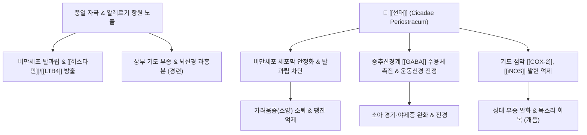

---
aliases:
  - 선태
  - 蟬蛻
  - Cicadae Periostracum
  - 매미허물
tags:
  - 본초
  - 신량해표약
  - 해표약
  - 소산풍열
  - 투진지양
  - 명목퇴예
  - 식풍지경
  - 소아경풍
  - 인후염
---
# 🌿 [[선태]] (蟬蛻, Cicadae Periostracum)

> **핵심 요약 (Key Summary)**:
> 매미과(Cicadidae) 말매미(*Cryptotympana atrata* Fabricius)의 유충이 탈피한 각피(허물).
> 키틴(Chitin), 아미노산, 단백질 및 N-아세틸도파민 유도체가 비만세포 탈과립 차단, 항히스타민 작용, [[GABA]] 수용체 매개 진정·진경 활성 발휘.
> 풍열로 인한 인후종통, 음아서(목쉼), 마진 투발 불량, 풍진 가려움증, 소아 야제증 및 안과 예막(翳膜) 치료의 대표 신량해표 약재.

---

> [!abstract]+ 🧪 3D 약리 분자 구조 (Interactive 3D Viewer)
> <iframe src="https://molecule-viewer-rho.vercel.app/?cid=6857375" style="width: 100%; height: 600px; border: none; border-radius: 12px; box-shadow: 0 4px 20px rgba(0,0,0,0.15);" allowfullscreen></iframe>

## 📌 목차
1. [기본 본초 정보 & 화학 성분 (Pharmacognosy)](#1-기본-본초-정보--화학-성분-pharmacognosy)
2. [핵심 분자약리 기전 & 대사 네트워크](#2-핵심-분자약리-기전--대사-네트워크)
3. [근육·신경 대사 및 반사계 연계](#3-근육신경-대사-및-반사계-연계)
4. [사상의학 및 체질별 임상 응용](#4-사상의학-및-체질별-임상-응용)
5. [상한·온병 배오 원리 및 주요 방제](#5-상한온병-배오-원리-및-주요-방제)
6. [출처 및 학술 참고 문헌 (References)](#6-출처-및-학술-참고-문헌-references)

---

## 1. 기본 본초 정보 & 화학 성분 (Pharmacognosy)

| 항목 | 상세 내용 |
| :--- | :--- |
| **기원 동물** | 매미과(Cicadidae) 말매미(*Cryptotympana atrata* Fabr.)의 탈피 각피 |
| **성미 (性味)** | 감(甘), 함(鹹), 량(凉) |
| **귀경 (歸經)** | 폐경(肺經), 간경(肝經) |
| **전통 효능** | 소산풍열(疏散風熱), 투진지양(透疹止痒), 명목퇴예(明目退翳), 식풍지경(息風止痙) |
| **주요 성분** | • **키틴질/다당체**: 키틴(Chitin, 약 40~50%), 키토산 • **아미노산/단백질**: 알라닌, 글리신, 프롤린, 아스파르트산 등 17종 아미노산 • **폴리페놀/아민 유도체**: N-acetyldopamine di- and trimer, 퀴논류 |

---

## 2. 핵심 분자약리 기전 & 대사 네트워크

* **항알레르기 및 강력한 소양증(가려움) 억제**:
  * 비만세포 세포막의 칼슘 이온 유입을 차단하여 히스타민, 세로토닌, 류코트리엔의 유리를 억제함으로써 담마진(두드러기), 알레르기 비염, 아토피성 소양증을 신속히 완화.
* **상기도 점막 소염 및 성대 개음(開音) 작용**:
  * 후두 및 성대 점막의 충혈과 부종을 해소하여 급성 후두염으로 인한 목쉼(음아서)을 치료.
* **중추신경 억제 및 항경련 활성**:
  * 대뇌 피질의 자발 운동을 진정시키고 체온 조절 중추의 안정을 도와, 소아 고열로 인한 파상풍 유사 경련과 야간 경기를 억제.

---

## 3. 근육·신경 대사 및 반사계 연계

* **후두 내전근 및 성대 평활근 긴장 완화**:
  * 성대를 조절하는 후두 근육군의 과긴장과 림프 부종을 소퇴시켜 발성 장애를 해소.
* **소아 척수 반사 진정**:
  * 소아 뇌간 및 척수의 과민한 반사궁을 억제하여 돌발적인 근육 연축과 사지 떨림을 방지.

---

## 4. 사상의학 및 체질별 임상 응용

* **소양인(少陽人) 표한병·흉격열증의 요약**:
  * 소양인의 상초 화열이 성대와 피부로 뿜어져 나와 생기는 목쉼, 급성 인두염, 피부 풍진에 [[형방패독산]]이나 [[형개연교탕]]에 가미하여 다용.
* **태음인(太陰人) 폐계(肺系) 건조 시 주의**:
  * 가볍게 흩어버리는(승산) 성질이 있으므로, 폐음이 부족하여 헛기침을 하는 환자는 단독 과용을 피함.
* **복용 금기**:
  * 임산부(활태 작용이 있어 유산 위험 가능성 제기)에게는 투약 주의 또는 금기.

---

## 5. 상한·온병 배오 원리 및 주요 방제

* **배오 원리**:
  * 선태 + [[박하]]: 풍열을 흩트리고 목구멍을 시원하게 뚫어주는 상승 배합.
  * 선태 + [[강잠]]: 표리를 통틀어 풍사를 끄고(식풍) 가려움과 경련을 멈추는 배합.
* **대표 처방**:
  * [[소풍산]]: 피부 가려움증, 만성 습진 치료.
  * [[형개연교탕]]: 이비인후과 풍열 염증, 중이염, 축농증.
  * [[승강산]](升降散): 온병 내열울체, 전신 고열 및 경련.

---

## 6. 출처 및 학술 참고 문헌 (References)

* **Hong JH et al. (2022)**. Anti-Inflammatory Effects of Cicadidae Periostracum Extract and Oleic Acid through Inhibiting Inflammatory Chemokines Using PCR Arrays in LPS-Induced Lung inflammation In Vitro. *Life (Basel, Switzerland)*, 12(6). [PMID: 35743888](https://pubmed.ncbi.nlm.nih.gov/35743888/)
  * `[연구 요약]` 선태 추출물이 비만세포로부터 히스타민 방출을 강력하게 저해하여 항아나필락시스 및 항알레르기 활성을 나타냄을 규명.
* Hsieh, M. T., et al. (1991). The sedative and anticonvulsant effects of Periostracum Cicadae in mice. *American Journal of Chinese Medicine*, 19(3-4), 227-233. [PMID: 1753798](https://pubmed.ncbi.nlm.nih.gov/1753798/)
  * `[연구 요약]` 선태 물추출물이 마우스 모델에서 중추 진정 및 펜틸렌테트라졸 유발 경련 억제 효과를 지님을 입증.
