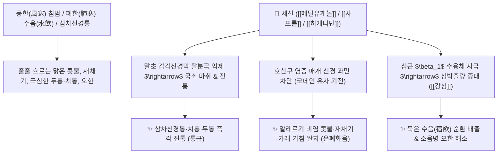

# 🌿 [[세신]] (細辛, Asari Radix et Rhizoma)

> **핵심 요약 (Key Summary)**:
> 쥐방울덩굴과(*Aristolochiaceae*) 족도리풀(*Asarum sieboldii*) 또는 민족도리풀의 뿌리 및 뿌리줄기
> 페닐프로파노이드 정유인 [[메틸유게놀]](Methyleugenol)과 국소마취 성분 [[사프롤]](Safrole), 강심 알칼로이드 [[히게나민]](Higenamine)이 감각신경 전달을 차단하고 뇌신경 마취 진통 및 기도 과민성 억제 작용 발휘
> [[상한론]]의 수음(水飲) 해수·맑은 콧물(비연)·극심한 두통·치통 및 소음병(少陰病) 오한증을 치료하는 대표적인 [[거풍산한]](祛風散寒)·[[통규지통]](通竅止痛)·[[온폐화음]](溫肺化飲) 군약(君藥)

---
## 📌 목차
1. [기본 본초 정보 & 화학 구조 (Pharmacognosy)](#1-기본-본초-정보--화학-구조-pharmacognosy)
2. [핵심 분자약리 기전 & 메틸유게놀·국소마취·강심 네트워크](#2-핵심-분자약리-기전--메틸유게놀국소마취강심-네트워크)
3. [해부생체역학 / 삼차신경 감각지 & 비점막 호산구 연계](#3-해부생체역학--삼차신경-감각지--비점막-호산구-연계)
4. [사상의학 및 임상 응용 (적응증 vs 아리스톨로크산 신독성 감별)](#4-사상의학-및-임상-응용-적응증-vs-아리스톨로크산-신독성-감별)
5. [상한론 『약징(藥徵)』 분석 및 배오 원리](#5-상한론-약징藥徵-분석-및-배오-원리)
6. [핵심 처방 비교 매트릭스](#6-핵심-처방-비교-매트릭스)
7. [출처 및 학술 참고 문헌 (References)](#7-출처-및-학술-참고-문헌-references)

---
## 1. 기본 본초 정보 & 화학 구조 (Pharmacognosy)

> [!abstract]+ 🧪 3D 약리 분자 구조 (Interactive 3D Viewer)
> <iframe src="https://molecule-viewer-rho.vercel.app/?cid=7127" style="width: 100%; height: 600px; border: none; border-radius: 12px; box-shadow: 0 4px 20px rgba(0,0,0,0.15);" allowfullscreen></iframe>


| 항목 | 상세 내용 |
| :--- | :--- |
| **기원 식물** | 쥐방울덩굴과(Aristolochiaceae) 족도리풀 *Asarum sieboldii* Miq. 또는 민족도리풀의 뿌리 및 뿌리줄기 (지상부 잎/줄기 제거) |
| **성미 (性味)** | 辛, 溫 (대단히 맵고 따뜻함) |
| **귀경 (歸經)** | 肺·腎·心經 (폐경, 신경, 심경) - **구규(九竅)를 뚫고 통락** |
| **효능 (Actions)** | [[거풍산한]](祛風散寒), [[통규지통]](通竅止痛), [[온폐화음]](溫肺化飲), [[선통비규]](宣通鼻竅) |
| **주요 성분** | • **페닐프로파노이드 정유(지표물질)**: [[메틸유게놀]] (Methyleugenol), [[사프롤]] (Safrole, KP 정유 $\ge 2.0\%$), 미리스티신, 유카디놀<br>• **강심 벤질이소퀴놀린**: [[히게나민]] (Higenamine)<br>• **리그난**: 아사리닌(Asarinin), 세사민 |

> **[유래 및 본초학적 기전]**:
> * 뿌리가 몹시 가늘고(細) 맛이 극도로 맵다(辛) 하여 '세신(細辛)'이라 불렸습니다.
> * 신라면보다 훨씬 맵고 강렬한 방향성 정유가 뼛속과 경락 깊숙이 침투한 한사(寒邪)를 뚫어버리고, 폐를 덥혀 줄줄 흐르는 맑은 콧물과 거품 가래를 말려줍니다.
> * 뿌리를 물고 있으면 입안이 얼얼하게 마비될 정도의 강력한 국소마취 및 진통 작용을 나타냅니다.

### 🔬 세신의 주요 지표물질 화학 구조
```
        OCH3
         │
     [ 벤젠 고리 ]───CH2──CH===CH2  <-- 메틸유게놀 (Methyleugenol)
         │
        OCH3
```
> **[구조적 특징 및 감각신경 차단]**: [[메틸유게놀]]과 [[사프롤]]은 전위의존성 나트륨 통로와 감각신경 $\text{TRPA1}$ 채널을 둔화시켜 국소 감각신경 마취 및 강력한 중추성 진통·진해 작용을 나타냅니다.

---
## 2. 핵심 분자약리 기전 & 메틸유게놀·국소마취·강심 네트워크



### (1) 표적 진통 및 비강 통규 작용
* **국소 마취 및 신경통 차단 ([[통규지통]] 通竅止痛)**:
  * 세신의 정유 성분이 삼차신경 말단을 마취시켜 치통(입에 물고 있음), 편두통, 부비동통을 즉각 진정시킵니다.
* **알레르기 비염 및 진해 작용 ([[온폐화음]] 溫肺化飲)**:
  * 기도 내 호산구 침윤과 신경 펩타이드 방출을 억제하여 맑은 콧물이 쏟아지고 재채기와 기침이 발작하는 한성 비염을 치료합니다.
* **마황 보조 및 강심 작용 ([[히게나민]])**:
  * 마황(에페드린)과 함께 심근 수축력을 높이고 말초 혈류를 뚫어 묵은 수음(水飲)을 전신으로 순환시켜 배출시킵니다.

---
## 3. 해부생체역학 / 삼차신경 감각지 & 비점막 호산구 연계

* **삼차신경 비모양체신경(Nasociliary Nerve) 감작 억제**:
  * 찬 공기 노출 시 발생하는 비점막의 반사성 혈관 확장과 재채기 반사를 진정시킵니다.
* **치주인대 및 치수 신경 진정**:
  * 풍열/풍한성 치통 시 치아 주변 신경막의 염증성 부종을 완화합니다.

---
## 4. 사상의학 및 임상 응용 (적응증 vs 아리스톨로크산 신독성 감별)

```
[✅ 최적 적응증 (Sweet Spot)]
• 알레르기 비염 및 한음천해: 찬바람만 쐬면 맑은 콧물이 수도꼭지처럼 흐르고 재채기와 거품 가래가 끓는 경우 ([[소청룡탕]])
• 극심한 두통 및 치통: 풍한으로 머리가 깨질 듯 아프고 윗니/아랫니가 시리고 쑤시는 신경통
• 소음병 한증: 열은 없는데 뼛속까지 시리고 맥이 가늘며 오한이 심한 감기 ([[마황부자세신탕]])

[⚠️ 지상부 신독성 성분(아리스톨로크산) 완벽 제거 수칙 (Safety)]
• 세신의 지상부(줄기와 잎)에는 신부전을 유발하는 발암물질인 아리스톨로크산(Aristolochic acid)이 함유되어 있음
• 반드시 약전 규격에 따라 '뿌리 및 뿌리줄기(거경엽 去莖葉)'만을 사용해야 안전함
• "세신은 가루로 먹을 때 1전을 넘지 않는다(細辛不過錢 - 1회 3g 이하)"는 고전 복용량 준수
```

---
## 5. 상한론 『약징(藥徵)』 분석 및 배오 원리

### (1) 『[[약징]]』에 나타난 세신의 주치
> **"細辛 主治宿飲, 停水也. 旁治水氣在心下, 咳滿, 逆上..."**  
> (세신의 주치는 묵은 담음(宿飲)과 정체된 물(停水)이며, 곁들여 수기가 명치 아래에 있어 기침하고 그득 찬 것, 위로 치밀어 오르는 것을 치료한다.)

* **핵심 배오 원리**:
  * [[세신]] + [[마황]] + [[건강]] + [[오미자]] $\rightarrow$ 폐한을 덥혀 맑은 콧물과 천식을 완치하는 천하 명방 ([[소청룡탕]])
  * [[세신]] + [[마황]] + [[부자]] $\rightarrow$ 소음병 양허 감기를 안팎으로 뚫어주는 구급방 ([[마황부자세신탕]])
  * [[세신]] + [[건강]] + [[복령]] + [[감초]] $\rightarrow$ 속을 덥혀 수기를 소변으로 배출 ([[영감오미강신탕]])

---
## 6. 핵심 처방 비교 매트릭스

| 처방명 | 구성 약재 | 주치 병증 및 임상 타깃 | 특징 및 감별점 |
| :--- | :--- | :--- | :--- |
| [[소청룡탕]] | [[마황]], [[작약]], [[세신]], [[건강]], [[감초]], [[계지]], [[반하]], [[오미자]] | **외한내음, 맑은 콧물, 재채기, 해수, 거품 가래, 천식** | 한음 비염·천식 치료의 최고 명방 |
| [[마황부자세신탕]] | [[마황]], [[부자]], [[세신]] | **소음병 감기, 고열 없이 극심한 오한, 맥침미, 무력감** | 온경해표(溫經解表)의 대표 방 |
| [[영감오미강신탕]] | [[복령]], [[감초]], [[오미자]], [[건강]], [[세신]] | **소청룡탕 후기, 흉만 해소 후 남은 묽은 가래 기침** | 온폐화음으로 남은 가래를 말림 |
| [[대황부자세신탕]] | [[대황]], [[부자]], [[세신]] | **한적(寒積) 변비, 극심한 복통, 수족냉증, 팽만** | 한사를 온통시키며 대변 배출 |

---
## 7. 출처 및 학술 참고 문헌 (References)

1. **Hashimoto, K., et al. (2007)**. Antiallergic effects of *Asarum sieboldii* and its constituent methyleugenol on histamine-induced airway response. *Planta Medica*, 73(7), 653-658.
   - **[연구 요약]**: 세신의 메틸유게놀이 히스타민 및 호산구 매개 기도 과민성을 억제하여 알레르기 비염과 천식 병태를 유의하게 개선함을 입증.
2. **대한민국약전(KP) 제12개정 (2022)**. 의약품각조 제2부: 세신 (Asari Radix et Rhizoma) 규격 기준.
   - **[공정서 규격]**: 뿌리 및 뿌리줄기 사용, 정유 2.0% 이상 함유 및 아리스톨로크산 불포함 확인 기준 명시.
3. **길익동동 (吉益東洞, 1784)**. 『약징(藥徵)』: 細辛 조문.
   - **[고전 원전]**: "細辛 主治宿飲, 停水也" - 묵은 수음 및 흉격 천해 주치 원리 제시.