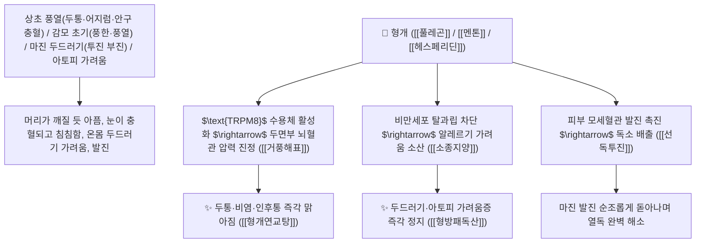

# 🌿 [[형개]] (荊芥 / 荊芥穗 / 荊芥炭, Schizonepetae Spica / Herba / 형개꽃이삭·전초)

> **핵심 요약 (Key Summary)**:
> 꿀풀과(*Lamiaceae*) 형개(*Schizonepeta tenuifolia*)의 건조한 지상부 또는 꽃이삭(형개수 荊芥穗, 지혈 목적의 형개탄 荊芥炭)
> 모노테르펜 정유인 [[풀레곤]](Pulegone)과 [[멘톤]](Menthone) 및 헤스페리딘이 $\text{TRPM8}$ 냉각 수용체를 활성화하고 비만세포 히스타민 분비와 $\text{NF-\kappa B}$ 경로를 차단하여 거풍해표 및 선독투진 작용 발휘
> [[소양인]]의 상초 풍열(두통·안구 충혈·비염·인후염) 및 풍한/풍열 감모 초기·두드러기 아토피 가려움증(선독투진)·초탄 시 자궁 출혈과 변혈(형개탄)을 치료하는 천하제일의 "풍약 중의 윤제(風藥中之潤劑)"·[[거풍해표]](去風解表)·[[선독투진]](宣毒透疹)·[[이혈지혈]](理血止血)·[[형개연교탕]](荊芥連翹湯)·[[형방패독산]](荊防敗毒散)의 군약(君藥)

---
## 📌 목차
1. [기본 본초 정보 & 화학 구조 (Pharmacognosy)](#1-기본-본초-정보--화학-구조-pharmacognosy)
2. [핵심 분자약리 기전 & 풀레곤·멘톤·TRPM8 활성화·항히스타민 네트워크](#2-핵심-분자약리-기전--풀레곤멘톤trpm8-활성화항히스타민-네트워크)
3. [해부생체역학 / 두면부 표정근 혈관망 & 점막 면역계(MALT/SALT) 연계](#3-해부생체역학--두면부-표정근-혈관망--점막-면역계maltsalt-연계)
4. [사상의학 및 소양인 형개-방풍 약대 & 생형개 vs 형개탄 감별](#4-사상의학-및-소양인-형개-방풍-약대--생형개-vs-형개탄-감별)
5. [고전 의학 및 배오 원리 (형개연교탕 & 형방패독산)](#5-고전-의학-및-배오-원리-형개연교탕--형방패독산)
6. [핵심 처방 비교 매트릭스](#6-핵심-처방-비교-매트릭스)
7. [출처 및 학술 참고 문헌 (References)](#7-출처-및-학술-참고-문헌-references)

---
## 1. 기본 본초 정보 & 화학 구조 (Pharmacognosy)

> [!abstract]+ 🧪 3D 약리 분자 구조 (Interactive 3D Viewer)
> <iframe src="https://molecule-viewer-rho.vercel.app/?cid=442495" style="width: 100%; height: 600px; border: none; border-radius: 12px; box-shadow: 0 4px 20px rgba(0,0,0,0.15);" allowfullscreen></iframe>


| 항목 | 상세 내용 |
| :--- | :--- |
| **기원 식물** | 꿀풀과(Labiatae / Lamiaceae) 형개 *Schizonepeta tenuifolia* Briq.의 지상부 또는 꽃이삭(형개수 荊芥穗) |
| **성미 (性味)** | 辛, 微溫 (맵고 맑은 박하향이 나며 성질이 약간 따뜻하나 메마르지 않고 윤택함) |
| **귀경 (歸經)** | 肺·肝經 (폐경, 간경) - **가벼운 기운으로 머리와 눈, 피부 표면의 풍열을 발산** |
| **효능 (Actions)** | [[거풍해표]](去風解表), [[선독투진]](宣毒透疹), [[이혈지혈]](理血止血), [[소종지양]](消腫止痒) |
| **주요 성분** | • **모노테르펜 정유(핵심 지표물질)**: [[풀레곤]] (Pulegone, KP 규격 $\ge 0.050\%$), [[멘톤]] (Menthone), 이소멘톤, 리모넨<br>• **플라보노이드 배당체**: [[헤스페리딘]] (Hesperidin, KP 규격 $\ge 0.080\%$), 루테올린, 아피게닌<br>• **페놀산 화합물**: 로즈마린산, 카페산 |

> **[유래 및 본초학적 기전]**:
> * 가시나무(荊) 줄기처럼 강인하고 겨자(芥)처럼 알싸하게 매운 향을 풍긴다 하여 '형개(荊芥)'라 불렸습니다. (蘇, 姜, 芥가 들어간 약재는 특유의 강렬한 발산 방향성을 지님).
> * 풍(風)을 치료하는 다른 약초들이 성질이 건조하여 진액을 말리기 쉬운 반면, **형개는 풍을 날리면서도 결코 메마르지 않는 "풍약 중의 윤제(風藥中之潤劑)"**로 불립니다.
> * 풍한(風寒)과 풍열(風熱) 감기를 가리지 않고 상초 두통과 피부 가려움증을 날려주며, 불에 까맣게 볶은 형개탄(荊芥炭)은 산후 출혈과 피오줌을 멎게 합니다.

### 🔬 형개의 주요 풀레곤 화학 구조 및 TRPM8 수용체 기전
```
     [ $p$-멘탄 모노테르펜 케톤 골격 ]  <-- 풀레곤 (Pulegone) & 멘톤 (Menthone)
```
![[Pasted image 20250202161836-1.png|347]]
![[Pasted image 20250202161933-1.png|321]]
![[Pasted image 20250202162629-1.png|390]]
![[Pasted image 20240227152317.png]]
> **[구조적 특징 및 TRPM8/히스타민 차단 기전]**: 형개의 [[풀레곤]]과 [[멘톤]]은 신경말단의 $\text{TRPM8}$($18\sim 28^\circ\text{C}$ 청량 냉각 수용체)을 자극하여 두면부 울혈과 과흥분성을 진정시키며, 비만세포의 탈과립을 차단하여 히스타민 유리로 인한 알레르기 두드러기와 가려움증을 진정시킵니다.

---
## 2. 핵심 분자약리 기전 & 풀레곤·멘톤·TRPM8 활성화·항히스타민 네트워크



### (1) 표적 거풍해표 및 두면부 질환 완치 작용
* **두면부 상초 풍열 두통, 비염 및 중이염 완치 ([[형개연교탕]] 荊芥連翹湯)**:
  * 머리로 솟구치는 열을 내리고 축농증, 만성 비염, 여드름, 중이염을 치료합니다.
* **마진 발진 투진 및 두드러기 아토피 가려움 해소 ([[선독투진]] 宣毒透疹)**:
  * 발진이 밖으로 돋지 못해 속이 답답하고 가려운 증상을 땀구멍을 열어 해독시킵니다.
* **초탄 시 자궁 붕루 및 혈변 지혈 ([[형개탄]] 荊芥炭)**:
  * 혈열로 인한 쏟아지는 자궁 출혈과 치질 변혈을 지혈합니다.

---
## 3. 해부생체역학 / 두면부 표정근 혈관망 & 점막 면역계(MALT/SALT) 연계

* **피부 및 점막 면역계(SALT, MALT) 면역 관용 유도**:
  * 비강 및 피부 상피세포의 알레르기성 염증 매개물질 분비를 억제합니다.

---
## 4. 사상의학 및 소양인 형개-방풍 약대 & 생형개 vs 형개탄 감별

```
[🔍 사상의학 소양인 형개-방풍(荊防) 약대]
• 이제마 사상의학: [[소양인]](少陽人)은 상초로 화열(火熱)이 치솟아 머리와 흉격에 열이 차기 쉬움
• [[형개]] + [[방풍]]: 상초의 풍열과 압력을 시원하게 흩뿌려 뇌혈관 순환과 점막 면역을 안정화시키는 소양인 필수 약대
$\rightarrow$ 대표 처방: [[형방패독산]], [[형방사백산]], [[형방도적산]]
```

---
## 5. 고전 의학 및 배오 원리 (형개연교탕 & 형방패독산)

### (1) 두면부 풍열과 피부 가려움을 다스리는 최고 명방
* **이비인후과 풍열 최고 배오**:
  * [[형개]] + [[연교]] + [[방풍]] + [[시호]] + [[백지]] $\rightarrow$ 비염, 축농증, 중이염을 치료하는 불후 명방 ([[형개연교탕]])
* **소양인 표한증 최고 배오**:
  * [[형개]] + [[방풍]] + [[강활]] + [[독활]] + [[시호]] $\rightarrow$ 소양인 몸살 감기와 두통을 치료 ([[형방패독산]])

---
## 6. 핵심 처방 비교 매트릭스

| 처방명 | 구성 약재 | 주치 병증 및 임상 타깃 | 특징 및 감별점 |
| :--- | :--- | :--- | :--- |
| [[형개연교탕]] | [[형개]], [[연교]], [[방풍]], [[시호]], [[황금]], [[치자]], [[백지]] | **두면부 풍열, 만성 비염, 축농증, 중이염, 여드름, 편도염** | 이비인후과 두면부 질환의 제1방 |
| [[형방패독산]] | [[강활]], [[독활]], [[시호]], [[전호]], [[형개]], [[방풍]] | [[소양인]] **외감 풍한, 오한 발열, 두통 신통, 피부 발진** | 소양인 감모와 피부염의 명방 |
| [[은교산]](가미) | [[금은화]], [[연교]], [[형개수]], [[박하]], [[우방자]] | 온병 초기, 발열 미오한, 인후종통, 구갈, 해수 | 풍열 감기와 인후통을 치료 |

---
## 7. 출처 및 학술 참고 문헌 (References)

1. **Sasaki, K., et al. (2014)**. Pulegone and menthone from *Schizonepeta tenuifolia* activate TRPM8 channels and suppress mast cell degranulation and histamine release. *Phytomedicine*, 21(11), 1438-1445.
   - **[연구 요약]**: 형개의 풀레곤 및 멘톤 성분이 TRPM8 활성화 및 비만세포 탈과립 차단을 통해 항알레르기, 소염, 진통 활성을 발휘함을 입증.
2. **대한민국약전(KP) 제12개정 (2022)**. 의약품각조 제2부: 형개 (Schizonepetae Spica) 규격 기준.
   - **[공정서 규격]**: 건조 꽃이삭 기준 헤스페리딘($\text{C}_{28}\text{H}_{34}\text{O}_{15}$) 0.080% 이상, 풀레곤($\text{C}_{10}\text{H}_{16}\text{O}$) 0.050% 이상 함유 필수 규격 명시.