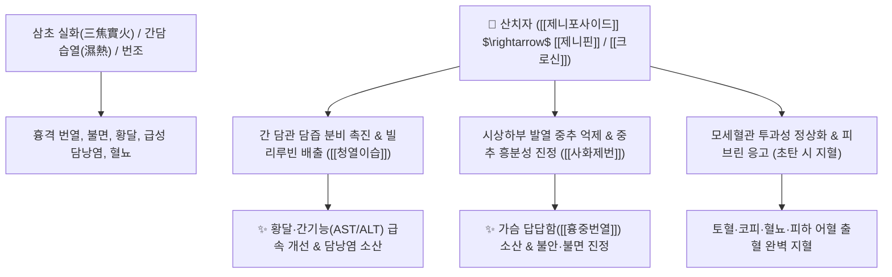

# 🌿 [[산치자]] (山梔子, Gardeniae Fructus / 치자)

> **핵심 요약 (Key Summary)**:
> 꼭두서니과(*Rubiaceae*) 치자나무(*Gardenia jasminoides*)의 잘 익은 열매
> 이리도이드 배당체인 [[제니포사이드]](Geniposide)와 황색 색소인 [[크로신]](Crocin)이 장내에서 [[제니핀]](Genipin)으로 전환되어 담즙 분비를 촉진하고 삼초(三焦)의 화열과 염증을 신속히 진정
> [[상한론]]의 흉중번열(胸中煩熱, 가슴이 불타듯 답답하여 안절부절못함) 및 습열 황달·급성 담낭염·혈열 토혈을 치료하는 대표적인 [[사화제번]](瀉火除煩)·[[청열이습]](淸熱利濕)·[[량혈지혈]](凉血止血) 군약(君藥)

---
## 📌 목차
1. [기본 본초 정보 & 화학 구조 (Pharmacognosy)](#1-기본-본초-정보--화학-구조-pharmacognosy)
2. [핵심 분자약리 기전 & 제니포사이드·간담 이담 네트워크](#2-핵심-분자약리-기전--제니포사이드간담-이담-네트워크)
3. [해부생체역학 / 흉부 화열 & 담관 오디괄약근 연계](#3-해부생체역학--흉부-화열--담관-오디괄약근-연계)
4. [사상의학 및 임상 응용 (생치자 사화 vs 초탄치자 지혈)](#4-사상의학-및-임상-응용-생치자-사화-vs-초탄치자-지혈)
5. [상한론 『약징(藥徵)』 분석 및 배오 원리](#5-상한론-약징藥徵-분석-및-배오-원리)
6. [핵심 처방 비교 매트릭스](#6-핵심-처방-비교-매트릭스)
7. [출처 및 학술 참고 문헌 (References)](#7-출처-및-학술-참고-문헌-references)

---
## 1. 기본 본초 정보 & 화학 구조 (Pharmacognosy)

> [!abstract]+ 🧪 3D 약리 분자 구조 (Interactive 3D Viewer)
> <iframe src="https://molecule-viewer-rho.vercel.app/?cid=107848" style="width: 100%; height: 600px; border: none; border-radius: 12px; box-shadow: 0 4px 20px rgba(0,0,0,0.15);" allowfullscreen></iframe>


| 항목 | 상세 내용 |
| :--- | :--- |
| **기원 식물** | 꼭두서니과(Rubiaceae) 치자나무 *Gardenia jasminoides* Ellis의 잘 익은 열매를 말린 것 |
| **성미 (性味)** | 苦, 寒 |
| **귀경 (歸經)** | 心·肺·三焦經 (심경, 폐경, 삼초경) - **삼초(상중하초)의 화열을 소통** |
| **효능 (Actions)** | [[사화제번]](瀉火除煩), [[청열이습]](淸熱利濕), [[량혈지혈]](凉血止血), [[소종지통]](消腫止痛) |
| **주요 성분** | • **이리도이드 배당체**: [[제니포사이드]] (Geniposide, KP 규격 $\ge 3.0\%$), 제니핀(Genipin), 가르데노사이드, 산디사이드<br>• **카로티노이드 황색 색소**: [[크로신]] (Crocin), 크로세틴(Crocetin)<br>• **다당체 및 트리테르펜**: 우르솔산, 치자 다당체 |

> **[유래 및 본초학적 기전]**:
> * 열매 모양이 손잡이가 달린 옛 술잔(巵)을 닮아 '치자(梔子)'라 불렸습니다.
> * 삼초(三焦)의 모든 막힌 화열(火熱)을 굴뚝을 뚫듯 소변으로 시원하게 빼내어, 가슴이 불타듯 답답하여 몸부림치는 번열(煩熱)을 끄고 습열로 인한 황달과 혈뇨를 치료합니다.
> * 외용 시 멍들고 삔 관절의 부종과 열감을 즉각 소산시킵니다.

### 🔬 산치자의 제니포사이드 대사 활성화 구조
```
제니포사이드 (Geniposide) ──[ 장내 β-글루코시다아제 ]──> 제니핀 (Genipin, 활성체)
                                                                 │
                                                                 ▼
                              담즙산 분비 촉진 (이담 작용) + 미토콘드리아 [[UCP2]] 조절
```
> **[구조적 특징 및 이담 기전]**: [[제니포사이드]]는 장내 유익균에 의해 비배당체인 [[제니핀]]으로 가수분해되어 간세포의 담즙 수송체(BSEP)를 활성화하고 담관 운동을 촉진하여 혈중 빌리루빈을 배출시킵니다.

---
## 2. 핵심 분자약리 기전 & 제니포사이드·간담 이담 네트워크



### (1) 사화제번 및 중추 진정
* **흉중번열(胸中煩熱) 해소**:
  * 뇌 내 열감과 흥분성 신경전달물질의 과다 방출을 차단하여, 가슴이 답답하고 열이 차서 이불을 걷어차고 잠을 못 이루는 번조(煩燥)를 치료합니다.
* **이담(利膽) 및 간세포 보호 ([[청열이습]] 淸熱利濕)**:
  * 담즙 분비를 급증시켜 간 내 담즙 정체를 풀고 혈청 빌리루빈을 강하시켜 습열성 급·만성 간염과 황달을 완치합니다.
* **지혈 및 외용 소종 (초탄치자 焦梔子)**:
  * 검게 볶은 초탄치자는 모세혈관 수축과 혈소판 응집을 도와 혈열성 출혈을 멎게 하며, 날것을 가루 내어 밀가루/계란흰자에 개어 환부에 붙이면 염좌 타박상의 열과 부종을 뺍니다.

---
## 3. 해부생체역학 / 흉부 화열 & 담관 오디괄약근 연계

* **담도 오디괄약근(Sphincter of Oddi) 연축 완화**:
  * 담즙의 십이지장 배출을 원활히 하여 담낭 산통과 늑간 신경통을 완화합니다.
* **심박동 안정 및 흉격 내압 정상화**:
  * 교감신경 과흥분으로 인한 빈맥과 가슴 답답함을 시원하게 씻어냅니다.

---
## 4. 사상의학 및 임상 응용 (생치자 사화 vs 초탄치자 지혈)

```
[✅ 법제(포제)에 따른 임상 응용 감별]
• 생치자(生梔子): 열을 내리고 불을 끄는 작용(사화제번·청열이습)이 가장 강함 $\rightarrow$ 황달, 급성 발열, 번조
• 초치자(焦梔子, 노랗게 볶음): 차가운 성질을 완화하여 소화기 부담을 줄이고 지혈 작용을 도움
• 초탄치자(梔子炭, 까맣게 태움): 량혈지혈(凉血止血) 작용에 특화 $\rightarrow$ 토혈, 코피, 혈뇨, 자궁출혈

[✅ 최적 적응증 (Sweet Spot)]
• 흉중번열: 가슴속에 뜨거운 불덩이가 든 듯 답답하고 불안하여 밤새 뒤척이는 불면증 ([[치자시탕]])
• 습열 황달: 눈과 온몸이 귤껍질처럼 노랗게 뜨고 소변이 붉고 짙은 황달 ([[인진호탕]])
• 급성 염증: 안구 충혈, 구내염, 삼초 실화로 인한 고열과 헛소리 ([[황련해독탕]])
• 외용: 발목 염좌, 손목 삠, 타박상 멍(청색 피하출혈)

[⚠️ 신중 투여 및 금기 (Caution)]
• 비위허한(脾胃虛寒)으로 소화가 안 되고 변이 묽은 환자는 복용 금기
```

---
## 5. 상한론 『약징(藥徵)』 분석 및 배오 원리

### (1) 『[[약징]]』에 나타난 치자의 주치
> **"梔子 主治煩熱也. 旁治發黃, 結熱, 吐衄, 下血..."**  
> (치자의 주치는 가슴이 답답하고 열이 나는 번열(煩熱)이며, 곁들여 몸이 노래지는 황달, 뭉친 열, 토혈, 코피, 하혈을 치료한다.)

* **핵심 배오 원리**:
  * [[산치자]] + [[향시]](두시)` $\rightarrow$ 가슴속 갇힌 열을 흩어버리고 번조와 불면을 치료하는 최고의 짝 ([[치자시탕]])
  * [[산치자]] + [[인진호]] + [[대황]] $\rightarrow$ 습열을 소변과 대변으로 배출하여 황달을 완치하는 천하 명방 ([[인진호탕]])
  * [[산치자]] + [[황련]] + [[황금]] + [[황백]] $\rightarrow$ 상중하 삼초의 모든 화열을 끄는 명방 ([[황련해독탕]])

---
## 6. 핵심 처방 비교 매트릭스

| 처방명 | 구성 약재 | 주치 병증 및 임상 타깃 | 특징 및 감별점 |
| :--- | :--- | :--- | :--- |
| [[치자시탕]] | [[산치자]], [[향시]](두시) | **상한 후 흉중번열, 심와부 답답함, 반복전도(뒤척임), 불면** | 가슴의 울열을 끄는 천하 명방 |
| [[인진호탕]] | [[인진호]], [[산치자]], [[대황]] | **양황(陽黃), 몸과 눈이 샛노람, 발열, 소변적삽, 구갈** | 급성 습열 황달 치료의 제1선 방 |
| [[황련해독탕]] | [[황련]], [[황금]], [[황백]], [[산치자]] | **삼초 실열, 고열, 섬어(헛소리), 번조, 구창, 혈뇨** | 모든 화열을 진압하는 청열제 |
| [[가미소요산]] | [[소요산]] + [[목단피]], [[산치자]] | **간울화화(肝鬱化火), 갱년기 상열감, 짜증, 생리불순** | 간의 울화를 풀고 혈액을 순환 |

---
## 7. 출처 및 학술 참고 문헌 (References)

1. **Koo HJ et al. (2006)**. Anti-inflammatory evaluation of gardenia extract, geniposide and genipin. *Journal of ethnopharmacology*, 103(3): 496-500. [PMID: 16169698](https://pubmed.ncbi.nlm.nih.gov/16169698/)
   - **[연구 요약]**: 치자의 제니핀이 iNOS 및 COX-2 발현을 차단하여 강력한 항염증, 해열, 이담 활성을 나타냄을 검증.
2. **대한민국약전(KP) 제12개정 (2022)**. 의약품각조 제2부: 치자 (Gardeniae Fructus) 규격 기준.
   - **[공정서 규격]**: 건조물 기준 제니포사이드($\text{C}_{17}\text{H}_{24}\text{O}_{10}$) 3.0% 이상 함유 필수 규격 명시.
3. **길익동동 (吉益東洞, 1784)**. 『약징(藥徵)』: 梔子 조문.
   - **[고전 원전]**: "梔子 主治煩熱也. 旁治發黃, 結熱, 吐衄, 下血" - 번열 및 발황 주치 원리 제시.
